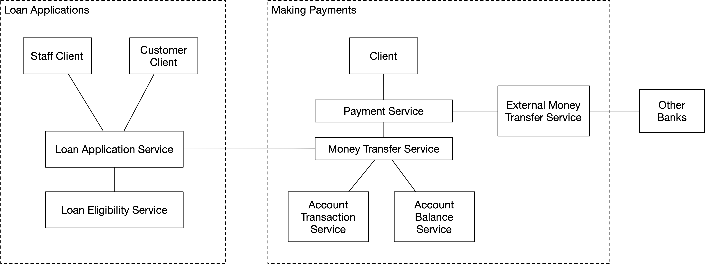

# 架构原则
本章描述了设计简洁、现代的云原生软件系统和应用程序的架构原则。 云原生软件由可在公共云、私有云或混合云中运行的松散耦合、可扩展、有弹性且可观察的服务构建而成。 云原生软件利用容器（例如 Docker）、微服务、无服务器功能和容器编排（例如 Kubernetes）等技术，并且可以使用声明性代码自动部署。

本章讨论以下架构原则和模式：

- 单一职责原则
- 统一命名原则
- 封装原则
- 服务聚合原则
- 高内聚、低耦合原则
- 库组合原则
- 避免重复原则
- 外化服务配置原则
- 服务替代原则
- 自动驾驶微服务原则
- 无状态微服务原则
- 弹性微服务原则
- 水平自动伸缩微服务原则
- 高可用微服务原则
- 可观察服务原则
- 服务间通信模式
- 领域驱动架构设计原则
- 软件版本控制原则
- Git版本控制原则
- 架构模式
- 首选技术栈原则

## 软件层次结构
一个软件系统由多个计算机程序和与这些程序相关的任何使它们可操作的东西组成，包括但不限于配置、部署代码和文档。 一个软件系统分为两个部分：后端和前端。 后端软件在服务器上运行，前端软件在 PC、平板电脑和手机等客户端设备上运行。 后端软件由服务组成。 前端软件由使用后端服务的客户端和不使用任何后端服务的独立应用程序组成。 独立应用程序的一个示例是计算器或简单的文本编辑器。

术语应用程序通常用于描述为特定目的指定的单个程序。 通常，软件应用程序是一些用于解决特定问题的软件。 从最终用户的角度来看，所有客户端都是应用程序。 但从开发人员的角度来看，除非应用程序是独立应用程序，否则应用程序需要客户端和后端服务才能正常运行。 在本书中，我将使用术语应用程序来指定程序和相关工件（如配置）的逻辑分组，以形成专用于特定目的的软件系统的功能部分。 在我的定义中，非独立应用程序由一个或多个服务组成，可能还有一个或多个客户端来满足最终用户的需求。 假设我们有一个用于电信网络分析的软件系统。 该系统提供数据可视化功能。 我们可以将软件系统的数据可视化部分称为数据可视化应用。 例如，该应用程序包含一个 Web 客户端和两项服务，一项用于获取数据，一项用于配置。 假设我们在系统中也有一个通用的数据摄取微服务。 通用数据摄取器不是没有某些配置的应用程序，这些配置使其成为我们可以称为应用程序的特定服务。 例如，通用数据摄取器可以具有从无线电网络摄取原始数据的配置。 通用数据摄取器和配置共同构成一个应用程序：无线电网络数据摄取器。


计算机程序和库是软件组件。 软件组件是可以单独打包、测试和交付的东西。 它由一个或多个类组成，一个类由一个或多个函数（类方法）组成。 （纯函数式语言中没有传统的类，软件组件只由函数组成。）一个计算机程序也可以由一个或多个库组成，一个库可以由其他库组成。


## 单一职责原则
> 一个软件实体在它的抽象层上应该只有单一的职责。

软件系统处于软件层次结构的最高层，应该有一个单一的专用目的。
例如，可以有电子商务或薪资软件系统。 但是不应该有一个软件系统来处理电子商务和工资相关的活动。 如果你是软件供应商并且制作了电子商务软件系统，那么将其销售给需要电子商务解决方案的客户会很容易。 但是，如果你制作了一个包含电子商务和薪资功能的软件系统，则很难将其出售给只需要电子商务解决方案的客户，因为他们可能已经拥有薪资软件系统，当然， 不想再要一个。

让我们考虑软件层次结构中的应用程序级别。 假设我们设计了一个用于电信网络分析的软件系统。 该软件系统分为四个不同的应用：无线电网络数据摄取、核心网络数据摄取、数据汇聚和数据可视化。 这些应用程序中的每一个都有一个专用的用途。 假设我们将数据聚合和可视化应用程序耦合到一个应用程序中。 在那种情况下，用第 3 方应用程序替换数据可视化部分可能很困难。 但是，当它们是具有明确定义界面的独立应用程序时，如果需要，用第三方应用程序替换数据可视化应用程序会容易得多。

软件组件还应该有一个专用的用途。 具有单一职责的服务类型的软件组件称为微服务。 例如，一个微服务可能负责处理订单，另一个微服务负责处理销售项目。 这两个微服务只负责一件事。 我们不应该有一个微服务同时负责订单和销售项目。 这将违反单一责任原则，因为订单和销售项目处理是同一抽象级别的两个不同功能。

微服务有很多优点：

- 提高生产力
  - 你可以选择最适合的编程语言和技术栈
  - 微服务很容易并行开发，因为合并冲突会更少
  - 开发单体应用会导致更频繁的合并冲突
- 改进的弹性和故障隔离
  - 单个微服务中的故障不会导致其他微服务宕机
  - 单体应用中的一个错误可能会导致整个单体应用崩溃
- 更好的可扩展性
  - 无状态微服务可以自动水平扩展
  - 单体的水平扩展很复杂或不可能
- 更好的数据安全性和合规性
- 每个微服务都封装了它的数据，只能通过公共 API 访问
- 更快更容易的升级
  - 仅升级更改的微服务就足够了。 无需每次都更新整个整体
- 更快的发布周期
  - 仅构建更改后的微服务。 发生变化时无需构建整个整体
- 更少的依赖
  - 依赖冲突的可能性较低
- 启用开闭架构，即对扩展开放和对修改关闭的架构
  - 与任何现有微服务无关的新功能可以放入新的微服务中，而不是修改当前的代码库。

微服务的主要缺点是分布式架构带来的复杂性。 操作和监控基于微服务的软件系统很复杂。 此外，测试分布式系统比测试单体系统更具挑战性。 开发团队应该通过聘请 DevOps 和测试自动化专家来关注这些领域。

库类型的软件组件也应该有单一的责任。 就像将单一职责服务称为微服务一样，我们可以将单一职责库称为微库。 例如，可能有一个用于处理 YAML 格式内容的库和另一个用于处理 XML 格式内容的库。 我们不应该尝试将两种格式的处理捆绑到一个库中。 如果我们这样做并且只需要与 YAML 相关的功能，我们也将始终获得与 XML 相关的功能。 我们的代码将始终与 XML 相关的代码一起发布，即使它从未被使用过。 这会引入不必要的代码膨胀。 我们还必须使用该库的任何安全补丁，即使该补丁仅用于我们不使用的与 XML 相关的功能。

## 统一命名原则
> 使用服务或 api 后缀命名微服务，使用客户端后缀命名客户端，使用库后缀命名库。

在开发软件时，你应该为微服务、客户端和库建立命名约定。

微服务的首选命名约定是```<service's purpose>-service```。 例如：数据聚合服务或电子邮件发送服务。 在不同的地方系统地使用微服务名称。 例如，将其用作 Kubernetes 部署名称和源代码存储库名称（或目录名称，如果是 ```monorepo```）。 使用服务后缀而不是微服务后缀来命名你的微服务就足够了，因为默认情况下每个服务都应该是微服务。 因此，使用微服务后缀命名微服务不会有任何实际好处。 那只会使微服务名称变长而没有任何附加值。

如果你想更具体地命名微服务，你可以使用 api 后缀命名 API 微服务，而不是更通用的服务后缀，例如，```sales-item-api```。 在本书中，我没有使用 api 后缀，而是始终只使用服务后缀。

客户端的首选命名约定是```<客户端的用途>-<客户端类型>-客户端```。 例如：```data-visualization-web-client```、```data-visualization-mobile-client```、```data-visualization-android-client``` 或 ```data-visualization-ios-client```。

库的首选命名约定是```<library's purpose>-library```。 例如：```common-utils-library``` 或 ```common-ui-components-library```。

使用这些命名约定时，仅通过查看名称就可以明确区分微服务、客户端和库类型的软件组件。 此外，很容易识别源代码存储库是否包含微服务、客户端或库。

## 封装原则
> 微服务必须将其内部状态封装在公共 API 后面。 公共 API 后面的任何内容都被认为是微服务私有的，其他微服务不能直接访问。

微服务应该定义其他微服务用于接口的公共 API。 公共 API 背后的任何内容都是私有的，其他微服务无法访问。

虽然微服务应该是无状态的（无状态服务原则将在本章后面讨论），但无状态微服务需要一个地方来在微服务之外存储其状态。 通常，状态存储在数据库中。 数据库是微服务的内部依赖，应该对微服务私有，这意味着没有其他微服务可以直接访问数据库。 使用微服务的公共 API 间接访问数据库。

不鼓励允许多个微服务共享一个数据库，因为这样就无法控制每个微服务如何使用数据库，以及每个微服务对数据库有什么要求。

如果每个微服务都使用自己的逻辑数据库，有时可以与多个微服务共享一个物理数据库。 这需要为每个微服务创建一个特定的数据库用户。 每个数据库用户只能访问一个专用于特定微服务的逻辑数据库。 这样，任何微服务都不能直接访问另一个微服务的数据库。 这种方法仍然会带来一些问题，因为必须考虑所有微服务对共享物理数据库的维度要求。 此外，必须确定共享数据库的部署责任。 例如，共享数据库可以部署为平台或公共服务，作为平台或公共服务部署的一部分。

## 服务聚合原则
> 较高抽象层次上的服务聚合了较低抽象层次上的服务。

当较高抽象级别上的一项服务聚合较低抽象级别上的服务时，就会发生服务聚合。


让我们举一个电子商务软件系统的服务聚合示例，该系统允许人们在线销售二手产品。

电子商务服务的问题域由以下子域组成：

- 用户帐户域
  - 创建、修改和删除用户帐户
  - 查看包含销售项目和订单的用户帐户
- 销售项目域
  - 添加新的销售项目、修改、查看和删除销售项目
- 购物车域
  - 在购物车中添加/删除销售商品，清空购物车
  - 查看包含销售商品详细信息的购物车
- 订购域
  - 下订单
    - 确保付款
    - 创建订单
    - 从购物车中删除订购的商品
    - 标记订购的销售商品已售出
    - 通过电子邮件发送订单确认
  - 查看包含销售项目详细信息的订单
  - 更新和删除订单

我们不应该在单个电子商务服务微服务中实现所有子域，因为那样我们就不会遵循单一责任原则。 我们应该使用服务聚合。 我们为每个子域创建一个单独的较低级别的微服务。 然后我们创建一个更高级别的电子商务服务微服务来聚合那些较低级别的微服务。

我们可以定义我们的电子商务服务聚合以下较低级别的微服务：

- 用户帐户服务
  - 创建/读取/更新/删除用户帐户
- 销售项目服务
  - 创建/读取/更新/删除销售项目
- 购物车服务
  - 查看购物车，从购物车中添加/删除销售项目或清空购物车
- 订单服务
  - 创建/读取/更新/删除订单
- 电子邮件通知服务
  - 发送电子邮件通知


上面描述的大多数微服务都可以作为 REST API 实现，因为它们主要包含基本的 CRUD（创建、读取、更新和删除）操作，REST API 非常适合这些操作。 我们将在后面的章节中更详细地处理 API 设计。 让我们使用 Java 和 Spring Boot 将 sales-item-service 实现为 REST API。 我们将首先实现 SalesItemController 类。 它定义了用于创建、获取、更新和删除销售项目的 API 端点：

```SalesItemController.java```

```java
import io.swagger.v3.oas.annotations.Operation;
import io.swagger.v3.oas.annotations.tags.Tag;
import org.springframework.beans.factory.annotation.Autowired;
import org.springframework.http.HttpStatus;
import org.springframework.web.bind.annotation.DeleteMapping;
import org.springframework.web.bind.annotation.GetMapping;
import org.springframework.web.bind.annotation.PathVariable;
import org.springframework.web.bind.annotation.PostMapping;
import org.springframework.web.bind.annotation.PutMapping;
import org.springframework.web.bind.annotation.RequestBody;
import org.springframework.web.bind.annotation.RequestMapping;
import org.springframework.web.bind.annotation.RequestParam;
import org.springframework.web.bind.annotation.ResponseStatus;
import org.springframework.web.bind.annotation.RestController;

@RestController
@RequestMapping(SalesItemController.API_ENDPOINT)
@Tag(
  name = "Sales item API", 
  description = "Manages sales items"
)
public class SalesItemController {
  public static final String API_ENDPOINT = "/sales-items";
  
  @Autowired
  private SalesItemService salesItemService;

  @PostMapping
  @ResponseStatus(HttpStatus.CREATED)
  @Operation(summary = "Creates new sales item")
  public final SalesItem createSalesItem(
    @RequestBody final SalesItemArg salesItemArg
  ) {
    return salesItemService.createSalesItem(salesItemArg);
  }

  @GetMapping
  @ResponseStatus(HttpStatus.OK)
  @Operation(summary = "Gets sales items")
  public final Iterable<SalesItem> getSalesItems() {
    return salesItemService.getSalesItems();
  }

  @GetMapping("/{id}")
  @ResponseStatus(HttpStatus.OK)
  @Operation(summary = "Gets sales item by id")
  public final SalesItem getSalesItemById(
    @PathVariable("id") final Long id
  ) {
    return salesItemService.getSalesItemById(id);
  }

  @GetMapping(params = "userAccountId")
  @ResponseStatus(HttpStatus.OK)
  @Operation(summary = "Gets sales items by user account id")
  public final Iterable<SalesItem> getSalesItemsByUserAccountId(
    @RequestParam("userAccountId") final Long userAccountId
  ) {
    return salesItemService
             .getSalesItemsByUserAccountId(userAccountId);
  }

  @PutMapping("/{id}")
  @ResponseStatus(HttpStatus.NO_CONTENT)
  @Operation(summary = "Updates a sales item")
  public final void updateSalesItem(
    @PathVariable final Long id,
    @RequestBody final SalesItemArg salesItemArg
  ) {
    salesItemService.updateSalesItem(id, salesItemArg);
  }

  @DeleteMapping("/{id}")
  @ResponseStatus(HttpStatus.NO_CONTENT)
  @Operation(summary = "Deletes a sales item by id")
  public final void deleteSalesItemById(
    @PathVariable final Long id
  ) {
    salesItemService.deleteSalesItemById(id);
  }

  @DeleteMapping
  @ResponseStatus(HttpStatus.NO_CONTENT)
  @Operation(summary = "Deletes all sales items")
  public final void deleteSalesItems() {
    salesItemService.deleteSalesItems();
  }
}
```

从上面的代码中我们可以注意到，```SalesItemController``` 类将实际工作委托给实现了 ```SalesItemService``` 接口的类的实例。 这是使用桥接模式的示例，将在下一章中与其他设计模式一起讨论。 在桥接模式中，控制器只是服务的抽象，实现了```SalesItemService```接口的类提供了具体的实现。 我们可以在不更改控制器的情况下更改服务实现，或者使用相同的 ```SalesItemService``` 接口引入不同的控制器，例如 ```GraphQL``` 控制器。 只有更改使用的控制器类，我们才能将 API 从 ```REST API``` 更改为 ```GraphQL API```。 下面是 ```SalesItemService``` 接口的定义：

```SalesItemService.java```

```java
public interface SalesItemService {
  SalesItem createSalesItem(SalesItemArg salesItemArg);
  SalesItem getSalesItemById(Long id);
  
  Iterable<SalesItem> getSalesItemsByUserAccountId(
   Long userAccountId
  );
  
  Iterable<SalesItem> getSalesItems();
  void updateSalesItem(Long id, SalesItemArg salesItemArg);
  void deleteSalesItemById(Long id);
  void deleteSalesItems();
}
```

下面的 ```SalesItemServiceImpl``` 类实现了 ```SalesItemService``` 接口。 它将与销售项目存储库交互，以保存、获取和删除数据库中的数据。

```SalesItemServiceImpl.java```

```java
import org.springframework.beans.factory.annotation.Autowired;
import org.springframework.stereotype.Service;

@Service
public class SalesItemServiceImpl implements SalesItemService {
  private static final String SALES_ITEM = "Sales item";
  
  @Autowired
  private SalesItemRepository salesItemRepository;

  @Override
  public final SalesItem createSalesItem(
    final SalesItemArg salesItemArg
  ) {
    final var salesItem = SalesItem.from(salesItemArg); 
    return salesItemRepository.save(salesItem);
  }

  @Override
  public final SalesItem getSalesItemById(final Long id) {
    return salesItemRepository.findById(id)
             .orElseThrow(() -> 
               new EntityNotFoundError(SALES_ITEM, id));
  }

  @Override
  public final Iterable<SalesItem> getSalesItemsByUserAccountId(
    final Long userAccountId
  ) {
    return salesItemRepository
             .findByUserAccountId(userAccountId);
  }

  @Override
  public final Iterable<SalesItem> getSalesItems() {
    return salesItemRepository.findAll();
  }

  @Override
  public final void updateSalesItem(
    final Long id,
    final SalesItemArg salesItemArg
  ) {
    if (salesItemRepository.existsById(id)) {
      final var salesItem =
        SalesItem.from(salesItemArg, id);
      
      salesItemRepository.save(salesItem);
    } else {
      throw new EntityNotFoundError(SALES_ITEM, id);
    }
  }

  @Override
  public final void deleteSalesItemById(final Long id) {
    if (salesItemRepository.existsById(id)) {
      salesItemRepository.deleteById(id);
    } 
  }

  @Override
  public final void deleteSalesItems() {
    salesItemRepository.deleteAll();
  }
}
```

```EntityNotFoundError.java```

```java
import org.springframework.http.HttpStatus;
import org.springframework.web.bind.annotation.ResponseStatus;

@ResponseStatus(HttpStatus.NOT_FOUND)
public class EntityNotFoundError extends RuntimeException {
  EntityNotFoundError(final String entityType, final long id) {
    super(entityType + 
         " entity not found with id " +
         String.valueOf(id));
  }
}
```

```SalesItemRepository``` 接口定义如下。 ```Spring``` 将创建一个实现该接口的类的实例，并将其注入到 ```SalesItemServiceImpl``` 类的实例中。 ```SalesItemRepository``` 接口扩展了 ```Spring``` 的 ```CrudRepository``` 接口，它默认提供了许多数据库访问方法。 它提供了以下及更多方法：```findAll```、```findById```、```save```、```existsById```、```deleteAll``` 和 ```deleteById```。 我们只需要向 ```SalesItemRepository``` 接口添加一个方法：```findByUserAccountId```。 ```Spring``` 将自动为 ```findByUserAccountId``` 方法生成一个实现，因为该方法名称遵循 ```Spring Data``` 框架的某些约定。 我们只需要将方法添加到接口，仅此而已。 我们不必为该方法提供实现，因为 ```Spring``` 会为我们做这件事。

```SalesItemRepository.java```

```java
import org.springframework.data.repository.CrudRepository;
import org.springframework.stereotype.Repository;

@Repository
public interface SalesItemRepository extends 
                    CrudRepository<SalesItem, Long> 
{
  Iterable<SalesItem> findByUserAccountId(Long userAccountId);
}
```

接下来，我们定义 ```SalesItem``` 实体类，其中包含名称和价格等属性。 它还包括两种方法，用于将 ```SalesItemArg``` 数据传输对象 (```DTO```) 类的实例转换为 ```SalesItem``` 类的实例。 ```DTO``` 是在服务器和客户端之间传输数据的对象。 我使用类名 ```SalesItemArg``` 而不是 ```SalesItemDto``` 来描述 ```SalesItemArg DTO``` 是 ```API``` 端点的参数。 如果某个 ```API``` 端点返回一个特殊的销售项目 ```DTO``` 而不是销售项目实体，我会将该 ```DTO``` 类命名为 ```SalesItemResponse``` 而不是 ```SalesItemDto```。 术语 ```Arg``` 和 ```Response``` 更好地描述了 ```DTO``` 传输数据的方向。 你还可以使用以下 ```DTO``` 名称：```InputSalesItem``` 和 ```OutputSalesItem``` 来描述传入和传出 ```DTO```（从服务器的角度来看）。

```SalesItem.java```

```java
import lombok.AllArgsConstructor;
import lombok.Data;
import lombok.NoArgsConstructor;
import org.modelmapper.ModelMapper;

import javax.persistence.Entity;
import javax.persistence.GeneratedValue;
import javax.persistence.GenerationType;
import javax.persistence.Id;
import javax.validation.constraints.Max;
import javax.validation.constraints.Min;
import javax.validation.constraints.NotNull;

@Entity
@Data
@NoArgsConstructor
@AllArgsConstructor
public class SalesItem {
  @Id
  @GeneratedValue(strategy = GenerationType.IDENTITY)
  private Long id;
  
  private Long userAccountId;

  @NotNull
  private String name;
  
  @Min(value = 0, message = "Price must be greater than 0")
  @Max(
    value = Integer.MAX_VALUE, 
    message = "Price must be <= " + Integer.MAX_VALUE
  )
  private Integer price;
  
  static SalesItem from(final SalesItemArg salesItemArg) {
    return new ModelMapper()
                 .map(salesItemArg, SalesItem.class);
  }
  
  static SalesItem from(
    final SalesItemArg salesItemArg,
    final Long id
  ) {
    final var salesItem = 
      new ModelMapper().map(salesItemArg, SalesItem.class);
    
    salesItem.setId(id);
    return salesItem;
  }
}
```

下面的 ```SalesItemArg``` 类包含与 ```SalesItem``` 实体类相同的属性，但 ```id``` 属性除外。 ```SalesItemArg DTO``` 类在创建新销售项目或更新现有销售项目时使用。 当创建一个新的销售项目时，客户端不应该提供 ```id``` 属性，因为微服务会自动生成它（或者在这种情况下，数据库会自动生成）。

```SalesItemArg.java```

```java
import lombok.AllArgsConstructor;
import lombok.Data;
import lombok.NoArgsConstructor;

@Data
@NoArgsConstructor
@AllArgsConstructor
public class SalesItemArg {
  private Long userAccountId;
  private String name;
  private Integer price;
}
```

下面定义了电子商务服务将如何协调聚合的低级微服务的使用：

- 用户帐户域
  - 将 CRUD 操作委托给用户帐户服务
  - 委托 sales-item-service 获取有关用户销售商品的信息
  - 委托订单服务获取有关用户订单的信息
- 销售项目域
  - 将 CRUD 操作委托给 sales-item-service
- 购物车域
  - 将读取/添加/删除/清空操作委托给购物车服务
  - 委托 sales-item-service 以获取有关购物车中销售商品的信息
- 订购域
  - 确保付款由支付网关确认
  - 将 CRUD 操作委托给订单服务
  - 代表购物车服务从购物车中删除已购买的商品
  - 代表 ```sales-item-service``` 标记已购买的销售项目
  - 委托电子邮件通知服务发送订单确认电子邮件
  - 委托 ```sales-item-service``` 获取有关订单销售商品的信息

电子商务服务旨在供前端客户端使用，例如 Web 客户端。 后端前端 (```BFF```) 术语通常用于描述旨在为前端客户端提供 API 的微服务。 与```BFF```术语相比，服务聚合是一个通用术语，不需要涉及前端。 你可以使用服务聚合来创建由另一个或多个微服务使用的聚合微服务。 如果你有一个庞大而复杂的软件系统，甚至可以有多个级别的服务聚合。

客户可能对他们希望从 API 获得哪些信息有不同的需求。 例如，移动客户端可能仅限于公开 API 提供的所有可用信息的一个子集。 相反，Web 客户端可以获取所有信息，也可以自定义客户端从 API 检索的信息。

以上所有要求都是基于 ```GraphQL``` 的 API 可以满足的。 出于这个原因，使用 ```GraphQL``` 实现电子商务服务是明智的。 我选择了 ```JavaScript```、```Node.js``` 和 ```Express``` 作为在电子商务服务中实现单个 ```GraphQL``` 查询的技术。 下面是用户查询的实现，它从三个微服务中获取数据。 它从用户帐户服务中获取用户帐户信息，从销售项目服务中获取用户的销售商品，最后从订单服务中获取用户的订单。

```server.js```

```js
const express = require('express');
const { graphqlHTTP } = require('express-graphql');
const { buildSchema, GraphQLError } = require('graphql');
const axios = require('axios').default;

const schema = buildSchema(`
  type UserAccount {
    id: ID!,
    userName: String!
    # Define additional properties...
  }
  
  type SalesItem {
    id: ID!,
    name: String!
    # Define additional properties...
  }
  
  type Order {
    id: ID!,
    userId: ID!
    # Define additional properties...
  }
  
  type User {
    userAccount: UserAccount!
    salesItems: [SalesItem!]!
    orders: [Order!]!
  }
  
  type Query {
    user(id: ID!): User!
  }
`);

const {
  ORDER_SERVICE_URL,
  SALES_ITEM_SERVICE_URL,
  USER_ACCOUNT_SERVICE_URL  
} = process.env;

const rootValue = {
  user: async ({ id }) => {
    try {
      const [
        { data: userAccount },
        { data: salesItems },
        { data: orders }
      ] = await Promise.all([
        axios.get(`${USER_ACCOUNT_SERVICE_URL}/user-accounts/${id}`),
        axios.get(
          `${SALES_ITEM_SERVICE_URL}/sales-items?userAccountId=${id}`
        ),
        axios.get(`${ORDER_SERVICE_URL}/orders?userAccountId=${id}`)
      ]);
      
      return {
        userAccount,
        salesItems,
        orders
      };
    } catch (error) {
      throw new GraphQLError(error.message);
    }
  },
};

const app = express();

app.use('/graphql', graphqlHTTP({
  schema,
  rootValue,
  graphiql: true,
}));

app.listen(4000);
```

使用 node server.js 命令启动上述程序后，你可以使用浏览器访问 GraphiQL 端点：

```http://localhost:4000/graphql```
在左侧窗格中，你可以指定一个 ```GraphQL``` 查询。 例如查询 id 为 2 的用户：

```js
{
  user(id: 2) {  
    userAccount {
      id
      userName
    }
    salesItems {
      id
      name
    }
    orders {
      id
      userId
    }
  }
}
```

因为我们还没有实现底层微服务，所以让我们修改 ```server.js``` 中访问底层微服务的部分，以返回虚拟静态结果，而不是访问真正的底层微服务：

```js
const [
    { data: userAccount },
    { data: salesItems },
    { data: orders }
] = await Promise.all([
    Promise.resolve({data: {id, userName: 'pksilen'}}),
    Promise.resolve({data: [{id: 1, name: 'sales item 1'}]}),
    Promise.resolve({data: [{id: 1,userId: id}]})
]);
```

如果我们现在执行之前指定的查询，我们应该会看到以下查询结果：

```json
{
  "data": {
    "user": {
      "userAccount": {
        "id": "2",
        "userName": "pksilen"
      },
      "salesItems": [
        {
          "id": "1",
          "name": "sales item 1"
        }
      ],
      "orders": [
        {
          "id": "1",
          "userId": "2"
        }
      ]
    }
  }
}
```

我们可以通过修改 ```server.js``` 以包含以下代码来模拟故障：

```js
const [{
        data: userAccount
    },
    {
        data: salesItems
    },
    {
        data: orders
    }
] = await Promise.all([
    axios.get(`http://localhost:3000/user-accounts/${id}`),
    Promise.resolve({
        data: [{
            id: 1,
            name: 'sales item 1'
        }]
    }),
    Promise.resolve({
        data: [{
            id: 1,
            userId: id
        }]
    })
]);
```

现在，如果我们再次执行查询，我们将得到以下错误响应，因为服务器无法连接到端口 3000 上的本地主机上的服务，因为 localhost:3000 上没有运行的服务。

```json
{
  "errors": [
    {
      "message": "connect ECONNREFUSED 127.0.0.1:3000",
      "locations": [
        {
          "line": 2,
          "column": 3
        }
      ],
      "path": [
        "user"
      ],
      "extensions": {}
    }
  ],
  "data": null
}
```

你还可以查询用户并指定查询以仅返回字段的子集。 以下查询不返回 ID 也不返回订单。 服务器端 GraphQL 库自动仅在响应中包含请求的字段。 作为开发人员，你无需执行任何操作。 当然，如果你愿意，你可以优化你的微服务以仅从数据库中获取请求的字段。

```js
{
  user(id: 2) {
    userAccount {
      userName
    }
    salesItems {
      name
    }
  }
}
```

上述查询的结果如下：

```json
{
  "data": {  
    "user": {
      "userAccount": {
        "userName": "pksilen"
      },
      "salesItems": [
        {
          "name": "sales item 1"
        }
      ]
    }
  } 
}
```

上面的示例缺少一些功能，例如生产所需的授权。 授权应该检查用户只能执行用户查询来获取他/她的资源。 如果用户尝试使用其他人的 ID 执行用户查询，则授权应该会失败。 在接下来的安全原则章节中将对安全性进行更多讨论。

上一个示例中的用户查询跨越多个较低级别的微服务：```user_account_service```、```sales-item-service``` 和 ```order-service```。 因为查询没有改变任何东西，所以它可以在没有分布式事务的情况下执行。 分布式事务类似于常规（数据库）事务，不同之处在于它跨越多个远程服务。

用于在电子商务服务中下订单的 API 端点需要使用订单服务创建新订单，使用销售项目服务将购买的销售商品标记为已购买，使用购物车服务清空购物车， 最后使用电子邮件通知服务发送订单确认电子邮件。 这些操作需要包装在分布式事务中，因为我们希望能够在这些操作中的任何一个失败时回滚事务。 本章后面将提供有关如何实现分布式事务的指导。

服务聚合利用外观模式。 外观模式允许将单个较低级别的微服务隐藏在外观（较高级别的微服务）后面。 软件系统的客户端通过门面访问系统。 它们不直接联系外观背后的各个较低级别的微服务，因为它打破了较低级别微服务在较高级别微服务中的封装。 客户端直接访问底层微服务会在客户端和底层微服务之间产生不必要的耦合，这使得在不影响客户端的情况下更改底层微服务变得困难。

将邮局柜台视为现实世界立面的示例。 它充当邮局的门面，当你需要接收包裹时，你可以与该门面（柜台的邮局职员）进行通信。 你有一个简单的界面，只需告诉包裹代码，店员就会从正确的货架上找到包裹并将其带给你。 如果你没有那个门面，那就意味着你将不得不自己做较低级别的工作。 你不能只是告诉包裹代码，你必须走到货架上，尝试找到你的包裹所在的合适货架，确保你挑选了正确的包裹，然后自己搬运包裹。 除了需要更多的工作之外，这种方法更容易出错。 如果你不够迂腐，你可能会不小心挑到别人的包裹。 想想你下次去邮局发现所有货架都被重新排列时的情况。 如果你使用外观，这将不是问题。

服务聚合，其中较高级别的微服务委托给较低级别的微服务，也实现了桥接模式。 较高级别的微服务仅提供一些高级控制，并依赖较低级别的微服务来完成实际工作。

服务聚合允许使用来自面向对象设计世界的更多设计模式。 服务聚合上下文中最有用的设计模式是：

- 装饰者模式
- 代理模式
- 适配器模式

装饰器模式可用于在较高级别的微服务中为较低级别的微服务添加功能。 一个例子是在更高级别的微服务中添加审计日志记录。 例如，你可以添加要为电子商务服务中的请求执行的审计日志记录。 你不需要在所有较低级别的微服务中单独实现审计日志记录。

代理模式可以用来控制高层微服务对底层微服务的访问。 代理模式的典型示例是授权和缓存。 例如，你可以为电子商务服务中的请求添加授权和缓存。 只有授权成功后，请求才会被下发到下层微服务。 如果在缓存中找不到请求的响应，请求将被转发到适当的较低级别的微服务。 你不需要在所有较低级别的微服务中单独实现授权和缓存。

适配器模式允许较高级别的微服务适应较低级别微服务的不同版本，同时保持面向客户端的 API 不变。

## 高内聚、低耦合原则
一个软件系统应该由高内聚低耦合的服务组成。

凝聚力是指服务内的类属于在一起的程度。 耦合是指一个服务与多少其他服务交互。 当遵循单一职责原则时，可以将服务实现为具有高内聚性的微服务。 服务聚合增加了低耦合。 微服务和服务聚合一起实现高内聚和低耦合，这是良好架构的目标。 如果没有服务聚合，较低级别的微服务将需要相互通信，从而在架构中产生高耦合。 此外，客户端将与较低级别的微服务相结合。 例如，在电子商务示例中，订单服务将与几乎所有其他微服务耦合。 如果 sales-item-service API 发生变化，在最坏的情况下，其他三个微服务也需要进行更改。 使用服务聚合时，较低级别的微服务仅耦合到较高级别的微服务。


高内聚和低耦合意味着服务的开发可以高度并行化。 在电子商务示例中，五个较低级别的微服务彼此之间没有耦合。 这些微服务中的每一个的开发都可以被隔离并分配给单个团队成员或一组团队成员。 下层微服务的开发可以并行进行，当下层微服务的API足够稳定时，可以开始上层微服务的开发。 目标是尽早设计较低级别的微服务 API，以支持较高级别微服务的开发。

## 避免重复原则
> 在软件系统和服务层面避免软件重复。

当两个或多个软件系统使用相同的服务时，就会发生软件系统级别的重复。 例如，两个不同的软件系统可以同时拥有消息代理、API 网关、身份和访问管理 (IAM) 应用程序以及日志和指标收集服务。 你可以进一步继续此列表。 无重复架构的目标是这些服务只有一次部署。 公共云提供商提供这些服务供你使用。 如果你有一个 Kubernetes 集群，另一种解决方案是将你的软件系统部署在不同的 Kubernetes 命名空间中，并将公共服务部署到一个共享的 Kubernetes 命名空间，例如可以称为平台或公共服务。

当两个或多个服务具有可以提取到单独的新微服务的共同功能时，就会发生服务级别的重复。 例如，考虑这样一种情况，用户帐户服务和订单服务都具有通过电子邮件向用户发送通知消息的功能。 此电子邮件发送功能在两个微服务中都是重复的。 通过将电子邮件发送功能提取到单独的新微服务，可以避免重复。 当电子邮件发送功能被提取到它自己的微服务时，微服务的单一职责变得更加明显。 人们可能会认为另一种选择是将通用功能提取到库中。 这不是一个很好的解决方案，因为微服务变得依赖于库。 当需要对库进行更改时（例如，安全更新），你必须更改所有使用该库的微服务中的库版本，然后测试所有受影响的微服务。

当一家公司在多个部门开发多个软件系统时，软件开发通常发生在孤岛中。 这些部门不一定知道其他部门在做什么。 例如，两个部门可能都开发了用于发送电子邮件的微服务。 现在存在无人知晓的软件重复。 这不是最佳情况。 软件开发公司应该做一些事情来促进部门之间的协作并打破孤岛。 共享软件的一种好方法是在公司使用的源代码存储库托管服务中建立共享文件夹或组织。 例如，在 GitHub 中，你可以创建一个组织来共享公共库的源代码存储库和另一个共享公共服务的组织。 每个软件开发部门都可以访问这些公共组织，并且仍然可以在自己的 GitHub 组织内开发自己的软件。 这样，如果需要，公司可以对不同部门的源代码实施适当的访问控制。 当一个团队需要开发新东西时，它可以首先查阅公共源代码存储库，看看是否已经有可以重用或扩展的东西。

## 外化服务配置原则
服务配置是指因服务部署（不同环境、不同客户等）而异的任何数据。

服务的配置应该是外部化的。 它应该存储在服务运行的环境中，而不是在源代码中。 外部化配置使服务适应不同的环境和需求。

以下是在 Kubernetes 集群中运行软件时，可以存放外部化配置的典型位置：

- 环境变量
- Kubernetes ConfigMaps
- Kubernetes 秘密


在以下部分中，我们将讨论这三个配置存储选项。

### 环境变量
环境变量可用于将配置存储为简单的键值对。 它们通常用于存储信息，例如如何连接到相关服务（如数据库或消息代理）或微服务的日志记录级别。 环境变量可用于微服务的运行进程，微服务可以通过名称（键）访问环境变量值。

你不应在源代码中对环境变量的默认值进行硬编码。 这是因为默认值通常不是针对生产环境，而是针对开发环境。 假设你将服务部署到生产环境，而忘记设置所有需要的环境变量。 在这种情况下，你的服务将有一些环境变量的默认值不适合生产环境。

你可以在特定于环境的 ```.env``` 文件中为微服务提供环境变量。 例如，你可以有一个 ```.env.dev``` 文件用于存储开发环境的环境变量值，还有一个 ```.env.ci``` 文件用于存储在微服务的持续集成 (CI) 管道中使用的环境变量值。 ```.env``` 文件的语法很简单。 每行定义一个环境变量：

```.env.dev```

```sh
NODE_ENV=development
HTTP_SERVER_PORT=3001
LOG_LEVEL=INFO
MONGODB_HOST=localhost
MONGODB_PORT=27017
MONGODB_USER=
MONGODB_PASSWORD=
```

```.env.ci```

```sh
NODE_ENV=integration
HTTP_SERVER_PORT=3001
LOG_LEVEL=INFO
MONGODB_HOST=localhost
MONGODB_PORT=27017
MONGODB_USER=
MONGODB_PASSWORD=
```

当使用 ```Helm``` 将软件组件部署到 ```Kubernetes``` 集群时，应在 ```Helm chart``` 的 ```values.yaml``` 文件中定义环境变量值：

```values.yaml```

```yaml
nodeEnv: production
httpServer:
  port: 8080
database:
  mongoDb:
    host: my-service-mongodb
    port: 27017
```

上述 ```values.yaml``` 文件中的值可用于使用以下 ```Helm``` 图表模板在 ```Kubernetes``` 部署中定义环境变量：

```deployment.yaml```

```yaml
apiVersion: apps/v1
kind: Deployment
metadata:
  name: my-service
spec:
  template:
    spec:
      containers:
        - name: my-service
          env:
            - name: NODE_ENV
              value: {{ .Values.nodeEnv }}
            - name: HTTP_SERVER_PORT
              value: "{{ .Values.httpServer.port }}"
            - name: MONGODB_HOST
              value: {{ .Values.database.mongoDb.host }}
            - name: MONGODB_PORT
              value: {{ .Values.database.mongoDb.port }}
```

当 ```Kubernetes``` 启动微服务 ```pod``` 时，以下环境变量将可用于正在运行的容器：

```sh
NODE_ENV=production
HTTP_SERVER_PORT=8080
MONGODB_HOST=my-service-mongodb
MONGODB_PORT=27017
```

### Kubernetes ConfigMaps

```Kubernetes ConfigMap``` 可以存储配置文件或各种格式的文件，例如 ```JSON``` 或 ```YAML```。 这些文件可以挂载到微服务运行容器的文件系统中。 然后容器可以从其文件系统中的挂载目录读取配置文件。

例如，你可以使用 ```ConfigMap``` 来定义 ```my-service``` 微服务的日志记录级别：

```configmap.yaml```

```yaml
apiVersion: v1
kind: ConfigMap
metadata:
  name: my-service
data:
  LOG_LEVEL: INFO
```

下面的 ```Kubernetes``` 部署描述符定义了 ```my-service ConfigMap``` 的键 ```LOG_LEVEL``` 的内容将存储在名为 ```config-volume``` 的卷中，```LOG_LEVEL``` 键的值将存储在名为 ```LOG_LEVEL``` 的文件中。 将配置卷挂载到 ```my-service``` 容器中的 ```/etc/config``` 目录后，可以读取 ```/etc/config/LOG_LEVEL``` 文件的内容，其中包含文本：```INFO```。

```deployment.yaml```

```yaml
apiVersion: apps/v1
kind: Deployment
metadata:
  name: my-service
spec:
  template:
    spec:
      containers:
        - name: my-service
          volumeMounts:
            - name: config-volume
              mountPath: "/etc/config"
              readOnly: true
      volumes:
        - name: config-volume
          configMap:
            name: my-service
            items:
              - key: "LOG_LEVEL"
                path: "LOG_LEVEL"
```

在 ```Kubernetes``` 中，对 ```ConfigMap``` 的编辑反映在相应的挂载文件中。 这意味着你可以监听 ```/etc/config/LOG_LEVEL``` 文件中的更改。 下面显示了如何在 ```JavaScript``` 中执行此操作：

```js
fs.watchFile('/etc/config/LOG_LEVEL', () => {
  try {
    const newLogLevel = fs.readFileSync(
      '/etc/config/LOG_LEVEL', 'utf-8'
    ).trim();
    
    // Check here that 'newLogLevel' contains a valid log level
    
    updateLogLevel(newLogLevel);
  } catch (error) {
    // Handle error
  }
});
```

### Kubernetes 秘密
```Kubernetes Secrets``` 类似于 ```ConfigMaps```，只是它们用于存储敏感信息，例如密码和加密密钥。

下面是用于创建 ```Kubernetes Secret``` 的 ```values.yaml``` 文件和 ```Helm``` 图表模板的示例。 ```Secret``` 将包含两个键值对：数据库用户名和密码。 ```Secret``` 的数据需要进行 Base64 编码。 在下面的示例中，Base64 编码是使用 Helm 模板函数 b64enc 完成的。

```values.yaml```

```yamal
database:
  mongoDb:
    host: my-service-mongodb
    port: 27017
    user: my-service-user
    password: Ak9(lKt41uF==%lLO&21mA#gL0!"Dps2
```

```secret.yaml```

```yaml
apiVersion: v1
kind: Secret
metadata:
  name: my-service
type: Opaque
data:
  mongoDbUser: {{ .Values.database.mongoDb.user | b64enc }}
  mongoDbPassword: {{ .Values.database.mongoDb.password | b64enc }}
```

创建后，秘密可以映射到微服务部署描述符中的环境变量。 在下面的示例中，我们将密钥 ```mongoDbUser``` 的值从 ```my-service``` 密钥映射到名为 ```MONGODB_USER``` 的环境变量，并将密钥 ```mongoDbPassword``` 的值映射到名为 ```MONGODB_PASSWORD``` 的环境变量。

```deployment.yaml```

```yaml
apiVersion: apps/v1
kind: Deployment
metadata:
  name: my-service
spec:
  template:
    spec:
      containers:
        - name: my-service
          env:
            - name: MONGODB_USER
              valueFrom:
                secretKeyRef:
                  name: my-service
                  key: mongoDbUser
        
            - name: MONGODB_PASSWORD
              valueFrom:
                secretKeyRef:
                  name: my-service
                  key: mongoDbPassword
```

当启动 ```my-service pod``` 时，以下环境变量可用于正在运行的容器：

```
MONGODB_USER=my-service-user
MONGODB_PASSWORD=Ak9(lKt41uF==%lLO&21mA#gL0!"Dps2
```

## 服务替代原则
> 通过使依赖关系透明化，可以轻松地将服务的服务依赖关系替换为另一个服务。 透明服务通过定义主机和端口暴露给其他服务。 在微服务中使用外部化服务配置原则（例如，环境变量）来定义依赖服务的主机和端口（以及可能的其他所需参数，如数据库用户名/密码）。

让我们举一个微服务依赖于 ```MongoDB``` 服务的例子。 ```MongoDB``` 服务应该通过定义主机和端口组合来暴露自己。 对于微服务，你可以指定以下环境变量以连接到本地主机 ```MongoDB``` 服务：

```.env.dev```

```sh
MONGODB_HOST=localhost
MONGODB_PORT=27017
```

假设在基于 ```Kubernetes``` 的生产环境中，集群中有一个 ```MongoDB``` 服务可以通过名为 ```my-service-mongodb``` 的 ```Kubernetes``` 服务访问。 在这种情况下，你应该为 ```MongoDB``` 服务定义如下环境变量：

```sh
MONGODB_HOST=my-service-mongodb.default.svc.cluster.local
MONGODB_PORT=8080
```

或者，```MongoDB``` 服务可以在 ```MongoDB Atlas``` 云中运行。 然后可以使用以下类型的环境变量值连接 ```MongoDB``` 服务：

```sh
MONGODB_HOST=my-service.tjdze.mongodb.net
MONGODB_PORT=27017
```

如上面的示例所示，你可以根据微服务的环境轻松地替换不同的 MongoDB 服务。 如果你想使用不同的MongoDB服务，你不需要修改微服务的源代码，只需要更改配置即可。

## 服务间通信方法
服务使用以下通信方法相互通信：同步、异步和共享数据。

### 同步通讯方式
当一个服务与另一个服务通信并希望立即响应时，应该使用同步通信方法。 可以使用 HTTP 或 gRPC（底层使用 HTTP）等协议来实现同步通信。


如果在处理请求时出现故障，请求处理微服务会向请求者微服务发送错误响应。 请求者微服务可以将错误级联到同步请求堆栈中，直到到达初始请求制造者。 通常，最初的请求者是一个客户端，比如网络或移动客户端。 然后，最初的请求者可以决定要做什么。 通常，它会在一段时间后尝试再次发送请求（我们在这里假设错误是暂时的服务器错误，而不是客户端错误，例如错误的请求）

如果在处理请求时出现故障，请求处理微服务会向请求者微服务发送错误响应。 请求者微服务可以将错误级联到同步请求堆栈中，直到到达初始请求制造者。 通常，最初的请求者是一个客户端，比如网络或移动客户端。 然后，最初的请求者可以决定要做什么。 通常，它会在一段时间后尝试再次发送请求（我们在这里假设错误是暂时的服务器错误，而不是客户端错误，例如错误的请求）

### 异步通信方式
当一个服务想要向另一个服务传递请求，但不期望响应或至少不期望立即响应时，则应使用异步通信方法。 服务之间的某些通信本质上是异步的。 例如，服务可能希望指示电子邮件通知服务向最终用户发送电子邮件或将审计日志条目发送到审计日志服务。 这两个示例都可以使用异步通信方法来实现，因为不需要对操作做出响应。


可以使用消息代理来实现异步通信。 服务可以向消息代理生成消息并使用来自消息代理的消息。 有多种可用的消息代理实现，例如 ```Apache Kafka```、```RabbitMQ```、```Apache ActiveMQ``` 和 ```Redis```。 当微服务向消息代理的主题生成请求时，生成微服务必须等待来自消息代理的确认，表明请求已成功存储到主题的多个副本，最好是所有副本。 否则，在某些消息代理故障场景中，无法 100% 保证请求已成功传递。

当异步请求属于即发即弃类型（即，不期望有响应）时，请求处理微服务必须确保请求最终得到处理。 如果请求处理失败，请求处理微服务必须在一段时间后重新尝试处理。 如果收到终止信号，请求处理微服务实例必须将请求返回给消息代理，并允许微服务的其他一些实例来完成请求。 向消息代理生成请求失败的可能性很小。 例如，你然后可以尝试将请求保存到持久卷，但这也可能会失败。 这种情况发生的可能性非常低。

在 API 设计原则一章中更详细地描述了为服务间通信设计 API。

### 共享数据通信方式
有时服务之间的通信可以通过共享数据发生（例如，使用共享数据库）。 当存储相同数据两次没有意义时，此方法对面向数据的服务很有用。 通常，一个或多个微服务生成共享数据，而其他微服务使用该数据。 这些微服务之间的接口由共享数据的模式定义，例如，由数据库表的模式定义。 为了保护共享数据，只有生产微服务才能对共享数据进行写入访问，而消费微服务只能对共享数据进行读取访问。


## 领域驱动架构设计原则
通过从软件层次结构（软件系统）的顶部开始并在服务级别结束的领域驱动设计（```DDD```）来设计架构。

我经常将软件系统架构设计比作房屋的建筑设计。 房子代表一个软件系统。 房子的立面代表软件系统的外部接口。 房子里的房间是软件系统的微服务。 像微服务一样，单个房间通常有专门的用途。 软件系统的架构设计包括外部接口、微服务及其与其他微服务的接口的定义。

架构设计阶段的结果是软件系统的基本规划。 在建筑设计之后，你设计了立面，并指定了所有房间：每个房间的用途以及房间与其他房间的接口方式。

设计一个单独的微服务不再是建筑设计，它就像一个房间的室内设计。 微服务的设计是使用面向对象的设计原则来处理的，将在下一章中介绍。

领域驱动设计 (```DDD```) 是一种软件设计方法，根据领域专家的输入对软件进行建模以匹配问题/业务领域。 通常，这些专家来自业务部门，特别是产品管理部门。 ```DDD``` 的思想是将领域知识从领域专家转移到个体软件开发人员，使参与软件开发的每个人都可以共享描述领域的通用语言。 共同语言的思想是人们可以相互理解，而不是使用多个术语来描述一个事物。 这种通用语言也称为无所不在的语言。

领域知识从产品经理和架构师转移到开发团队中的主要开发人员和产品所有者 (PO)。 团队的首席开发人员和 PO 与团队的其他成员共享领域知识。 这通常发生在团队处理史诗和功能并在计划会议中将它们拆分为用户故事时。 软件开发团队也可以有专门的领域专家或专家。

```DDD``` 从顶级业务/问题域开始。 顶级域在同一抽象级别上被拆分为多个子域：比顶级域低一级。 域应划分为子域，以便子域之间的重叠最小。 子域将使用定义明确的接口与其他子域连接。 子域也称为限界上下文，从技术上讲，它们代表一个应用程序或一个微服务。 例如，银行软件系统可以有一个子域或限界上下文用于贷款申请，另一个用于付款。

### 设计实例一：移动电信网络分析软件系统
假设一个架构团队被指派设计一个移动电信网络分析软件系统。 该团队首先更详细地定义软件系统的问题域。 在更详细地考虑系统时，他们最终至少弄清楚了以下子域：

1. 从移动电信网络的各种来源获取原始数据
2. 将摄取的原始数据转化为有意义的见解
3. 向软件系统用户展示见解的正确方法

让我们从上面的定义中挑选一些关键字，并为子域制定简称：

- 摄取原始数据
- 将原始数据转化为洞察力
- 提出见解


让我们分别考虑这三个子域中的每一个。

我们知道移动电信网络分为核心网和无线网。 由此，我们可以得出结论，Ingesting raw data域可以进一步分为子域：Ingesting radio network raw data和Ingesting core network raw data。 我们可以把这两个子域变成我们软件系统的应用程序：无线网络数据摄取器和核心网络数据摄取器。

将原始数据转化为洞察力领域至少应包括一个将接收到的原始数据聚合到计数器和关键绩效指标 (KPI) 的应用程序。 我们可以称该应用程序为数据聚合器。

Presenting insights 域应该包含一个 Web 应用程序，它可以以各种方式呈现见解，例如使用包含图表的仪表板来呈现聚合计数器和计算的 KPI。 我们可以将此应用程序称为 Insights 可视化工具。

现在我们为软件系统定义了以下应用程序：

- 无线电网络数据摄取器
- 核心网络数据摄取器
- 数据聚合器
- 洞察可视化工具


接下来，我们通过将每个应用程序拆分为一个或多个软件组件来继续架构设计。 （服务、客户端和库）。 在定义软件组件时，一定要记住遵循单一职责原则、避免重复原则和外化服务配置原则。

在考虑无线电网络数据摄取器和核心网络数据摄取器应用程序时，我们可以注意到我们可以使用单个微服务 ```data-ingester-service``` 来实现它们，无线电和核心网络具有不同的配置。 这是因为用于摄取数据的协议对于无线电和核心网络是相同的。 这两个网络在摄取数据的模式上有所不同。 使用单个可配置的微服务，我们可以通过使用外部化配置来避免代码重复。

数据聚合器应用程序可以使用单个数据聚合器服务微服务来实现。 我们可以使用外部化配置来定义微服务应该聚合和计算哪些计数器和 KPI。

```Insights``` 可视化工具应用程序由三个不同的软件组件组成：

- 网络客户端
- 用于获取聚合和计算数据（计数器和 KPI）的服务
- 用于存储 Web 客户端动态配置的服务

动态配置服务存储有关在 Web 客户端中可视化哪些见解以及如何可视化的信息。

```Insights``` 可视化应用程序中的微服务是：

- 洞察可视化网络客户端
- 洞察可视化数据服务洞察可视化配置服务

现在我们已经准备好对软件系统进行微服务级别的架构设计。


架构设计的最后一部分是定义服务间通信方法。 ```data-ingester-service``` 需要将原始数据发送到 ```data-aggregator-service```。 数据发送使用异步即发即弃请求完成，并使用消息代理实现。 ```data-aggregator-service``` 和 ```insights-visualizer-data-service``` 之间的通信应该使用共享数据通信方法，因为 ```data-aggregator-service``` 生成 ```insights-visualizer-data-service``` 使用的聚合数据。 前端的```insights-visualizer-web-client```与后端的```insights-visualizer-data-service```和```insights-visualizer-configuration-service```之间的通信是同步通信，可以使用基于HTTP的```JSON-RPC```实现， ```REST```，或 ```GraphQL API```。


接下来，设计在开发团队中继续。 团队将指定微服务之间的API，并对微服务进行面向对象的设计。 API设计在后面的章节中介绍，面向对象的设计在下一章中介绍。

### 设计实例二：银行软件系统
让我们设计一个部分银行软件系统。 银行软件系统应该能够处理客户的贷款申请和付款。 银行系统问题域可以分为两个子域或限界上下文：

- 贷款申请
- 付款

在贷款申请域中，客户可以提交贷款申请。 将评估贷款的资格，银行可以接受贷款申请并支付贷款或拒绝贷款申请。 在付款域中，客户可以进行付款。 付款将从客户的帐户中提取资金。 这也是应该记录的交易。


让我们添加一个功能，可以向另一家银行的收款人付款：




让我们添加另一个功能：钱可以从外部银行转账到客户的账户。


从上图可以看出，随着新功能的引入，银行软件系统的架构也在不断演变。 例如，创建了两个新的子域（或限界上下文）：汇款和外部汇款。 微服务本身并没有太大变化，但是它们在逻辑上分组到限界上下文的方式发生了变化。

## 自动驾驶微服务原则
> 微服务应设计为在其部署环境中自动运行。

自动驾驶微服务是指在部署环境中运行的微服务，无需人工交互，除非在异常情况下微服务应生成警报以指示需要人工干预。

自动驾驶微服务原则要求遵循以下子原则：

- 无状态微服务原理
- 弹性微服务原则
- 水平自动伸缩微服务原理
- 高可用微服务原理
- 可观察微服务原理

接下来将更详细地讨论这些原则。

### 无状态微服务原理
> 微服务应该是无状态的，以实现弹性、水平可扩展性和高可用性。

微服务可以通过将其状态存储在自身之外而变得无状态。 状态可以存储在微服务实例共享的数据存储中。 通常，数据存储是数据库或内存缓存（例如 Redis）。

### 弹性微服务原则

> 微服务应该是有弹性的，即能够自动从故障中快速恢复。

在 ```Kubernetes``` 集群中，微服务的弹性由 ```Kubernetes``` 控制平面处理。 如果微服务实例所在的计算节点需要退役，```Kubernetes```会在另一个计算节点上创建一个新的微服务实例，然后将微服务从待退役节点中驱逐。

在微服务中需要做的是让它监听 Linux 终止信号，特别是 ```SIGTERM``` 信号，它被发送到微服务实例以指示它应该终止。 收到 ```SIGTERM``` 信号后，微服务实例应启动正常关闭。 如果微服务实例没有正常关闭，```Kubernetes``` 最终会发出 ```SIGKILL``` 信号强行终止微服务实例。 ```SIGKILL``` 信号在终止宽限期结束后发送。 默认情况下，此时间段为 30 秒，但它是可配置的。

还有其他原因可能会导致微服务实例从计算节点中被逐出。 一个这样的原因是 ```Kubernetes``` 必须分配（由于某些原因可能与 CPU/内存请求相关，例如）另一个要在该特定计算节点上运行的微服务，并且你的微服务将不再适合那里并且必须移动到 另一个计算节点。

如果微服务 pod 崩溃，```Kubernetes``` 会注意到并启动一个新的 pod，以便始终有所需数量的微服务副本（pod/实例）在运行。 副本计数可以在微服务的 ```Kubernetes``` 部署中定义。

但是，如果微服务 pod 进入死锁而无法处理请求怎么办？ 这种情况可以借助 ```liveness probe``` 来解决。 你应该始终为每个微服务部署指定一个活动探测器。 下面是一个微服务部署的例子，其中定义了一个 HTTP GET 类型的 ```liveness``` 探测：

```deployment.yaml```

```yaml
apiVersion: apps/v1
kind: Deployment
metadata:
  name: {{ include "microservice.fullname" . }}
spec:
  replicas: 1
  selector:
    matchLabels:
      {{- include "microservice.selectorLabels" . | nindent 6 }}
  template:
    spec:
      containers:
        - name: {{ .Chart.Name }}
          image: "{{ .Values.imageRegistry }}/{{ .Values.imageRepository }}:{{ .Values.imageTag }}"
          livenessProbe:
            httpGet:
              path: /isMicroserviceAlive
              port: 8080
            initialDelaySeconds: 30
            failureThreshold: 3
            periodSeconds: 3
```

```Kubernetes``` 将每三秒轮询一次微服务实例的 ```/isMicroserviceAlive``` HTTP 端点（在为微服务实例启动预留的初始延迟 30 秒之后）。 HTTP 端点应返回 HTTP 状态代码 200 OK。 假设对于特定的微服务实例，对该端点的请求连续三次失败（例如，由于死锁）（由 ```failureThreshold``` 属性定义）。 在那种情况下，微服务实例被认为是死的，```Kubernetes``` 将终止 pod 并自动启动一个新的 pod。

将微服务升级到较新版本时，应修改 ```Kubernetes Deployment```。 应在 ```Deployment``` 的 ```image``` 属性中指定一个新的容器镜像标签。 此更改将触发 ```Deployment``` 的更新过程。 默认情况下，```Kubernetes``` 执行滚动更新，这意味着你的微服务可以在更新过程中为请求提供服务而无需停机。

假设你在微服务 ```Deployment``` 中定义了一个副本（如上副本：1），并执行了 ```Deployment``` 升级（将映像更改为更新版本）。 在这种情况下，```Kubernetes``` 会使用新的镜像标签创建一个新的 pod，只有在新的 pod 准备好处理请求后，```Kubernetes``` 才会删除运行旧版本的 pod。 因此没有停机时间，微服务可以在升级过程中处理请求。

如果你的微服务部署有更多副本，例如 10 个，默认情况下，Kubernetes 将终止最多 25% 的正在运行的 pod 并启动最多 25% 的副本计数新 pod。 滚动更新意味着更新 pod 是分块进行的，一次更新 25% 的 pod。 百分比值是可配置的。

### 横向自动伸缩微服务原理
> 微服务应该自动水平扩展，以便能够处理更多请求。

水平扩展意味着添加新实例或删除微服务实例。 微服务的水平扩展需要无状态。 有状态服务通常使用粘性会话来实现，以便来自特定客户端的请求转到相同的服务实例。 有状态服务的横向扩展很复杂，因为客户端的状态存储在单个服务实例中。 在云原生世界中，我们希望确保微服务实例之间的负载均匀分布，并将请求定位到任何可用的微服务实例进行处理。

最初，一个微服务只能有一个实例。 当微服务的负载越来越大时，一个实例不一定能处理所有的工作。 在这种情况下，微服务必须通过添加一个或多个新实例来水平扩展（横向扩展）。 当多个微服务实例运行时，状态不能再存储在实例内部，因为不同的客户端请求可以定向到不同的微服务实例。 无状态微服务必须将其状态存储在微服务之外的内存缓存或所有微服务实例共享的数据库中。

微服务可以手动扩展，但很少有人希望这样做。 手动缩放需要有人持续监控软件系统并手动进行所需的缩放操作。 微服务应该自动横向扩展。 微服务要水平自动扩展有两个要求：

- 微服务必须是无状态的
- 必须有一个或多个定义扩展行为的指标

水平自动缩放的典型指标是 CPU 利用率和内存消耗。 在许多情况下，仅使用 CPU 利用率指标就足够了。 也可以使用自定义或外部指标。 例如，Kafka 消费者滞后指标可以指示消费者滞后是否在增加，以及是否应生成新的微服务实例以减少消费者滞后。

在 ```Kubernetes``` 中，你可以使用 ```HorizontalPodAutoscaler (HPA)``` 指定水平自动缩放：

hpa.yaml

```yaml
apiVersion: autoscaling/v2beta1
kind: HorizontalPodAutoscaler
metadata:
  name: my-service
spec:
  scaleTargetRef:
    apiVersion: apps/v1
    kind: Deployment
    name: my-service
  minReplicas: 1
  maxReplicas: 99
  metrics:
    - type: Resource
      resource:
        name: cpu
        targetAverageUtilization: 75
    - type: Resource
      resource:
        name: memory
        targetAverageUtilization: 75
```

在上面的示例中，```my-service``` 微服务是水平自动缩放的，因此始终至少有一个微服务实例在运行。 最多可以运行 99 个微服务实例。 如果 CPU 或内存利用率超过 75%，微服务就会缩容；当 CPU 和内存利用率都低于 75% 时，微服务就会缩容（减少微服务实例的数量）。

### 高可用微服务原则

> 关键业务微服务必须具有高可用性。

如果只有一个微服务实例在一个环境中运行，它不会使微服务高可用。 如果那个实例出现问题，微服务将暂时不可用，直到新实例启动并准备好为请求提供服务。 因此，你应该为所有关键业务微服务运行至少两个或更多实例。 你还应该确保这两个实例不在同一个计算节点上运行。 这些实例应该在云提供商的不同可用性区域中运行。 那么可用区 1 中的灾难不一定会影响在可用区 2 中运行的微服务。

你可以通过在微服务 ```Deployment``` 中定义反亲和规则来确保不会有两个微服务实例运行在同一个计算节点上：

```deployment.yaml```

```yaml
.
.
.
affinity:
  podAntiAffinity:
    requiredDuringSchedulingIgnoredDuringExecution:
      - labelSelector:
          matchLabels:
            app.kubernetes.io/name: {{ include "microservice.name" . }}
        topologyKey: "kubernetes.io/hostname"
.
.
.
```

对于业务关键微服务，我们需要修改上一节中的水平自动缩放示例： ```minReplicas``` 属性应增加到 2：

```hpa.yaml```

```yaml
apiVersion: autoscaling/v2beta1
kind: HorizontalPodAutoscaler
metadata:
  name: my-service
spec:
  scaleTargetRef:
    apiVersion: apps/v1
    kind: Deployment
    name: my-service
  minReplicas: 2
  maxReplicas: 99
  .
  .
  .
```

## 可观察微服务原则
> 应该能够尽快检测到部署的微服务中的任何异常行为。 异常行为应触发警报。 部署环境应提供对异常行为进行故障排除的帮助。

现代云原生软件系统由多个同时运行的微服务组成。 没有人可以手动检查数十个或数百个微服务实例的日志。 监控微服务的关键是自动化。 一切都始于从微服务及其执行环境中收集相关指标。 这些指标用于定义异常情况的自动警报。 指标还用于创建监控和故障排除仪表板，可用于在触发警报后分析软件系统及其微服务的状态。

除了指标之外，为了能够深入到问题的根本原因，还应该实施分布式跟踪来记录不同微服务之间的通信，以解决服务间通信问题。 每个微服务还必须至少记录所有错误和警告。 这些日志应该被提供给一个集中的日志收集系统，在那里查询日志变得容易。

## 软件版本控制原则
在本节中，将介绍以下与软件版本控制相关的原则：

- 使用语义版本控制
- 避免使用 0.x 版本
- 不要增加主要版本
- 对所有主要版本实施安全补丁和错误更正
- 避免在生产中使用非 LTS（长期支持）版本

### 使用语义版本控制原则
> 对软件组件使用语义版本控制。

语义版本控制意味着给定格式的版本号：```<MAJOR>.<MINOR>.<PATCH>```，递增：

- 进行不兼容的 API 更改时的 MAJOR 值
- 以向后兼容的方式添加功能时的 MINOR 值
- 进行向后兼容的错误修复或安全补丁时的 PATCH 值

### 避免使用 0.x 版本原则
如果你使用的是第三方组件，请避免使用 0.x 版本的组件。

在语义版本控制中，主要版本零 (0.x.y) 用于初始开发。 任何事情都可以随时改变。 公共 API 不应被认为是稳定的。 通常，零主要版本的软件组件仍处于概念验证阶段，任何事情都可能发生变化。 如果你想要或需要使用较新的版本，则必须为更改做好准备，有时这些更改可能相当大，从而导致大量重构。

### 不增加主版本原则
在进行向后不兼容的公共 API 更改时，你需要增加主要版本。 我建议不要进行向后不兼容的更改，因此不会增加主要版本。

如果你需要进行向后不兼容的公共 API 更改，你应该使用不同的名称创建一个全新的软件组件。 例如，假设你有一个 common-ui-library 并且需要进行向后不兼容的更改。 在这种情况下，建议将新的主版本号添加到库名称中并发布一个新库 common-ui-library-2。 这可以防止开发人员在更改使用的库版本号时意外使用更新的不兼容版本。 库用户不一定知道库是否正确使用了语义版本控制。 此信息通常不会在库文档中告知，但在库文档中传达该信息是一种很好的做法。

如果一个软件组件正在使用 ```common-ui-library```，它总是可以安全地使用最新版本的库，其中包含所有需要的错误修复和安全更新。

如果你使用的是 Node.js 和 NPM，这将是安全的：

```sh
npm install --save common-ui-library@latest
```

而当你准备迁移到新的大版本库时，你可以通过以下方式卸载旧版本并安装新的大版本：

```sh
npm uninstall common-ui-library
npm install --save common-ui-library-2
```

考虑何时创建库的新主要版本。 当你创建第一个库版本时，你可能没有在公共 API 中获得正确的一切。 那是正常的。 第一次创建完美的 API 几乎是不可能的。 在发布库的第二个主要版本之前，我建议与团队一起审查新 API，收集用户反馈，并等待足够长的时间以使 API 第二次“接近完美”。 没有人愿意使用一个经常发生向后不兼容的主要版本更改的库。

### 对所有主要版本原则实施安全补丁和错误更正

如果你编写了一个供其他人使用的库，请不要仅仅因为它包含一些旧主要版本不可用的错误更正或安全补丁，就强迫用户使用该库的新主要版本。 你应该有一套全面的自动化测试，以确保错误修复或安全补丁不会破坏任何东西。 因此，在多个分支或源代码存储库中制作安全补丁或错误修复应该很容易。

要求库用户升级到新的主要版本以获得一些安全补丁或错误更正可能会造成维护地狱，库用户必须重构所有使用该库的软件组件才能获得安全补丁或错误更正。

### 避免在生产原则中使用非 LTS 版本

某些软件可作为长期支持 (LTS) 和非 LTS 版本使用。 在生产中始终只使用 LTS 版本。 通过错误更正和安全补丁，你将获得长期支持。 你可以将非 LTS 版本用于你想要使用 LTS 版本中不可用的一些新功能的概念验证项目。 但是你必须记住，如果 PoC 成功了，你不能就把它投入生产。 你需要先将其产品化，即用 LTS 软件替换非 LTS 软件。

## Git版本控制原则
> 在合并到主分支中的功能分支中开发软件。 需要时使用功能切换。

当你需要开发新功能时，可以使用以下任一方式来完成：

- 使用特性分支
- 使用多个功能分支和功能切换

### 功能分支
功能分支方法足以满足包含单个程序增量、团队和微服务的简单功能。 在从主分支创建的特性分支中开发一个新特性，当特性准备就绪时，将特性分支合并回主分支，如果需要可以删除特性分支。 应该使用触发 CI 管道运行的合并或拉取请求来合并功能分支，该 CI 管道运行必须在合并/拉取请求完成之前成功。 合并或拉取请求还应该负责代码审查。 还应该有一种手动方式来触发功能分支的 CI/CD 流水线运行，以便开发人员可以在开发阶段在测试环境中测试未完成的功能。

下面描述了创建和使用功能分支的示例工作流程：

```sh
git clone <repository-url>
git checkout main
git pull origin main

# Create and checkout a feature branch named "feature-id"
git checkout -b <feature-id>

# First commit
git commit -a -m "Commit message"

# More commits...

# Push feature branch 
git push origin <feature-id>

# Other developers can now also use the feature branch
# because it is pushed to origin
```

功能准备就绪后，你可以创建从功能分支到主分支的拉取或合并请求。

### 功能切换
功能切换类似于功能许可证。 对于功能许可证，只有当用户在其环境中激活了相应的许可证时，该功能才可用。 只有当功能切换打开时，可切换功能才可用。 功能切换应该用于跨越多个程序增量、微服务或团队的复杂功能。 功能切换是环境配置的一部分。 例如，功能切换可以存储在任何微服务都可以访问的 ```Kubernetes ConfigMap``` 中。 使用功能切换时，切换最初是关闭的。 该功能的开发发生在不同团队的多个功能分支中。 团队将他们的功能部分合并到主分支。 当所有功能分支都合并到主分支中时，可以打开功能开关以激活功能。

## 架构模式
### 事件溯源模式

> 使用事件源将状态更改捕获为事件序列。

事件溯源确保服务状态的所有更改都存储为有序的事件序列。 事件溯源使得查询状态变化成为可能。 此外，状态更改事件充当审计日志。 可以重建过去的状态并将当前状态倒回到某个更早的状态。 与资源上的 CRUD 操作不同，事件溯源仅使用 CR（创建和读取）操作。 只能创建新事件和读取事件。 无法更新现有事件或删除事件。

让我们举一个使用事件源在电子商务软件系统中存储订单的例子。 订单服务应该能够存储以下事件：

- 抽象订单事件
  - 包含时间戳和订单 ID 属性的其他具体事件的抽象基础事件
- 订单创建事件
  - 包含有关订单的基本信息
- 订单支付事件
  - 包含有关订单付款的信息
- 订单修改事件
  - 包含有关客户在包装前对订单所做修改的信息
- 订购打包事件
  - 包含有关谁收集和打包订单的信息
- 订单取消事件
  - 描述客户已取消订单，订单不应发货
- 订单发货事件
  - 包含有关物流合作伙伴的信息和订单发货的跟踪 ID
- 订单交付事件
  - 包含有关已交付订单的取货点的信息
- 订单发货已收到事件
  - 通知客户已收到货物
- 订单退货事件
  - 包含有关退回订单或订单商品的信息
- 订单退货事件
  - 包含有关物流合作伙伴的信息和退货的跟踪 ID
- 订单退货接收事件
  - 包含有关谁处理订单退货和退货商品状态的信息
- 订单报销事件
  - 包含有关向客户退回的订单项目的报销信息

### 命令查询责任分离 (```CQRS```) 模式
如果要使用与要用于查询信息的模型不同的模型进行创建/更新（= 命令）操作，请使用 ```CQRS``` 模式。

让我们考虑之前使用事件溯源的订单服务示例。 在订单服务中，所有命令都是事件。 我们希望用户能够高效地查询订单。 除了事件之外，我们还应该有一个订单的额外表示，因为总是通过重放所有相关事件来生成订单的当前状态是低效的。 出于这个原因，我们的架构应该利用 ```CQRS``` 模式并将订单服务分为两个不同的服务：订单命令服务和订单查询服务。


```order-command-service```和原来的```order-service```一样使用了事件源，```order-query-service```是一个新的服务。 订单查询服务有一个数据库，其中包含订单的物化视图。 这两个服务与消息代理相连。 ```order-command-service``` 将事件发送到消息代理中的主题。 订单查询服务从主题中读取事件并将更改应用于物化视图。 物化视图经过优化以包含每个订单的基本信息，包括其当前状态，供电子商务公司员工和客户使用。 因为客户查询订单，物化视图应该由客户 id 列索引以实现快速检索。 假设在某些特殊情况下，客户需要有关物化视图中可用的订单的更多详细信息。 在这种情况下，订单命令服务可用于查询订单事件以获取更多信息。

#### 分布式事务模式
分布式事务是跨越多个微服务的事务。 分布式事务由一个或多个远程请求组成。 分布式事务可以使用传奇模式来实现。 在 ```saga``` 模式中，分布式事务中的每个请求都应该定义相应的补偿操作。 如果分布式事务中有一个请求失败，则应该对已经成功执行的请求执行补偿请求。 执行补偿请求的想法是让系统回到分布式事务开始之前的状态。 因此，分布式事务的回滚是通过执行补偿操作来完成的。

如果我们无法确定服务器是否成功执行了请求，则必须有条件地补偿分布式事务中失败的请求。 当请求超时并且我们没有收到指示请求状态的响应时，可能会发生这种情况。

此外，执行补偿请求可能会失败。 出于这个原因，微服务必须保留补偿请求，以便稍后可以重试，直到它们全部成功。 需要持久性，因为微服务实例可以在成功完成所有补偿请求之前终止。 另一个微服务实例可以继续已终止的微服务实例留下的工作。

分布式事务中的某些请求可能无法得到补偿。 一个典型的例子是发送电子邮件。 一旦发送，你就无法取消发送。 至少有两种方法可以处理无法补偿的请求。 第一个是延迟请求的执行，以便可以对其进行补偿。 例如，电子邮件发送微服务可以将电子邮件存储在队列中以供稍后发送，而不是立即发送电子邮件。 现在，电子邮件发送微服务可以接受一个补偿请求，将电子邮件从发送队列中删除。

另一种方法是在分布式事务的最新可能阶段执行不可补偿的请求。 例如，你可以将电子邮件发送请求作为分布式事务的最后一个请求发出。 然后，与电子邮件作为分布式事务中的第一个请求发送相比，需要补偿电子邮件发送的可能性更低。 你也可以结合使用这两种方法。 有时，即使你一开始认为不是，请求也可以得到补偿。 如果我们考虑发送一封电子邮件，可以通过发送另一封电子邮件来补偿，你在其中声明由于特定原因应忽略较早发送的电子邮件。

##### Saga编排模式
> 编排器或控制器微服务编排分布式事务的执行。

让我们举一个使用 saga 编排模式和在线银行系统的分布式事务的例子，用户可以在其中从他们的账户转账。 我们有一个更高级别的微服务，称为汇款服务，用于进行汇款。 银行系统还有两个较低级别的微服务，称为账户余额服务和账户交易服务。 账户余额服务保存账户余额信息，而账户交易服务跟踪账户上的所有交易。 汇款服务充当 saga 编排器，并利用两个较低级别的微服务来进行汇款。

让我们考虑当用户提取 25,10 美元时由汇款服务执行的分布式交易：

1. ```money-transfer-service``` 尝试通过向 ```account_balance_service``` 发送以下请求来从用户账户中提取金额：

```
POST /account-balance-service/accounts/123456789012/withdraw
{
  "sagaUuid": "e8ab60b5-3053-46e7-b8da-87b1f46edf34", 
  "amountInCents": 2510
}
```

```sagaUuid``` 是 ```saga``` 编排器在 ```saga``` 开始之前生成的通用唯一标识符 (UUID)。 如果没有足够的资金来提取给定的金额，请求将失败并显示 HTTP 状态代码 400 Bad Request。 如果请求成功执行，```account-balance-service``` 应该将 saga UUID 临时存储到数据库表中。 应该通过删除足够旧的 saga UUID 来定期清理此表。

2. ```money-transfer-service``` 将通过向 ```account-transaction-service``` 发送以下请求来为用户的账户创建一个新的账户交易：

```
POST /account-transaction-service/accounts/123456789012/transactions
{   
  "sagaUuid": "e8ab60b5-3053-46e7-b8da-87b1f46edf34", 
  // Additional transaction information here...
}
```

上述分布式事务有两个请求，每个请求都可能失败。 让我们考虑一下对账户余额服务的第一个请求失败的场景。 如果第一个请求由于请求超时而失败，我们不知道接收微服务是否成功处理了请求。 我们不知道，因为我们没有得到响应和状态代码。 因此，我们需要通过发出以下补偿请求来执行补偿操作：

```
POST /account-balance-service/accounts/123456789012/undo-withdraw
{
  "sagaUuid": "e8ab60b5-3053-46e7-b8da-87b1f46edf34", 
  "amountInCents": 2510
}
```

```account-balance-service``` 将执行 ```undo-withdraw``` 操作，仅当使用给定 saga UUID 的提款较早进行且该提款尚未撤消时才执行。 成功撤消后，```account-balance-service``` 将从先前临时存储 saga UUID 的数据库表中删除给定 saga UUID 的行。 具有相同 saga UUID 的进一步撤消操作将是无操作操作，从而使撤消撤消操作是幂等的。

接下来我们考虑第一个请求成功，第二个请求失败的场景。 现在我们必须补偿这两个请求。 首先，我们补偿前面描述的第一个请求。 然后我们将通过删除以 sagaUuid 标识的帐户交易来补偿第二个请求：

```
DELETE /account-transaction-service/accounts/123456789012/transactions?sagaUuid=e8ab60b5-3053-46e7-b8da-87b1f46edf34
```

如果补偿请求失败，则必须重复直到成功。 请注意，上述补偿请求都是幂等的，即它们可以执行多次并得到相同的结果。 幂等性是补偿请求的要求，因为补偿请求可能会在补偿已经执行后失败。 补偿请求失败将导致再次尝试补偿请求。 汇款服务中的分布式事务管理器应确保分布式事务成功完成或由汇款服务的实例回滚。 你应该为每种编程语言或技术栈实现一个分布式事务管理器库，并在所有需要编排分布式事务的微服务中使用它。 或者，使用第三方库。

让我们用本章前面介绍的电子商务服务再举一个简短的例子。 电子商务服务的下订单端点应在分布式事务中发出以下请求：

1. 确保付款
2. 创建订单
3. 从购物车中移除订购的销售商品
4. 标记已售出的已订购销售商品
5. 排队发送订单确认电子邮件

各自的补偿请求如下：

1. 偿还款项
2. 使用 saga UUID 删除订单
3. 将订购的销售商品添加回购物车。 （购物车服务必须保证一个商品只能添加一次到购物车）
4. 将订购的销售商品标记为待售
5. 出列订单确认电子邮件

##### Saga编排模式
> 微服务以编排方式执行分布式事务，其中客户端微服务启动分布式事务，涉及的最后一个微服务通过向客户端微服务发送完成消息来完成分布式事务。

传奇编排模式利用微服务之间的异步通信。 涉及的微服务在编排中相互发送消息以实现 saga 完成。

传奇编排模式有几个缺点：

- 分布式事务的执行并不像 saga 编排模式那样集中，并且很难弄清楚分布式事务的实际执行方式。
- 它创建了微服务之间的耦合，而微服务应该尽可能松耦合。

传奇编排模式在参与的微服务数量较少的情况下效果最好。 那么服务之间的耦合度低，更容易推理出一个分布式事务是如何进行的。

让我们使用与之前相同的转账示例，但现在使用 saga 编排模式而不是 saga 编排模式。

1. ```money-transfer-service``` 通过向消息代理的 ```account-balance-service``` 主题发送以下事件来启动 saga：

```
{
  "event": "Withdraw",
  "data": {
    "sagaUuid": "e8ab60b5-3053-46e7-b8da-87b1f46edf34", 
    "amountInCents": 2510,
    // Additional transaction information here...
  }
}
```

2. ```account-balance-service``` 将使用来自消息代理的 ```Withdraw``` 事件，执行取款，如果成功，将相同的事件发送到消息代理的 ```account-transaction-service``` 主题。
3. ```account-transaction-service``` 将使用来自消息代理的 ```Withdraw``` 事件，持久化一个帐户交易，如果成功，将以下事件发送到消息代理的 ```money-transfer-service``` 主题：

```
{
  "event": "WithdrawComplete",
  "data": {
    "sagaUuid": "e8ab60b5-3053-46e7-b8da-87b1f46edf34"
  }
}
```

如果步骤 2) 或 3) 失败，```account-balance-service``` 或 ```account-transaction-service``` 将向消息代理的 ```money-transfer-service``` 主题发送以下事件：

```
{
  "event": "WithdrawFailure",
  "data": {
    "sagaUuid": "e8ab60b5-3053-46e7-b8da-87b1f46edf34"
  }
}
```

如果汇款服务收到 ```WithdrawFailure``` 事件或在某个超时期间未收到 ```WithdrawComplete``` 事件，汇款服务将通过向消息代理的帐户余额服务发送以下事件来启动分布式事务回滚序列 话题：

```
{
  "event": "WithdrawRollback",
  "data": {
    "sagaUuid": "e8ab60b5-3053-46e7-b8da-87b1f46edf34", 
    "amountInCents": 2510,
    // Additional transaction information here...
  }
}
```

一旦 ```account-balance-service``` 中的回滚完成，回滚事件将产生到消息代理中的 ```account-transaction-service``` 主题。 ```account-transaction-service``` 成功执行回滚后，它向 ```money-transfer-service``` 主题发送 ```WithdrawRollbackComplete``` 事件。 一旦汇款服务使用了该消息，取款事件就会成功回滚。 假设汇款服务在某个超时期间没有收到 ```WithdrawRollbackComplete``` 事件。 在这种情况下，它将通过将 ```WithdrawRollback``` 事件重新发送到帐户余额服务来重新启动回滚编排。

## 首选技术栈原则
> 为不同的目的定义首选技术堆栈。

微服务架构能够使用最合适的技术栈来开发每一个微服务。 例如，一些微服务需要高性能和受控的内存分配，而其他微服务则不需要这些东西。 你可以根据微服务的需要选择使用的技术栈。 对于实时数据处理微服务，你可以选择 C++ 或 Rust，对于简单的 REST API，你可以选择 Node.js 和 Express、Java 和 Spring Boot，或者 Python 和 Django。

即使微服务架构允许不同的团队和开发人员决定在实现微服务时使用哪些编程语言和技术，为不同的目的定义首选技术栈仍然是一个很好的做法。 否则，你可能会发现自己处于软件系统中使用多种编程语言和技术的境地。 一些编程语言和技术，如 Clojure、Scala 或 Haskell，可能相对小众。 当组织中的软件开发人员来来去去时，你可能会遇到这样的情况：没有人了解某些特定的小众编程语言或技术。 在最坏的情况下，需要使用一些更主流的技术从头开始重新实现微服务。 出于这个原因，你应该指定团队应该使用的技术堆栈。 这些技术栈应该尽可能包含主流的编程语言和技术。

例如，架构团队可能会做出以下决定：

- 应使用 TypeScript、React 和 Redux 开发 Web 客户端
- 出于性能原因，非 API 后端服务应使用 C++ 开发
- API 应使用 TypeScript、Node.js 和 Nest.js 或使用 Java 和 Spring Boot 开发
- 集成测试应该使用与实现相同的语言使用 Cucumber 实现，或者使用 Python 和 Behave
- E2E 测试应使用 Python 和 Behave 实现
- 脚本应使用 Bash 实现小脚本，使用 Python 实现大脚本

以上技术栈是主流。 招聘具有所需知识和能力的人才应该毫不费力。

在你定义了首选技术堆栈之后，你应该创建一个或多个实用程序，这些实用程序可用于快速启动使用特定技术堆栈的新项目。 此实用程序或实用程序应为新的微服务、客户端或库生成初始源代码存储库内容。 初始源代码存储库应至少包含以下用于新微服务的项目：

- 源代码文件夹
- 单元测试文件夹
- 集成测试文件夹
- 构建工具，例如 Gradle Wrapper for Java
- 初始构建定义文件，如 Java 的 build.gradle、C++ 的 CMakeLists.txt 或 Node.js 的 package.json
  - 构建定义文件中定义的初始依赖项
- ```.env``` 文件用于存储不同环境（dev、CI）的环境变量
- ```.gitignore```
- ```README.MD```模板
- 代码检查规则（例如 ```.eslintrc.json```）
- 代码格式规则（例如，```.prettier.rc```）
- 集成测试的初始代码，例如，用于启动集成测试环境的 ```docker-compose.yml``` 文件
- 所选云提供商的基础设施代码，例如，在云中部署托管 SQL 数据库的代码
- 用于构建微服务容器镜像的代码（例如 ```Dockerfile```）
- 部署代码（例如 ```Helm``` 图表）
- CI/CD 流水线定义代码

在为微服务创建初始源代码存储库内容之前，该实用程序应向开发人员询问以下问题：

- 微服务的名称是什么？
- 微服务部署到什么云环境？ （AWS、Azure、谷歌云等）
- 使用的服务间通信方式有哪些？ 根据答案，该实用程序可以添加依赖项，例如 Kafka 客户端依赖项
- 微服务应该有数据库，什么数据库？
- 其他依赖的微服务是什么？

当然，关于首选技术栈的决定并不是一成不变的。 它们不是静态的。 随着时间的推移，新技术不断涌现，新的编程语言也越来越流行。 在某个时候，可以做出一个新的技术堆栈应该取代现有的首选技术堆栈的决定。 然后所有的新项目都应该使用新的技术栈，旧的软件组件将逐步迁移到使用新的技术栈。

许多开发人员热衷于定期学习新事物。 应该鼓励他们使用自己选择的技术从事爱好项目，并且他们应该能够在选定的新项目中使用新的编程语言和框架。