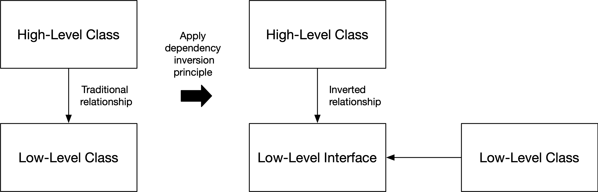

# 面向对象设计原则
本章描述了与面向对象设计相关的原则。 讨论了以下原则：

- SOLID原则
- 统一命名原则
- 封装原则
- 组合原则
- 领域驱动设计原则
- 使用设计模式原则
- 别问，讲原则
- Demeter法则
- 避免原始类型迷恋原则
- 依赖注入原理
- 避免重复原则

## SOLID原则

本节涵盖了所有五个 SOLID 原则。 依赖倒置原则被概括为一种反对接口原则的程序。 五项 SOLID 原则如下：

- 单一职责原则
- 开闭原则
- 里氏替换原则
- 接口隔离原则
- 依赖倒置原则（概括：program against interfaces principle）

### 单一职责原则

> 类应该有一个责任，代表一个事物或提供一个单一的功能。 函数应该只做一件事。

每个班级都应该有一个专门的目的。 类可以表示单个事物，如银行账户（```Account``` 类）或雇员（```Employee``` 类），或提供单一功能，如解析配置文件（```ConfigFileParser``` 类）或计算税金（```TaxCalculator``` 类）。

我们不应该创建一个代表银行账户和雇员的类。 这是完全错误的。 当然，员工可以拥有银行账户。 但那是另一回事。 它被称为对象组合。 在对象组合中，一个 ```Employee``` 类对象包含一个 ```Account``` 类对象。 ```Employee``` 类仍然代表一件事：雇员（可以拥有银行帐户）。 本章稍后将更详细地介绍对象组合。

在函数级别，每个函数都应该执行一个任务。 函数名应该描述函数执行的任务，这意味着每个函数名都应该包含一个动词。 函数名称不应包含该词，因为它可能意味着该函数正在做不止一件事，或者你没有在正确的抽象级别上命名该函数。 你不应该根据函数执行的步骤来命名函数（例如，doThisAndThatAndThenSomeThirdThing），而是使用更高抽象级别的措辞。

当一个类表示某物时，它可以包含多个方法。 例如，在 ```Account``` 类中，可以有 ```deposit``` 和 ```withdraw``` 之类的方法。 如果这些方法足够简单并且类中的方法不是太多，它仍然是一个单一的责任。

下面是一个真实的代码示例，其中在函数名称中使用了 and word：

```java
void deletePageAndAllReferences(Page page) {
  deletePage(page);
  registry.deleteReference(page.name);
  configKeys.deleteKey(page.name.makeKey());
}
```

在上面的示例中，该函数似乎做了两件事：删除页面和删除对该页面的所有引用。 但是如果我们查看函数内部的代码，我们可以意识到它还在做第三件事：从配置键中删除页面键。 那么这个函数应该命名为 ```deletePageAndAllReferencesAndConfigKey``` 吗？ 听起来不太合理。 函数名的问题在于它与函数语句处于同一抽象级别。 函数名应该比函数内的语句处于更高的抽象层次。

那么我们应该如何命名该函数呢？ 我不能肯定地说，因为我不知道函数的上下文。 我们可以将函数命名为 ```delete```。 这会告诉函数调用者页面将被删除。 调用者不需要知道所有的动作
与删除页面有关。 来电者只是想删除一个页面。 函数实现应该满足该请求并执行所需的内务处理操作，例如删除对被删除页面的所有引用等。

一个函数做多件事的另一个例子是 ```JavaScript``` 的 ```Array``` 类中的 ```splice``` 方法。 函数名称应该描述它的作用（更多关于统一命名原则部分）。 但是如果他们只是第一次听到这个名字，没有人会知道拼接函数是做什么的。 如果函数名称无法说明函数的作用，则函数可能会做不止一件事。 拼接方法的描述如下：

> ```splice()``` 方法通过删除或替换现有元素和/或添加新元素来更改数组的内容。

上面的描述表明 ```splice``` 方法做了很多事情：删除、替换和添加。 此方法应拆分为多个方法，每个方法都具有删除、替换或添加的单一职责。

让我们考虑另一个使用 ```React Hooks``` 的例子。 ```React Hooks``` 有一个名为 ```useEffect``` 的函数，可用于将要在组件渲染后运行的函数排入队列。 ```useEffect``` 函数可用于在初始渲染后（组件安装后）、每次渲染后或有条件地运行一些代码。 这是对单个函数的相当大的责任。 此外，该函数的奇怪名称并没有透露其用途。 效果这个词来自于这个函数用于将其他具有副作用的函数排入队列以运行。 函数式语言程序员可能熟悉术语副作用。 它表示函数不纯（有副作用）。

下面是一个示例 ```React``` 功能组件：

```MyComponent.jsx```

```javascript
import { useEffect } from "react";

export default function MyComponent() {
  useEffect(() => {
    function startFetchData() {
      // ...
    }
    
    function subscribeToDataUpdates() {
      // ...
    }
    
    function unsubscribeFromDataUpdates() {
      // ...
    }
    
    startFetchData();
    subscribeToDataUpdates();
    return function cleanup() { unsubscribeFromDataUpdates() };
  }, []);
  
  // JSX to render
  return ...;
}
```

在上面的示例中，```useEffect``` 调用使得对函数 ```startFetchData``` 和 ```subscribeToDataUpdates``` 的调用发生在初始渲染之后，因为为依赖项提供了空数组（```useEffect``` 函数的第二个参数）。 从提供给 ```useEffect``` 的函数返回的清理函数将在效果再次运行之前或在卸载组件时调用，在这种情况下，仅在卸载时调用，因为效果只会在初始渲染后运行一次。

让我们想象一下如何改进 ```useEffect``` 函数。 我们可以将与挂载和卸载相关的功能分成两个不同的功能：```afterMount``` 和 ```beforeUnmount```。 那么我们可以将上面的例子改成下面这段代码：

```java
export default function MyComponent() {
  function startFetchData() {
    // ...
  }
  
  function subscribeToDataUpdate() {
    // ...
  }
  
  function unsubscribeFromDataUpdate() {
    // ...
  }
   
  afterMount(startFetchData, subscribeToDataUpdates);
  beforeUnmount(unsubscribeFromDataUpdates)
  
  // JSX to render
  return ...;
}
```

上面的例子比原来的例子更清晰，也更容易让读者理解。 没有多层嵌套函数。 你不必返回要在组件卸载时执行的函数，也不必提供依赖项数组。

```js
import { useEffect, useState } from "react";

export default function ButtonClickCounter() {
  const [clickCount, setClickCount] = useState(0);
  
  useEffect(() => {
    function updateClickCountInDocumentTitle() {
      document.title = `Click count: ${clickCount}`;
    }
    
    updateClickCountInDocumentTitle();
  });
}
```

在上面的示例中，效果在每次渲染后调用（因为没有为 ```useEffect``` 函数提供依赖项数组）。 上面的代码没有明确说明将执行什么以及何时执行。 我们仍然使用相同的 ```useEffect``` 函数，但现在它的行为与前面的示例不同。 ```useEffect``` 函数似乎在做很多事情。 如何解决这个问题？ 我们再假设一下。 我们可以引入另一个新函数，当我们希望在每次渲染后发生某些事情时可以调用该函数：

```js
export default function ButtonClickCounter() {
  const [clickCount, setClickCount] = useState(0);
  
  afterEveryRender(function updateClickCountInDocumentTitle() {
    document.title = `Click count: ${clickCount}`;
  });
}
```

上述 ```React``` 功能组件的意图非常明确：它将在每次渲染后更新文档标题中的点击次数。

让我们优化我们的示例，以便仅当点击计数发生变化时才会更新点击计数：

```js
import { useEffect, useState } from "react";

export default function ButtonClickCounter() {
  const [clickCount, setClickCount] = useState(0);
  
  useEffect(() => {
    function updateClickCountInDocumentTitle() {
      document.title = `Click count: ${clickCount}`;
    }
    
    updateClickCountInDocumentTitle();
  }, [clickCount]);
}
```

请注意现在如何将 ```clickCount``` 添加到 ```useEffect``` 函数的依赖项数组中。 这意味着效果不会在每次渲染后执行，而只会在点击次数更改时执行。

让我们想象一下我们如何改进上面的例子。 我们可以引入一个处理依赖关系的新函数：```afterEveryRenderIfChanged```。 我们假设的例子现在看起来像这样：

```js
export default function ButtonClickCounter() {
  const [clickCount, setClickCount] = useState(0);
   
  afterEveryRenderIfChanged(
    [clickCount],
    function updateClickCountInDocumentTitle() {
      document.title = `Click count: ${clickCount}`;
  });
}
```

让函数只做一件事情也有助于提高代码的可读性。 关于原始示例，读者必须查看 ```useEffect``` 函数调用的结尾，以弄清楚在什么情况下会调用 ```effect``` 函数。 理解和记住缺失依赖项数组和空依赖项数组之间的区别在认知上具有挑战性。 好的代码不会让代码阅读者思考。 充其量，代码应该读起来像散文：如果更改了```clickCount```，则在每次渲染后更新文档标题中的点击次数。

单一职责原则背后的一个想法是，它支持使用下一节中描述的开闭原则进行软件开发。 当你遵循单一职责原则并需要添加功能时，你将其添加到一个新类中，这意味着你不需要修改现有类。 你应该避免修改现有代码，而是通过添加新类来扩展它，每个类都有一个单一的职责。

### 开闭原则

> 软件代码应该对扩展开放，对修改关闭。 不应修改现有类中的功能，但应引入实现新接口或现有接口或扩展现有类的新类。

每当你发现自己修改现有类中的某些方法时，你应该首先考虑是否可以遵循此原则以及是否可以避免修改。 每次修改现有类时，都可能在工作代码中引入错误。 这个原则的想法是让工作代码保持不变，这样它就不会被意外破坏。

让我们举一个不遵循这个原则的例子。 我们有以下现有的工作代码：

```java
public interface Shape {
}

public class RectangleShape implements Shape {
  private int width;
  private int height;
  
  public RectangleShape(final int width, final int height) {
    this.width = width;
    this.height = height;
  }
  
  public int getWidth() {
    return width;
  }

  public int getHeight() {
    return height;
  }
  
  public void setWidth(final int newWidth) {
    width = newWidth;
  }

  public void setHeight(final int newHeight) {
    height = newHeight;
  }
}
```

假设我们得到一个任务来引入对方形的支持。 让我们尝试修改现有的 ```RectangleShape``` 类，因为正方形也是矩形：

```java
public class RectangleShape implements Shape {
  private int width;
  private int height;
    
  // Rectangle constructor
  public RectangleShape(final int width, final int height)  {
    this.width = width;
    this.height = height;
  }
    
  // Square constructor
  public RectangleShape(final int sideLength) {
    this.width = sideLength;
    this.height = sideLength;
  }
    
  public int getWidth() {
      return width;
  }

  public int getHeight() {
      return height;
  }

  public void setWidth(final int newWidth) {
    if (height == width) {
      //noinspection SuspiciousNameCombination
      height = newWidth;    
    }
    
    width = newWidth;
  }

  public void setHeight(final int newHeight) {
    if (height == width) {
      //noinspection SuspiciousNameCombination
      width = newHeight;
    }
    
    height = newHeight;
  }
}
```

我们需要添加一个新的构造函数并修改类中的两个方法。 当我们运行测试时一切正常。 但是我们在代码中引入了一个微妙的错误：如果我们创建一个高度和宽度相等的矩形，矩形就会变成正方形，这可能不是我们想要的。 这是一个在单元测试中很难发现的错误。 此示例表明修改现有类可能会出现问题。 我们修改了一个现有的类，不小心破坏了它。

引入对方形支持的更好解决方案是使用开闭原则并创建一个实现 ```Shape``` 接口的新类。 这样我们就不必修改任何现有的类，也不会有意外破坏现有代码的风险。 下面是新的 ```SquareShape``` 类：

```java
public class SquareShape implements Shape {
  private int sideLength;
    
  public SquareShape(final int sideLength) {
    this.sideLength = sideLength;
  }
  
  public int getSideLength() {
    return sideLength;
  }

  public void setSideLength(final int newSideLength) {
    sideLength = newSideLength;
  }
}
```

在以下情况下，可以通过添加新方法来安全地修改现有类：

1. 添加的方法是一个纯函数，即它总是为相同的参数返回相同的值并且没有副作用，即它不修改对象的状态。
2. 添加的方法是只读和线程安全的，即它不会修改对象的状态，并且在多线程代码的情况下以线程安全的方式访问对象的状态。 形状类中的只读方法的一个示例是计算形状面积的方法。
3. 类是不可变的，即添加的方法（或任何其他方法）不能修改对象的状态

在某些情况下，需要修改现有代码。 一个例子是工厂。 当你引入一个新类时，你需要修改相关的工厂才能创建那个新类的实例。 例如，如果我们有一个 ```ShapeFactory``` 类，我们需要修改它以支持创建 ```SquareShape``` 对象。 本章稍后将讨论工厂。

另一种情况是添加一个新的枚举常量。 你通常需要修改现有代码来处理新的枚举常量。 如果你忘记在现有代码中的某处添加新枚举常量的处理，通常会出现错误。 出于这个原因，你应该始终使用抛出的默认情况来保护 ```switch-case``` 语句，并使用抛出的 ```else``` 分支来保护 ```if/else-if``` 结构。 如果缺少 ```switch``` 语句的默认情况或 ```if/else-if``` 结构中缺少 ```else``` 分支，你还可以启用静态代码分析工具来报告问题。 此外，如果你没有在 ```switch-case``` 语句中处理枚举常量，一些静态代码分析工具可能会报告问题。

下面是在 ```Java``` 中保护 ```if/else-if``` 结构的示例：

```java
public enum FilterType {
  INCLUDE,
  EXCLUDE
}

interface Filter { 
  boolean isFilteredOut(...);
}

public class FilterImpl implements Filter {
  private final FilterType filterType;
  
  public FilterImpl(final FilterType filterType, ...) {
    this.filterType = filterType;
    // ...
  }
  
  public boolean isFilteredOut(...) {
    if (filterType == FilterType.INCLUDE) {
      // ...
    } else if (filterType == FilterType.EXCLUDE) {
      // ..
    } else {
      // Safeguarding
      throw new IllegalArgumentException("Invalid filter type");
    }
  }
}
```

在 ```TypeScript``` 中，联合类型也可能需要保护：

```javascript
type FilterType = 'include' | 'exclude';

if (filterType === 'include') {
  // ...
} else if (filterType === 'include') {
  // ...
} else {
  // Safeguarding
  throw new Error("Invalid filter type");
}
```

从上面的例子中我们可以注意到，如果更好的面向对象设计可以避免 ```if/else-if``` 结构。 例如，我们可以创建一个 ```Filter``` 接口和两个独立的类，```IncludeFilter``` 和 ```ExcludeFilter```，它们实现了 ```Filter``` 接口。 使用面向对象的设计允许我们消除 ```FilterType``` 枚举和 ```if/else-if``` 结构。 这被称为用多态性重构技术替换条件。 下一章将详细讨论重构。 下面是重构为更面向对象的上述 ```Java``` 示例：

```java
interface Filter { 
  boolean isFilteredOut(...);
}

public class IncludeFilter implements Filter {
  
  // ...
  
  public boolean isFilteredOut(...) {
    // ...
  }
}

public class ExcludeFilter implements Filter {
  
  // ...
  
  public boolean isFilteredOut(...) {
    // ...
  }
}
```

### 里氏替换原则
> 超类的对象应该可以在不破坏应用程序的情况下被其子类的对象替换。 即，子类对象的行为方式与超类对象的行为方式相同。

遵循里氏替换原则可保证类型层次结构中类型的语义互操作性。

让我们举一个包含 ```RectangleShape``` 类和派生 ```SquareShape``` 类的示例：

```java
public interface Shape {
  void draw();
}

public class RectangleShape implements Shape {
  private int width;
  private int height;

  public RectangleShape(final int width, final int height) {
    this.width = width;
    this.height = height;
  }

  public void draw() {
    // ...
  }

  public int getWidth() {
    return this.width;
  }

  public int getHeight() {
    return this.height;
  } 

  public void setWidth(final int newWidth) {
    width = newWidth;
  }

  public void setHeight(final int newHeight) {
    height = newHeight;
  }
}

public class SquareShape extends RectangleShape {
  public SquareShape(final int sideLength) {
    super(sideLength, sideLength);
  }

  @Override
  public void setWidth(final int newWidth) {
    super.setWidth(newWidth);
    //noinspection SuspiciousNameCombination
    super.setHeight(newWidth);
  }

  @Override
  public void setHeight(final int newHeight) {
    //noinspection SuspiciousNameCombination
    super.setWidth(newHeight);
    super.setHeight(newHeight);
  }
}
```


上面的例子没有遵循里氏代换原则，因为你不能单独设置正方形的宽度和高度。 这意味着从面向对象的角度来看，正方形不是矩形。 当然，从数学上讲，正方形就是长方形。 但是考虑到上面```RectangleShape```类的公共```API```，我们可以得出正方形不是矩形的结论，因为正方形不能完全实现```RectangleShape```类的```API```。 我们不能用方形对象代替矩形对象。 我们需要做的是在不从 ```RectangleShape``` 类派生的情况下实现 ```SquareShape``` 类：

```java
public class SquareShape implements Shape {
  private int sideLength;

  public SquareShape(final int sideLength) {
    this.sideLength = sideLength;
  }

  public void draw() {
    // ...
  }

  public int getSideLength() {
    return this.sideLength;
  }

  public void setSideLength(final int newSideLength) {
    sideLength = newSideLength;
  }
}
```


里氏替代原则要求如下：

- 子类必须实现超类 ```API``` 并保留（或在某些情况下替换）超类的功能。
- 超类不应该有受保护的字段，因为它允许子类修改超类的状态，这会导致超类中的错误行为

下面是一个示例，其中子类在 ```doSomething``` 方法中扩展了超类的行为。 超类的功能保留在子类中，使子类对象可以替代超类对象。

```java
public class SuperClass {
  // ...
  
  public void doSomething() {
    // ...
  }
}

public class SubClass extends SuperClass {
  // ...

  @Override
  public void doSomething() {
    super.doSomething();

    // Some additional behaviour...
  }
}
```

让我们举一个使用上述策略的具体例子。 我们定义了以下 ```CircleShape``` 类：

```java
public interface Shape {
  void draw();
}

public class CircleShape implements Shape {
  public void draw() {
    // draw the circle stroke
  }
}
```

接下来，我们介绍一个实心圆的类：

```java
public class FilledCircleShape extends CircleShape {
  @Override
  public void draw() {
     super.draw(); // draws the circle stroke
     // Fill the circle
  }
}
```

```FilledCircleShape``` 类满足里氏替换原则的要求。 我们可以在任何需要 ```CircleShape``` 类实例的地方使用 ```FilledCircleShape``` 类的实例。 ```FilledCircleShape``` 类完成 ```CircleShape``` 类所做的所有工作，并添加了一些行为（= 填充圆圈）。

你还可以完全替换子类中的超类功能：

```ReverseArrayList.java```

```java
public class ReverseArrayList<T> extends ArrayList<T>
{
  @Override
  public Iterator<T> iterator() {
    return new ReverseListIterator<>(this);
  }
}
```

上面的子类实现了超类 ```API``` 并保留了它的行为：迭代器方法仍然返回一个迭代器。 与超类相比，它只是返回一个不同的迭代器。

### 接口隔离和多重继承原则

> 将更大的接口分离为具有单一能力/行为的微接口，并通过继承多个微接口来构造更大的接口。

让我们举几个汽车类的例子：

```java
public interface Automobile {
  void drive(Location start, Location destination);
  void carryCargo(double volumeInCubicMeters, double weightInKgs);
}

public class PassengerCar implements Automobile {
  // Implement drive and carryCargo
}

public class Van implements Automobile {
  // Implement drive and carryCargo
}

public class Truck implements Automobile {
  // Implement drive and carryCargo
}

public interface ExcavatingAutomobile extends Automobile {
  void excavate(...);
}

public class Excavator implements ExcavatingAutomobile {
  // Implement drive, carryCargo and excavate
}
```

请注意 ```Automobile``` 接口是如何声明两个方法的。 如果我们以后想引入其他只能驾驶但不能运载货物的车辆，这可能会限制我们的软件。 在早期阶段，我们应该从 ```Automobile``` 接口中分离出两个微接口。 微接口定义单个功能或行为。 隔离之后，我们会有以下两个微接口：

```java
public interface Drivable {
  void drive(Location start, Location destination);
}

public interface CargoCarriable {
  void carryCargo(double volumeInCubicMeters, double weightInKgs);
}
```

现在我们有了两个接口，我们也可以在我们的代码库中单独使用这些接口。 例如，我们可以有一个可驱动对象列表或一个可以运载货物的对象列表。 不过，我们仍然希望有一个汽车界面。 我们可以使用接口多重继承来重新定义```Automobile```接口来扩展两个微接口：

```java
public interface Automobile extends Drivable, CargoCarriable {
}
```

如果我们查看 ```ExcavatingAutomobile``` 接口，我们会注意到它扩展了 ```Automobile``` 接口并添加了挖掘行为。 如果我们想要一台非自动移动的挖掘机，我们又遇到了一个问题。 挖掘行为应该被隔离到它自己的微界面中：

```java
public interface Excavating { 
  void excavate(...);
}
```


我们可以再次使用接口多重继承来重新定义 ```ExcavatingAutomobile``` 接口，如下所示：

```java
public interface ExcavatingAutomobile extends Excavating, Automobile {
}
```

```ExcavatingAutomobile``` 接口现在扩展了三个微接口：```Excavating```、```Drivable``` 和 ```CargoCarriable```。 无论何时在代码库中需要挖掘的、可驾驶的或可运载货物的对象，都可以在那里使用 ```Excavator``` 类的实例。

让我们再举一个使用 ```TypeScript``` 的通用集合接口的例子。 我们应该能够遍历一个集合，也能够比较两个集合是否相等。 首先，我们为迭代器定义一个通用的 ```MyIterator``` 接口。 它有两种方法，如下所述：

```java
interface MyIterator<T> {
  hasNextElement(): boolean;
  getNextElement(): T;
}
```

接下来，我们可以定义集合接口：

```java
interface Collection<T> {
  createIterator(): MyIterator<T>;
  equals(anotherCollection: Collection<T>): boolean;
}
```

```Collection<T>``` 是一个具有两个不相关方法的接口。 让我们将这些方法分成两个微接口：```MyIterable``` 和 ```Equatable```。 ```MyIterable``` 接口用于可以迭代的对象。 它有一种创建新迭代器的方法。 ```Equatable``` 接口的 ```equals``` 方法比 ```Collection<T>``` 接口中的 ```equals``` 方法更通用。 你可以将 ```Equatable<T>``` 对象等同于另一个 ```T``` 类型的对象：

```java
interface MyIterable<T> {
  createIterator(): MyIterator<T>;
}

interface Equatable<T> {
  equals(anotherObject: T): boolean;
}
```

我们可以使用接口多重继承来重新定义 ```Collection<T>``` 接口，如下所示：

```java
interface Collection<T> extends MyIterable<T>, Equatable<Collection<T>> {
}
```

我们可以通过迭代两个集合中的元素并检查元素是否相等来实现 ```equals``` 方法：

```java
abstract class AbstractCollection<T> implements Collection<T> {
  abstract createIterator(): MyIterator<T>;
  
  equals(anotherCollection: Collection<T>): boolean {
    const iterator = this.createIterator();
    const anotherIterator = anotherCollection.createIterator();
    let collectionsAreEqual = 
      this.areEqual(iterator, anotherIterator);
    
    if (anotherIterator.hasNextElement()) {
      collectionsAreEqual = false; 
    }
    
    return collectionsAreEqual;
  }
  
  private areEqual(
    iterator: MyIterator<T>,
    anotherIterator: MyIterator<T>
  ): boolean {
    while (iterator.hasNextElement()) {
      if (anotherIterator.hasNextElement()) {
        if (iterator.getNextElement() !== 
            anotherIterator.getNextElement()) {
         return false;
        }
      } else {
        return false;
      }
    }
    
    return true;
  }
}
```

集合也可以进行比较。 让我们介绍对此类集合的支持。 首先，我们定义一个通用的 ```Comparable<T>``` 接口来比较一个对象和另一个对象：

```java
type ComparisonResult = 'isLessThan' | 'areEqual' | 'isGreaterThan' | 'unspecified';

interface Comparable<T> {
  compareTo(anotherObject: T): ComparisonResult;
}
```

现在我们可以引入一个可比较的集合接口，它允许比较两个相同类型的集合：

```java
interface ComparableCollection<T> extends Comparable<Collection<T>>, Collection<T> {
}
```

让我们为元素可比较的集合定义一个通用的排序算法：

```java
function sort<T, U extends Comparable<T>, V extends Collection<U>>(
  collection: V
): V {
  // ...
}
```

让我们为可以插入实例元素的类创建两个接口，```Inserting<T>``` 和 ```InsertingIterable<T>```：

```java
interface Inserting<T> {
  insert(element: T): void;
}

interface InsertingIterable<T> extends Inserting<T>, MyIterable<T> {
}
```

让我们重新定义 ```Collection``` 接口以扩展 ```InsertingIterable``` 接口，因为集合是可迭代的，并且你可以将元素插入到集合中。

```java
interface Collection<T> extends InsertingIterable<T> {
}
```

接下来，我们介绍两种集合的通用算法：```map``` 和 ```filter```。 我们可以意识到，这些算法处理的对象比集合更抽象。 我们受益于接口隔离，因为我们可以使用 ```MyIterable<T>``` 和 ```InsertingIterable<T>``` 接口来创建通用映射和过滤器算法，而不是 ```Collection<T>``` 接口。 稍后可以引入一些额外的非集合可迭代对象，这些对象也可以使用这些算法。 下面是地图和过滤器功能的实现：

```java
function map<T, U>(
  source: MyIterable<T>,
  mapped: (sourceElement: T) => U,
  destination: InsertingIterable<U>
): InsertingIterable<U> {
  const sourceIterator = source.createIterator();
  
  while(sourceIterator.hasNextElement()) {
    const sourceElement = sourceIterator.getNextElement();
    destination.insert(mapped(sourceElement));
  }
  
  return destination;
}

function filter<T>(
  source: MyIterable<T>,
  isIncluded: (sourceElement: T) => boolean,
  destination: InsertingIterable<T>
): InsertingIterable<T> {
  const sourceIterator = source.createIterator();
  
  while (sourceIterator.hasNextElement()) {
    const sourceElement = sourceIterator.getNextElement();
    
    if (isIncluded(sourceElement)) {
      destination.insert(sourceElement);
    }
  }
  
  return destination;
}
```

让我们定义以下具体的集合类：

```java
class List<T> implements Collection<T> {
  constructor(...args: T[]) {
    // ...
  }

  // ...
}

class Stack<T> implements Collection<T> {
  // ...
}

class MySet<T> implements Collection<T> {
  // ...
}
```

现在我们可以将 ```map``` 和 ```filter``` 算法与上面定义的集合类一起使用：

```java
const numbers = new List<number>(1, 2, 3, 3, 3, 50, 60);
const isLessThan10 = (nbr: number) => nbr < 10;

const uniqueLessThan10Numbers =
  filter(numbers, isLessThan10, new MySet());

const doubled = (nbr: number) => 2 * nbr;
const stackOfDoubledNumbers = map(numbers, doubled, new Stack());
```

让我们创建地图算法的异步版本：

```java
interface MaybeCloseable {
  tryClose(): Promise<void>;
}

interface MaybeInserting<T> {
  tryInsert(value: T): Promise<void>;
}

interface MaybeCloseableInserting<T> 
            extends MaybeCloseable, MaybeInserting<T> {
}

class MapError extends Error {
  // ...
}

async function tryMap<T, U>(
  source: MyIterable<T>,
  mapped: (sourceElement: T) => U,
  destination: MaybeCloseableInserting<U>
): Promise<void> {
  const sourceIterator = source.createIterator();
 
  try {
    while (sourceIterator.hasNextElement()) {
      const sourceElement = sourceIterator.getNextElement();
      await destination.tryInsert(mapped(sourceElement));
    }
      
    await destination.tryClose();
  } catch (error: any) {
    throw new MapError(error.message);
  }
}
```

让我们创建一个实现 ```MaybeCloseableInserting``` 接口的 ```FileLineInserter``` 类：

```java
const fs = require('fs');

class FileLineInserter<T extends { toString(): string }>
        implements MaybeCloseableInserting<T> {
  private writeStream: FS.WriteStream;

  constructor(private readonly filePathName: string) {
    this.writeStream = 
      fs.createWriteStream(this.filePathName, { flags: 'a' });
  }

  async tryInsert(value: T): Promise<void> {
    try {
      const writePromise = new Promise((resolve, reject) => {
        const line = value.toString() + '\n';
        
        this.writeStream.write(line, (error: any) => {
          if (error) {
            reject(error);
          } else {
            resolve(undefined);
          }
        });
      });
      
      await writePromise;
    } catch (error: any) {
      throw new Error(error.message);
    }
  }

  tryClose(): Promise<void> {
    this.writeStream.close();
    return Promise.resolve();
  }
}
```

让我们使用上面定义的 ```tryMap``` 算法和 ```FileLineInserter``` 类将双倍数字（每行一个数字）写入名为 ```file.txt``` 的文件：

```java
const numbers = new List<number>(1, 2, 3, 2, 1, 50, 60);
const doubled = (nbr: number) => 2 * nbr;

try {
  await tryMap(numbers, doubled, new FileLineInserter('file.txt'));
} catch(error: any) { // error will be always MapError type.
  console.log(error.message);
}
```

### Program Against Interfaces Principle（广义依赖倒置原则）
> 不要编写内部依赖项是具体对象类型的程序，而是针对接口进行编程。 此规则的一个例外是没有行为的数据类（不包括简单的 ```getter```/```setter```）。

接口用于定义抽象基类型。 可以引入实现该接口的各种实现。 当你想要更改程序的行为时，你可以创建一个实现接口的新类，然后使用该类的实例。 这样，你就可以实践开闭原则。 你可以将此原则视为有效使用开闭原则的先决条件。 针对接口原则的程序是 ```SOLID``` 原则中依赖倒置原则的概括：

> 依赖倒置原则是松耦合软件类的一种方法。 当遵循该原则时，将高层类到低层类的常规依赖关系颠倒过来，从而使高层类独立于低层的实现细节。

依赖倒置原则指出：

1. 高级类不应该从低级类中导入任何东西
2. 抽象（= 接口）不应依赖于具体实现（类）
3. 具体实现（类）应该依赖于抽象（=接口）



接口始终是抽象类型，无法实例化。 下面是一个接口的例子：

```java
public interface Shape {
  void draw();
  double calculateArea();
}
```

接口的名称描述了一些抽象的东西，你不能创建它的对象。 在上面的例子中，```Shape``` 显然是抽象的东西。 你不能创建 ```Shape``` 的实例然后绘制它或计算它的面积，因为你不知道它是什么形状。 但是当一个类实现一个接口时，可以创建表示该接口的类的具体对象。 下面是实现 ```Shape``` 接口的三个不同类的示例：

```java
public class CircleShape implements Shape {
  private final int radius;
  
  public CircleShape(final int radius) {
    this.radius = radius;
  }
  
  public void draw() {
    // ...
  }
  
  public double calculateArea() {
    return Math.PI * radius * radius;
  }
}

public class RectangleShape implements Shape {
  private final int width;
  private final int height;

  public RectangleShape(final int width, final int height) {
    this.width = width;
    this.height = height;
  }

  public void draw() {
    // ...
  }

  public double calculateArea() {
    return width * height;
  }
}

public class SquareShape extends RectangleShape {
  public SquareShape(final int sideLength) {
   super(sideLength, sideLength);
  }
}
```

在代码中使用形状时，我们应该针对 ```Shape``` 接口进行编程。 在下面的示例中，我们创建了一个依赖于 ```Shape``` 接口的高级类 ```Canvas```，而不依赖于任何低级类（```CircleShape```、```RectangleShape``` 或 ```SquareShape```）。 现在高级 ```Canvas``` 类和所有低级形状类都只依赖于抽象，即 ```Shape``` 接口。 我们还可以注意到高级类 ```Canvas``` 没有从低级类中导入任何东西。 此外，抽象 ```Shape``` 不依赖于具体实现（类）。

```java
public class Canvas {
  private final List<Shape> shapes = new ArrayList<>(10);
  
  public Canvas() {
  }
  
  public void add(final Shape shape) {
    shapes.add(shape);
  }
  
  public void drawShapes() {
    for(final var shape : shapes) {
      shape.draw();    
    }
  }
}
```

```Canvas``` 对象可以包含任何形状并绘制任何形状。 它可以处理任何当前定义的具体形状和未来定义的任何新形状。

如果你没有针对接口进行编程并且没有使用依赖倒置原则，你的 ```Canvas``` 类将如下所示：

```java
public class Circle {
  public void draw() {
    // ...
  }    
}

public class Rectangle {
  public void draw() {
    // ...
  }    
}

public class Square {
  public void draw() {
    // ...
  }    
}

public class Canvas {
  private final List<Circle> circles = new ArrayList<>(10);
  private final List<Rectangle> rectangles = new ArrayList<>(10);
  private final List<Square> squares = new ArrayList<>(10);
  
  public Canvas() {
  }
  
  public void addCircle(final Circle circle) {
    circles.add(circle);
  }

  public void addRectangle(final Rectangle rectangle) {
    rectangles.add(rectangle);
  }

  public void addSquare(final Square square) {
    squares.add(square);
  }
  
  public void drawShapes() {
    for(final var circle : circles) {
      circle.draw();    
    }
    
    for(final var rectangle : rectangles) {
      rectangle.draw();
    }

    for(final var square : squares) {
      square.draw();
    }
  }
}
```

上面的高级 ```Canvas``` 类与所有低级类（```Circle```、```Rectangle``` 和 ```Square```）相结合。 如果需要新的形状类型，则必须修改 ```Canvas``` 类。 如果任何低级类的公共 ```API``` 发生变化，则需要相应地修改 ```Canvas``` 类。

让我们再举一个例子。 如果你阅读过有关面向对象设计的书籍或文章，你可能遇到过类似于以下示例中的内容：

```java
public class Dog {
  public void walk() {
    // ...
  }
  
  public void bark() {
    // ...
  }
}

public class Fish {
  public void swim() {
    // ...
  }
}

public class Bird {
  public void fly() {
    // ...
  }

  public void sing() {
    // ...
  }
}
```

上面定义了三个具体实现，但是没有定义接口。 假设我们正在制作一款有不同动物的游戏。 编写游戏代码时要做的第一件事是记住针对接口进行编程，从而引入一个 ```Animal``` 接口，我们可以将其用作抽象基类型。 让我们尝试根据上述具体实现来创建 ```Animal``` 接口：

```java
public interface Animal {
  void walk();
  void bark();
  void swim();
  void fly();
  void sing();
}

public class Dog implements Animal {
  public void walk() {
    // ...
  }

  public void bark() {
    // ...
  }

  public void swim() {
    throw new RuntimeException("Illegal operation");
  }
  
  public void fly() {
    throw new RuntimeException("Illegal operation");
  }
  
  public void sing() {
    throw new RuntimeException("Illegal operation");
  }
}
```

上面的做法是错误的。 我们声明 ```Dog``` 类实现了 ```Animal``` 接口，但它并没有这样做。 它只实现了 ```walk``` 和 ```bark``` 方法，而其他方法抛出异常。 我们应该能够在需要动物的地方替换任何具体的动物实现。 但这是不可能的，因为如果我们有一个 ```Dog``` 对象，我们就不能安全地调用 ```swim```、```fly``` 或 ```sing``` 方法，因为它们总是会抛出。

问题是我们在定义接口之前定义了具体类。 这种做法是错误的。 我们应该先指定接口，再指定具体的实现。 我们上面所做的是相反的。

当定义一个接口时，我们应该记住我们正在定义一个抽象基类型，所以我们必须用抽象的术语来思考。 我们必须考虑我们希望动物在游戏中做什么。 如果我们看```walk```、```fly```、```swim```这些方法，都是具体的动作。 但是这三个具体动作共同的抽象动作是什么？ 是动。 而行走、飞行、游泳，都是运动的方式。 同样，如果我们看```bark```和```sing```的方法，也是具体的动作。 这两个具体动作共同的抽象动作是什么？ 它是 ```makeSound```。 吠叫和唱歌都是发出声音的方式。 如果我们使用这些抽象动作，我们的 ```Animal``` 界面如下所示：

```java
public interface Animal {
  void move();
  void makeSound();
}
```

我们现在可以重新定义动物类来实现新的 ```Animal``` 接口：

```java
public class Dog implements Animal {
  public void move() {
    // walk
  }
  
  public void makeSound() {
    // bark
  }
}

public class Fish implements Animal {
  public void move() {
    // swim
  }

  public void makeSound() {
    // Intentionally no operation 
    // (Fishes typically don't make sounds)
  }
}

public class Bird implements Animal {
  public void move() {
    // fly
  }

  public void makeSound() {
    // sing
  }
}
```

现在我们有了正确的面向对象设计，可以针对 ```Animal``` 接口进行编程。 当我们想让动物移动时，我们可以调用 ```move``` 方法；当我们想让动物发出声音时，我们可以调用 ```makeSound``` 方法。

在意识到有些鸟根本不会飞之后，我们可以轻松地改进我们的设计。 我们可以介绍两种不同的实现方式：

```java
public abstract class AbstractBird implements Animal {
  public abstract void move();
  
  public void makeSound() {
    // sing
  }
}

public class FlyingBird extends AbstractBird {
  public void move() {
    // fly
  }
}

public class NonFlyingBird extends AbstractBird {
  public void move() {
    // walk
  }
}
```

我们以后可能还会意识到，并非所有的鸟都会唱歌，而是会发出不同的声音。 例如，鸭子嘎嘎叫。 除了像上面那样使用继承，更好的替代方法是使用对象组合。 我们组成了 ```Bird``` 类的行为类来移动和发出声音：

```java
public interface Mover {
  void move();    
}

public interface SoundMaker {
  void makeSound();
}

public class Bird implements Animal {
  private final Mover mover;
  private final SoundMaker soundMaker;
  
  public Bird(
    final Mover mover,
    final SoundMaker soundMaker
  ) {
    this.mover = mover;
    this.soundMaker = soundMaker;
  }
  
  public void move() {
    mover.move();
  }
  
  public void makeSound() {
    soundMaker.makeSound();
  }
}
```

现在我们可以创建具有各种移动和发出声音行为的鸟类。 我们可以使用工厂模式来创建不同的鸟。 本章稍后将更详细地描述工厂模式。 让我们介绍三种不同的移动和发声行为以及制造三种鸟类的工厂：金翅雀、鸵鸟和家鸭。

```java
public class Flyer implements Mover {
  public void move() {
    // fly
  }
}

public class Runner implements Mover {
  public void move() {
    // run
  }
}

public class Walker implements Mover {
  public void move() {
    // walk
  }
}

public class GoldfinchSoundMaker implements SoundMaker {
  public void makeSound() {
    // Sing goldfinch specific songs
  }
}

public class OstrichSoundMaker implements SoundMaker {
  public void makeSound() {
    // Make ostrich specific sounds like whistles,
    // hoots, hisses, growls, and deep booming growls
    // that sound like the roar of a lion
  }
}

public class Quacker implements SoundMaker {
  public void makeSound() {
    // quack
  }
}

public enum BirdType {
  GOLDFINCH,
  OSTRICH,
  DOMESTIC_DUCK
}

public class BirdFactory {
  public Bird createBird(final BirdType birdType) {
    return switch(birdType) {
      case GOLDFINCH ->
        new Bird(new Flyer(),
                 new GoldfinchSoundMaker());
      
      case OSTRICH -> 
        new Bird(new Runner(),
                 new OstrichSoundMaker());
      
      case DOMESTIC_DUCK ->
        new Bird(new Walker(),
                 new Quacker());
      
      default -> 
        throw new IllegalArgumentException("Unsupported type");
    };
  }
}
```

## 整洁微服务设计原则
> 整洁微服务设计促进了面向对象的设计，通过使用依赖倒置原则（针对接口编程）将软件分成几层来实现关注点分离。

整洁微服务设计具有以下好处：

- 不依赖于任何单一框架
- 不依赖于任何单一的 ```API``` 技术，如 ```REST``` 或 ```GraphQL```
- 可单元测试
- 不依赖于特定客户端（适用于网络、桌面、控制台和移动客户端）
- 不依赖于特定的数据库
- 不依赖于任何特定的外部服务实现

整洁 ```API``` 微服务设计由以下几层组成：

- 控制器、接口适配器
- 用例
- （商业）实体

用例和实体共同构成了服务模型，也称为业务逻辑。


上图中的依赖方向用箭头表示。 我们可以看到微服务 ```API``` 依赖于我们创建的控制器。 控制器取决于用例。 用例层依赖于（业务）实体。 用例层的目的是在（业务）实体上编排操作。

让我们举一个真实的例子，创建一个名为 ```order-service``` 的 ```API``` 微服务，它处理电子商务软件系统中的订单。 首先，我们使用 ```Java``` 和 ```Spring Boot``` 定义一个 ```REST API``` 控制器：

```java
@RestController
@RequestMapping("/orders")
public class RestOrderController {
  @Autowired
  private OrderService orderService;

  @PostMapping
  @ResponseStatus(HttpStatus.CREATED)
  public final Order createOrder(
    @RequestBody final OrderArg orderArg
  ) {
    return orderService.createOrder(orderArg);
  }
  
  // Other API methods...
}
```

微服务提供的 ```API``` 取决于控制器，如上图所示。 该 ```API``` 目前是一个 ```REST API```，但我们可以创建和使用 ```GraphQL``` 控制器。 然后我们的 ```API```，它依赖于控制器，是一个 ```GraphQL API```。 下面是使用 ```Java``` 和 ```Spring Boot``` 的 ```GraphQL``` 控制器的部分实现：

```java
@Controller
public class GraphQlOrderController {
  @Autowired
  private OrderService orderService;
  
  @MutationMapping
  public final Order createOrder(
    @Argument final OrderArg orderArg
  ) {
    return orderService.createOrder(orderArg);
  }
  
  // Other API methods...
}
```

```RestOrderController``` 和 ```GraphQlOrderController``` 类依赖于 ```OrderService``` 接口，它是用例层的一部分。 请注意，控制器不依赖于用例的具体实现，而是根据依赖倒置原则依赖于接口。 下面是 ```OrderService``` 接口的定义：

```java
public interface OrderService {
  Order createOrder(OrderArg orderArg);
  Order getOrderById(Long id);
  Iterable<Order> getOrderByUserAccountId(Long userAccountId);
  void updateOrder(Long id, OrderArg orderArg);
  void deleteOrderById(Long id);
}
```

下面的 ```OrderServiceImpl``` 类实现了 ```OrderService``` 接口：

```java
@Service
public class OrderServiceImpl implements OrderService {
  private static final String ORDER = "Order";

  @Autowired
  private OrderRepository orderRepository;

  @Override
  public final Order createOrder(
    final OrderArg orderArg
  ) {
    final var order = Order.from(orderArg);
    return orderRepository.save(order);
  }

  @Override
  public final Order getOrderById(final Long id) {
    return orderRepository.findById(id)
             .orElseThrow(() -> 
               new EntityNotFoundError(ORDER, id));
  }
  
  // Rest of the methods...
}
```

```OrderServiceImpl``` 类依赖于订单存储库。 这种依赖性也是倒置的。 ```OrderServiceImpl``` 类仅依赖于 ```OrderRepository``` 接口。 订单存储库用于协调订单实体的持久性。 请注意，对数据库没有任何直接依赖性。

下面是 ```OrderRepository``` 接口：

```java
public interface OrderRepository {
  Order save(Order order);
  Order findById(Long id);
  // ...
}
```

```OrderRepository``` 接口仅依赖于 ```Order``` 实体类。 你可以引入一个称为接口适配器的类，它实现了 ```OrderRepository``` 接口。 数据库接口适配器使特定的具体数据库适应 ```OrderRepository``` 接口。 实体类不依赖于除其他实体之外的任何东西来创建分层实体。 例如，```Order``` 实体由 ```OrderItem``` 实体组成。

在实施干净的微服务设计时，一切都使用配置和依赖注入连接在一起。 例如，实现```OrderRepository``` 接口的实例是根据配置创建的，并由```Spring``` 框架注入到```OrderServiceImpl``` 实例中。 对于 ```Spring```，依赖注入器是使用配置文件和注释配置的。 配置文件可以用来配置使用什么数据库。 此外，```Spring``` 依赖注入器创建 ```OrderServiceImpl``` 类的实例并将其注入到需要 ```OrderService``` 对象的位置。


依赖注入器是微服务中唯一包含对具体实现的引用的地方。 在许多框架中，依赖注入器不是一个可见的组件，但它的使用是使用配置文件和注解来配置的。 例如，在 ```Spring``` 中，```@Autowired``` 注释告诉依赖注入器将具体实现注入到带注释的类字段或构造函数参数中。 本章后面的部分将详细讨论依赖注入原理。 依赖倒置原则和依赖注入原则通常是齐头并进的。 依赖注入用于连接接口依赖，使它们成为对具体实现的依赖，如下图所示。


让我们添加一个功能，在创建订单时清空购物车：

```java
@Service
public class OrderServiceImpl implements OrderService {
  @Autowired
  private OrderRepository orderRepository;
  
  @Autowired
  private ShoppingCartService shoppingCartService;

  @Override
  public final Order createOrder(
    final OrderArg orderArg
  ) {
    final var order = Order.from(orderArg);
    final var savedOrder = orderRepository.save(order);
    shoppingCartService.emptyCart(order.userAccountId);
    return savedOrder;
  }
}
```

从上面的代码可以看出，```OrderServiceImpl``` 类不依赖于购物车服务的任何具体实现。 我们可以创建一个接口适配器类，它是 ```ShoppingCartService``` 接口的具体实现。 该接口适配器类连接到特定的外部购物车服务，例如，通过 ```REST API```。 依赖注入器将再次注入一个具体的 ```ShoppingCartService``` 实现到 ```OrderServiceImpl``` 类的一个实例。

请注意，上面的 ```createOrder``` 方法不是生产质量的，因为它缺少事务。

## 统一命名原则

> 使用统一的方式命名接口、类和函数。

本节介绍统一命名接口、类和函数的约定。

### 命名接口和类
> 类代表一个事物或一个演员。 它们的命名应该一致，以便类名以名词结尾。 一个接口代表一个抽象的事物、参与者或能力。 表示事物或参与者的接口应该像类一样命名，但使用抽象名词。 表示能力的接口应该根据能力命名。

当一个接口表示一个抽象的东西时，根据那个抽象的东西来命名它。 例如，如果你有一个包含各种几何对象的绘图应用程序，请将几何对象接口命名为 ```Shape```。 它是一个简单的抽象名词。 名称应始终是最短、最具描述性的名称。 如果我们可以简单地使用 ```Shape```，则没有理由将几何对象接口命名为 ```GeometricalObject``` 或 ```GeometricalShape```。

当一个接口代表一个抽象参与者时，根据那个抽象参与者来命名它。 接口的名称应该源自它提供的功能。 例如，如果接口中有```parseConfig```方法，则该接口应命名为```ConfigParser```，如果接口中有```validateObject```方法，则该接口应命名为```ObjectValidator```。 不要使用不匹配的名称组合，例如带有 ```parseConfig``` 方法的 ```ConfigReader``` 接口或带有 ```validateData``` 方法的 ```ObjectValidator``` 接口。

当接口代表一种能力时，根据该能力命名它。 能力是具体类能够做的事情。 例如，一个类可以是可排序的、可迭代的、可比较的、公平的等。根据功能命名相应的接口：可排序、可迭代、可比较和公平。 表示能力的接口名称通常以 ```able``` 或 ```ing``` 结尾。

不要命名以 ```I``` 开头的接口。相反，在需要时使用类名的 ```Impl``` 后缀来区分类和接口。 你应该针对接口进行编程，如果每个接口的名称都以 ```I``` 为前缀，它只会给代码增加不必要的噪音。 仅当它是编程语言约定时才使用 ```I``` 前缀。

表示事物的类名称的一些示例是：```Account```、```Order```、```RectangleShape``` 和 ```CircleShape```。 在类继承层次结构中，类名通常细化接口名或基类名。 例如，如果有一个 ```InputMessage``` 接口，那么 ```InputMessage``` 接口可以有不同的具体实现（=类）。 它们可以表示来自不同来源的输入消息，例如 ```KafkaInputMessage``` 和 ```HttpInputMessage```。 不同的数据格式可能有不同的子类：```AvroBinaryKafkaInputMessage``` 或 ```JsonHttpInputMessage```。

接口或基类名称应保留在类或子类名称中。 类名应遵循以下模式：```<class-purpose> + <interface-name>``` 或 ```<sub-class-purpose> + <super-class-name>```，例如，```Kafka + InputMessage = KafkaInputMessage``` 和 ```AvroBinary + KafkaInputMessage = AvroBinaryKafkaInputMessage```。 使用前缀 ```Abstract``` 命名抽象类。

如果没有带来任何实际好处，请不要将设计模式名称添加到类名称中。 例如，假设我们有一个 ```DataStore``` 接口、一个 ```DataStoreImpl``` 类和一个包装 ```DataStore``` 实例并使用代理模式向包装的数据存储添加缓存功能的类。 我们不应该将缓存类命名为 ```CachingProxyDataStore``` 或 ```CachingDataStoreProxy``` 。 代理这个词并没有增加重要的价值，所以这个类应该简单地命名为 ```CachingDataStore```。

### 命名函数
> 函数应该做一件事，函数的名称应该描述函数的作用。 函数名称必须包含一个动词，表明该函数的作用。 函数名通常应以动词开头，但也有例外。 如果函数返回一个值，请尝试为函数命名，以便函数名称描述它返回的内容。

一般规则是命名一个函数，以便函数的目的明确。 一个好的函数名不应该让你思考。

下面是一个接口示例，其中包含两个仅使用简单动词命名的方法。 ```startThread``` 和 ```stopThread``` 方法是没有必要命名的，因为这些方法已经是 ```Thread``` 接口的一部分，并且 ```start``` 方法从什么开始，```end``` 方法结束什么是不言而喻的。

```java
public interface Thread {
  void start();
  void stop();
}
```

让我们再举一个 ```Java``` 例子：

```java
grpcChannel.shutdown().awaitTermination(30, TimeUnit.SECONDS);
```

上面的例子有两个关于关机功能的问题。 大多数人可能认为调用关闭函数将关闭通道并在通道关闭后返回，没有任何返回值。 但是现在关闭函数正在返回一些东西。 它返回的内容不一定是不言而喻的。 但是我们可以注意到，关闭函数不会等待通道终止。

最好将关闭函数重命名为 ```requestShutdown```，因为它更好地描述了该函数的作用。 此外，我们应该将 ```awaitTermination``` 命名为 ```awaitShutdown```，因为我们不应该使用两个不同的术语关闭和终止来表示一个事物。

```java
final var shutdownPromise = grpcChannel.requestShutdown();
shutdownPromise.awaitShutdown(30, TimeUnit.SECONDS);
```

让我们在 ```JavaScript``` 中举个例子：

```javascript
fetch(url).then(response => response.json()).then(...);
```

在上面的例子中，我们有以下问题：```fetch``` 函数没有正确描述它的作用。 根据文档，它获取资源。 但它不返回资源。 它返回一个响应对象。 只要有可能，函数名就应该指明函数返回的内容。 ```fetch``` 对资源执行操作，并不总是返回资源。 通过将 HTTP 动词作为函数的参数来指定操作（GET 是默认的 HTTP 动词）。 最常见的操作是 ```GET```、```POST```、```PUT``` 和 ```DELETE```。 如果你为 ```REST API``` 发出 ```PUT``` 请求，你通常不会取回资源。 当然，这同样适用于 ```DELETE``` 请求。 你无法取回资源，因为它刚刚被删除。

我们可以将函数命名为 ```performActionOnResource```，但这是一个很长的名称并且不传达返回值类型。 我们应该将获取函数命名为 ```makeHttpRequest```（或 ```sendHttpRequest```）以表明它正在发出 ```HTTP``` 请求。 新函数名称还表明它返回 ```HTTP``` 响应。 另一种可能性是为不同的 ```HTTP``` 方法引入一个具有静态方法的 ```actor``` 类，例如：```HttpClient.makeGetRequest(url)```。

在上面的例子中，```json``` 函数名缺少一个动词。 它应该包含动词解析，因为它就是这样做的。 函数名称还应该说明它解析的内容：响应主体。 我们还应该添加一个 ```try``` 前缀以指示该函数可以抛出（下一章将详细介绍 ```try``` 前缀和一般错误处理）。 下面是重命名函数的示例：

```javascript
makeHttpRequest(url).then(response => response.tryParseBodyJson()).then(...);
```

许多语言都提供可写入的流，例如标准输出流。 流通常是缓冲的，实际写入流不会立即发生。 例如，下面的语句不一定立即写入标准输出流。 当缓冲区被刷新到流中时，它会缓冲稍后要写入的文本。 当缓冲区已满、自上次刷新后已经过去一段时间或关闭流时，可能会发生这种情况。

```javascript
stdOutStream.write(...);
```

上面的陈述具有误导性，可以通过重命名函数来描述它的实际作用来纠正：

```javascript
stdOutStream.writeOnFlush(...);
```

上面的函数名称立即告诉开发人员写入仅在刷新时发生，开发人员可以查阅函数文档来确定何时刷新。

你可以引入一种方便的方法来执行立即刷新的写入：

```java
// Instead of this:
stdOutStream.writeOnFlush(...);
stdOutStream.flush();

// User can do this:
stdOutStream.writeWithFlush(...);
```

很多时候函数的动作与目标相关联，例如：

```java
public interface ConfigParser {
  Configuration tryParseConfig(...);
}
```

当函数的操作有目标时，使用以下模式命名函数会很有用：```<action-verb> + <action-target>```，例如，```parse + config = parseConfig```。

如果函数的第一个参数描述了动作目标，我们可以从函数名中删除动作目标。 不过，将操作目标保留在函数名称中并没有错。 但如果它可以被删除，通常会使函数调用语句可读性更好。 在下面的示例中，```config```一词重复出现：```tryParseConfig(configJson)```，这使得函数调用语句读起来有些笨拙。

```java
final var configuration = configParser.tryParseConfig(configJson);
```

我们可以从函数名中删除动作目标：

```java
public interface ConfigParser {
  Configuration tryParse(final String configJson);
}
```

如下所示，假设我们使用描述性变量名称，此更改使代码可读性更好。 当然，我们应该始终使用描述性变量名。

```java
final var configuration = configParser.tryParse(configJson);
```

这是另一个例子：

```java
public class Vector<T> {
  void pushBack(final T value); // OK
  void pushBackValue(final T value); // Not ideal, word "value" repeated
}
```

假设我们有以下功能：

```java
public class KafkaAdminClient {
  void create(final String topic);
}
```

仅当主题是 ```Kafka``` 管理客户端可以创建的唯一内容时，才应使用上述函数名称。 我们不能通过以下方式调用上面的函数：

```java
kafkaAdminClient.create("xyz");
```

我们需要引入一个正确命名的变量：

```java
final var topic = "xyz";
kafkaAdminClient.create(topic);
```

在可以使用命名函数参数的语言中，以下是可能的：

```python
# Python
kafkaAdminClient.create(topic = "xyz");

```

```swift
// Swift
kafkaAdminClient.create(topic: "xyz");
```

#### 函数名中的介词
> 需要时在函数名称中使用介词来阐明函数的用途。

如果可以假定介词（即介词是隐含的），则无需向函数名称添加介词。 在许多情况下，只能假定一个介词。 如果你有一个名为 ```wait``` 的函数，则可以采用介词 ```for```，如果你有一个名为 ```subscribe``` 的函数，则可以采用介词 ```to```。 我们不需要使用函数名称 ```waitFor``` 和 ```subscribeTo```。

假设一个函数名为 ```laugh(person: Person)```。 现在我们必须添加一个介词，因为无法假设。 我们应该将函数命名为 ```laughWith(person: Person)``` 或 ```laughAt(person: Person)```。

以下各节介绍了如何更好地命名编程语言中的一些现有函数的示例。

##### 示例 1：重命名 ```JavaScript``` 数组方法
将元素添加到 ```JavaScript``` 数组是使用 ```push``` 方法完成的。 它将元素推向何处？ 方法名称什么也没说。 存在三种可能性：

1. 开始
2. 中间
3. 最后

肯定不是第二种，但也有两种可能。 大多数人正确地猜测它将元素推到最后。 为了 100% 清楚元素被推送到哪里，这个函数应该命名为 ```pushBack```。 然后它不会让任何人想到元素被推到哪里。 请记住，好的函数名不会让你思考。

从数组中弹出元素是使用 ```pop``` 方法完成的。 但是它从哪里弹出呢？ 如果你阅读方法描述，它会告诉你元素从后面弹出。 为了 100% 清楚，这个方法应该命名为 ```popBack```。

```Array``` 类还包含方法 ```shift``` 和 ```unshift```。 它们类似于 ```push``` 和 ```pop```，但在数组的开头操作。 这些方法名称非常没有描述性，应该命名为 ```popFront``` 和 ```pushFront```。

JavaScript ```Array``` 类中有多种方法可用于查找数组中的元素。 以下是这些方法的列表：

- ```find```（找到给定谓词为真的第一个元素）
- ```findIndex```（找到给定谓词为真的第一个元素的索引）
- ```includes```（根据给定元素是否在数组中找到返回 ```true``` 或 ```false```）
- ```indexOf```（返回找到给定元素的第一个索引）
- ```lastIndexOf```（返回找到给定元素的最后一个索引）

以下是上述函数的建议新名称：

- ```find ==> findFirstWhere```
- ```findIndex ==> findFirstIndexWhere```
- ```includes ==> include```
- ```indexOf ==> findFirstIndexOf```
- ```lastIndexOf ==> findLastIndexOf```

以下是这些正在使用的新函数名称的示例：

```javascript
const numbers = [1, 2, 3, 4, 5, 5];
const numberIsEven = nbr => (nbr % 2) === 0;
const firstEvenNumber = numbers.findFirstWhere(numberIsEven);
const firstEvenNumberIndex = numbers.findFirstIndexWhere(numberIsEven);
const numbersIncludeFour = numbers.include(4);
const firstIndexOfFive = numbers.findFirstIndexOf(5);
const lastIndexOfFive = numbers.findLastIndexOf(5);
```

##### 示例 2：重命名 ```C++``` 转换表达式
```C++``` 包含几个转换表达式。 它们本身不是函数，但它们的行为和外观很像函数。 下面是 ```C++``` 转换操作的列表，我将为其提供一些替代名称：

- ```const_cast```
- ```reinterpret_cast```
- ```static_cast```
- ```dynamic_cast```


第一个转换，```const_cast```，可能执行多项操作，例如添加/删除常量和/或波动性。 ```const_cast``` 通常用于添加或删除单个常量。 最好为所有不同的情况定义单独的操作：```remove_const```、```add_const```、```add_volatile``` 和 ```remove_volatile```。

第二个转换，```reinterpret_cast```，通过重新解释底层位模式在类型之间进行转换。 它的作用是强制转换，可以命名为 ```force_cast```。

第三个转换，```static_cast```，是在编译阶段执行的标准转换。 如果无法执行转换，将给出编译错误。 我们可以用一个更简单的名字来命名这个 ```cast：cast```。

第四个转换，```dynamic_cast```，做两件不同的事情：类继承层次结构中的向上转换和向下转换。 我们可以命名这些操作：```try_cast_to_base_class``` 和 ```try_cast_to_derived_class```。 如果给定的参数是派生类的对象，则对基类的转换总是成功的。 我在操作前加上 ```try``` 来告诉他们可以抛出。 可以引入返回可选值的替代操作 ```cast_to_base_class``` 和 ```cast_to_derived_class```。

#### 命名方法对
类中的方法可以成对出现。 一个典型的例子是一对 ```getter``` 和 ```setter``` 方法。 在类中定义方法对时，请按逻辑命名方法。 方法对中的方法通常做两件相反的事情，比如获取或设置一个值。 如果你不确定如何命名其中一种方法，请尝试找到一个词的反义词。 例如，如果你有一个名称以```create```开头的方法，并且不确定如何为相反的操作命名该方法，请尝试使用 Google 搜索：```create antonym```。

以下是一些成对出现的方法名称的非综合列表：

- ```get```/```set``` (```getters``` 和 ```setters```)
  - 命名一个与相应字段同名的布尔 ```getter```，例如 ```boolean isDone()```
  - 使用 ```set``` + 布尔字段名称命名布尔 ```setter```，例如 ```void setIsDone(boolean isDone)```
- ```get```/```put``` (尤其是在访问集合时)
- ```read```/```write```
- ```add```/```remove```
- ```store```/```retrieve```
- ```open```/```close```
- ```load```/```save```
- ```initialize```/```destroy```
- ```create```/```destroy```
- ```insert```/```delete```
- ```start```/```stop```
- ```pause```/```resume```
- ```start```/```finish```
- ```increase```/```decrease```
- ```increment```/```decrement```
- ```construct```/```destruct```
- ```encrypt```/```decrypt```
- ```encode```/```decode```
- ```obtain```/```relinquish```
- ```acquire```/```release```
- ```reserve```/```release```
- ```startup```/```shutdown```
- ```login```/```logout```
- ```begin```/```end```
- ```launch```/```terminate```
- ```publish```/```subscribe```
- ```join```/```detach``````
- ``````<something>```/```un<something>```，例如 ```assign```/```unassign```, ```install```/```uninstall```, ```subscribe```/```unsubscribe```, ```follow```/```unfollow```
- ```<something>```/```de<something>```，例如 ```serialize```/```deserialize```, ```allocate```/```deallocate```
- ```<something>```/```dis<something>```，例如 ```connect```/```disconnect```

```Debian/Ubuntu-based Linux``` 中的```apt``` 工具有安装包的```install``` 命令，但是卸载包的命令是```remove```。 应该是卸载。 ```Kubernetes``` 包管理器 ```Helm``` 具有此正确性。 它有一个用于安装 Helm 版本的安装命令和一个用于卸载它的卸载命令。

#### 命名布尔函数（谓词）
布尔函数（谓词）的命名应该是这样的，当读取函数调用语句时，它读作一个可以为真或为假的布尔语句。

在本节中，我们考虑命名函数，这些函数是谓词并返回一个布尔值。 这里我指的不是根据执行动作的成功返回 ```true``` 或 ```false``` 的函数，而是函数调用用于评估语句为 ```true``` 或 ```false``` 的情况。 布尔函数的命名应该是这样的，当读取函数调用语句时，它做出的语句可以是真或假。 下面是一些例子：

```java
public class Response {
  public boolean hasError() { 
    // ...
  }
}

public class String {
  public boolean isEmpty() { 
    //... 
  }
  
  public boolean startsWith(final String anotherString) { 
    //...
  }
  
  public boolean endsWith(final String anotherString) { 
    // ... 
  }
  
  public boolean contains(final String anotherString) {
    // ...
  }
}

// Here we have a statement: response has error? true or false?
if (response.hasError()) { 
  // ...
}

// Here we have a statement: line is empty? true or false?
final String line = fileReader.readLine();
if (line.isEmpty()) {
  // ...  
}

// Here we have statement: line starts with a space character?
// true or false?
if (line.startsWith(" ")) { 
    // ...
}

// Here we have statement: line ends with a semicolon?
// true or false?
if (line.endsWith(";")) { 
    // ...
}

public class Thread {
  public boolean shouldTerminate() {
    // ...
  }

  public boolean isPaused() {
    // ...
  }

  public boolean canResumeExecution() {
    // ...
  }

  public void run() {
    // ...

    // Here we have statement: [this] should terminate?
    // true or false?
    if (shouldTerminate()) { 
      return;
    }

    // Here we have statement: [this] is paused and
    // [this] can resume execution? true or false? 
    if (isPaused() && canResumeExecution()) { 
      // ...
    }
    
    // ...
  }
}
```

当你在代码中调用函数时，布尔返回函数的名称是正确的，并且可以用简单的英语阅读该函数调用语句。 以下是错误和正确命名的示例：

```java
public class Thread {
  public boolean stopped() { // Incorrect naming
    // ...
  } 
  
  public boolean isStopped() { // Correct naming
    // ...
  }
}

if (thread.stopped()) { 
  // Here we have: if thread stopped
  // This is not a statement with a true or false answer
  // It is a second conditional form, 
  // asking what would happen if thread stopped.
  // ...
}

// Here we have statement: if thread is stopped
// true or false?
if (thread.isStopped()) { 
  // ...   
}
```

从上面的示例中，我们可以注意到许多返回布尔值的函数的名称以 ```is``` 或 ```has``` 开头，并遵循以下模式：

- ```is + <形容词>```，例如 ```isOpen```、```isRunning``` 或 ```isPaused```
- ```has + <名词>```

此外，这两种形式可能相对常见：

- ```should + <动词>```
- ```can + <动词>```

但是正如我们在 ```startsWith```、```endsWith``` 和 ```contains``` 函数中看到的那样，返回布尔值的函数名称可以以第三人称单数形式的任何动词开头（即以 s 结尾）。 如果你有一个集合类，它的布尔方法名称应该有一个复数形式的动词，例如：```numbers.include(...)``` 而不是 ```numbers.includes(...)```。 始终以复数形式命名你的集合变量（例如，数字而不是 ```numberList```）。 我们将在下一章讨论变量的统一命名原则。

不要在函数名称中包含 ```does``` 词，例如 ```doesStartWith```、```doesEndWith``` 或 ```doesContain```。 添加 ```does``` 词不会为名称添加任何实际值，并且这样的函数名称在代码中使用时难以阅读，例如：

```java
final String line = textFileReader.readLine();

// "If line does start with" sound awkward
if (!line.doesStartWith(" ")) { 
  // ...  
}
```

当你想在函数名中使用过去时时，在函数名中使用 ```did``` 前缀，例如：

```java
public class DatabaseOperation {
  public void execute() {
    // ...
  }
  
  // Method name not OK. This is a second conditional form
  // if (dbOperation.startedTransaction())...
  public boolean startedTransaction() { 
    // ...
  }

  // Method name OK, no confusion possible
  public boolean didStartTransaction() { 
    // ...
  }
}
```

#### 命名构建器方法
构建器类用于创建构建器对象，这些构建器对象构建特定类型的新对象。 如果你想构建一个 ```URL```，可以使用 ```UrlBuilder``` 类来实现该目的。 ```Builder``` 类方法向构建的对象添加属性。 因此，建议以动词 ```add``` 开头命名构建器类方法。 最终构建所需对象的方法应简单命名为 ```build``` 或 ```build + <build-target>```，例如 ```buildUrl```。 我更喜欢较长的形式来提醒读者正在构建什么。 下面是在构建器类中命名方法的示例：

```java
public class UrlBuilder {
  public UrlBuilder() {
    // ...
  }
  
  public UrlBuilder addScheme(final String scheme) {
   // ...
   return this;
  }
  
  public UrlBuilder addHost(final String host) {
    // ...
    return this;
  }
  
  public UrlBuilder addPort(final int port) {
    // ...
    return this;
  }
  
  public UrlBuilder addPath(final String path) {
    // ...
    return this;
  }
  
  public UrlBuilder addQuery(final String query) {
    // ...
    return this;
  }
  
  public Url buildUrl() {
    // ...
  }
};

final var url = new UrlBuilder()
  .addScheme("https://")
  .addHost("google.com")
  .buildUrl();
```

#### 隐式动词命名方法
工厂方法名称通常以动词 ```create``` 开头。 可以命名工厂方法，以便隐式创建动词，例如：

```java
Optional.of(final T value)
Optional.empty() // Not optimal, 'empty' can be confused as a verb
Either.withLeft(final L value)
Either.withRight(final L value)
SalesItem.from(final SalesItemArg salesItemArg)
```

上述方法名称的显式版本是：

```java
Optional.createOf(final T value)
Optional.createEmpty()
Either.createWithLeft(final L value)
Either.createWithRight(final L value)
SalesItem.createFrom(final SalesItemArg salesItemArg)
```

类似地，可以命名转换方法，以便转换动词是隐式的。 没有动词的转换方法通常以 ```to``` 介词开头，例如：

```java
value.toString();
object.toJson();
```

上述方法的显式命名版本是：

```java
value.convertToString();
object.convertToJson();
```

你可以使用 ```at(index)``` 方法访问某些语言中的集合元素。 这里的隐式动词是```get```。 我建议谨慎地使用带有隐式动词的方法名称，并且仅在隐式动词不言自明且不强迫开发人员思考的情况下使用。

#### 命名属性 getter 函数
属性 ```getter``` 函数通常命名为 ```get + <property-name>```。 也可以仅使用属性名称来命名没有相应 ```setter``` 的属性 ```getter```。 在属性名称不能与动词混淆的情况下，这是可以接受的。 下面是属性获取器的示例：

```java
// Word 'Location' repeated, not optimal, but allowed
drive(startLocation: Location, destinationLocation: Location): void

// Better way
// When we think about 'drive' and 'start' or 'destination',
// we can assume that 'start' and 'destination' mean locations
drive(start: Location, destination: Location): void
```

#### 命名生命周期方法
生命周期方法仅在某些情况下被调用。 生命周期方法名称应该回答这个问题：这个方法什么时候或"在什么场合"被调用？ 生命周期方法的好名字示例有：```onInit```、```onError```、```onSuccess```、```afterMount```、```beforeUnmount```。 在 ```React``` 中，类组件中有生命周期方法，称为 ```componentDidMount```、```componentDidUpdate``` 和 ```componentWillUnmount```。 没有理由在生命周期方法名称中重复类名。 更好的名称应该是：```afterMount```、```afterUpdate``` 和 ```beforeUnmount```。

#### 命名函数参数
函数参数的命名规则与变量的命名规则基本相同。 下一章将更详细地描述变量的统一命名原则。

有一些例外，比如命名对象参数。 当函数参数是对象时，当参数名和函数名隐式描述参数的类时，对象类的名称可以从参数名中省略。 此异常是可以接受的，因为函数参数类型始终可以通过查看函数签名轻松检查。 而且这应该很容易完成，因为一个函数应该很短（最多 5-7 个语句）。 下面是命名对象类型参数的示例：

```javascript
func drive(from start: Location, to destination: Location) {
  // ...
}

func send(
  message: String,
  from sender: Person,
  to recipient: Person
) {
  // ...
}


let startLocation = new Location(...);
let destLocation = new Location(...);
drive(from: startLocation, to: destLocation);

let message = "Some message";
let person = new Person(...);
let anotherPerson = new Person(...);
send(message, from: person, to: anotherPerson);
```

某些编程语言（如 ```Swift```）允许向函数参数添加所谓的外部名称。 使用外部名称可以使函数调用语句更好读，如下所示：

## 封装原则
> 一个类应该封装它的状态，以便只能通过公共类方法访问状态。

封装是通过将类字段声明为私有来实现的。 如果你需要在类外修改状态，你可以创建 ```getter``` 和 ```setter``` 方法。 但是，如果你不需要为类字段创建 ```getter``` 和 ```setter``` 方法，则最好确保封装。 不要为每个类自动实现 ```getter``` 和 ```setter``` 方法。 仅在需要时创建这些访问器方法，例如当类表示可修改的数据结构时。 并且只为需要在类外修改的类字段生成```setter```方法。

### 不可变对象
确保对象状态封装的最好方法是使对象不可变。 这意味着一旦对象被创建，它的状态就不能再被修改。 不变性确保你不会无意或有意地修改对象的状态。 在对象外部修改对象的状态可能是错误的来源。

当创建一个不可变对象时，你在构造函数中为该对象提供了所需的属性，之后这些属性将无法修改。 不可变类的字段标记为 ```final```、```const``` 或 ```readonly```（取决于编程语言），这意味着不能为该类创建 ```setter``` 方法。

如果你需要修改一个不可变对象，唯一的方法是创建一个新对象，并为构造函数提供不同的值。 这种方法的缺点是，与仅修改现有对象的属性相比，在创建新对象时会引入性能损失。 但在许多情况下，与不变性的好处相比，这种惩罚可以忽略不计。 例如，字符串在许多语言中是不可变的，例如 ```Java``` 和 ```JavaScript```。 一旦你创建了一个字符串，你就不能修改它。 你只能创建新字符串。

不变性还要求 ```getter``` 和其他返回值的方法不能返回可修改的类字段，如数组。 如果你从方法返回这样一个数组，则可以通过添加或删除元素来修改该数组，而"拥有"对象不会意识到这一点。

### 不要在对象原则之外泄漏可修改的内部状态
从类方法返回值时要小心。 方法可能会意外返回对象的某些内部状态，方法调用者稍后可以修改这些状态。 从类方法返回可修改状态会破坏封装。 某些语言（如 ```Java```）的静态代码分析器可以警告你内部状态泄漏到对象外部的情况。

你可以从类方法中安全地返回原始类型或所谓的值类型。 这些类型包括 ```Java``` ```boolean```、```int``` 和 ```long``` 等类型。 你还可以安全地返回不可变对象，如 ```Java``` 字符串。 但是，例如，你不能安全地返回一个可变集合。

有两种方法可以防止将内部状态泄漏到对象外部：

- 返回可修改内部状态的副本
- 返回可修改内部状态的不可修改版本

对于第一种方式，当返回一个副本时，调用者可以随意使用它。 对复制对象所做的更改不会影响原始对象。 我主要是在谈论制作浅拷贝。 在许多情况下，浅拷贝就足够了。 例如，原始值列表、不可变字符串或不可变对象不需要列表的深拷贝。 但是你应该在需要的时候做一个深拷贝。

复制方法可能会导致性能损失，但在许多情况下，这种损失是微不足道的。 在 ```JavaScript``` 中，你可以轻松创建数组的副本：

```java
const values = [1, 2, 3, 4, 5];
const copyOfValues = [...values];
```

第二种方法要求你创建可修改对象的不可修改版本并返回该不可修改对象。 一些语言提供了一种简单的方法来创建某些对象的不可修改版本。 在 ```Java``` 中，你可以分别使用 ```Collections.unmodifiableList```、```Collections.unmodifiableMap``` 或 ```Collections.unmodifiableSet``` 工厂方法创建 ```List```、```Map``` 或 ```Set``` 的不可修改版本。

你也可以自己创建类的不可修改版本。 下面是 ```Java``` 中的示例：

```java
public interface MyList<T> {
  void addToEnd(T item);
  Optional<T> getItem(int index);
}

public class UnmodifiableMyList<T> implements MyList<T> {
  private final MyList<T> list;
  
  public UnmodifiableMyList(final MyList<T> list) {
    this.list = list;
  }
  
  public void addToEnd(final T item) {
    throw new UnsupportedOperationException(...);
  }

  public Optional<T> getItem(final int index) {
    return list.getItem(index);
  }
}
```

在上面的示例中，不可修改列表类将另一个列表（可修改列表）作为构造函数参数。 它只实现不尝试修改包装列表的 ```MyList``` 接口方法。 在这种情况下，它仅实现委托给 ```MyList``` 类中相应方法的 ```getItem``` 方法。 尝试修改包装列表的 ```UnmodifiableMyList``` 类方法应该抛出错误。 ```UnmodifiableMyList``` 类通过包装 ```MyList``` 类的对象并部分允许访问 ```MyList``` 类方法来利用代理模式。

在 ```C++``` 中，你可以通过将返回类型声明为 ```const``` 来返回不可修改的版本，例如：

```c++
std::shared_ptr<const std::vector<std::string>>
getStringValues() const;
```

现在 ```getStringValues``` 方法的调用者不能修改返回的字符串向量，因为它被声明为 ```const```。

不可修改和不可变对象略有不同。 没有人可以修改不可变对象，但是当你从类方法返回一个不可修改对象时，该对象仍然可以被拥有类修改，并且所有收到该对象不可修改版本的人都可以看到修改。 如果这是不受欢迎的，你应该使用副本代替。

### 不要将方法参数分配给可修改字段
如果一个类接收可修改对象作为构造函数或方法参数，通常最好不要将这些参数直接分配给内部状态。 如果直接分配它们，则该类可能有意或无意地修改这些参数对象，这可能不是构造函数或方法调用者所期望的。

有两种方法可以处理这种情况：

- 将可修改参数对象的副本存储到类的内部状态
- 将可修改参数对象的不可修改版本存储到类的内部状态

下面是第二种方法的示例：

```java
public class MyClass {
  private final List<Integer> values;
  
  public MyClass(final List<Integer> values) {
    this.values = Collections.unmodifiableList(values);
  }
}
```

#### 封装违规的真实示例：```React``` 类组件的状态
```React``` 类组件的状态未正确封装。 ```React``` 文档指示应该在 ```Component``` 子类构造函数中使用 ```this.state``` 直接修改 ```state``` 属性。 例如：

```javascript
import { Component } from 'react';

class ButtonClickCounter extends Component {
  constructor(props) {
    super(props);
    
    this.state = {
      clickCount: 0
    };
  }
}
```

```state``` 属性在 ```Component``` 类中是 ```public``` 或 ```protected``` 不是好的面向对象设计。 你不应在 ```ButtonClickCounter``` 子类中修改基类的状态属性。 以面向对象的方式初始化状态的正确方法是使用 ```super``` 将初始状态作为参数提供给 ```Component``` 类构造函数。 但是，```React``` 不支持以下内容：

```javascript
import { Component } from 'react';

export default class ButtonClickCounter extends Component {
  constructor(props) {
    // This is not possible in real life
    super(props, {
      clickCount: 0
    });
  }
}
```

设置状态是通过 ```Component``` 类中定义的 ```setState``` 方法完成的，但访问状态是直接通过 ```state``` 属性发生的。 根据 ```React``` 文档，这会导致在调用 ```setState``` 方法时无法使用 ```this.state``` 的问题，因为这会导致错误行为。 所以以下是不允许的：

```javascript
incrementClickCount = () =>
  this.setState({
    clickCount: this.state.clickCount + 1
  });
```

下面是一个在 ```React``` 类组件中正确使用 ```setState``` 方法的例子：

```javascript
import { Component } from 'react';

export default class ButtonClickCounter extends Component {
  constructor(props) {
    super(props);
    
    this.state = {
      clickCount: 0
    };
  }
  
  incrementClickCount = () =>
    this.setState(({ clickCount }) => ({
      clickCount: clickCount + 1
    }));

  render() {
    return (
      <>
        Click count: {this.state.clickCount}
        <button onClick={this.incrementClickCount} />
      </>
    );
  }
}
```

访问 ```Component``` 子类中的状态应该使用 ```getter``` ```getState``` 来完成，而不是直接访问 ```state``` 属性。 下面是修改为使用虚构的 ```getState``` 方法的上述示例：

```javascript
import { Component, Fragment } from 'react';

export default class ButtonClickCounter extends Component {
  constructor(props) {
    super(props, {
      clickCount: 0
    });
  }
   
  incrementClickCount = () =>
    this.setState({
      clickCount: this.getState().clickCount + 1
    });
  
  render() {
    return (
      <>
        Click count: {this.getState().clickCount}
        <button onClick={this.incrementClickCount} />
      </>
    );
  }
}
```

## 组合原则
> 在面向对象的设计中，就像在现实生活中一样，对象是通过从较小的对象构造较大的对象来构造的。 这称为对象组合。 更喜欢对象组合而不是继承。

例如，汽车对象可以由发动机和传动装置对象（仅举几例）组成。 对象很少通过派生自另一个对象来"组合"，即使用继承。 但首先，让我们尝试使用继承来指定实现以下 ```Car``` 接口的类：

```java
public interface Car {
  void drive(
    Location start,
    Location destination
 );
}

public class CombustionEngineCar implements Car {
  public void drive(
    final Location start,
    final Location destination
  ) {
    // ...
  }
}

public class ElectricEngineCar implements Car {
  public void drive(
    final Location start,
    final Location destination
  ) {
    // ...
  }
}

public class ManualTransmissionCombustionEngineCar 
         extends CombustionEngineCar {
  public void drive(
    final Location start,
    final Location destination
  ) {
    // ...
  }
}

public class AutomaticTransmissionCombustionEngineCar
         extends CombustionEngineCar {
  public void drive(
    final Location start,
    final Location destination
  ) {
    // ...
  }
}
```

如果我们想为汽车添加其他组件，如两轮或四轮驱动，所需的类数将增加三个。 如果我们想为汽车添加设计属性（轿车、两厢车、旅行车或 SUV），所需类的数量会激增，类名会变得长得离谱。 我们可以注意到，继承并不是构建更复杂类的正确方法。

类继承在超类及其子类之间创建了一种 ```is-a``` 关系。 对象组合创建了 ```has-a``` 关系。 我们可以声称 ```ManualTransmissionCombustionEngineCar``` 是一种 ```CombustionEngineCar```，所以基本上，我们在这里没有做错任何事情，有人可能会想。 但是在设计类的时候，首先应该确定是否可以使用对象组合：有没有```has-a```关系？ 你可以将一个类声明为另一个类的属性吗？ 如果答案是肯定的，那么应该使用组合而不是继承。

以上所有与汽车有关的东西，其实都是汽车的属性。 汽车有发动机。 汽车有变速箱。 它具有两轮或四轮驱动和设计。 我们可以将基于继承的解决方案变成基于组合的解决方案：

```java
public interface Drivable {
  void drive(
    Location start, 
    Location destination
  );
}

public interface Engine {
  // Methods like start, stop ...
}

public class CombustionEngine implements Engine {
  // Methods like start, stop ...
}

public class ElectricEngine implements Engine {
  // Methods like start, stop ...
}

public interface Transmission {
  // Methods like changeGear ...
}

public class AutomaticTransmission implements Transmission {
  // Methods like changeGear ...
}

public class ManualTransmission implements Transmission {
  // Methods like changeGear ...
}

// Define DriveType here...
// Define Design here...

public class Car implements Drivable {
  private final Engine engine;
  private final Transmission transmission;
  private final DriveType driveType;
  private final Design design;
  
  public Car(
    final Engine engine,
    final Transmission transmission,
    final DriveType driveType,
    final Design design
  ) {
    this.engine = engine;
    this.transmission = transmission;
    this.driveType = driveType;
    this.design = design;
  }
    
  public void drive(
    final Location start,
    final Location destination
  ) {
    // To implement functionality, delegate to 
    // component classes, for example:
    
    // engine.start();
    // transmission.shiftGear(...);
    // ...
    // engine.stop();
  }
}
```

让我们用 ```TypeScript``` 中的不同图表类型来举一个更真实的例子。 起初，这听起来像是可以使用继承的情况：我们有一些抽象的基本图表，可以扩展不同的具体图表，例如：

```typescript
interface Chart {
  renderView(): JSX.Element;
  updateData(...): void;
}

abstract class AbstractChart implements Chart {
  abstract renderView(): JSX.Element;
  abstract updateData(...): void;

  // Implement some common functionality
  // shared by all chart types
}

abstract class XAxisChart extends AbstractChart {
  abstract renderView(): JSX.Element;
    
  updateData(...): void {
    // This is common for all x-axis charts,
    // like ColumnChart, LineChart and AreaChart
  }
}

class ColumnChart extends XAxisChart {
  renderView(): JSX.Element {
    // ...

    return (
      <XYZChart 
        type="column"
        data={data}
        options={options}... 
      />;
    );
  }
}

// LineChart class definition here...
// AreaChart class definition here...

abstract class NonAxisChart extends AbstractChart {
  abstract renderView(): JSX.Element;
  
  updateData(...): void {
    // This is common for all non-x-axis charts,
    // like PieChart and DonutChart
  }
}

class PieChart extends NonAxisChart {
  renderView(): JSX.Element {
    // ...

    return (
      <XYZChart
        type="pie"
        data={data}
        options={options}...
      />;
    );
  }
}

class DonutChart extends PieChart {
  renderView(): JSX.Element {
    // ...

    return (
      <XYZChart
        type="donut"
        data={data}
        options={options}...
      />;
    );
  }
}
```

上面的类层次结构看起来易于管理：不应该有太多需要定义的子类。 当然，我们可以考虑新的图表类型，例如我们可以为其添加子类的地理地图或数据表。 当你需要更改或更正与特定图表类型相关的内容时，会出现深类层次结构的一个问题。 假设你想要更改或纠正与饼图相关的某些行为。 如果在其中定义了行为，你将首先检查 ```PieChart``` 类。 如果找不到你要查找的内容，则需要导航到 ```PieChart``` 类 (```NonAxisChart```) 的基类并在那里查找。 你可能需要继续此导航，直到到达你要更改或更正的行为所在的基类。 当然，如果你非常熟悉代码库，你也许能够在第一次尝试时找到正确的子类。 但总的来说，这不是一项简单的任务。

使用类继承可以引入类层次结构，其中某些类具有比其他类多得多的方法。 例如，在图表继承链中，```AbstractChart``` 类的方法可能比继承链末端的类多得多。 这种类大小差异造成了类之间的不平衡，使得很难推断出每个类提供的功能。

即使上面的类层次结构乍一看可能没问题，但目前存在一个问题。 我们已经对要呈现的图表视图类型进行了硬编码。 我们正在使用 ```XYZ``` 图表库并呈现 ```XYZChart``` 视图。 假设我们想介绍另一个名为 ```ABC``` 的图表库。 我们希望同时使用这两个图表库，以便我们的数据可视化应用程序的开源版本使用开源的 ```XYZ``` 图表库。 我们应用程序的付费版本使用商业 ```ABC``` 图表库。 使用类继承时，我们必须为 ```ABC``` 图表库的每个具体图表类型创建新类。 因此，我们将为每种具体图表类型创建两个类，就像这里的饼图一样：

```typescript
class XYZPieChart extends XyzNonAxisChart {
  renderView(): JSX.Element {
    // ...

    return (
      <XYZChart
        type="pie"
        data={data}
        options={options}...
      />;
    );
  }
}

class ABCPieChart extends AbcNonAxisChart {
  renderView(): JSX.Element {
    // ...

    return (
      <ABCPieChart
        dataSeries={dataSeries}
        chartOptions={chartOptions}...
      />;
    );
  }
}
```

使用组合而不是继承来实现上述功能有几个好处：

- 更明显的是每个类包含什么行为
- 类之间没有显着的大小不平衡，其中一些类很大而另一些类相对较小
- 你可以将图表行为拆分为你认为合适的类，并且符合单一职责原则

在下面的示例中，我们将一些图表行为分为两种类型：图表视图渲染器和图表数据工厂：

```java
interface Chart {
  renderView(): JSX.Element;
  updateData(...): void;
}

interface ChartViewRenderer {
  renderView(data: ChartData, options: ChartOptions): JSX.Element;
}

interface ChartDataFactory {
  createData(...): ChartData
}

// ChartData...
// ChartOptions...

class ChartImpl implements Chart {
  private data: ChartData;
  private options: ChartOptions;

  constructor(
    private readonly viewRenderer: ChartViewRenderer,
    private readonly dataFactory: ChartDataFactory
  ) {
    // ...
  }
  
  renderView(): JSX.Element {
    return this.viewRenderer.renderView(this.data, this.options);
  }
  
  updateData(...): void {
    this.data = this.dataFactory.createData(...);
  }
}

class XYZPieChartViewRenderer implements ChartViewRenderer {
  renderView(data: ChartData, options: ChartOptions): JSX.Element {
    // ...

    return (
      <XYZPieChart
        data={dataInXyzChartLibFormat}
        options={optionsInXyzChartLibFormat}...
      />;
    );
  }
}

class ABCPieChartViewRenderer implements ChartViewRenderer {
   renderView(data: ChartData, options: ChartOptions): JSX.Element {
     // ...
    
     return (
       <ABCPieChart
         dataSeries={dataInAbcChartLibFormat}
         chartOptions={optionsInAbcChartLibFormat}...
       />;
     );
   }
}

// ABCColumnChartViewRenderer...
// XYZColumnChartViewRenderer...

type ChartType = 'column' | 'pie';

interface ChartFactory {
  createChart(chartType: ChartType): Chart;
}

class ABCChartFactory implements ChartFactory {
  createChart(chartType: ChartType): Chart {
    switch(chartType) {
      case 'column':
        return new ChartImpl(new ABCColumnChartViewRenderer,
                             new XAxisChartDataFactory());
      case 'pie':
        return new ChartImpl(new ABCPieChartViewRenderer,
                             new NonAxisChartDataFactory());
      
      default:
        throw new Error('Invalid chart type');
    }
  }
}

class XYZChartFactory implements ChartFactory {
  createChart(chartType: ChartType): Chart {
    switch(chartType) {
      case 'column':
        return new ChartImpl(new XYZColumnChartViewRenderer,
                             new XAxisChartDataFactory());
      case 'pie':
        return new ChartImpl(new XYZPieChartViewRenderer,
                             new NonAxisChartDataFactory());

      default:
        throw new Error('Invalid chart type');
    }
  }
}
```

```XYZPieChartViewRenderer``` 和 ```ABCPieChartViewRenderer``` 类在将提供的数据和选项转换为实现（```ABC``` 或 ```XYZ``` 图表库）特定接口时使用适配器模式。

我们可以通过组合更多类的 ```ChartImpl``` 类来轻松添加更多功能。 例如，可能有标题格式化程序、工具提示格式化程序类、```y/x``` 轴标签格式化程序和事件处理程序类。

```java
class ChartImpl implements Chart {
  private data: ChartData;
  private options: ChartOptions;

  constructor(
    private readonly viewRenderer: ChartViewRenderer,
    private readonly dataFactory: ChartDataFactory,
    private readonly titleFormatter: ChartTitleFormatter,
    private readonly tooltipFormatter: ChartTooltipFormatter,
    private readonly xAxisLabelFormatter: ChartXAxisLabelFormatter,
    private readonly eventHandler: ChartEventHandler
  ) {
    // ...
  }
  
  renderView(): JSX.Element {
    return this.viewRenderer.renderView(this.data, this.options);
  }
  
  updateData(...): void {
    this.data = this.dataFactory.createData(...);
  }
}
 ```TypeScri
class ABCChartFactory implements ChartFactory {
  createChart(chartType: ChartType): Chart {
    switch(chartType) {
      case 'column':
        return new ChartImpl(new ABCColumnChartViewRenderer,
                             new XAxisChartDataFactory(),
                             new ChartTitleFormatterImpl(),
                             new XAxisChartTooltipFormatter(),
                             new ChartXAxisLabelFormatterImpl(),
                             new ColumnChartEventHandler());
                             
     case 'pie':
       return new ChartImpl(new ABCColumnChartViewRenderer,
                            new NonAxisChartDataFactory(),
                            new ChartTitleFormatterImpl(),
                            new NonAxisChartTooltipFormatter(),
                            new NullXAxisLabelFormatter(),
                            new NonAxisChartEventHandler());

      default:
        throw new Error('Invalid chart type');
    }
  }
}
```

## 领域驱动设计原则
> 领域驱动设计 (```DDD```) 是一种软件设计方法，其中对软件进行建模以匹配软件试图解决的问题域的语言。 ```DDD``` 是分层的。 顶级域可以划分为子域，子域又可以进一步划分为子域。

```DDD``` 是指软件的结构，以及代码中出现的名称（接口、类、函数、变量名）应该与领域相匹配。 例如，在银行软件系统中，应使用诸如 ```Account```、```withdraw```、```deposit```、```makePayment``` 和 ```LoanApplication``` 等名称。 软件系统的顶级域应该划分为更小的子域。 每个子域都应该作为一个单独的应用程序或软件组件来实现。 例如，一个开发团队可以专注于贷款申请子域，而另一个团队则专注于支付。 团队中的开发人员需要了解他们团队的子域。 当与其他域交互时，他们需要对其他域有足够的了解才能理解接口。 这样一来，单个团队需要理解和记住的概念就更少了。 产品经理和首席架构师应该很好地掌握顶级领域，即他们应该了解大局。

### 领域驱动设计示例：数据导出器微服务

让我们来看一个 ```DDD``` 示例，其中包含用于导出数据的微服务。 数据导出将是我们的顶级域。 开发团队应参与 ```DDD``` 和面向对象设计 (```OOD```) 过程。 专家级软件开发人员（例如团队技术负责人）很可能可以单独完成 ```DDD``` 和 ```OOD```，但这不是应该如何完成的。 其他团队成员，尤其是初级成员，应该参与进来，以进一步学习和发展他们的技能。

```DDD``` 流程首先根据产品管理和架构团队的要求定义全局（顶级域）：

> 数据导出器处理由包含多个字段的消息组成的数据。 数据导出应该从输入系统到输出系统。 在导出过程中，可以对数据进行各种转换，输入和输出系统中的数据格式可以不同。

我们可以根据上述需求为数据导出器微服务指定四个子域：

- 使用来自输入系统的消息并将它们解码为内部消息
- 内部消息
- 转换内部消息
- 将转换后的消息编码为所需的格式并将它们生成到输出系统

我们可以命名子域，如下图所示：


当更详细地考虑输入域时，我们可以发现它由以下子域、接口和类组成：

- 输入讯息
  - 包含从输入数据源消费的消息
  - ```InputMessage``` 是一个可以有多个具体实现的接口，比如 ```KafkaInputMessage``` 表示从 ```Kafka``` 数据源消费的输入消息
- 输入消息消费者
  - 使用来自输入数据源的消息并创建 ```InputMessage``` 实例
  - ```InputMessageConsumer``` 是一个可以有多个具体实现的接口，比如 ```KafkaInputMessageConsumer``` 用于消费来自 ```Kafka``` 数据源的消息
- 输入消息解码器
  - 将输入消息解码为内部消息
  - ```InputMessageDecoder``` 是一个可以有多个具体实现的接口，比如 ```AvroBinaryInputMessageDecoder```，它解码以 ```Avro``` 二进制格式编码的输入消息
- 输入配置
  - 输入配置阅读器
    - 读取域的配置
    - ```InputConfigReader``` 是一个接口，可以有多个具体实现，比如 ```LocalFileSystemInputConfigReader``` 或 ```HttpRemoteInputConfigReader```
  - 输入配置解析器
    - 解析读取配置以生成 ```InputConfig```
    - ```InputConfigParser``` 是一个接口，可以有多个具体实现，比如 ```JsonInputConfigParser``` 或 ```YamlInputConfigParser```
  - ```InputConfig``` 实例包含域的解析配置，如输入数据源类型、主机、端口和输入数据格式。


当更详细地考虑内部消息域时，我们可以发现它由以下接口和类组成：

- 内部消息
  - 内部消息由一个或多个内部消息字段组成
  - ```InternalMessage``` 是一个类的接口，它提供输入消息的内部表示
- 内部消息字段
  - ```InternalMessageField``` 是表示内部消息的单个字段的类的接口


当更详细地考虑 ```Transformer``` 域时，我们可以发现它由以下子域、接口和类组成：

- 字段转换器
  - ```FieldTransformers``` 是 ```FieldTransformer``` 对象的集合
  - 字段转换器将输入消息字段的值转换为输出消息字段的值
  - ```FieldTransformer``` 是一个接口，可以有多个具体实现，如 ```FilterFieldTransformer```、```CopyFieldTransformer```、```TypeConversionFieldTransformer``` 和 ```ExpressionTransformer```
- 消息转换器
  - ```MessageTransformer``` 获取内部消息并使用字段转换器对其进行转换
- 转换器配置
  - 转换器配置阅读器
    - 读取域的配置
    - ```TransformerConfigReader``` 是一个接口，可以有多个具体实现，比如 ```LocalFileSystemTransformerConfigReader```
  - 转换器配置解析器
    解析读取配置以生成 ```TransformerConfig```
    ```TransformerConfigParser``` 是一个接口，可以有多个具体实现，比如 ```JsonTransformerConfigParser```
  - ```TransformerConfig``` 实例包含 ```Transformer``` 域的解析配置


当更详细地考虑输出域时，我们可以发现它由以下子域、接口和类组成：

- 输出消息编码器
  - 将转换后的消息编码为具有特定数据格式的输出消息
  - ```OutputMessageEncoder``` 是一个接口，可以有几个具体的实现，比如 ```CsvOutputMessageEncoder```，```JsonOutputMessageEncoder```，```AvroBinaryOutputMessageEncoder```
- 输出信息
  ```OutputMessage``` 是容器对象的接口，用于将输出消息保存为字节序列
- 输出消息生产者
  - 生成输出消息到输出目的地
  - ```OutputMessageProducer``` 是一个接口，可以有多个具体实现，比如 ```KafkaMessageProducer```
- 输出配置
  - 输出配置阅读器
    - 读取域的配置
    - ```OutputConfigReader``` 是一个可以有多个具体实现的接口，比如 ```LocalFileSystemOutputConfigReader```
  - 输出配置解析器
    - 将读取的配置解析为 ```OutputConfig```
    - ```OutputConfigParser``` 是一个接口，可以有多个具体实现，比如 ```JsonOutputConfigParser```
  - ```OutputConfig``` 实例包含域的已解析配置，如输出目标类型、主机、端口和输出数据格式


如果将以上设计图结合起来，它们就形成了一个数据处理管道，可以通过以下方式实现：

```java
void DataExporterApp::run() 
{
  while(m_isRunning)
  {
    const auto inputMessage =
      m_inputMessageConsumer.consumeInputMessage();
      
    const auto internalMessage =
      m_inputMessageDecoder.decodeToInternalMessage(inputMessage);
      
    const auto transformedMessage = 
      m_messageTransformer.transform(*internalMessage);
      
    const auto outputMessage = 
      m_outputMessageEncoder.encode(transformedMessage);
      
    m_outputMessageProducer.produce(outputMessage);
  }
}
```

```MessageTransformer::transform``` 方法可以通过以下方式实现：

```java
std::unique_ptr<InternalMessage> MessageTrasformer::transform(
  const InternalMessage& internalMessage
) 
{
  const auto transformedMessage =
    std::make_unique<InternalMessageImpl>();
  
  std::ranges::for_each(m_fieldTransformers,
                        [&internalMessage, &transformedMessage]
                        (const auto& fieldTransformer) {
    fieldTransformer.transform(internalMessage,
                               transformedMessage);
  }); 
    
  return transformedMessage;
}
```

### 领域驱动设计示例：异常检测微服务
让我们来看另一个带有异常检测微服务的 DDD 示例。 微服务的目的是检测测量数据中的异常。 对微服务目的的简要描述揭示了微服务的两个子域：

- 异常
- 度量

让我们首先更详细地分析测量子域。 我们可以为它识别以下子域：

- 度量配置
  - 加载并解析以下配置
    - 度量数据源
    - 度量
- 度量查询
  - 表示获取测量数据的查询
- 度量数据源
  - 表示可以针对其执行度量查询的数据源
- 度量数据
  - 表示执行的度量查询的结果
  - 度量数据定标器
    - 使用特定技术缩放度量数据
- 度量
  - 表示度量（包含名称、度量查询等属性）

异常子域包含以下子域：

- 异常检测
- 异常检测配置
  - 加载并解析异常检测规则
- 异常检测规则
  - 指定应如何检测测量的异常
- 异常检测器
  - 使用经过训练的异常模型根据异常检测规则检测测量中的异常
- 异常检测引擎
  - 用于检测给定异常检测配置的异常的线程
- 异常模型
  - 训练异常模型
  - 异常模型训练器
    - 使用特定的 AI 技术训练异常模型，例如自组织地图
  - 异常模型训练引擎
    - 用于训练异常模型的线程
- 异常指标
  - 异常指标表示
  - 异常指示器序列化器
    - 序列化异常指示器表示
    - 可以实现不同的序列化器，比如 ```JSON```
  - 异常指标发布者
    - 发布序列化异常指标
      可以实现不同的发布者，如 ```Kafka``` 或 ```REST API```

异常和测量这两个领域可以并行开发。 异常域与测量域接口以从特定数据源获取特定测量的数据。 异常域和测量域的开发工作可以进一步拆分，以实现更多的开发并行化。 例如，一名开发人员可以处理异常检测，另一名人员可以处理异常模型训练，而第三名人员可以处理异常指标。

## 设计模式
以下部分介绍了 25 种设计模式，其中大部分因四人帮及其著作《设计模式》而闻名。 设计模式分为创建模式、结构模式和行为模式。

### 创建对象的设计模式
本节介绍用于创建对象的设计模式。 将介绍以下设计模式：

- 工厂模式
- 抽象工厂模式
- 工厂方法模式
- 建造者模式
- 单例模式
- 原型图案
- 对象池模式

#### 工厂模式
> 工厂模式允许将创建什么样的对象推迟到调用工厂的创建方法时。

工厂通常恰好包含一个或多个用于创建特定类型对象的方法。

下面是一个 ```ConfigParserFactory``` 示例，它具有用于创建不同类型的 ```ConfigParser``` 对象的单个创建方法。 在单个 ```create``` 方法的情况下，该方法通常包含一个 ```switch-case``` 语句或一个 ```if/else-if``` 结构。 工厂是面向对象编程中唯一允许使用大量 ```switch-case``` 语句或 ```if/else-if``` 结构的地方。 如果代码中的其他地方有冗长的 ```switch-case``` 语句或长 ```if/else-if``` 结构，这通常是非面向对象设计的标志。

```java
public interface ConfigParser {
  // ...
}

public class JsonConfigParser implements ConfigParser {
  // ...
}

public class YamlConfigParser implements ConfigParser {
  // ...
}

public enum ConfigFormat {
  JSON,
  YAML
}

public final class ConfigParserFactory {
  public static ConfigParser createConfigParser(
    final ConfigFormat configFormat
  ) {
    return switch(configFormat) {
      case JSON -> new JsonConfigParser();
      case YAML -> new YamlConfigParser();
      default -> 
        throw new IllegalArgumentException(
          "Unsupported config format"
        );
    };
  }
}
```

以下是具有多个创建方法的工厂示例：

```java
public final class ShapeFactory {
  public static Shape createCircleShape(final int radius) {
    return new CircleShape(radius);
  }
  
  public static Shape createRectangleShape(
    final int width,
    final int height
  ) {
    return new RectangleShape(width, height);
  }
  
  public static Shape createSquareShape(final int sideLength) {
    return new SquareShape(sideLength);
  }
}
```

#### 抽象工厂模式
> 在抽象工厂模式中，有一个抽象因素（=工厂接口）和一个或多个具体工厂（实现工厂接口的工厂类）。

抽象工厂模式是前面描述的工厂模式的扩展。 通常，应该使用抽象工厂模式而不是普通工厂模式。 下面是一个带有一个具体实现的抽象 ConfigParserFactory 示例：

```java
public interface ConfigParserFactory {
  ConfigParser createConfigParser(ConfigFormat configFormat);
}

public class ConfigParserFactoryImpl implements 
               ConfigParserFactory {
   public final ConfigParser createConfigParser(
     final ConfigFormat configFormat
   ) {
     return switch(configFormat) {
       case JSON -> new JsonConfigParser();
       case YAML -> new YamlConfigParser();
       default ->
         throw new IllegalArgumentException(
           "Unsupported config format"
         );
    };
  }
}
```

你应该遵循程序的接口原则，并在你的代码中使用抽象的 ```ConfigParserFactory``` 而不是具体的工厂。 然后使用依赖注入原理，你可以注入想要的工厂实现，比如 ```ConfigParserFactoryImpl```。

在对代码进行单元测试时，你应该使用工厂创建模拟对象而不是真实对象。 抽象工厂模式对你有所帮助，因为你可以在测试代码中注入 ```ConfigParserFactory``` 的模拟实例。 然后你可以期望调用模拟的 ```createConfigParser``` 方法并返回 ```ConfigParser``` 接口的模拟实例。 然后，你可以期望在 ```ConfigParser``` 模拟上调用 ```parse``` 方法并返回模拟配置。 下面是一个使用 ```JUnit5``` 和 ```JMockit``` 库的示例单元测试。 我们在包含 ```ConfigParserFactory``` 字段的应用程序类中测试初始化方法。 ```Application``` 类使用 ```ConfigParserFactory``` 实例创建一个 ```ConfigParser``` 来解析应用程序配置。 在下面的测试中，我们使用来自 ```JMockit``` 的 ```@Injectable``` 注释将 ```ConfigParserFactory mock``` 注入到 ```Application``` 实例。 单元测试和模拟在后面的测试原则章节中有更好的描述。

```java
public class Application {
  private ConfigParserFactory configParserFactory;
  private Config config;

  public Application(final ConfigParserFactory configParserFactory) {
    this.configParserFactory = configParserFactory;
  }

  public void initialize() {
    // ...

    final var configParser = configParserFactory.createConfigParser(...);
    config = configParser.parse(...);

    // ...
  }

  public Config getConfig() {
    return config;
  }
}

public class ApplicationTests {
  @Tested
  Application application;
  
  @Injectable
  ConfigParserFactory configParserFactoryMock;
  
  @Mocked
  ConfigParser configParserMock;
  
  @Mocked
  Config configMock;
  
  @Test
  public void testInitialize() {
    // GIVEN
    new Expectations() {{
      configParserFactoryMock.createConfigParser(...);
      result = configParserMock;
      configParserMock.parse(...);
      result = configMock;
    }};
  
    // WHEN
    application.initialize();

    // THEN
    assertEquals(application.getConfig(), configMock);
  }
}
```

#### 工厂方法模式
> 在工厂方法模式中，对象是使用类中的一个或多个静态工厂方法创建的，并且类构造函数是私有的。

如果要验证构造函数中的参数，构造函数可能会抛出异常。 除非使用 ```out``` 参数，否则不能从构造函数返回错误值，但通常不鼓励使用该模式。 建议创建不能抛出的构造函数，因为如果构造函数签名中没有任何内容表明它可以抛出，则很容易忘记捕获从构造函数抛出的错误。 当你从构造函数中抛出已检查的异常时，Java 是此规则的一个例外。 不可能忘记处理已检查的异常。 有关错误/异常处理原则的讨论，请参阅下一章。

下面是一个可以抛出的构造函数的例子：

```java
class Url {
  constructor(
    scheme: string,
    port: number,
    host: string,
    path: string,
    query: string
  ) {
    // Validate the arguments and throw if invalid
  }
}
```

你可以使用工厂方法模式来克服从构造函数中抛出错误的问题。 你可以使工厂方法返回可选值（如果不需要返回错误原因）或使工厂方法抛出异常。 我们可以在工厂方法名前加一个```try```前缀，表示它可以抛出。 然后，函数签名（函数名称）向读者传达函数可以抛出的信息。

下面是一个带有两个工厂方法和一个私有构造函数的示例类：

```Url.ts```

```typescript
class Url {
  private constructor(
    scheme: string,
    port: number,
    host: string,
    path: string,
    query: string
  ) {
    // ...
  }
  
  static createUrl(
    scheme: string,
    port: number,
    host: string,
    path: string,
    query: string
 ): Url | null {
    // Validate the arguments and return 'null' if invalid
  }
  
  static tryCreateUrl(
    scheme: string,
    port: number,
    host: string,
    path: string,
    query: string
  ): Url {
    // Validate the arguments and throw if invalid
  }
}
```

从工厂方法返回可选值允许使用函数式编程技术。 这是 ```Java``` 中的示例：

```java
public class Url {
  private Url(
    final String scheme,
    final String host,
    final int port,
    final String path,
    final String query
  ) {
    // ...
  }
  
  public static Optional<Url> createUrl(
    final String scheme,
    final String host,
    final int port,
    final String path,
    final String query
  ) {
    // ...
  }
}

final var maybeUrl = Url.createUrl(...);
maybeUrl.ifPresent(url -> {
  // Do something with the validated and correct 'url'
});
```

#### 建造者模式
> 建造者模式允许你一块一块地构造对象。

在构建器模式中，你使用构建器类的 ```addXXX``` 方法向构建的对象添加属性。 添加所有需要的属性后，你可以使用构建器类的 ```build``` 或 ```buildXXX``` 方法构建最终对象。

例如，你可以从 ```URL``` 的一部分构建 ```URL```。 下面是一个使用 ```UrlBuilder``` 类的 ```Java``` 示例：

```java
final Optional<Url> url = new UrlBuilder()
  .addScheme("https")
  .addHost("www.google.com")
  .buildUrl();
```

构建器模式的好处是可以在构建方法中验证为构建器提供的属性。 你可以让构建器的构建方法返回一个可选值，指示构建是否成功。 或者，如果需要返回错误，可以使构建方法抛出。 然后你应该使用 ```try``` 前缀命名构建方法，例如 ```tryBuildUrl```。 构建器模式还有一个好处，就是不需要向构建器添加默认属性。 例如，```https``` 可能是默认方案，如果你正在构建 ```HTTPS URL```，则不需要调用 ```addScheme```。 唯一的问题是你必须查阅构建器文档以确定默认值。

构建器模式的一个缺点是你可以按错误的逻辑顺序给出参数，如下所示：

```java
final Optional<Url> url = new UrlBuilder()
  .addHost("www.google.com")
  .addScheme("https")
  .buildUrl();
```

它有效但看起来不太好。 因此，如果你使用构建器，请始终尝试以逻辑上正确的顺序为构建器提供参数（如果存在这样的顺序）。 当参数之间没有任何内在顺序时，构建器模式运行良好。 下面是这种情况的一个例子：用 ```HouseBuilder``` 类建造的房子。

```java
final House house = new HouseBuilder()
  .addKitchen()
  .addLivingRoom()
  .addBedrooms(3)
  .addBathRooms(2)
  .addGarage()
  .buildHouse();
```

你可以使用带有默认参数的工厂方法实现类似于构建器的功能：

```Url.ts```

```typescript
class Url {
  private constructor(
    host: string,
    path?: string,
    query?: string,
    scheme = 'https',
    port = 443
  ) {
    // ...
  }
  
  static createUrl(
    host: string,
    path?: string,
    query?: string,
    scheme = 'https',
    port = 443
  ): Url | null {
    // Validate the arguments and return 'null' if invalid
  }
}
```

在上面的工厂方法中，可以清楚地看到默认值是什么。 当然，你现在不能按逻辑顺序给出参数。 还有一个更大的可能性是你不小心以错误的顺序提供了一些参数，因为它们中有很多是相同的类型（字符串）。 对于使用具有特定名称的方法来提供特定参数的构建器，这不会成为潜在问题。 在现代开发环境中，以错误顺序提供参数的可能性较小，因为 ```IDE``` 提供了内嵌参数提示。 很容易看出你是否在错误的位置提供了特定参数。 如下所示，使用经过语义验证的函数参数类型也可以避免以错误的顺序给出参数。 本章稍后将讨论经过语义验证的函数参数。

```Url.ts```

```typescript
class Url {
  static createUrl(
    host: Host,
    path?: Path,
    query?: Query,
    scheme = Scheme.createScheme('https'),
    port = Port.createPort(443)
 ): Url | null {
    // ...
  }
}
```

你还可以在 ```Java``` 等不支持默认参数的语言中使用工厂方法重载。 但是该解决方案，例如，在 ```Url``` 类的情况下，不容易实现，并且需要引入相当多的重载方法，这对于开发人员来说可能是不堪重负的。

你始终可以使用参数对象，不仅在 ```Java``` 中而且在许多其他语言中也是如此。 下面是 ```Java``` 中的示例：

```java
import lombok.Getter;
import lombok.Setter;

@Getter
@Setter
public class UrlParams {
  private String scheme = "https";
  private String host;
  private int port = 443;
  private String path = "";
  private String query = "";
  
  UrlParams(final String host) {
    this.host = host;
  }
}

public class Url {
  private Url(final UrlParams urlParams) {
    // ...
  }

  public static Optional<Url> createUrl(
    final UrlParams urlParams
  ) {
    // ...
  }
}

final var urlParams = new UrlParams("www.google.com");
urlParams.setQuery("query=design+patterns");
final var maybeUrl = Url.createUrl(urlParams);
```

#### 单例模式

> 单例模式定义一个类只能有一个实例。

单例在 ```Java``` 这样的纯面向对象语言中非常常见。 在许多情况下，单例类可以被识别为没有任何状态。 这就是为什么只需要该类的一个实例的原因。 创建多个相同的实例没有意义。 在一些非纯面向对象的语言中，单例不像在纯面向对象的语言中那样普遍，通常可以用定义函数来代替。

在 ```JavaScript/TypeScript``` 中，单例实例可以在模块中创建并导出。 当你从其他模块中的模块导入实例时，其他模块将始终获得相同的导出实例，而不是每次都是新实例。 下面是这样一个单例的例子：

```myClassSingleton.ts```

```typescript
class MyClass {
  // ...
}

export const myClassSingleton = new MyClass();
```

```otherModule.ts```

```typescript
import { myClassSingleton } from 'myClassSingleton';

// ...
```

单例模式可以使用静态类来实现，因为它不能被实例化。 静态类的问题是单例类是硬编码的，静态类很难或不可能在单元测试中模拟。 我们应该记住针对接口进行编程。 实现单例模式最好的方法是使用依赖倒置原则和依赖注入原则。 下面是使用 ```Google Guice``` 库处理依赖项注入的 ```Java``` 示例。 ```FileConfigReader``` 类的构造函数需要一个 ```ConfigParser```。 我们用 ```@Inject``` 注解来注解构造函数，以注入一个实现 ```ConfigParser``` 接口的实例：

```java
import com.google.inject.Inject;

public interface ConfigReader {
  Configuration tryRead(...);
}

public class FileConfigReader
         implements ConfigReader {
  private ConfigParser configParser;
  
  @Inject
  public FileConfigReader(
    final ConfigParser configParser
  ) {
    this.configParser = configParser;
  }
  
  public Configuration tryRead(
    final String configFilePathName
  ) {
    final String configFileContents = // Read configuration file
    
    final var configuration = 
      configParser.tryParse(configFileContents);
      
    return configuration;
  }
}
```

在下面的 ```DI``` 模块中，我们配置了一个带有惰性绑定的单例。 在惰性绑定中，```JsonConfigParser``` 类仅在需要使用时创建。

```java
import com.google.inject.AbstractModule;

public class DiModule extends AbstractModule {
  @Override
  protected void configure() {
    bind(ConfigParser.class)
      .to(JsonConfigParser.class)
      .in(Scopes.SINGLETON);
  }
}
```

或者，我们可以定义一个热切的单例：

```java
import com.google.inject.AbstractModule;

public class DiModule extends AbstractModule {
  @Override
  protected void configure() {
    bind(ConfigParser.class)
      .to(JsonConfigParser.class)
      .asEagerSingleton();
  }
}
```

#### 原型模式
> 原型模式允许你使用现有对象作为原型来创建新对象。

让我们举一个 ```DrawnShape``` 类的例子：

```java
public interface Shape {
  // ...
}

// Implement concrete shapes...

public interface Position {
  int getX();
  int getY();
}

public class DrawnShape {
  private final Position position;
  private final Shape shape;
  
  public DrawnShape(
    final Position position,
    final Shape shape
  ) {
    this.position = position;
    this.shape = shape;
  }
  
  public DrawnShape(
    final Position position,
    final DrawnShape drawnShape
  ) {
    this.position = position;
    shape = drawnShape.getShape();
  }
  
  public DrawnShape cloneTo(
    final Position position
  ) {
    return new DrawnShape(position, this);
  }
  
  public Shape getShape() {
    return this.shape;
  }
}
```

在第二个构造函数中，我们使用原型模式。 新的 ```DrawnShape``` 对象是从现有的 ```DrawnShape``` 对象创建的。 使用原型模式的另一种方法是调用原型对象的 ```cloneTo``` 方法，并提供位置参数以指定新形状的放置位置。

原型模式在 ```JavaScript``` 中也用于实现原型继承。 从 EcmaScript version 6 开始，可以使用基于类的继承，不需要使用原型继承。

原型继承的思想是将同一类对象的公共部分存储在一个原型实例中。 这些公共部分通常意味着共享方法。 在每个对象中多次存储方法是没有意义的。 那将是一种资源浪费，因为 ```JavaScript``` 函数本身就是对象。

当你使用 ```Object.create``` 方法创建新对象时，你将原型作为参数提供。 之后，你可以为新创建的对象设置属性。 当你在创建的对象上调用方法时，如果在对象的属性中找不到该方法，则会在原型对象中查找该方法。 可以链接原型，以便原型对象包含另一个原型对象。 此链接用于实现继承链。 下面是一个原型继承的简单例子：

```typescript
const pet = {
  name: '',
  getName: function() { return this.name; }
};

// Creates a new object with 'pet' object as a prototype
const petNamedBella = Object.create(pet);

petNamedBella.name = 'Bella';
console.log(petNamedBella.getName()); // Prints 'Bella'

// Prototype of a dog which contains 'pet' as nested prototype
const dog = {
  bark: function() { console.log('bark'); },
  __proto__: pet
}

// Creates a new object with 'dog' object as prototype
const dogNamedLuna = Object.create(dog);

dogNamedLuna.name = 'Luna';
console.log(dogNamedLuna.getName()); // Prints 'Luna'
dogNamedLuna.bark(); // Prints 'bark'
```

#### 对象池模式
在对象池模式中，创建的对象存储在池中，对象可以从池中获取并返回以供重用。 对象池模式是一种优化模式，因为它允许重用创建的对象。

如果你需要创建许多短期对象，你应该使用对象池并减少内存分配和取消分配的需要，这需要时间。 在垃圾收集语言中，频繁的对象创建和删除会导致垃圾收集器的额外工作，从而消耗 CPU 时间。

下面是 ```C++``` 中的对象池实现示例。 下面的 ```LimitedSizeObjectPool``` 类实现在其方法中使用自旋锁来实现线程安全。 在即将到来的并发编程原理章节中有更多关于线程安全的内容。

```ObjectPool.h```

```c++
#include <memory>

template <typename T>
class ObjectPool
{
public:
  virtual ~ObjectPool() = default;

  virtual std::shared_ptr<T> acquireObject() = 0;
  virtual void returnObject(std::shared_ptr<T> object) = 0;
};
```

```LimitedSizeObjectPool.h```

```c++
#include <deque>
#include "ScopedSpinlock.h"
#include "Spinlock.h"
#include "ObjectPool.h"

template <typename T>
class LimitedSizeObjectPool : public ObjectPool<T>
{
public:
  explicit LimitedSizeObjectPool(const size_t maxPoolSize):
    m_maxPoolSize(maxPoolSize) 
  {}

  std::shared_ptr<T> acquireObject()
  {
    std::shared_ptr<T> object;
    const ScopedSpinlock scopedLock{m_lock};

    if (m_pooledObjects.empty())
    {
      object = std::make_shared<T>();
    }
    else
    {
      object = m_pooledObjects.front();
      m_pooledObjects.pop_front();
    }

    return object;
  }

  void returnObject(std::shared_ptr<T> object)
  {
    const ScopedSpinlock scopedLock{m_lock};

    const bool poolIsFull = 
      m_pooledObjects.size() >= m_maxPoolSize;

    if (poolIsFull)
    {
      object.reset();
    }
    else
    {
      m_pooledObjects.push_back(object);
    }
  }

private:
  Spinlock m_lock;
  size_t m_maxPoolSize;
  std::deque<std::shared_ptr<T>> m_pooledObjects;
};
```

下面是一个稍微不同的对象池实现。 下面的实现接受可清除对象，这意味着返回到池中的对象在重新使用之前被清除。 下面的实现允许你定义分配的对象是否包含在共享指针或唯一指针中。 你还可以提供构造对象时使用的参数。

```ObjectPool.h```

```c++
#include <concepts>
#include <deque>
#include <memory>

template<typename T>
concept ClearableObject =
requires(T object)
{
  { object.clear() } -> std::convertible_to<void>;
};

template<typename T, typename U>
concept Pointer = std::derived_from<T, std::shared_ptr<U>> ||
                  std::derived_from<T, std::unique_ptr<U>>;

template<
  ClearableObject O,
  typename ObjectInterface,
  Pointer<ObjectInterface> OP,
  typename ...Args
>
class ObjectPool
{
public:
  virtual ~ObjectPool() = default;

  virtual OP acquireObject(Args&& ...args) = 0;
  
  virtual void acquireObjects(
    std::deque<OP>& objects,
    size_t objectCount,
    Args&& ...args
   ) = 0;
   
  virtual void returnObject(OP object) = 0;
  virtual void returnObjects(std::deque<OP>& objects) = 0;
};
```

```LimitedSizeObjectPool.h```

```c++
#include "ScopedLock.h"
#include "Spinlock.h"
#include "ObjectPool.h"

template<
  ClearableObject O,
  typename ObjectInterface,
  Pointer<ObjectInterface> OP,
  typename ...Args
>
class LimitedSizeObjectPool :
   public ObjectPool<O, ObjectInterface, OP, Args...>
{
public:
  explicit LimitedSizeObjectPool(const size_t maxPoolSize) :
    m_maxPoolSize(maxPoolSize)
  {}

  OP acquireObject(Args&& ...args) override
  {
    const ScopedLock scopedLock(m_lock);
    OP acquiredObject;

    if (const bool poolIsEmpty = m_pooledObjects.empty();
            poolIsEmpty)
    {
      acquiredObject = OP{new O{std::forward<Args>(args)...}};
    }
    else
    {
      acquiredObject = m_pooledObjects.front();
      m_pooledObjects.pop_front();
    }

    return acquiredObject;
  }

  void acquireObjects(
    std::deque<OP>& objects,
    const size_t objectCount,
    Args&& ...args
  ) override
  {
    for (size_t n{1U}; n <= objectCount; ++n)
    {
      objects.push_back(acquireObject(std::forward<Args>(args)...));
    }
  }

  void returnObject(OP object) override
  {
    const ScopedLock scopedLock(m_lock);

    if (const bool poolIsFull = m_pooledObjects.size() >=
                                m_maxPoolSize;
            poolIsFull)
    {
        object.reset();
    }
    else
    {
        object->clear();
        m_pooledObjects.push_back(object);
    }
  }

  void returnObjects(std::deque<OP>& objects) override
  {
    while (!objects.empty())
    {
      returnObject(objects.front());
      objects.pop_front();
    }
  }

private:
  size_t m_maxPoolSize;
  Spinlock m_lock;
  std::deque<OP> m_pooledObjects;
};
```

在下面的示例中，我们为最多 5000 条输出消息创建了一个消息池。 我们从池中获得一个指向输出消息的共享指针。 池创建新对象的具体类是 ```OutputMessageImpl```。 当我们从池中获取输出消息时，我们向 ```OutputMessageImpl``` 类的构造函数提供一个 ```size_t``` 类型值（= 输出消息长度）。 ```OutputMessageImpl``` 类必须是可清除的，即它必须具有返回 ```void``` 的清除方法。

```c++
LimitedSizeObjectPool<
  OutputMessageImpl,
  OutputMessage,
  std::shared_ptr<OutputMessage>,
  size_t
> outputMessagePool{5000U};

// Acquire an output message of 1024 bytes from the pool.
const auto outputMessage = outputMessagePool.acquireObject(1024U);
```

### 结构设计模式
本节介绍结构设计模式。 大多数模式使用对象组合作为实现特定设计的主要方法。 介绍了以下设计模式：

- 组合模式
- 门面模式
- 桥接模式
- 策略模式
- 适配器模式
- 代理模式
- 装饰器模式
- 享元模式

#### 组合模式

> 在组合模式中，类可以由自身组合，即组合是递归的。

递归对象组合可以通过用户界面如何由不同的小部件组成来描述。 在下面的示例中，我们有一个 ```Pane``` 类，它是一个 ```Widget```。 一个 ```Pane``` 对象可以包含其他几个 ```Widget``` 对象，这意味着一个 ```Pane``` 对象可以包含其他 ```Pane``` 对象。

```java
interface Widget {
  void render();
}

public class Pane implements Widget {
  private final List<Widget> widgets;

  public void render() {
    // Render each widget inside pane
  }
}

public class StaticText implements Widget {
  public void render() {
   // Render static text widget
  }

  // ...
}

public class TextInput implements Widget {
  public void render() {
    // Render text input widget
  }
}

public class Button implements Widget {
  public void render() {
    // Render button widget
  }
}

public class UIWindow {
  private final List<Widget> widgets = new ArrayList<>(10);
  
  public void render() {
    widgets.forEach(Widget::render);
  }
}
```

形成树结构的对象递归地由它们自身组成。 下面是一个带有嵌套记录字段的 ```Avro``` 记录字段模式：

```java
{
  "type": "record", 
  "name": "sampleMessage",
  "fields": [
    { 
      "name": "field1",
      "type": "string"
    },
    { 
      "name": "nestedRecordField",
      "namespace": "nestedRecordField",
      "type": "record",
      "fields": [
        {
          "name": "nestedField1",
          "type": "int",
          "signed": "false"
        }
      ]
    }
  ]
}
```

为了解析 ```Avro``` 模式，我们可以通过字段类型为不同的子模式定义类。 在分析下面的例子时，我们可以注意到 ```RecordAvroFieldSchema``` 类可以包含任何 ```AvroFieldSchema``` 对象，也可以包含其他 ```RecordAvroFieldSchema``` 对象，使 ```RecordAvroFieldSchema``` 对象成为一个复合对象。

```java
public interface AvroFieldSchema {
  // ...
}

public class RecordAvroFieldSchema implements AvroFieldSchema {
  private final List<AvroFieldSchema> subFieldSchemas;
  
  // ...
}

public class StringAvroFieldSchema implements AvroFieldSchema {
  // ...
}

public class IntAvroFieldSchema implements AvroFieldSchema {
  // ...
}
```

#### 外观模式

> 在外观模式中，较高抽象层次的对象由较低抽象层次的对象组成。 较高级别的对象充当较低级别对象前面的外观。 外观后面的较低级别对象只能或主要只能由外观访问。

让我们以数据导出器微服务为例。 对于该微服务，我们可以创建一个配置接口，该接口可用于获取数据导出器微服务的不同部分（输入、转换器和输出）的配置。 ```Configuration``` 接口充当外观。 立面的用户不需要看到立面后面。 他们不知道表象背后发生了什么。 他们不应该关心，因为他们只是在使用外观提供的接口。

可以有各种类在外观背后执行实际工作。 在下面的示例中，有一个 ```ConfigReader``` 从可能不同的来源（例如，从本地文件或远程服务）读取配置，并且有配置解析器可以解析配置的特定部分，可能采用不同的数据格式，例如 ```JSON``` 或 ```YAML```。 这些实现和细节对外观的用户都是不可见的。 外观背后的任何这些实现都可以随时更改而不会影响外观的用户，因为外观用户没有耦合到较低级别的实现。

下面是 ```Java``` 中 ```Configuration facade``` 的实现：

```java
import com.google.inject.Inject;

public interface Configuration {
  InputConfig tryGetInputConfig();
  TransformerConfig tryGetTransformerConfig();
  OutputConfig tryGetOutputConfig();
}

public class ConfigurationImpl implements Configuration {
  private final ConfigReader configReader;
  private final InputConfigParser inputConfigParser;
  private final TransformerConfigParser transformerConfigParser;
  private final OutputConfigParser outputConfigParser;
  private String configString = "";  
  private Optional<InputConfig> inputConfig = Optional.empty();
  private Optional<OutputConfig> outputConfig = Optional.empty();
  
  private Optional<TransformerConfig> transformerConfig =
    Optional.empty();

  @Inject
  public ConfigurationImpl(
    final ConfigReader configReader, 
    final InputConfigParser inputConfigParser,
    final TransformerConfigParser transformerConfigParser,
    final OutputConfigParser outputConfigParser
  ) {
    // ...
  }
  
  public InputConfig tryGetInputConfig() {
    return inputConfig.orElseGet(() -> {
      tryReadConfigIfNeeded();
      
      inputConfig =
        inputConfigParser.tryParseInputConfig(configString);
      
      return inputConfig;
    });
  }
  
  public TransformerConfig tryGetTransformerConfig() {
    // ...
  }
  
  public OutputConfig tryGetOutputConfig() {
    // ...
  }
  
  private void tryReadConfigIfNeeded() {
    if (configString.isEmpty()) {
      configString =
        configReader.tryRead(...);
    }
  }
}
```

在Java中实现上述门面有一个独特的选择：只公开```Configuration接口```和```ConfigurationImpl```类，所有配置读取和解析相关的接口和类都可以包私有。 这将使外观的使用成为强制性的。 除了```ConfigurationImpl``` 类之外，没有其他人可以使用与配置读取和解析相关的较低级别的实现类。

#### 桥接模式
> 在桥接模式中，一个类的实现委托给另一个类。 原始类是"抽象的"，因为它除了委托给另一个类之外没有任何行为，或者它可以有一些关于如何委托给另一个类的更高级别的控制逻辑。

不要将此处的"抽象"一词与抽象类混淆。 在抽象类中，有些行为根本没有实现，而是将实现推迟到抽象类的子类中。 在这里，我们可以使用术语委托类来代替术语"抽象类"。


让我们举一个例子，其中包含能够绘制不同形状的形状和绘图：

```java
public interface Shape {
  void render(final ShapeRenderer renderer);
}

public class RectangleShape implements Shape {
  private final Point upperLeftCorner;
  private final int width;
  private final int height;
  
  public RectangleShape(
    final Point upperLeftCorner,
    final int width,
    final int height
    ) {
    this.upperLeftCorner = upperLeftCorner;
    this.width = width;
    this.height = height;
  }
  
  public void render(final ShapeRenderer renderer) {
    renderer.renderRectangleShape(upperLeftCorner, width, height);
  }
}

public class CircleShape implements Shape {
  private final Point center;
  private final int radius;
  
  public CircleShape(final Point center, final int radius) {
    this.center = center;
    this.radius = radius;
  }
  
  public void render(final ShapeRenderer renderer) {
    renderer.renderCircleShape(center, radius);
  }
}
```

上面的 ```RectangleShape``` 和 ```CircleShape``` 类是抽象的，因为它们将它们的功能（渲染）委托给了 ```ShapeRenderer``` 类型的外部类（实现类）。 我们可以为形状类提供不同的渲染实现。 让我们定义两个形状渲染器，一个用于渲染光栅形状，另一个用于渲染矢量形状：

```java
public interface ShapeRenderer {
  void renderCircleShape(final Point center, final int radius);
  
  void renderRectangleShape(
    final Point upperLeftCorner,
    final int width,
    final int height
  );
  
  // Methods for rendering other shapes...
}

public class RasterShapeRenderer implements ShapeRenderer {
  private final Canvas canvas;
  
  public RasterShapeRenderer(final Canvas canvas) {
    this.canvas = canvas;
  }
    
  public void renderCircleShape(
    final Point center,
    final int radius
  ) {
    // Renders circle to canvas
  }
  
  public void renderRectangleShape(
    final Point upperLeftCorner,
    final int width,
    final int height
  ) {
    // Renders a rectangle to canvas
  }
  
  // Methods for rendering other shapes to the canvas
}

public class VectorShapeRenderer implements ShapeRenderer {
  private final SvgElement svgRoot;

  public VectorShapeRenderer(final SvgElement svgRoot) {
    this.svgRoot = svgRoot;
  }

  public void renderCircleShape(
    final Point center,
    final int radius
  ) {
    // Render circle as SVG element and attach as child to SVG root
  }
  
  public void renderRectangleShape(
    final Point upperLeftCorner,
    final int width,
    final int height
  ) {
    // Render rectangle as SVG element
    // and attach as child to SVG root
  }

  // Methods for rendering other shapes 
}
```

让我们实现两个不同的绘图，一个光栅图和一个矢量绘图：

```java
public interface Drawing {
  ShapeRenderer getShapeRenderer();
  void draw();
  void save();
}

public abstract class AbstractDrawing implements Drawing {
  private final String name;
  
  public AbstractDrawing(final String name) {
    this.name = name;
  }

  public abstract ShapeRenderer getShapeRenderer();
  public abstract String getFileExtension();
  public abstract byte[] getData();
  
  public void save() {
    final var fileName = name + getFileExtension();
    final var data = getData();
    
    // Save the 'data' to 'fileName'
  }

  public void draw(final List<Shape> shapes) {
    for (final var shape: shapes) {
      shape.render(getShapeRenderer());
    }
  }
}

public class RasterDrawing extends AbstractDrawing {
  private final Canvas canvas = new Canvas();

  private final RasterShapeRenderer shapeRenderer =
    new RasterShapeRenderer(canvas);

  public RasterDrawing(final String name) {
    super(name);
  }

  public ShapeRenderer getShapeRenderer() {
    return shapeRenderer;
  } 

  public String getFileExtension() {
    return ".png";
  }

  public byte[] getData() {
    // get data from the 'canvas' object
  }
}

public class VectorDrawing extends AbstractDrawing {
  private final SvgElement svgRoot = new SvgElement();

  private final VectorShapeRenderer shapeRenderer = 
    new VectorShapeRenderer(svgRoot);

  public VectorDrawing(final String name) {
    super(name);
  }

  public ShapeRenderer getShapeRenderer() {
    return shapeRenderer;
  }

  public String getFileExtension() {
    return ".svg";
  }

  public byte[] getData() {
    // get data from the 'svgRoot' object
  }
}
```

在上面的示例中，我们已将形状类的渲染行为委托给实现 ```ShapeRenderer``` 接口的具体类。 ```Shape``` 类只表示一个形状，但不渲染该形状。 他们只负责表示一个形状。 关于渲染，形状类是"抽象"，因为它们将渲染委托给负责渲染不同形状的其他类。

现在我们可以有一个形状列表并以不同的方式渲染它们。 我们可以如下所示执行此操作，因为我们没有将形状类与任何特定的渲染行为耦合。

```java
final List<Shape> shapes = new ArrayList<>(50);
// Add various shapes to 'shapes' list here...

final var rasterDrawing = new RasterDrawing("raster-drawing-1");
rasterDrawing.draw(shapes);
rasterDrawing.save();

final var vectorDrawing = new VectorDrawing("vector-drawing-1");
vectorDrawing.draw(shapes);
vectorDrawing.save();
```

#### 策略模式
在策略模式中，可以通过将组合类型的实例更改为该类型的不同实例来更改对象的功能。

下面是一个示例，其中可以通过将 ```configParser``` 字段的值更改为不同类的实例来更改 ```ConfigReader``` 类的行为。 默认行为是解析 ```JSON``` 格式的配置，这可以使用默认构造函数来实现。

```java
public class ConfigReader {
  private final ConfigParser configParser;
    
  public ConfigReader() {
    configParser = new JsonConfigParser();
  }

  public ConfigReader(final ConfigParser configParser) {
    this.configParser = configParser;
  }
  
  public Configuration tryRead(final String configFilePathName) {
    // Try read the configuration file contents to a string
    // variable named 'configFileContents'
    
    final Configuration configuration =
      configParser.tryParse(configFileContents);
    
    return configuration;
  }
}
```

使用策略模式，我们可以通过更改 ```configParser``` 字段值来更改 ```ConfigReader``` 类对象的功能。 例如，可以使用以下实现 ```ConfigParser``` 接口的类：

- ```JsonConfigParser```
- ```YamlConfigParser```
- ```TomlConfigParser```

通过将 ```YamlConfigParser``` 类的实例作为 ```ConfigReader``` 构造函数的参数，我们可以动态更改 ```ConfigReader``` 类的行为以使用 ```YAML``` 解析策略。

#### 适配器模式

> 适配器模式将一个接口更改为另一个接口。 适配器模式允许你将不同的接口适配到单个接口。

在下面的示例中，我们为可以使用 ```MessageConsumer``` 从数据源中使用的消息定义了一个 ```Message``` 接口。

```Message.h```

```c++
#include <cstdint>

class Message
{
public:
  Message() = default;
  virtual ~Message() = default;
  
  virtual uint8_t* getData() const = 0;
  virtual std::size_t getDataLengthInBytes() const = 0;
};
```

```MessageConsumer.h```

```c++
#include <memory>
#include "Message.h"

class MessageConsumer 
{
public:
  MessageConsumer() = default;
  virtual ~MessageConsumer() = default;
  
  virtual std::shared_ptr<Message> consumeMessage() = 0;
};
```

接下来，我们可以为 ```Apache Kafka``` 和 ```Apache Pulsar``` 定义消息和消息消费者适配器类：

```KafkaMessageConsumer.h```

```c++
#include "MessageConsumer.h"

class KafkaMessageConsumer : public MessageConsumer
{
public:
  KafkaMessageConsumer(...);
  ~KafkaMessageConsumer() override;
  
  std::shared_ptr<Message> consumeMessage() override {
    // Consume a message from Kafka using a 3rd party
    // Kafka library, e.g. LibRdKafka
    // Wrap the consumed LibRdKafka message inside an instance
    // of KafkaMessage class
    // Return the KafkaMessage instance
  }
};
```

```KafkaMessage.h```

```c++
#include <bit>
#include <librdkafka/rdkafkacpp.h>
#include "Message.h"

class KafkaMessage : public Message
{
public:
  explicit KafkaMessage(RdKafka::Message* const message):
    m_message(message)
  {}
  
  ~KafkaMessage() override
  {
    delete m_message;
  }

  uint8_t* getData() const override
  {
    return std::bit_cast<uint8_t*>(m_message->payload());
  }

  std::size_t getDataLengthInBytes() const override
  {
    return m_message->len();
  }

private:
  RdKafka::Message* m_message;
};
```

```PulsarMessageConsumer.h```

```c++
#include "MessageConsumer.h"

class PulsarMessageConsumer : public MessageConsumer
{
public:
  PulsarMessageConsumer(...);
  ~PulsarMessageConsumer() override;
  
  std::shared_ptr<Message> consumeMessage() override {
    // Consume a message from Pulsar using the Pulsar ```C++``` client
    // Wrap the consumed Pulsar message inside an instance
    // of PulsarMessage
    // Return the PulsarMessage instance
  }
};
```

```PulsarMessage.h```

```c++
#include "Message.h"

class PulsarMessage : public Message
{
public:
  // ...
};
```

现在我们可以使用具有相同消费者和消息接口的 ```Kafka``` 或 ```Pulsar``` 数据源。 将来，很容易将新的数据源集成到系统中。 我们只需要为新数据源实现适当的适配器类（消息和消费者类）。 无需更改其他代码。 因此，我们将正确地遵循开闭原则。

让我们想象一下，所使用的 ```LibRdKafka``` 库的 ```API``` 发生了变化。 我们不需要在代码中的许多地方进行更改。 我们需要为新的 ```LibRdKafka API``` 创建新的适配器类（消息和消费者类），并使用这些新的适配器类代替旧的适配器类。 所有这些工作再次遵循开闭原则。

即使没有什么可以适应的，也要考虑使用适配器模式，尤其是在使用三方库时。 因为那样你就会为未来的变化做好准备。三方库接口可能会更改，或者需要使用不同的库。 如果你还没有使用过适配器模式，那么使用一个新的库或库版本可能意味着你必须在代码库的几个地方进行许多小的更改，这很容易出错并且违反了开闭原则。

让我们举一个使用第三方日志库的例子。 最初，我们的 ```abc-logging-library``` 适配器只是库中 ```abcLogger``` 实例的包装器。 没有进行任何实际的调整。

```logger.ts```

```typescript
import abcLogger from 'abc-logging-library';
import { LogLevel } from 'LogLevel';

interface Logger {
  log(logLevel: LogLevel, logMessage: string): void;
}

class AbcLogger implements Logger {
  log(logLevel: LogLevel, logMessage: string): void {
    abcLogger.log(logLevel, logMessage);
  }
}

export default new AbcLogger();
```

假设将来有一个更好的日志记录库，叫做 ```xyz-logging-library```，我们想使用它，但它的接口有点不同。 它的日志记录实例称为```xyzLogWriter```，日志记录方法命名不同，参数的给出顺序与```abc-logging-library```不同。 我们可以为新的日志记录库创建一个适配器，并且不需要在代码库的其他地方更改其他代码：

```logger.ts```

```typescript
import xyzLogWriter from 'xyz-logging-library';
import { LogLevel } from 'LogLevel';

interface Logger {
  log(logLevel: LogLevel, logMessage: string): void;
}

class XyzLogger implements Logger {
  log(logLevel: LogLevel, logMessage: string): void {
    xyzLogWriter.writeLogEntry(logMessage, logLevel);
  }
}

export default new XyzLogger();
```

我们不必修改代码中使用日志记录的所有地方。 通常，日志记录用在很多地方。 我们已经从很多容易出错和不必要的工作中解脱出来，并且再次遵循了开闭原则。

#### 代理模式

> 代理模式允许有条件地修改或扩充对象的行为。

使用代理模式时，你定义了一个包装另一个类（被代理类）的代理类。 代理类有条件地委托给包装类。 代理类实现了包装类的接口，在代码中代替包装类使用。

下面是 ```TypeScript``` 代理类 ```CachingEntityStore``` 的示例，它缓存实体存储操作的结果：

```typescript
class MemoryCache<K, V> {
  // ...
  
  retrieveBy(key: K): V {
    // ...
  }

  store(key: K, value: V, timeToLiveInSecs?: number): void {
    // ...
  }
}

interface EntityStore<T> {
  getEntityById(id: number): Promise<T>;
}

class DbEntityStore<T> implements EntityStore<T> {
  getEntityById(id: number): Promise<T> {
    // Try get entity from database
  }
}

class CachingEntityStore<T> implements EntityStore<T> {
  private readonly entityCache = new MemoryCache<number, T>();
  
  constructor(private readonly entityStore: EntityStore<T>) 
  {}
  
  async getEntityById(id: number): Promise<T> {
    let entity = this.entityCache.retrieveBy(id);
    
    if (entity === undefined) {
      entity = await this.entityStore.getEntityById(id);
      const timeToLiveInSecs = 60;
      this.entityCache.store(id, entity, timeToLiveInSecs);
    }

    return entity;
  }
}
```

在上面的示例中，```CachingEntityStore``` 类是包装 ```EntityStore``` 的代理类。 代理类通过有条件地委托给包装类来修改包装类的行为。 只有在缓存中找不到实体时，它才会委托给包装类。

下面是代理类的另一个 ```TypeScript``` 示例，它在执行服务操作之前授权用户：

```typescript
interface UserService {
  getUserById(id: number): Promise<User>;
}

class UserServiceImpl implements UserService {
  getUserById(id: number): Promise<User> {
    // Try get user by id
  }
}

class AuthorizingUserService implements UserService {
  constructor(
    private readonly userService: UserService,
    private readonly userAuthorizer: UserAuthorizer
  ) {}
  
  async getUserById(id: number): Promise<User> {
    try {
      await this.userAuthorizer.tryAuthorizeUser(id);
    } catch (error: any) {
      throw new UserServiceError(error.message);
    }

    return this.userService.getUserById(id);
  }
}
```

在上面的示例中，```AuthorizingUserService``` 类是一个包装了 ```UserService``` 的代理类。 代理类通过有条件地委托给包装类来修改包装类的行为。 只有授权成功，它才会委托给包装类。

#### 装饰器模式

> 装饰器模式可以在不需要修改类方法的情况下增强类方法的功能。

装饰器类包装另一个类，其功能将被增强。 装饰器类实现了被包装类的接口，在代码中用于代替被包装类。 当你无法修改现有类时，装饰器模式很有用，例如，现有类位于三方库中。 装饰器模式还有助于遵循开闭原则，因为你不必修改现有方法来增强其功能。 你可以创建一个包含新功能的装饰器类。

下面是装饰器模式的 ```TypeScript``` 示例。 有一个标准的 ```SQL``` 语句执行器实现和两个经过修饰的 ```SQL``` 语句执行器实现：一个添加日志记录功能，一个添加 ```SQL``` 语句执行计时功能。 最后，创建了一个双重修饰的 ```SQL``` 语句执行器，它记录 ```SQL``` 语句并计算其执行时间。

```typescript
import logger from 'logger';
import { LogLevel } from 'LogLevel';

interface SqlStatementExecutor {
  tryExecute(
    sqlStatement: string,
    parameterValues?: any[]
  ): Promise<any>;
}

class SqlStatementExecutorImpl implements SqlStatementExecutor {
  // Implement getConnection()

  tryExecute(
    sqlStatement: string,
    parameterValues?: any[]
  ): Promise<any> {
    return this.getConnection().execute(sqlStatement,
                                        parameterValues);
  }
}

class LoggingSqlStatementExecutor 
        implements SqlStatementExecutor {
  constructor(
    private readonly sqlStatementExecutor: SqlStatementExecutor
  ) {}
  
  tryExecute(
    sqlStatement: string,
    parameterValues?: any[]
  ): Promise<any> {
    logger.log(LogLevel.Debug,
               `Executing SQL statement: ${sqlStatement}`);
               
    return this.sqlStatementExecutor
      .tryExecute(sqlStatement, parameterValues);
  }
}

class TimingSqlStatementExecutor
        implements SqlStatementExecutor {
  constructor(
    private readonly sqlStatementExecutor: SqlStatementExecutor
  ) {}
  
  async tryExecute(
    sqlStatement: string,
    parameterValues?: any[]
  ): Promise<any> {
    const startTimeInMs = Date.now();
    
    const result = 
      await this.sqlStatementExecutor
        .tryExecute(sqlStatement, parameterValues);
                                
    const endTimeInMs = Date.now();
    const durationInMs = endTimeInMs - startTimeInMs;
    
    logger.log(LogLevel.Debug, 
    `SQL statement execution duration: ${durationInMs} ms`);
      
    return result;
  }
}

const timingAndLoggingSqlStatementExecutor = 
  new LoggingSqlStatementExecutor(
    new TimedSqlStatementExecutor(
      new SqlStatementExecutorImpl()));
```

#### 享元模式
> 享元模式是一种节省内存的优化模式，其中享元对象重用对象。

让我们举一个简单的游戏示例，其中在不同的位置绘制不同的形状。 假设游戏绘制了很多相似的形状但位置不同，以便我们可以注意到应用此模式后内存消耗的差异。

游戏绘制的形状具有以下属性：大小、形式、填充颜色、描边颜色、描边宽度和描边样式。

```java
public interface Shape {
  // ...
}

// Color...
// StrokeStyle...

public class AbstractShape implements Shape {
  private final Color fillColor;
  private final Color strokeColor;
  private final int strokeWidth;
  private final StrokeStyle strokeStyle;
  
  // ...
}

public class CircleShape extends AbstractShape {
  private final int radius;

  // ...
}

// LineSegment...

public class PolygonShape extends AbstractShape {
  private final List<LineSegment> lineSegments;

  // ...
}
```

在分析 ```PolygonShape``` 类时，我们可以注意到它包含许多消耗内存的属性。 特别是具有许多线段的多边形会消耗大量内存。 如果游戏在不同的屏幕位置绘制许多相同的多边形并且总是创建一个新的 ```PolygonShape``` 对象，那么内存中就会有很多相同的 ```PolygonShape``` 对象。 为了解决这个问题，我们可以引入享元类 ```DrawnShapeImpl```，它包含形状的位置和对实际形状的引用。 这样，我们可以绘制很多 ```DrawnShapeImpl``` 对象，它们都包含对同一个 ```PolygonShape``` 对象的引用：

```java
public interface DrawnShape {
  // ...
}

public class DrawnShapeImpl implements DrawnShape {
  private final Shape shape;
  private Position screenPosition;
  
  public DrawnShapeImpl(
    final Shape shape,
    final Position screenPosition
  ) {
    this.shape = shape;
    this.screenPosition = screenPosition;
  }
  
  // ...
}

final Shape polygon = new PolygonShape(...);
final List<Position> positions = generateLotsOfPositions();

final var drawnPolygons = positions.stream().map(position -> 
  new DrawnShapeImpl(polygon, position)
);
```

### 行为设计模式
行为设计模式描述了使用面向对象设计实现新行为的方法。 以下部分将介绍以下行为设计模式：

- 责任链模式
- 观察者模式
- 命令/动作模式
- 迭代器模式
- 状态模式
- 中介模式
- 模板方法模式
- 纪念图案
- 访客模式
- 空对象模式

#### 责任链模式

> 责任链模式允许你沿着处理程序链传递请求。

收到请求时，每个处理程序都可以决定要做什么：

- 处理请求，然后将其传递给链中的下一个处理程序
- 处理请求而不将其传递给后续处理程序（终止链）
- 保留请求未处理并将其传递给下一个处理程序

此模式最著名的实现之一是 ```Java``` ```servlet``` 过滤器。 ```servlet``` 过滤器在将传入的 ```HTTP``` 请求传递给实际的 ```servlet``` 进行处理之前对其进行处理。 ```Servlet``` 过滤器可用于实现各种功能，如日志记录、压缩、加密/解密、输入验证等。

让我们看一个 ```servlet``` 过滤器的例子，它在处理每个 ```HTTP``` 请求之前和之后添加日志记录：

```LoggingFilter.java```

```java
import java.io.IOException;

import javax.servlet.*;
import javax.servlet.annotation.WebFilter;

@WebFilter(urlPatterns = {"/*"})
public class LoggingFilter implements Filter {
  // No initialization needed, thus empty method  
  public void init(final FilterConfig filterConfig)
    throws ServletException
  {}

  // No cleanup needed, thus empty method
  public void destroy()
  {}

  public void doFilter(
    final ServletRequest request,
    final ServletResponse response,
    final FilterChain filterChain
  ) throws IOException, ServletException 
  {
    final var responseWriter = response.getWriter();
    responseWriter.print("Before response\n");
    
    // Sends request to the next filter 
    // or when no more filters to the servlet
    filterChain.doFilter(request, response); 
    
    responseWriter.print("\nAfter response");
  }
}
```

```HelloWorldServlet.java```

```java
import java.io.IOException;  
  
import javax.servlet.ServletException;  
import javax.servlet.annotation.WebServlet;
import javax.servlet.http.*;

@WebServlet("/helloworld")
public class HelloWorldServlet extends HttpServlet {  
  public void doGet(
    HttpServletRequest request,
    HttpServletResponse response
  ) throws ServletException, IOException {
    response.setContentType("text/plain");  
    final var responseWriter = response.getWriter();
    responseWriter.print("Hello, world!");
  }
}
```

当我们向 ```/helloworld``` 端点发送 ```HTTP GET``` 请求时，我们应该得到以下响应：

```
Before response
Hello, world!
After response
```

让我们实现一个 ```JWT``` 授权过滤器：

```JwtAuthorizationFilter.java```

```java
import java.io.IOException;

import javax.servlet.*;
import javax.servlet.annotation.WebFilter;
import javax.servlet.http.HttpServletResponse;

@WebFilter(urlPatterns = {"/*"})
public class AuthorizationFilter implements Filter {
  public void init(final FilterConfig filterConfig) 
    throws ServletException 
  {}
  
  public void destroy()
  {}

  public void doFilter(
    final ServletRequest request,
    final ServletResponse response,
    final FilterChain filterChain
  ) throws IOException, ServletException {
      
    // From request's 'Authorization' header,
    // extract the bearer JWT
    // Set 'tokenIsPresent' variable value
    // to true or false
    // Verify the validity of JWT and assign result
    // to 'tokenIsValid' variable
    
    HttpServletResponse httpResponse = 
      (HttpServletResponse) response;

    if (tokenIsValid) {
      filterChain.doFilter(request, response);
    } else if (tokenIsPresent) {
      // NOTE! filterChain is not invoked,
      // this will terminate the request
      httpResponse.setStatus(403);
      final var responseWriter = response.getWriter();
      responseWriter.print("Unauthorized");
      responseWriter.close();
    } else {
    // NOTE! filterChain is not invoked,
    // this will terminate the request  
    httpResponse.setStatus(401);
    final var responseWriter = response.getWriter();
    responseWriter.print("Unauthenticated");
    responseWriter.close();
    }
  }
}
```

Node.js 的 ```Express``` 框架利用责任链模式来处理请求。 在 ```Express``` 框架中，你可以使用中间件编写可插入的行为，这是一个类似于 ```Java``` 中的 ```servlet``` 过滤器的概念。 下面是与上面相同的日志记录和授权示例，但使用 ```JavaScript``` 和 ```Express``` 框架编写：

```typescript
const express = require('express')
const app = express()

// Authorization middleware
function authorize(request, response, next) {
  // From request's 'Authorization' header,
  // extract the bearer JWT, if present 
  // Set 'tokenIsPresent' variable value
  // Verify the validity of JWT and assign result
  // to 'tokenIsValid' variable
      
  if (tokenIsValid) {
    next();
  } else if (tokenIsPresent) {
    // NOTE! next is not invoked,
    // this will terminate the request
    response.writeHead(403);
    response.end('Unauthorized');
  } else {
    // NOTE! next is not invoked,
    // this will terminate the request  
    response.writeHead(401);
    response.end('Unauthenticated');
  }
}

// Logging before middleware
function logBefore(request, response, next) {
  response.write('Before response\n');
  next();
}

// Use authorization and logging middlewares
app.use(authorize, logBefore);

app.get('/helloworld', (request, response, next) => {
  response.write('Hello World!\n');
  next();
});

// Logging after middleware
function logAfter(request, response, next) {
  response.write('After response\n');
  response.end();
  next();
}

app.use(logAfter);

app.listen(4000);
```

我们不能使用如下所述的 ```Express``` 中间件：

```typescript
// Logging middleware
async function log(request, response, next) {
  response.write('Before response\n');
  await next();
  response.write('After response\n');

  // You cannot use response.end('After response\n')
  // because that would close the response stream
  // before Hello World! is written and the output
  // would be just:
  // Before response
  // After response
}

// Use authorization and logging middlewares
app.use(authorize, log);

app.get('/helloworld', (request, response) => {
  setTimeout(() => response.end('Hello World!\n'), 1000);
});
```

原因是 ```next``` 函数没有返回我们可以等待的承诺。 因此，```/helloworld``` 端点的输出顺序错误：

```typescript
Before response
After response
Hello World!
```

```ESLint``` 插件也使用责任链模式。 下面是在 ```ESLint``` 插件中定义一条规则的代码：

```typescript
create(context) {
  return {
    NewExpression(newExpr) {
      if (
        newExpr.callee.name === "SqlFilter" &&
        newExpr.arguments &&
        newExpr.arguments[0] &&
        newExpr.arguments[0].type !== "Literal"
      ) {
        context.report(
          newExpr,
          `SqlFilter constructor's 1st parameter must be a string literal`
        );
      }
    }
  };
}
```

```ESLint``` 插件框架将调用创建函数并提供上下文参数。 创建函数应该返回一个函数对象来分析不同的抽象语法树 (```AST```) 节点。 在上面的例子中，我们只对 ```NewExpression``` 节点感兴趣，并分析了一个新的 ```SqlFilter``` 对象的创建。 为 ```SqlFilter``` 构造函数提供的第一个参数应该是文字。 如果不是，我们使用 ```context.report``` 方法报告问题。

在启用上述插件和规则的情况下运行 ```ESLint``` 时，每当 ```ESLint``` 在代码文件中遇到新表达式时，将调用上面提供的 ```NewExpression``` 处理函数来检查代码中的新表达式是否有效。

以下代码将通过上述 ```ESLint``` 规则：

```typescript
const sqlFilter = new SqlFilter('field1 > 0');
```

而下面的代码不会：

```typescript
const sqlExpression = 'field1 > 0';
const sqlFilter = new SqlFilter(sqlExpression);
```

#### 观察者模式
> 观察者模式允许你定义一种观察-通知（或发布-订阅）机制，以将发生在被观察对象上的事件通知一个或多个对象。

使用观察者模式的一个典型示例是观察模型的 ```UI``` 视图。 每当模型更改并且可以重绘自身时，```UI``` 视图就会收到通知。 让我们举一个 ```Java``` 的例子：

```java
public interface Observer {
  void notifyAboutChange();
}

public interface Observable {
  void observeBy(Observer observer);
}

public class ObservableImpl {
  private final List<Observer> observers = new ArrayList<>();

  public void observeBy(final Observer observer) {
    observers.add(observer);
  }

  protected void notifyObservers() {
    observers.forEach(Observer::notifyAboutChange);
  }
}

public class TodosModel extends ObservableImpl {
  private List<Todo> todos = new ArrayList<>(25);

  // ...

  public void addTodo(final Todo todo) {
    todos.add(todo);
    notifyObservers();
  }

  public void removeTodo(final Todo todo) {
    todos.remove(todo);
    notifyObservers();
  }
}

public class TodosView implements Observer {
  private final TodosModel todosModel;

  public TodosView(final TodosModel todosModel) {
    this.todosModel = todosModel;
    todosModel.observeBy(this);
  }
  
  public void notifyAboutChange() {
    // Will be called when todos model change
    render();
  }

  public void render() {
    // Renders todos...
  }
}
```

让我们再举一个使用发布-订阅模式的例子。 下面我们定义一个 ```MessageBroker``` 类，它包含以下方法：发布、订阅和取消订阅。

```java
interface MessagePublisher<T> {
  void publish(String topic, T message);
}

@FunctionalInterface
interface MessageHandler<T> {
  void handle(T message);
}

interface MessageSubscriber<T> {
  void subscribe(String topic,
                 MessageHandler<T> messageHandler);
}

public class MessageBroker<T> implements
               MessagePublisher<T>, MessageSubscriber<T> {
  private final Map<String, List<MessageHandler<T>>>
    topicToMessageHandlersMap = new HashMap<>();
  
  public void publish(
    final String topic,
    final T message
  ) {
    final var messageHandlers =
      topicToMessageHandlersMap.get(topic);
    
    if (messageHandlers != null) {
      messageHandlers.forEach(messageHandler ->
        messageHandler.handle(message));
    }
  }
  
  public void subscribe(
    final String topic,
    final MessageHandler<T> messageHandler
  ) {
    final var messageHandlers =
      topicToMessageHandlersMap.get(topic);

      if (messageHandlers == null) {
        topicToMessageHandlersMap.put(topic,
                                      List.of(messageHandler));
      } else {
        messageHandlers.add(messageHandler);
      }
  }
  
   public void unsubscribe(
    final String topic,
    final MessageHandler<T> messageHandlerToRemove
  ) {
    final var messageHandlers =
      topicToMessageHandlersMap.get(topic);
      
    messageHandlers.removeIf(messageHandler ->
      messageHandler == messageHandlerToRemove);
  }
}
```

在上面的示例中，我们可以使用内置的 ```Java Consumer<T>``` 接口而不是自定义的 ```MessageHandler<T>``` 接口。

#### 命令/动作模式

> 命令或动作模式用于将命令或动作定义为对象，这些对象可以作为参数提供给其他函数以供以后执行。

让我们举一个使用许多 ```React``` 开发人员熟知的 ```Redux``` 库的示例。 下面是一个 Redux ```reducer```：

```todosReducer.js```

```typescript
function todosReducer(state = initialState, action) {
  switch (action.type) {
    case 'ADD_TODO':
      return {
        ...state,
        todos: [...state.todos, {
          id: action.payload.id,
          name: action.payload.name,
          isDone: false
        }]
      };
    case 'MARK_TODO_DONE':
      const newTodos = state.todos.map(todo => {
        if (todo.id !== action.payload.id) {
          return todo;
        }
        
        return {
          ...todo,
          isDone: true
        };
      });
     
      return {
        ...state,
        todos: newTodos
      };
    default:
      return state;
  }
}
```

在上面的示例中，我们定义了一个 ```todosReducer```，它可以处理两种不同的操作：```ADD_TODO``` 和 ```MARK_TODO_DONE```。 动作的实现内联在 ```switch``` 语句中，这使得代码有些难以阅读。 我们可以重构上面的代码，这样我们就可以为动作对象引入两个类：

```AddTodoAction.ts```

```typescript
export default class AddTodoAction {
  constructor(
    private readonly id: number,
    private readonly name: string
  ) {}
  
  perform(state: TodoState): TodoState {
    return {
      ...state,
      todos: [...state.todos, {
        id: this.id,
        name: this.name,
        isDone: false
      }]
   };
  }
}
```

```MarkDoneTodoAction.ts```

```typescript
export default class MarkDoneTodoAction {
  constructor(private readonly id: number) {}
  
  perform(state: TodoState): TodoState {
    const newTodos = state.todos.map(todo => {
      if (todo.id !== this.id) {
        return todo;
      }
      
      return {
        ...todo,
        isDone: true
      };
    });
     
    return {
      ...state,
      todos: newTodos
    };
  }
}
```

现在我们可以重新设计 ```todosReducer``` 如下所示：

```todosReducer.ts```

```typescript
import AddTodoAction from './AddTodoAction';
import MarkDoneTodoAction from './MarkDoneTodoAction';

function todosReducer(
  state: TodoState = initialState,
  { payload: { id, name }, type }: any
) {
  switch (type) {
    case 'ADD_TODO':
      return new AddTodoAction(id, name).perform(state);      
    case 'MARK_TODO_DONE':
      return new MarkDoneTodoAction(id).perform(state);
    default:
      return state;
  }
}
```

我们将动作分成类，```todosReducer``` 函数变得更简单。 但是，我们应该通过用多态替换条件（```switch-case```）来使代码面向对象。 让我们进行以下修改：为操作引入一个通用基类，为与待办事项相关的操作引入一个基类：

```AbstractAction.ts```

```typescript
export default abstract class AbstractAction<S> {
  abstract perform(state: S): S;
}
```

```AbstractTodoAction.ts```

```typescript
import AbstractAction from './AbstractAction';

export default abstract class AbstractTodoAction extends 
  AbstractAction<TodoState> {}
```

必须修改 ```todo``` 操作类以扩展 ```AbstractTodoAction``` 类：

```AddTodoAction.ts```

```typescript
import AbstractTodoAction from './AbstractTodoAction';

export default class AddTodoAction extends AbstractTodoAction {
  // ...
}
```

```MarkDoneTodoAction.ts```

```typescript
import AbstractTodoAction from './AbstractTodoAction';

export default class MarkDoneTodoAction extends AbstractTodoAction {
  // ...
}
```

然后我们可以引入一个通用函数来创建一个```reducer```。 此函数将创建一个 ```reducer``` 函数，该函数为给定的操作基类执行操作：

```createReducer.ts```

```typescript
import AbstractAction from './AbstractAction';

export default function createReducer<S>(
  initialState: S,
  ActionBaseClass:
    abstract new (...args: any[]) => AbstractAction<S>
) {
  return function(
    state: S = initialState,
    action: { type: AbstractAction<S> }
   ) {
     return action.type instanceof ActionBaseClass
       ? action.type.perform(state)
       : state;
  };
}
```

让我们为待办事项创建初始状态：

```Todo.ts```

```typescript
export type Todo = {
  id: number,
  name: string,
  isDone: boolean
}
```

```initialTodosState.ts```

```typescript
import { Todo } from './Todo';

export type TodoState = {
  todos: Todo[];
}

const initialTodosState = {
  todos: []
} as TodoState

export default initialTodosState;
```

接下来，我们可以使用 ```createReducer``` 函数、初始待办事项状态和待办事项相关操作的基本操作类来创建 ```Redux``` 存储：

```store.ts```

```typescript
import { combineReducers, createStore } from "redux";
import createReducer from "./createReducer";
import initialTodosState from "./initialTodoState";
import AbstractTodoAction from "./AbstractTodoAction";

const rootReducer = combineReducers({
  todoState: createReducer(initialTodosState, AbstractTodoAction)
});
```

现在我们有一个面向对象的解决方案，可以通过以下方式调度操作：

```typescript
dispatch({ type: new AddTodoAction(id, name) });
dispatch({ type: new MarkTodoDoneAction(id) });
```

让我们修改 ```AbstractAction``` 类以支持可撤销的操作。 默认情况下，一个动作是不可撤销的：

```AbstractAction.ts```

```typescript
export default abstract class AbstractAction<S> {
  abstract perform(state: S): S;

  getName(): string {
    return this.constructor.name;
  }
  
  isUndoable(): boolean {
    return false;
  }
}
```

我们还创建一个新类作为可撤销操作的基类：

```AbstractUndoableAction.ts```

```typescript
import AbstractAction from "./AbstractAction";

export default abstract class AbstractUndoableAction<S> extends
         AbstractAction<S> {
  override isUndoable(): boolean {
    return true;
  }
}
```

让我们为撤消操作定义一个类。 撤消操作将状态设置为执行实际操作之前的状态。

```UndoAction.ts```

```typescript
import AbstractAction from "./AbstractAction";

export default class UndoAction<S> extends AbstractAction<S> {
  constructor(
    private readonly actionName: string,
    private readonly ActionBaseClass: 
      abstract new (...args: any[]) => AbstractAction<S>,
    private readonly state: S
  ) {
    super();
  }
  
  override getName(): string {
    return this.actionName;
  }

  override perform(state: S): S {
    return this.state;
  }
  
  getActionBaseClass():
    abstract new (...args: any[]) => AbstractAction<S>
  {
    return this.ActionBaseClass;
  }
}
```

让我们修改 ```createReducer``` 函数，为可撤销的操作创建撤销操作，并将它们存储在名为 ```undoActions``` 的堆栈中。 当用户想要执行上一个操作的撤消时，可以弹出并执行 ```undoActions``` 堆栈中最顶层的元素。

```undoActions.ts```

```typescript
import UndoAction from "./UndoAction";

const undoActions = [] as UndoAction<any>[];
export default undoActions;
```

```createReducer.ts```

```typescript
// ...
import undoActions from './undoActions';
import AbstractAction from "./AbstractAction";
import UndoAction from "./UndoAction";

function createReducer<S>(
  initialState: S,
  ActionBaseClass:
    abstract new (...args : any[]) => AbstractAction<S>
) {
  return function(
    state: S = initialState,
    action: { type: AbstractAction<S> }
  ) {
    let newState;

    if (action.type instanceof UndoAction &&
        action.type.getActionBaseClass() === ActionBaseClass) {
      newState = action.type.perform(state);
    } else if (action.type instanceof ActionBaseClass) {
      if (action.type.isUndoable()) {
          undoActions.unshift(new UndoAction(
            action.type.getName(),
            ActionBaseClass,
            state));
      }
    
      newState = action.type.perform(state);
    } else {
      newState = state;
    }

    return newState;
  };
}
```

命令/动作也可以在没有面向对象的方法的情况下使用新创建的带有闭包的函数来定义。 在下面的示例中，函数 () => ```toggleTodoDone(id)``` 为每个待办事项重新定义。 函数重定义总是会创建一个新的闭包来存储当前的 ```id``` 变量值。 我们可以将 () => ```toggleTodoDone(id)``` 视为一个动作或命令，因为它将 ```id``` 值"封装"在闭包中。

```TodosTableView.tsx```

```typescript

// type Props = ...

export default function TodosTableView(
  { toggleTodoDone, todos }: Props
) {
  const todoElements = todos.map(({ id, name }) => (
    <tr>
      <td>{id}</td>
      <td>{name}</td>
      <td>
        <input 
          type="checkbox"
          onChange={() => toggleTodoDone(id)}
        />
      </td>
    </tr>
  ));
  
  return <table><tbody>{todoElements}</tbody></table>;
}
```

#### 迭代器模式
> 迭代器模式可用于向序列类添加迭代功能。

让我们为 ```Java``` 的 ```List``` 类创建一个反向迭代器。 我们通过为 ```hasNext``` 和 ```next``` 方法提供实现来实现 ```Iterator``` 接口：

```ReverseListIterator.java```

```java
public class ReverseListIterator<T> implements Iterator<T> {
  private final List<T> values;
  private int iteratorPosition;
  
  public ReverseListIterator(final List<T> values) {
    this.values = Collections.unmodifiableList(values);
    iteratorPosition = values.size() - 1;
  }
  
  @Override
  public boolean hasNext() {
    return iteratorPosition >= 0;
  }
  
  @Override
  public T next() {
    // Note! We don't check the iteratorPosition
    // validity here, it is checked in hasNext() method,
    // which must be called before calling next() method
    // and only call next() method if hasNext() method
    // returned true
    final var nextValue = values.get(iteratorPosition);
    iteratorPosition--;
    return nextValue;
  }
}
```

我们可以在下面定义的 ```ReverseArrayList``` 类中使用 ```ReverseListIterator``` 类：

```ReverseArrayList.java```

```java
public class ReverseArrayList<T> extends ArrayList<T>
{
  @Override
  public Iterator<T> iterator() {
    return new ReverseListIterator<>(this);
  }
}
```

现在我们可以使用新的迭代器以相反的顺序迭代列表：

```java
final var reversedNumbers = new ReverseArrayList<Integer>();
reversedNumbers.addAll(List.of(1,2,3,4,5));

for (final var number : reversedNumbers) {
  System.out.println(number);
}

// Prints:
// 5
// 4
// 3
// 2
// 1
```

#### 状态模式

> 状态模式允许对象根据其当前状态改变其行为。

例如，开发人员通常不会将对象的状态视为对象，而是将其视为枚举值 (```enum```)。 下面是一个示例，其中我们定义了一个 ```UserStory``` 类，表示可以在屏幕上呈现的用户故事。 枚举值表示 ```UserStory``` 对象的状态。

```java
public enum UserStoryState {
  TODO, IN_DEVELOPMENT, IN_VERIFICATION, READY_FOR_REVIEW, DONE
}

public class UserStory {
  private String name;
  private UserStoryState state = UserStoryState.TODO;
  // Other properties...
  
  public UserStory(final String name, ...) {
    this.name = name;
    // ...
  }

  public void setState(
    final UserStoryState newState
  ) {
    state = newState;
  }
  
  public void render() {
    final var icon = switch(state) {
      case TODO -> new TodoIcon();
      case IN_DEVELOPMENT -> new InDevelopmentIcon(); 
      case IN_VERIFICATION -> new InVerificationIcon();
      case READY_FOR_REVIEW -> new ReadyForReviewIcon();
      case DONE -> new DoneIcon();
      default -> throw new IllegalArgumentException(...);
    };
    
    // Draw a ```UI``` elements on screen representing the user story
    // using the given 'icon'
  }
}
```

上面的解决方案不是面向对象的。 我们应该用多态设计替换条件语句（```switch-case``` 语句）。 这可以通过引入状态对象来完成。 在状态模式中，对象的状态用对象而不是枚举值来表示。 下面是修改为使用状态模式的上述代码：

```java
public interface UserStoryState {
  Icon getIcon();
}

public class TodoUserStoryState implements UserStoryState {
  public Icon getIcon() {
    return new TodoIcon();
  }
}

public class InDevelopmentUserStoryState
         implements UserStoryState {
  public Icon getIcon() {
    return new InDevelopmentIcon();
  }
}

public class InVerificationUserStoryState
         implements UserStoryState {
  public Icon getIcon() {
    return new InVerificationIcon();
  }
}

public class ReadyForReviewUserStoryState
         implements UserStoryState {
  public Icon getIcon() {
    return new ReadyForReviewIcon();
  }
}

public class DoneUserStoryState
         implements UserStoryState {
  public Icon getIcon() {
    return new DoneIcon();
  }
}

public class UserStory {
  private String name;
  private UserStoryState state = new TodoUserStoryState();
  // Other properties...
  
  public UserStory(final String name, ...) {
    this.name = name;
    // ...
  }

  public void setState(
    final UserStoryState newState
  ) {
    state = newState;
  }
  
  public void render() {
    final Icon icon = state.getIcon();
    // Draw a ```UI``` element on screen representing
    // the user story using the given 'icon' 
  }
}
```

让我们再举一个 ```Order``` 类的例子。 订单可以有状态，如已付款、已打包、已交付等。下面我们将订单状态实现为类：

```java
public interface OrderState {
  String getMessage(String orderId);
}

public class PaidOrderState implements OrderState {
  public String getMessage(final String orderId) {
    return "Order " + orderId + " is successfully paid";
  }
}

public class DeliveredOrderState implements OrderState {
  public String getMessage(final String orderId) {
    return "Order " + orderId + " is delivered";
  }
}

// Implement the rest of possible order states here...

public class Order {
  private String id;
  private OrderState state;
  private Customer customer;
  
  // ...
  
  public String getCustomerEmailAddress() {
    return customer.getEmailAddress();
  }

  public String getStateMessage() {
    return state.getMessage(id);
  }
}

emailService.sendEmail(order.getCustomerEmailAddress(), order.getStateMessage());
```

#### 中介模式
> 中介模式让你减少对象之间的依赖性。 它限制了两个不同层的对象之间的直接通信，并强制它们只能通过一个或多个中介对象进行协作。

中介模式消除了两个不同层次的对象之间的耦合。 因此可以对一层对象进行更改，而无需更改另一层中的对象。

中介模式的典型示例是模型-视图-控制器 (```MVC```) 模式。 在 ```MVC``` 模式中，模型和视图对象不直接通信，而只能通过中介对象（控制器）进行通信。 接下来，将介绍在前端客户端中使用 ```MVC``` 模式的几种不同方式。 当后端还生成要在客户端设备（```Web``` 浏览器）中显示的视图时，传统上在后端使用 ```MVC``` 模式。 随着单页 ```Web``` 客户端的出现，现代后端是一个仅包含模型和控制器 (```MC```) 的简单 ```API```。


在下图中，你可以看到如何使用依赖倒置，并且没有一个实现类依赖于具体实现。 你可以轻松地将任何实现类更改为不同的实现类，而无需修改任何其他实现类。 请注意 ```ControllerImpl``` 类如何使用桥接模式并实现两个桥接器，一个用于模型，另一个用于视图。


如下图所示，```controller```也可以作为```bridge-adapter```使用：可以修改```controller```来适应```view```层的变化（```View2```而不是```View```），而不需要改变```model```层。 修改后的模块在图片中以灰色背景显示。 类似地，可以修改控制器以适应模型层的变化，而无需更改视图层（图中未显示）。


以下示例使用称为模型-视图-展示器 (```MVP```) 的 ```MVC``` 模式的专门化。 在 ```MVP``` 模式中，控制器称为演示器。 不过，我在所有示例中都使用更通用的术语控制器。 ```Presenter``` 充当视图和模型之间的中间人。 演示者类型的控制器对象具有对视图对象和模型对象的引用。 视图对象命令演示者对模型执行操作。 模型对象要求演示者更新视图对象。

过去，流行使用 ```Java``` ```Swing``` 作为 ```UI``` 层来制作桌面 ```UI``` 应用程序。 让我们以一个简单的待办事项应用程序为例：

首先，我们实现 ```Todo``` 类，它是模型的一部分。

```Todo.java```

```java
public class Todo {
  private int id;
  private String name;
  private boolean isDone;
  
  // Constructor...
  
  public int getId() {
    return id;
  }

  public void setId(final int id) {
    this.id = id;
  }
  
  public String getName() {
    return name;
  }

  public void setName(final String name) {
    this.name = name;
  }
  
  public boolean isDone() {
    return isDone;
  }

  public void setIsDone(final boolean isDone) {
    this.isDone = isDone;
  }
}
```

接下来，我们实现视图层：

```TodoView.java```

```java
public interface TodoView {
  void show(List<Todo> todos);
  void show(String message);
}
```

```TodoViewImpl.java```

```java
public class TodoViewImpl implements TodoView {
  private final TodoController controller;
  
  public TodoViewImpl(final TodoController controller) {
    this.controller = controller;
    controller.setView(this);
    controller.startFetchTodos();
  }
  
  public void show(final List<Todo> todos) {
    // Update the view to show the given todos
    // Add listener for each todo checkbox.
    // Listener should call: controller.toggleTodoDone(todo.id)
  }
  
  public void show(final String errorMessage) {
    // Update the view to show error message
  }
}
```

然后我们实现一个通用的 ```Controller``` 类作为具体控制器的基类：

```Controller.java```

```java
public class Controller<M, V> {
  private M model;
  private V view;

  public M getModel() {
    return model;
  }

  public void setModel(final M model) {
    this.model = model;
  }
  
  public V getView() {
    return view;
  }
  
  public void setView(final V view) {
    this.view = view;
  }
}
```

下面的 ```TodoControllerImpl``` 类实现了两个动作，```startFetchTodos``` 和 ```toggleTodoDone```，它们委托给模型层。 它还实现了两个动作，```updateViewWith(todos)``` 和 ```updateViewWith(errorMessage)```，委托给视图层。 后两个操作使用 ```SwingUtilities.invokeLater``` 在 ```Swing UI``` 线程中执行。

```TodoController.java```

```java
public interface TodoController {
  void startFetchTodos();
  void toggleTodoDone(final int id);
  void updateViewWith(final List<Todo> todos);
  void updateViewWith(final String errorMessage);
}
```

```TodoControllerImpl.java```

```java
public class TodoControllerImpl 
         extends Controller<TodoModel, TodoView>
         implements TodoController {
  
  public void startFetchTodos() {
    getModel().fetchTodos();
  }
  
  public void toggleTodoDone(final int id) {
    getModel().toggleTodoDone(id);
  }
  
  public void updateViewWith(final List<Todo> todos) {
    SwingUtilities.invokeLater(() ->
      getView().show(todos));
  }

  public void updateViewWith(final String errorMessage) {
    SwingUtilities.invokeLater(() ->
      getView().show(errorMessage));
  }
}
```

下面的 ```TodoModelImpl``` 类使用提供的 ```todoService``` 实现 ```todos``` (```fetchTodos```) 的获取。 例如，```todoService``` 访问后端以从数据库中读取待办事项。 当成功获取待办事项时，控制器会被告知更新视图。 如果获取待办事项失败，视图将更新以显示错误。 使用 ```todoService``` 及其 ```updateTodo``` 方法实现切换待办事项。

```TodoService.java```

```java
public interface TodoService {
  public List<Todo> getTodos();
  public void updateTodo(Todo todo);
}
```

```TodoModel.java```

```java
public interface TodoModel {
  public void fetchTodos();
  public void toggleTodoDone(int id);
}
```

```TodoModelImpl.java```

```java
public class TodoModelImpl implements TodoModel {
  private final TodoController controller;
  private final TodoService todoService;
  private List<Todo> todos = new ArrayList<>();

  public TodoModelImpl(
    final TodoController controller,
    final TodoService todoService
  ) {
    this.controller = controller;
    controller.setModel(this);
    this.todoService = todoService;
  }
  
  public void fetchTodos() {
    CompletableFuture
      .supplyAsync(todoService::getTodos)
      .thenAccept(todos -> {
        this.todos = todos;
        controller.updateViewWith(todos);
      })
      .exceptionally((error) -> {
        controller.updateViewWith(error.getMessage());
        return null;
      });
  }
  
  public void toggleTodoDone(final int id) {
    todos.stream()
      .filter(todo -> todo.getId() == id)
      .findAny()
      .ifPresent(todo -> {
          todo.setIsDone(!todo.isDone());
          
          CompletableFuture
            .runAsync(() ->
              todoService.updateTodo(todo))
            .exceptionally((error) -> {
              controller.updateViewWith(error.getMessage());
              return null;
            });
      });
  }
}
```

让我们使用 ```Web``` 组件来做同样的例子。 ```Web``` 组件视图应该扩展 ```HTMLElement``` 类。 视图的 ```connectedCallback``` 方法将在组件挂载时调用。 它开始获取待办事项。 ```showTodos``` 方法将给定的待办事项呈现为 ```HTML``` 元素。 它还为标记完成按钮添加事件侦听器。 ```showError``` 方法更新视图的内部 ```HTML``` 以显示错误消息。

```Todo.ts```

```typescript
export type Todo = {
  id: number;
  name: string;
  isDone: boolean;
};
```

```TodoView.ts```

```typescript
interface TodoView {
  showTodos(todos: Todo[]): void;
  showError(errorMessage: string): void;
}
```

```TodoViewImpl.ts```

```typescript
import controller from './todoController';
import { Todo } from './Todo';

export default class TodoViewImpl 
         extends HTMLElement implements TodoView {
  constructor() {
    super();
    controller.setView(this);
  }
  
  connectedCallback() {
    controller.startFetchTodos();
    this.innerHTML = '<div>Loading todos...</div>';
  }
  
  showTodos(todos: Todo[]) {
    const todoElements = todos.map(({ id, name, isDone }) => `
      <li id="todo-${id}">
        ${id}&nbsp;${name}&nbsp;
        ${isDone ? '' : '<button>Mark done</button>'}
      </li>
    `);
    
    this.innerHTML = `<ul>${todoElements}</ul>`;

    todos.map(({ id }) => this
      .querySelector(`#todo-${id} button`)?
      .addEventListener('click',
                        () => controller.toggleTodoDone(id)));
  }
  
  showError(errorMessage: string) {
    this.innerHTML = `
      <div>
        Failure: ${errorMessage}
      </div>
    `;
  }
}
```

对于这个 ```Web``` 组件示例，我们可以使用与 ```Java``` ```Swing``` 示例中相同的控制器和模型 ```API```。 我们只需要将 ```Java``` 代码转换为 ```TypeScript``` 代码：

```Controller.ts```

```typescript
export default class Controller<M, V> {
  private model: M | undefined;
  private view: V | undefined;
 
  getModel(): M | undefined {
    return this.model;
  }
  
  setModel(model: M): void {
    this.model = model;
  }
  
  getView(): V | undefined {
    return this.view;
  }

  setView(view: V): void {
    this.view = view;
  }
}
```

```TodoController.ts```

```typescript
import { Todo } from "./Todo";

export interface TodoController {
  startFetchTodos(): void;
  toggleTodoDone(id: number): void;
  updateViewWithTodos(todos: Todo[]): void;
  updateViewWithError(message: string): void;
}
```

```todoController.ts```

```typescript
import TodoView from './TodoView';
import Controller from "./Controller";
import { TodoController } from './TodoController';
import { Todo } from "./Todo";
import TodoModel from './TodoModel';

class TodoControllerImpl 
         extends Controller<TodoModel, TodoView>
         implements TodoController {
  
  startFetchTodos(): void {
    this.getModel()?.fetchTodos();
  }

  toggleTodoDone(id: number): void {
    this.getModel()?.toggleTodoDone(id);
  }

  updateViewWithTodos(todos: Todo[]): void {
    this.getView()?.showTodos(todos);
  }

  updateViewWithError(message: string): void {
    this.getView()?.showError(message);
  }
}

const controller = new TodoControllerImpl();
export default controller;
```

```TodoService.ts```

```typescript
export interface TodoService {
  getTodos(): Promise<Todo[]>;
  updateTodo(todo: Todo): Promise<void>;
}
```

```TodoModel.ts```

```typescript
export interface TodoModel {  
  fetchTodos(): void;
  toggleTodoDone(id: number): void;
}
```

```TodoModelImpl.ts```

```typescript
import controller, { TodoController } from './todoController';
import { TodoModel } from './TodoModel';
import { Todo } from "./Todo";

export default class TodoModelImpl implements TodoModel {
  private todos: Todo[] = [];

  constructor(
    private readonly controller: TodoController,
    private readonly todoService: TodoService
  ) {
    controller.setModel(this);
  }
  
  fetchTodos(): void {
    this.todoService.getTodos()
      .then((todos) => { 
        this.todos = todos;
        controller.updateViewWithTodos(todos);
      })
      .catch((error) =>
        controller.updateViewWithError(error.message));
  }
  
  toggleTodoDone(id: number): void {
    const foundTodo = this.todos.find(todo => todo.id === id);
      
    if (foundTodo) {
      foundTodo.isDone = !foundTodo.isDone;
      this.todoService
          .updateTodo(foundTodo)
          .catch((error: any) =>
            controller.updateViewWithError(error.message));
    }
  }
}
```

我们可以将上面定义的控制器和模型与 ```React``` 视图组件一起使用：

```ReactTodoView.tsx```

```typescript
// ...
import controller from './todoController';

// ...

export default class ReactTodoView 
        extends Component<Props, State>
        implements TodoView {

  constructor(props: Props) {
    super(props);
    controller.setView(this);
    
    this.state = {
      todos: []
    }
  }

  componentDidMount() {
    controller.startFetchTodos();
  }
  
  showTodos(todos: Todo[]) {
    this.setState({ ...this.state, todos });
  }
  
  showError(errorMessage: string) {
     this.setState({ ...this.state, errorMessage });
  }
  
  render() {
    // Render todos from 'this.state.todos' here
    // Or show 'this.state.errorMessage' here
  }
}
```

如果你有多个视图使用同一个控制器，你可以从下面定义的 ```MultiViewController``` 类派生你的控制器：

```MultiViewController.ts```

```typescript
export default class MultiViewController<M, V> {
  private model: M | undefined;
  private views: V[] = [];
 
  getModel(): M | undefined {
    return this.model;
  }
  
  setModel(model: M): void {
    this.model = model;
  }
  
  getViews(): V[]  {
    return this.views;
  }

  addView(view: V): void {
    this.views.push(view);
  }
}
```

假设我们想要有两种待办事项视图，一种是实际的待办事项，另一种是查看待办事项的数量。 我们需要稍微修改控制器以支持多个视图：

```todoController.ts```

```typescript
import TodoView from './TodoView';
import MultiViewController from './MultiViewController';
import { Todo } from "./Todo";
import { TodoController } from './TodoController';
import TodoModel from './TodoModel';

class TodoControllerImpl 
         extends MultiViewController<TodoModel, TodoView>
         implement TodoController {
  startFetchTodos(): void {
    this.getModel()?.fetchTodos();
  }

  toggleTodoDone(id: number): void {
    this.getModel()?.toggleTodoDone(id);
  }

  updateViewsWithTodos(todos: Todo[]): void {
    this.getViews().forEach(view => view.showTodos(todos));
  }

  updateViewWithError(message: string): void {
    this.getViews().forEach(view => view.showError(message));
  }
}

const controller = new TodoController();
export default controller;
```

许多现代 ```UI``` 框架和状态管理库实现了称为模型-视图-视图模型 (```MVVM```) 的 ```MVC``` 模式的专门化。 在 ```MVVM``` 模式中，控制器称为视图模型。 不过，我在下面的示例中使用了更通用的术语控制器。 ```MVP```模式中```view model```和```presenter```的主要区别在于，在```MVP```模式中，```presenter```有对```view```的引用，而```view model```没有。 视图模型提供视图的事件和模型中的操作之间的绑定。 这可能发生，以便视图模型将动作调度程序函数添加为视图的属性。 在另一个方向上，视图模型将模型的状态映射到视图的属性。 例如，当使用 ```React``` 和 ```Redux``` 时，你可以使用 ```mapDispatchToProps``` 函数将视图连接到模型，并使用 ```mapStateToProps``` 函数将模型连接到视图。 这两个映射函数构成了将视图和模型绑定在一起的视图模型（或控制器）。

让我们首先使用 ```React``` 和 ```Redux``` 实现 ```todo``` 示例，然后展示如何在不修改控制器或模型层的情况下将 ```React``` 视图替换为 ```Angular``` 视图。 请注意，某些类的代码未在下面列出。 你可以假设这些类与命令/操作模式示例中定义的相同。

让我们为待办事项实现一个列表视图：

```TodosListView.tsx```

```typescript
import { connect } from 'react-redux';
import { useEffect } from "react";
import { controller, ActionDispatchers, State } 
  from './todosController';

type Props = ActionDispatchers & State;

function TodosListView({
  toggleTodoDone,
  startFetchTodos,
  todos
}: Props) {

  useEffect(() => {
    startFetchTodos();
  }, [startFetchTodos]);

  const todoElements = todos.map(({ id, name, isDone }) => (
    <li key={id}>
      {id}&nbsp;
      {name}&nbsp;
      {isDone
        ? undefined
        : <button onClick={() => toggleTodoDone(id)}>
            Mark done
          </button>
      }
    </li>
  ));

  return <ul>{todoElements}</ul>;
}

// Here we connect the view to the model using the controller
export default connect(
  controller.getState,
  () => controller.getActionDispatchers()
)(TodosListView);
```

下面是控制器的基类：

```Controller.ts```

```typescript
import AbstractAction from "./AbstractAction";

export type Dispatch =
 (plainActionObject: { type: AbstractAction<any> }) => void;

export default class Controller {
  protected readonly dispatch:
    (action: AbstractAction<any>) => void;

  // The 'dispatch' is from Redux library
  constructor(dispatch: Dispatch) {
    this.dispatch = (action: AbstractAction<any>) =>
      dispatch({ type: action });
  }
}
```

下面是待办事项的控制器：

```todosController.ts```

```typescript
import store from './store';
import { AppState } from "./AppState";
import ToggleDoneTodoAction from "./ToggleDoneTodoAction";
import StartFetchTodosAction from "./StartFetchTodosAction";
import Controller from "./Controller";

class TodosController extends Controller {
  getState(appState: AppState) {
    return {
      todos: appState.todosState.todos,
    }
  }

  getActionDispatchers() {
    return {
      toggleTodoDone: (id: number) =>
        this.dispatch(new ToggleDoneTodoAction(id)),

      startFetchTodos: () =>
        this.dispatch(new StartFetchTodosAction())
    }
  }
}

export const controller = new TodosController(store.dispatch);
export type State = ReturnType<typeof controller.getState>;

export type ActionDispatchers =
  ReturnType<typeof controller.getActionDispatchers>;
```

在开发阶段，我们可以使用 ```StartFetchTodosAction``` 类的以下临时实现：

```StartFetchTodosAction.ts```

```typescript

import { TodoState } from "./TodoState";
import AbstractTodoAction from "./AbstractTodoAction";

export default class StartFetchTodosAction extends
                       AbstractTodoAction {
  perform(state: TodoState): TodoState {
    return {
      todos: [
        {
          id: 1,
          name: "Todo 1",
          isDone: false,
        },
        {
          id: 2,
          name: "Todo 2",
          isDone: false,
        },
      ],
    };
  }
}
```

现在我们可以为 ```todos``` 引入一个新的视图，一个 ```TodosTableView```，它可以使用与 ```TodosListView``` 相同的控制器。

```TodosTableView.tsx```

```typescript
import { connect } from 'react-redux';
import { useEffect } from "react";
import { controller, ActionDispatchers, State }
  from './todosController';

type Props = ActionDispatchers & State;

function TodosListView({
  toggleTodoDone,
  startFetchTodos,
  todos
}: Props) {
  useEffect(() => {
    startFetchTodos();
  }, [startFetchTodos]);

  const todoElements = todos.map(({ id, isDone, name }) => (
    <tr key={id}>
      <td>{id}</td>
      <td>{name}</td>
        <td>
          <input
            type="checkbox"
            checked={isDone}
            onChange={() => toggleTodoDone(id)}
          />
        </td>
    </tr>
  ));

  return <table><tbody>{todoElements}</tbody></table>;
}

export default connect(
  controller.getState,
  () => controller.getActionDispatchers()
)(TodosListView);
```

我们可以注意到 ```TodosListView``` 和 ```TodosTableView``` 组件中有一些重复。 例如，两者都使用相同的效果。 我们可以创建一个 ```TodosView```，我们可以为其提供单个待办事项视图的类型作为参数，列表项或表格行视图：

```TodosView.tsx```

```typescript
import { useEffect } from "react";
import { connect } from "react-redux";
import ListItemTodoView from './ListItemTodoView';
import TableRowTodoView from './TableRowTodoView';
import { controller, ActionDispatchers, State }
  from './todosController';

type Props = ActionDispatchers & State & {
    TodoView: typeof ListItemTodoView | typeof TableRowTodoView;
};

function TodosView({
  toggleTodoDone,
  startFetchTodos,
  todos,
  TodoView
}: Props) {
  useEffect(() => {
    startFetchTodos()
  }, [startFetchTodos]);

  const todoViews = todos.map((todo) =>
    <TodoView 
      key={todo.id}
      todo={todo}
      toggleTodoDone={toggleTodoDone} 
    />
  );

  return TodoView === ListItemTodoView
      ? <ul>{todoViews}</ul>
      : <table><tbody>{todoViews}</tbody></table>;
}

export default connect(
  controller.getState,
  () => controller.getActionDispatchers()
)(TodosView);
```

下面是将单个待办事项显示为列表项的视图：

```TodoViewProps.ts```

```typescript
import { Todo } from "./Todo";

export type TodoViewProps = {
  toggleTodoDone: (id: number) => void,
  todo: Todo
}
```

```ListItemTodoView.tsx```

```typescript
import { TodoViewProps } from './TodoViewProps';

export default function ListItemTodoView({
  toggleTodoDone,
  todo: { id, name, isDone } 
}: TodoViewProps) {
  return (
    <li>
      {id}&nbsp;
      {name}&nbsp;
      { isDone ?
        undefined :
        <button onClick={() => toggleTodoDone(id)}>
          Mark done
        </button> }
    </li>
  );
}
```

下面是将单个待办事项显示为表格行的视图：

```TableRowTodoView.tsx```

```typescript
import { TodoViewProps } from './TodoViewProps';

export default function TableRowTodoView({
  toggleTodoDone,
  todo: { id, name, isDone } 
}: TodoViewProps) {
  return (
    <tr>
      <td>{id}</td>
      <td>{name}</td>
      <td>
        <input 
          type="checkbox"
          checked={isDone}
          onChange={() => toggleTodoDone(id)}
        />
      </td>
    </tr>);
}
```


在大多数情况下，你不应该在视图中存储状态，即使该状态仅适用于该特定视图。 相反，当你将它存储在模型中时，它会带来以下好处：

- 在浏览器或后端轻松保持状态的可能性
- 可以轻松实施撤消操作
- 如果需要，稍后可以轻松地与另一个视图共享状态
- 迁移视图以使用不同的视图技术更直接
- 更容易调试与状态相关的问题，例如，使用 ```Redux DevTools``` 浏览器扩展

我们还可以将视图实现从 ```React``` 更改为 ```Angular```，而无需修改控制器或模型层。 例如，这可以使用 ```_@angular-redux2/store_ library```来完成。 下面是作为 ```Angular``` 组件实现的 ```todos``` 表视图：

```todos-table-view.component.ts```

```typescript
import { Component, OnInit } from "@angular/core";
import { NgRedux, Select } from '@angular-redux2/store';
import { Observable } from "rxjs";
import { controller } from './todosController';
import { TodoState } from "./TodoState";
import { AppState } from "./AppState";

const { startFetchTodos,
        toggleTodoDone } = controller.getActionDispatchers();

@Component({
  selector: 'todos-table-view',
  template: `
    <table>
      <tr *ngFor="let todo of (todoState | async)?.todos">
        <td>{{ todo.id }}</td>
        <td>{{ todo.name }}</td>
        <td>
          <input
            type="checkbox"
            [checked]="todo.isDone"
            (change)="toggleTodoDone(todo.id)"
          />
        </td>
      </tr>
    </table>
  `
})
export class TodosTableView implements OnInit {
  @Select(controller.getState) todoState: Observable<TodoState>;

  constructor(private ngRedux: NgRedux<AppState>) {}

  ngOnInit(): void {
    startFetchTodos();
  }

  toggleTodoDone(id: number) {
    toggleTodoDone(id);
  }
}
```

```app.component.ts```

```typescript
import { Component } from '@angular/core';

@Component({
  selector: 'app-root',
  template: `
  <div>
    <todos-table-view></todos-table-view>
  </div>`,
  styleUrls: ['./app.component.css']
})
export class AppComponent {
  title = 'angular-test';
}
```

```app.module.ts```

```typescript
import { NgModule } from '@angular/core';
import { BrowserModule } from '@angular/platform-browser';
import { NgReduxModule, NgRedux } from '@angular-redux2/store';

import { AppComponent } from './app.component';
import store from './store';
import { AppState } from "./AppState";
import { TodosTableView } from "./todos-table-view.component";

@NgModule({
  declarations: [
    AppComponent, TodosTableView
  ],
  imports: [
    BrowserModule,
    NgReduxModule
  ],
  providers: [],
  bootstrap: [AppComponent]
})
export class AppModule {
  constructor(ngRedux: NgRedux<AppState>) {
    ngRedux.provideStore(store);
  }
}
```

#### 模板方法模式
模板方法模式允许你在基类中定义模板方法，子类定义该方法的最终实现。 模板方法包含对子类中实现的抽象方法的一次或多次调用。

在下面的示例中，```AbstractDrawing``` 类包含一个模板方法 ```draw```。 此方法包括对 ```getShapeRenderer``` 方法的调用，该方法是在 ```AbstractDrawing``` 类的子类中实现的抽象方法。 ```draw``` 方法是一个模板方法，子类定义了如何绘制单个形状。

```java
public interface Drawing {
  ShapeRenderer getShapeRenderer();
  void draw();
}

public abstract class AbstractDrawing implements Drawing {
  private final List<Shape> shapes;
  
  public AbstractDrawing(final List<Shape> shapes) {
    this.shapes = shapes;
  }

  public abstract ShapeRenderer getShapeRenderer();

  public final void draw() {
    for (final Shape shape: shapes) {
      shape.render(getShapeRenderer());
    }
  }
}
```


我们现在可以实现 ```AbstractDrawing``` 类的两个子类，它们定义了模板化绘制方法的最终行为。 我们将模板方法 ```draw``` 标记为 ```final```，因为子类不应覆盖它。 最好将模板方法声明为 ```final```。 他们应该只提供抽象 ```getShapeRenderer``` 方法的实现。

```java
public class RasterDrawing extends AbstractDrawing {
  private final Canvas canvas = new Canvas();
  
  private final ShapeRenderer shapeRendrerer =
    new RasterShapeRenderer(canvas);

  public RasterDrawing(final List<Shape> shapes) {
    super(shapes);
  }

  public ShapeRenderer getShapeRenderer() {
    return shapeRenderer;
  }
}

public class VectorDrawing extends AbstractDrawing {
  private final SVGElement svgRoot = new SVGElement();
  
  private final ShapeRenderer shapeRenderer =
    new VectorShapeRenderer(svgRoot);

  public VectorDrawing(final List<Shape> shapes) {
    super(shapes);
  }

  public ShapeRenderer getShapeRenderer() {
    return shapeRenderer;
  }
}
```

#### 备忘录模式

> 备忘录模式可用于将一个对象的内部状态保存到另一个称为备忘录对象的对象中。

让我们举一个 ```TextEditor``` 类的例子。 首先，我们定义一个 ```TextEditorState``` 接口及其实现。 然后我们定义一个 ```TextEditorStateMemento``` 类来存储文本编辑器状态的备忘录。

```java
public interface TextEditorState {
  TextEditorState clone();
}

public class TextEditorStateImpl implements TextEditorState {
  // Implement text editor state here
}

public class TextEditorStateMemento {
  private final TextEditorState state;

  public TextEditorStateMemento(final TextEditorState state) {
    this.state = state.clone();
  }
  
  public TextEditorState getState() {
    return state;
  }
}
```

```TextEditor``` 类存储文本编辑器状态的纪念品。 它提供了保存状态、恢复状态或恢复先前状态的方法：

```TextEditor.java```

```java
class TextEditor {
  private final List<TextEditorStateMemento> stateMementos =
    new ArrayList<>(20);
    
  private TextEditorState currentState;
  private int currentVersion = 1;

  public void saveState() {
    stateMementos.add(new TextEditorStateMemento(currentState));
    currentVersion += 1;
  }

  public void restoreState(final int version) {
    if (version >= 1 && version <= stateMementos.size()) {
      currentState = stateMementos.get(version - 1).getState();
      currentVersion += 1;
    }
  }

  public void restorePreviousState() {
    if (currentVersion > 1) {
      restoreState(currentVersion - 1);
    }
  }
}
```

在上面的示例中，我们可以通过调用 ```saveState``` 方法为文本编辑器的状态添加一个备忘录。 我们可以使用 ```restorePreviousState``` 方法调用文本编辑器的先前版本状态，我们可以使用 ```restoreState``` 方法调用任何版本的文本编辑器状态。

#### 访客模式

> 访问者模式允许在不修改类的情况下向类添加功能（如添加新方法）。 这很有用，例如，对于你无法修改的库类。

首先，让我们举一个我们可以修改的类的例子：

```java
public interface Shape {
  void draw();
}

public class CircleShape implements Shape {
  private final int radius;

  // ...

  public void draw() {
    // ...
  }
  
  public int getRadius() {
    return radius;
  }
}

public class RectangleShape implements Shape {
  private final int width;
  private final int height;

  // ...
  
  public void draw() {
    // ...
  }
  
  public int getWidth() {
    return width;
  }
  
  public int getHeight() {
    return height;
  }
}
```

假设我们需要计算图形中形状的总面积。 目前，我们处于可以修改形状类的情况，所以让我们将 ```calculateArea``` 方法添加到类中：

```java
public interface Shape {
  // ...
  
  double calculateArea();
}

public class CircleShape implements Shape {
  // ...
  
  public double calculateArea() {
    return Math.PI * radius * radius;
  }
}

class RectangleShape implements Shape {
  // ...
  
  public double calculateArea() {
    return width * height;
  }
}
```

向现有类添加新方法可能违反开闭原则。 在上述情况下，添加 ```calculateArea``` 方法是安全的，因为形状类是不可变的。 即使它们不是，添加 ```calculateArea``` 方法也是安全的，因为它们是只读方法，即它们不修改对象的状态，我们不必担心线程安全，因为我们可以同意我们的 示例应用程序不是多线程的。

现在我们添加了面积计算方法，我们可以使用通用算法来计算图形中形状的总面积：

```java
final var totalAreaOfShapes = drawing
  .getShapes()
  .stream()
  .reduce(0.0, (subTotalArea, shape) ->
     subTotalArea + shape.calculateArea(), Double::sum);
```


但是，如果没有面积计算能力的形状类位于我们无法修改的三方库中怎么办？ 我们必须这样做：

```java
final var totalAreaOfShapes = drawing
  .getShapes()
  .stream()
  .reduce(0.0, (subTotalArea, shape) -> {
    double shapeArea;
    
    if (shape instanceof CircleShape) {
      shapeArea = Math.PI *
                  Math.pow(((CircleShape)shape).getRadius(), 2);
    } else if (shape instanceof RectangleShape){
      shapeArea = ((RectangleShape)shape).getWidth() *
                  ((RectangleShape)shape).getHeight();
    }
    else {
      throw new IllegalArgumentException("Invalid shape");
    }
    
    return subTotalArea + shapeArea;
  }, Double::sum);
```

上述解决方案很复杂，每次引入新的形状类型时都需要更新。 上面的例子没有遵循面向对象的设计原则：它包含一个带有 ```instanceof``` 检查的 ```if/else-if``` 结构。

我们可以使用访问者模式来用多态来代替上面的条件。 首先，我们介绍一个访问者界面，可用于为形状类提供额外的行为。 然后我们在```Shape```接口中引入一个```execute```方法。 在形状类中，我们实现了执行方法，以便可以执行具体访问者提供的其他行为：

```java
// This is our visitor interface that
// provides additional behaviour to the shape classes
public interface ShapeBehavior {
  Object executeForCircle(final CircleShape circle);
  Object executeForRectangle(final RectangleShape rectangle);
  
  // Add methods for possible other shape classes here...
}

public interface Shape {
  // ...

  Object execute(final ShapeBehavior behavior);
}

public class CircleShape implements Shape {
  public Object execute(final ShapeBehavior behavior) {
    return behavior.executeForCircle(this);
  }
}

public class RectangleShape implements Shape {
  public Object execute(final ShapeBehavior behavior) {
    return behavior.executeForRectangle(this);
  }
}
```

假设形状类是可变的并且是线程安全的。 我们必须定义具有适当同步的执行方法，使它们也是线程安全的：

```java
public class CircleShape implements Shape {
  public synchronized Object execute(
    final ShapeBehavior behavior
  ) {
    return behavior.executeForCircle(this);
  }
}

public class RectangleShape implements Shape {
  public synchronized Object execute(
    final ShapeBehavior behavior
  ) {
    return behavior.executeForRectangle(this);
  }
}
```

让我们实现一个具体的访问者来计算不同形状的区域：

```java
public class AreaCalculationShapeBehavior implements
               ShapeBehavior {
  public Object executeForCircle(final CircleShape circle) {
    return (Double)(Math.PI *
                    Math.pow(circle.getRadius(), 2));
  }

  public Object executeForRectangle(
    final RectangleShape rectangle
  ) {
    return (Double)(double)(rectangle.getWidth() *
                            rectangle.getHeight());
  }
}
```

现在我们可以使用通用算法实现形状总面积的计算，并且我们摆脱了条件。 我们为每个形状执行```areaCalculation```行为，并将行为执行的结果转换为```Double```。 访问者中的方法通常返回一些常见类型，如 ```Object```。 这使得能够执行各种操作。 执行访问者后，返回值应转换为正确的类型。

```java
final var areaCalculation = new AreaCalculationShapeBehavior();

final var totalAreaOfShapes = drawing
  .getShapes()
  .stream()
  .reduce(0.0, (subTotalArea, shape) ->
    subTotalArea + (Double)shape.execute(areaCalculation),
      Double::sum);
```

你可以通过定义新的访问者来向形状类添加更多行为。 让我们定义一个 ```PerimeterCalculationShapeBehaviour``` 类：

```java
public class PerimeterCalculationShapeBehavior implements ShapeBehavior {
  public Object executeForCircle(final CircleShape circle) {
    return (Double)(2 * Math.PI * circle.getRadius());
  }

  public Object executeForRectangle(
    final RectangleShape rectangle
  ) {
    return (Double)(double)(2 * rectangle.getWidth() + 2 * rectangle.getHeight());
  }
}
```


请注意，我们不需要在代码示例中使用访问者术语。 将设计模式名称添加到软件实体名称（类/函数名称等）中通常不会带来任何实际好处，反而会使名称变长。 但是，有一些设计模式，如工厂模式和构建器模式，你总是在类名中使用设计模式名称。

如果你开发三方库并希望其类的行为由其用户扩展，你应该让你的库类接受可以执行额外行为的访问者。

#### 空对象模式
> 空对象是什么都不做的对象。

使用空对象模式为不执行任何操作的空对象实现一个类。 空对象可以用来代替做某事的真实对象。

让我们举一个带有 ```Shape``` 接口的例子：

```Shape.java```

```java
public interface Shape {
  void draw();
}
```

我们可以轻松地为空形状对象定义一个类：

```NullShape.java```

```java
public class NullShape implements Shape {
  void draw() {
    // Intentionally no operation
  }
}
```

我们可以在任何需要具体实现 ```Shape``` 接口的地方使用 ```NullShape``` 类的实例。

## 别问，讲原则
> 别问，讲原则 定义在你的对象中，你应该告诉另一个对象做什么，而不是询问另一个对象的状态，然后你的对象自己做这些工作。

如果你的对象使用多个 ```getter``` 从另一个对象请求很多东西，你可能会产生功能嫉妒设计味道。 你的对象嫉妒另一个对象应该有的特征。

让我们举个例子，定义一个立方体形状类：

```java
public interface ThreeDShape {
  // ...
}

public class Cube3DShape implements ThreeDShape {
  private final int width;
  private final int height;
  private final int depth;
  
  // Constructor...
  
  public int getWidth() {
    return width;
  }

  public int getHeight() {
    return height;    
  }

  public int getDepth() {
    return depth;
  }
}
```

接下来，我们定义另一个类 ```CubeUtils```，它包含一个计算立方体总体积的方法：

```java
public class CubeUtils {
  public int calculateTotalVolume(
    final List<Cube3DShape> cubes
  ) {
    int totalVolume = 0;
    
    for (final Cube3DShape cube : cubes) {
      final var width = cube.getWidth();
      final var height = cube.getHeight();
      final var depth = cube.getDepth();
      totalVolume += width * height * depth;
    }
    
    return totalVolume;
  }
}
```

在 ```calculateTotalVolume``` 方法中，我们询问了三次有关立方体对象状态的信息。 这违背了不问不说的原则。 我们的方法羡慕体积计算功能，希望自己完成，而不是告诉 ```Cube3DShape``` 对象计算其体积。

让我们更正上面的代码，使其遵循别问，讲原则：

```java
public interface ThreeDShape {
  int calculateVolume();    
}

public class Cube3DShape implements ThreeDShape {
  private final int width;
  private final int height;
  private final int depth;
  
  // Constructor
  
  public int calculateVolume() {
    return height * width * depth;
  }
}

public class ThreeDShapeUtils {
  public int calculateTotalVolume(
    final List<ThreeDShape> threeDShapes
  ) {
    int totalVolume = 0;

    for (final var threeDShape : threeDShapes) {
      totalVolume += threeDShape.calculateVolume();
    }

    return totalVolume;
  }
}
```

现在我们的 ```calculateTotalVolume``` 方法不询问有关立方体对象的任何信息。 它只是告诉一个立方体对象计算它的体积。 我们还从 ```Cube3DShape``` 类中删除了询问方法（```getter```），因为它们不再需要了。

下面是另一个用询问代替告诉的例子：

```java
using namespace std::chrono_literals;
using std::chrono::system_clock;

void AnomalyDetectionEngine::runEngine()
{
  while (m_isRunning)
  {
    const auto now = system_clock::now();
    
    if (m_anomalyDetector->shouldDetectAnomalies(now)) 
    {
      const auto anomalies = m_anomalyDetector->detectAnomalies();
      // Do something with the detected anomalies
    }
    
    std::this_thread::sleep_for(1s);
  }
}
```

在上面的例子中，我们询问异常检测器我们现在是否应该检测异常。 然后，根据结果，我们在异常检测器上调用另一个方法来检测异常。 这可以通过使 ```detectAnomalies``` 方法检查是否应使用 ```shouldDetectAnomalies``` 方法检测异常来简化。 那么可以将```shouldDetectAnomalies```方法设为```private```，我们可以将上面的代码简化如下：

```java
using namespace std::chrono_literals;

void AnomalyDetectionEngine::runEngine()
{
  while (m_isRunning)
  {
    const auto anomalies = m_anomalyDetector->detectAnomalies();
    // Do something with the detected anomalies
    std::this_thread::sleep_for(1s);
  }
}
```

## Demeter法则
> 不应调用从另一个对象的方法调用接收到的对象上的方法。

以下陈述被认为是违法的：

```java
user.getAccount().getBalance();
user.getAccount().withdraw(...); 
```

可以通过将功能移动到不同的类或通过使第二个对象充当第一个和第三个对象之间的外观来更正上述陈述。

下面是后一种解决方案的示例，我们在 ```User``` 类中引入了两个新方法并删除了 ```getAccount``` 方法：

```java
user.getAccountBalance();
user.withdrawFromAccount(...);
```

在上面的示例中，User 类是我们不应该直接从我们的对象访问的 ```Account``` 类前面的外观。

但是，你应该始终检查是否可以使用第一个解决方案替代方案。 它使代码更加面向对象，并且不需要创建额外的方法。

下面是一个使用 ```User``` 和 ```SalesItem``` 实体并且不遵守 Demeter 法则的 ```Java``` 示例：

```java
void purchase(final User user, final SalesItem salesItem) {
  final var account = user.getAccount();
  
  // Breaks the law
  final var accountBalance = account.getBalance(); 
  
  final var salesItemPrice = salesItem.getPrice();
  
  if (accountBalance >= salesItemPrice) {
    account.withdraw(salesItemPrice); // Breaks the law
  }

  // ...
}
```

我们可以通过将 ```purchase``` 方法移动到正确的类来解决上面示例中的问题，在本例中为 ```User``` 类：

```java
class User {
  private Account account;

  // ...

  void purchase(final SalesItem salesItem) {
    final var accountBalance = account.getBalance(); 
    final var salesItemPrice = salesItem.getPrice();
    
    if (accountBalance >= salesItemPrice) {
      account.withdraw(salesItemPrice);
    }

    // ...
  }
}
```

## 避免对原始类型的痴迷原则

> 通过为函数参数和函数返回值定义语义类型来避免对原始类型的痴迷。

我们中的许多人都遇到过以错误的顺序向函数提供参数的情况。 例如，如果函数采用两个整数参数，但你不小心以错误的顺序给出了这两个整数参数，则这很容易。 你不会收到编译错误。

原始类型作为函数参数的另一个问题是参数值不一定经过验证。 你必须在函数中实现验证逻辑。

假设你在函数中接受端口号的整数参数。 在这种情况下，你可能会得到任何整数值作为参数值，即使有效端口号是从 ```1``` 到 ```65535```。假设你在同一代码库中还有其他函数接受端口号作为参数。 在那种情况下，你最终可能会在多个地方执行相同的验证逻辑，从而在你的代码库中有重复的代码。

让我们举一个使用这个原则的简单例子：

```RectangleShape.java```

```java
public class RectangleShape implements Shape {
  private int width;
  private int height;
  
  public RectangleShape(final int width, final int height) {
    this.width = width;
    this.height = height;
  }
}
```

在上面的示例中，构造函数有两个具有相同原始类型 (```int```) 的参数。 可能以错误的顺序给出宽度和高度。 但是，如果我们重构代码以使用对象而不是原始值，我们可以大大降低以错误顺序给出参数的可能性：

```java
public class Value<T> {
  private final T value;
  
  public Value(final T value) {
    this.value = checkNotNull(value);
  }
  
  T get() {
    return value;
  }
}

public class Width extends Value<Integer> {
  public Width(final int width) {
    super(width);
  }
}

public class Height extends Value<Integer> {
  public Height(final int height) {
    super(height);
  }
}

public class RectangleShape implements Shape {
  private final int width;
  private final int height;
  
  public RectangleShape(final Width width, final Height height) {
    this.width = width.get();
    this.height = height.get();
  }
}

final var width = new Width(20);
final var height = new Height(50);

// OK
final Shape rectangle = new RectangleShape(width, height);

// Does not compile, parameters are in wrong order
final Shape rectangle2 = new RectangleShape(height, width);

// Does not compile, first parameter is not a width
final Shape rectangle3 = new RectangleShape(height, height);

// Does not compile, second parameter is not a height
final Shape rectangle4 = new RectangleShape(width, width);

// Does not compile, Width and Height objects must be used
// instead of primitive types
final Shape rectangle5 = new RectangleShape(20, 50);
```

在上面的例子中，```Width``` 和 ```Height``` 是简单的数据类。 它们不包含任何行为。 你可以使用具体数据类作为函数参数类型。 无需为数据类创建接口。 因此，针对接口原则的程序在这里不适用。

让我们来看另一个简单的例子，我们有以下函数签名：

```java
public void doSomething(final String namespacedName, ...) {
  // ...
}
```

上面的函数签名允许函数调用者意外地提供一个非命名空间的名称。 通过为命名空间名称使用自定义类型，我们可以将上述函数签名表述为：

```java
public class NamespacedName {
  private final String namespacedName;

  public NamespacedName(
    final String namespace,
    final String name
  ) {
    this.namespacedName = namespace.isEmpty() 
                            ? name 
                            : (namespace + '.' + name);
  }

  public String get() {
    return this.namespacedName;
  }
}

public void doSomething(final NamespacedName namespacedName, ...) {
  // ...
}
```

让我们看一个更全面的 ```HttpUrl``` 类示例。 类构造函数有几个参数，应在创建 ```HTTP URL``` 时进行验证：

```HttpUrl.java```

```java
public class HttpUrl {
  private final String httpUrl;
  
  public HttpUrl(
    final String scheme,
    final String host,
    final int port,
    final String path,
    final String query
  ) {
    httpUrl = scheme + 
              "://" +
              host +
              ":" +
              port +
              path +
              "?" +
              query;
  }
}
```

让我们为验证值引入一个抽象类：

```AbstractValidatedValue.java```

```java
public abstract class AbstractValidatedValue<T> {
  protected final T value;

  public AbstractValidatableValue(final T value) {
    this.value = checkNotNull(value);
  }
  
  abstract boolean valueIsValid();

  Optional<T> get() {
    return valueIsValid() 
             ? Optional.of(value) 
             : Optional.empty();
  }
  
  T tryGet() {
    if (valueIsValid()) {
      return value;
    } else {
      throw new ValidatedValueGetError(...);
    }
  }
}
```

让我们为经过验证的 ```HTTP``` 方案对象创建一个类：

```HttpScheme.java```

```java
public class HttpScheme extends AbstractValidatedValue<String> {
  public HttpScheme(String value) {
    super(value);
  }

  public boolean valueIsValid() {
    // Because the AbstractValidatedValue<String> is immutable,
    // if you had complex validation logic, you could cache
    // the validation result and store it to a class attribute.
    
    return "https".equals(value.toLowerCase()) || 
           "http".equals(value.toLowerCase());
  }
}
```

让我们创建一个端口类（应该为主机、路径和查询创建类似的类）：

```java
public class Port extends AbstractValidatedValue<Integer> {
  public Port(Integer value) {
    super(value);
  }

  public boolean valueIsValid() {
    return value >= 1 && value <= 65535;
  }
}

// public class Host ...
// public class Path ...
// public class Query ...
```

让我们创建一个实用程序类 ```OptionalUtils```，它有一个方法来映射五个可选值的结果：

```java
@FunctionalInterface
public interface Mapper<T, U, V, X, Y, R> {
  R map(T value,
        U value2,
        V value3,
        X value4,
        Y value5);  
}

public final class OptionalUtils {
  public static <T, U, V, X, Y, R> Optional<R>
    mapAll(
      final Optional<T> opt1,
      final Optional<U> opt2,
      final Optional<V> opt3,
      final Optional<X> opt4,
      final Optional<Y> opt5,
      final Mapper<T, U, V, X, Y, R> mapper
  ) {
    if (opt1.isPresent() && 
        opt2.isPresent() &&
        opt3.isPresent() &&
        opt4.isPresent() &&
        opt5.isPresent()
    ) {
      return Optional.of(mapper.map(opt1.get(),
                                    opt2.get(),
                                    opt3.get(),
                                    opt4.get(),
                                    opt5.get()));
    } else {
      return Optional.empty();
    }
  } 
}
```

接下来，我们可以重新实现 ```HttpUrl``` 类以包含两个用于创建 ```HTTP URL``` 的备选工厂方法：

```HttpUrl.java```

```java
public class HttpUrl {
  private final String httpUrl;
  
  // Constructor is private because factory methods
  // should be used to create instances of this class
  private HttpUrl(final String httpUrl) {
    this.httpUrl = httpUrl;
  }
  
  // Factory method that returns an optional HttpUrl
  public static Optional<HttpUrl> create(
    final HttpScheme scheme,
    final Host host,
    final Port port,
    final Path path,
    final Query query
  ) {
    return OptionalUtils.mapAll(scheme.get(),
                                host.get(),
                                port.get(),
                                path.get(),
                                query.get(),
            (schemeValue,
             hostValue,
             portValue,
             pathValue,
             queryValue) ->
                    new HttpUrl(schemeValue +
                                "://" + 
                                hostValue + 
                                ":" + 
                                portValue +
                                pathValue + 
                                "?" + 
                                queryValue));
  }

  // Factory method that returns a valid HttpUrl or
  // throws an error
  public static HttpUrl tryCreate(
    final HttpScheme scheme,
    final Host host,
    final Port port,
    final Path path,
    final Query query
  ) {
    try {
      return new HttpUrl(scheme.tryGet() +
                          "://" +
                          host.tryGet() +
                          ":" + 
                          port.tryGet() +
                          path.tryGet() +
                          "?" +
                          query.tryGet());
    } catch (final ValidatedValueGetError error) {
      throw new HttpUrlCreateError(error);
    }
  }
}
```

请注意，我们没有在 ```HttpUrl``` 类中硬编码 ```URL``` 验证，而是创建了小型验证值类：```HttpScheme```、```Host```、```Port```、```Path``` 和 ```Query```。 如果需要，这些类可以在代码库的其他部分进一步使用，甚至可以放入通用验证库中以进行更广泛的使用。

对于 ```TypeScript```，我创建了一个名为 ```validated-types``` 的库，用于轻松创建和使用语义验证类型。 该库位于 https://github.com/pksilen/validated-types。 该库的想法是在从输入接收到数据时验证数据。 然后，你可以将已经过验证的强类型数据传递给软件组件中的其余功能。

应用程序通常通过以下方式从外部源接收未经验证的输入数据：

- 读取命令行参数
- 读取环境变量
- 读取标准输入
- 从文件系统读取文件
- 从套接字读取数据（网络输入）
- 从用户界面 (```UI```) 接收输入

下面是使用验证类型库创建允许值介于 ```1``` 和 ```10``` 之间的验证整数类型的示例。```VInt``` 通用类型采用字符串类型的类型参数，它以以下格式定义允许的值范围：```<min -值>,<最大值>```

```java
import { VInt } from 'validated-types';

function useInt(int: VInt<'1,10'>) {
  // The wrapped integer value can be accessed
  // through the 'value' property 
  console.log(int.value);
}

const int: VInt<'1,10'> = VInt.tryCreate('1,10', 5);
useInt(int); // prints to console: 5

// Returns null, because 12 is not between 1 and 10
const maybeInt: VInt<'1,10'> | null = VInt.create('1,10', 12); 

// Prints to console: 10
useInt(maybeInt ?? VInt.tryCreate('1,10', 10));

// Throws, because 500 is not between 1 and 10
const int2: VInt<'1,10'> = VInt.tryCreate('1,10', 500); 
```

下面的示例定义了一个 ```Url``` 类型，它包含六个验证来验证符合以下条件的字符串：

- 至少一个字符长
- 最多 1024 个字符长
- 是小写字符串
- 是一个有效的网址
- 网址以```https```开头
- 网址以```.html```结尾

```java
import { SpecOf, VString } from 'validated-types';

// First element in the VString type parameter array validates
// a lowercase string between 1-1024 characters long

// Second element in the VString type parameter array validates
// an URL

// Third element in the VString type parameter array validates
// a string that starts with "https"

// Fourth element in the VString type parameter array validates
// a string that ends with ".html"

type Url = VString<['1,1024,lowercase',
                    'url',
                    'startsWith,https',
                    'endsWith,.html']>;
                    
const urlVSpec: VSpecOf<Url> = ['1,1024,lowercase',
                                'url',
                                'startsWith,https',
                                'endsWith,.html'];

function useUrl(url: Url) {
  console.log(url.value);
}

const url: Url = VString.tryCreate(
  urlVSpec,
  'https://server.domain.com:8080/index.html'
);

// Prints to console: https://server.domain.com:8080/index.html
useUrl(url); 
                 
// 'maybeUrl' will be null
const maybeUrl: Url | null = VString.create(urlVSpec,
                                            'invalid URL'); 

const defaultUrl: Url = VString.tryCreate(
  urlVSpec,
  'https://default.domain.com:8080/index.html'
);

// Prints to console: https://default.domain.com:8080/index.html                 
useUrl(maybeUrl ?? defaultUrl);
```

如果不需要验证但想创建语义类型，则可以使用验证类型库中的 ```SemType``` 类：

```java
import { SemType } from 'validated-types';

// Defines a semantic boolean type with name 'isRecursiveCall'
type IsRecursiveCall = SemType<boolean, 'isRecursiveCall'>

// Defines a semantic boolean type with name 'isInternalCall'
type IsInternalCall = SemType<boolean, 'isInternalCall'>;

function myFunc(isRecursiveCall: IsRecursiveCall, isInternalCall: IsInternalCall) {
  // The value of a semantic type variable
  // can be obtained from the 'value' property
  console.log(isRecursiveCall.value);
  console.log(isInternalCall.value);
}

const isRecursiveCall = false;
const isInternalCall = true;

// This will succeed
myFunc(new SemType({ isRecursiveCall }), new SemType({ isInternalCall }));

// All the below myFunc calls will fail during 
// the compilation
myFunc(new SemType({ isInternalCall }), new SemType({ isRecursiveCall }));
       
myFunc(true, true);

myFunc(new SemType('isSomethingElse', true), new SemType('isInternalCall', true));
       
myFunc(new SemType('isRecursiveCall', false), new SemType('isSomethingElse', true));
       
myFunc(new SemType('isSomethingElse', true), new SemType('isSomethingElse', true));
```

## 依赖注入（```DI```）原则
> 依赖注入 (```DI```) 允许基于静态或动态配置更改应用程序的行为。 使用依赖项注入时，依赖项仅在应用程序启动时注入。 应用程序可以首先读取其配置，然后决定为应用程序创建哪些对象。 在许多语言中，依赖注入对于单元测试也至关重要。 使用 ```DI``` 执行单元测试时，你可以将模拟依赖项注入到测试代码中，而不是使用应用程序的标准依赖项。

下面是一个在没有依赖注入的情况下使用单例模式的 ```C++``` 示例：

```main.cpp```

```c++
int main()
{
  Logger::initialize("Exporter");

  Logger::writeLogEntry(LogLevel::Info,
                        std::source_location::current(),
                        "Starting application");
  
  // ...
}
```

开发人员必须记住在调用 ```Logger``` 类的任何其他方法之前先调用初始化方法。 应该避免这种方法之间的耦合。 此外，很难对 ```Logger``` 类的静态方法进行单元测试。

我们应该重构上面的代码以使用依赖注入：

```main.cpp```

```c++
int main()
{
  DependencyInjectorFactory::createDependencyInjector(...)
    ->injectDependencies();

  Logger::getInstance()->writeLogEntry(
    LogLevel::Info,
    std::source_location::current(),
    "Starting application"
  );
  
  // ...
}
```

```Singleton.h```

```c++
template<typename T>
class Singleton
{
public:
  Singleton() = default;

  virtual ~Singleton()
  {
    m_instance.reset();
  };

  static inline std::shared_ptr<T>& getInstance()
  {
    return m_instance;
  }

  static void setInstance(const std::shared_ptr<T>& instance)
  {
    m_instance = instance;
  }

private:
  static inline std::shared_ptr<T> m_instance;
};
```

```Logger.h```

```c++
class Logger : public Singleton<Logger>
{
public:
  virtual void writeLogEntry(...) = 0;
};
```

```StdOutSyslogLogger.h```

```c++
class StdOutSyslogLogger : public Logger
{
public:
  void writeLogEntry(...) override 
  {
    // Write the log entry
    // in Syslog format to the standard output
  }
};
```

```DependencyInjectorFactory.h```

```c++
class DependencyInjectorFactory {
public:
  static std::shared_ptr<DependencyInjector>
  createDependencyInjector(...) 
  {
    // You can use a switch-case here to create
    // different kinds of dependency injectors
    // that inject different kinds of dependencies
    return std::make_shared<DefaultDependencyInjector>();
  }
}
```

```DependencyInjector.h```

```c++
class DependencyInjector {
public:
  virtual ~DependencyInjector = default;
  virtual void injectDependencies() = 0;
}
```

```DefaultDependencyInjector.h```

```c++
class DefaultDependencyInjector : public DependencyInjector {
public:
  void injectDependencies() override;
}
```

```DefaultDependencyInjector.cpp```

```c++
void DefaultDependencyInjector::injectDependencies()
{
  // Inject other dependencies...

  Logger::setInstance(
    std::make_shared<StdOutSyslogLogger>("Exporter")
  );
}
```

下面是一个数据可视化网络客户端的示例，其中 ```noicejs``` NPM 库用于依赖注入。 这个库类似于 ```Google Guice``` 库。 下面是一个 ```FakeServicesModule``` 类，它为 ```Web``` 客户端使用的不同后端服务配置依赖项。 正如你所注意到的，所有服务都配置为使用假实现，因为在后端服务尚不可用时使用此 ```DI``` 模块。 当后端服务可用时，可以实现和使用 ```RealServicesModule``` 类。 在 ```RealServicesModule``` 类中，服务绑定到它们的实际实现类而不是假实现。

```FakeServicesModule.ts```

```typescript
import { Module } from 'noicejs';
import FakeDataSourceService from ...;
import FakeMeasureService from ...;
import FakeDimensionService from ...;
import FakeChartDataService from ...;

export default class FakeServicesModule extends Module {
  override async configure(): Promise<void> {
    this.bind('dataSourceService')
      .toInstance(new FakeDataSourceService());
      
    this.bind('measureService')
      .toInstance(new FakeMeasureService());
      
    this.bind('dimensionService')
      .toInstance(new FakeDimensionService());
      
    this.bind('chartDataService')
      .toInstance(new FakeChartDataService());
    );
  }
}
```

使用 ```noicejs``` 库，你可以配置多个 ```DI``` 模块并从所需模块创建 ```DI``` 容器。 模块方法允许你将依赖项划分为多个模块，因此你没有一个大模块。 它还允许你根据应用程序配置实例化一个或多个不同的模块。

在下面的示例中，```DI``` 容器是从单个模块创建的，该模块是 ```FakeServicesModule``` 类的一个实例：

```diContainer.ts```

```typescript
import { Container } from 'noicejs';
import FakeServicesModule from './FakeServicesModule';

const diContainer = Container.from(new FakeServicesModule());

export default diContainer;
```

在开发阶段，我们可以创建两个独立的模块，一个用于假服务，一个用于真实服务，并根据网页的 ```URL``` 查询参数来控制应用程序的行为：

```diContainer.ts```

```typescript
import { Container } from 'noicejs';
import FakeServicesModule from './FakeServicesModule';
import RealServicesModule from './RealServicesModule';

const diContainer = (() => {
  if (location.href.includes('useFakeServices=true')) {
    // Use fake services if ```Web``` page URL
    // contains 'useFakeServices=true'
    return Container.from(new FakeServiceModule());
  } else {
    // Otherwise use real services
    return Container.from(new RealServicesModule());
  }
})();
```

然后你必须配置 ```diContainer``` 才能使用依赖注入。 在下面的示例中，```diContainer``` 在呈现 ```React``` 应用程序之前配置：

```index.tsx```

```typescript
import ```React``` from 'react';
import ReactDOM from 'react-dom';
import diContainer from './diContainer';
import AppView from './app/view/AppView';

diContainer.configure().then(() => {
  ReactDOM.render(<AppView />, document.getElementById('root'));
});
```

然后，在需要服务的 ```Redux``` 操作中，你可以使用 ```@Inject``` 装饰器注入所需的服务。 你指定要注入的服务的名称。 该服务将作为类构造函数参数的属性（具有相同的名称）注入。

```StartFetchChartDataAction.ts```

```typescript
// Imports ...

type ConstructorArgs = {
  chartDataService: ChartDataService,
  chart: Chart,
  dispatch: Dispatch;
};

export default
@Inject('chartDataService')
class StartFetchChartDataAction extends AbstractChartAreaAction {
  private readonly chartDataService: ChartDataService;
  private readonly chart: Chart;

  constructor({ chart,
                chartDataService,
                dispatch }: ConstructorArgs) {
    super(dispatch);
    this.chartDataService = chartDataService;
    this.chart = chart;
  }
  
  perform(currentState: ChartAreaState): ChartAreaState {
    this.chartDataService
      .fetchChartData(
        this.chart.dataSource,
        this.chart.getColumns(),
        this.chart.getSelectedFilters(),
        this.chart.getSelectedSortBys()
      )
      .then((columnNameToValuesMap: ColumnNameToValuesMap) => {
        this.dispatch(
          new FinishFetchChartDataAction(columnNameToValuesMap,
                                         this.chart.id)
        );
      })
      .catch((error) => {
        // Handle error
      });

    this.chart.isFetchingChartData = true;
    return ChartAreaStateUpdater
            .getNewStateForChangedChart(currentState, this.chart);
  }
}
```

为了能够发送上述操作，应该实现一个控制器：

```ChartAreaController.ts```

```typescript
import diContainer from './diContainer';
import StartFetchChartDataAction from './StartFetchChartDataAction';
import Controller, { Dispatch } from './Controller';

class ChartAreaController extends Controller {
  constructor(dispatch: Dispatch) {
    super(dispatch)
  }

  getActionDispatchers() {
    return {
      startFetchChartData: (chart: Chart) =>
        // the 'chart' is given as a property to
        // StartFetchChartDataAction class constructor
        this.dispatchWithDi(diContainer,
                            StartFetchChartDataAction,
                            { chart });
    }
  }
}
```

还定义了以下基类：

```AbstractAction.ts```

```typescript
export default abstract class AbstractAction<S> {
  abstract perform(state: S): S;
}
```

```AbstractDispatchingAction.ts```

```typescript
// Imports...

export default abstract class AbstractDispatchingAction<S>
    extends AbstractAction<S> {
  constructor(protected readonly dispatch: Dispatch) {}
}
```

```AbstractChartAreaAction.ts```

```typescript
// Imports...

export default abstract class AbstractChartAreaAction 
         extends AbstractDispatchingAction<ChartAreaState> {
}
```

```Controller.ts```

```typescript
export type Dispatch =
  (plainActionObject: { type: AbstractAction<any> }) => void;

export default class Controller {
  protected readonly dispatch:
    (action: AbstractAction<any>) => void;

  // The 'dispatch' is from Redux library
  constructor(dispatch: Dispatch) {
    this.dispatch = (action: AbstractAction<any>) =>
      dispatch({ type: action });
  }

  dispatchWithDi(
    diContainer: { create: (...args: any[]) => Promise<any> },
    ActionClass: 
      abstract new (...args: any[]) => AbstractAction<any>,
    otherArgs: {}
  ) {
    // diContainer.create will create a new object of 
    // class ActionClass.
    // The second parameter of the create function defines
    // additional properties supplied to ActionClass constructor.
    // The create method is asynchronous. When it succeeds,
    // the created action object is available in the 'then'
    // function and it can be now dispatched
    
    diContainer
      .create(ActionClass, {
        dispatch: this.dispatch,
        ...otherArgs
      })
      .then((action: any) => this.dispatch(action));
  }
}
```

## 避免重复原则
> 在类级别，当你在实现相同接口的两个不同类中发现重复代码时，你应该创建一个新的基类以容纳通用功能并使这些类扩展新的基类。

下面是一个实现 ```InputMessage``` 接口的 ```AvroBinaryKafkaInputMessage``` 类：

```InputMessage.h```

```c++
class InputMessage 
{
public:
  virtual ~InputMessage() = default;
  
  virtual uint32_t tryDecodeSchemaId() const = 0;
  
  virtual std::shared_ptr<DecodedMessage>
  tryDecodeMessage(const std::shared_ptr<Schema>& schema)
  const = 0;
};
```

```AvroBinaryKafkaInputMessage.h```

```c++
class AvroBinaryKafkaInputMessage : public InputMessage
{
public:
  AvroBinaryKafkaInputMessage(
    std::unique_ptr<RdKafka::Message> kafkaMessage
  ) : m_kafkaMessage(std::move(kafkaMessage))
  {}

  uint32_t tryDecodeSchemaId() const override;
  
  std::shared_ptr<DecodedMessage>
  tryDecodeMessage(const std::shared_ptr<Schema>& schema)
  const override;
  
private:
  std::unique_ptr<RdKafka::Message> m_kafkaMessage;
};

uint32_t AvroBinaryKafkaInputMessage::tryDecodeSchemaId() const 
{
  // Try decode schema id from the beginning of
  // the Avro binary Kafka message
}

std::shared_ptr<DecodedMessage>
AvroBinaryKafkaInputMessage::tryDecodeMessage(
  const std::shared_ptr<Schema>& schema
) const
{
  return schema->tryDecodeMessage(m_kafkaMessage->payload(),
                                  m_kafkaMessage->len());
}
```

如果我们想为 ```JSON```、```CSV``` 或 ```XML``` 格式引入一个新的 ```Kafka``` 输入消息类，我们可以创建一个类似于 ```AvroBinaryKafkaInputMessage``` 类的类。 但是我们可以注意到 ```tryDecodeMessage``` 方法中的代码重复。 我们可以注意到无论输入消息来源和格式如何，```tryDecodeMessage``` 方法都是相同的。 根据这个原则，我们应该把重复的代码移到一个公共的基类```BaseInputMessage```中。 我们可以根据模板方法模式使 ```tryDecodeMessage``` 方法成为模板方法，并创建用于获取消息数据及其长度的抽象方法：

```BaseInputMessage.h```

```c++
class BaseInputMessage : public InputMessage
{
public:
  std::shared_ptr<DecodedMessage> 
  tryDecodeMessage(const std::shared_ptr<Schema>& schema)
  const final;
  
protected:
  // Abstract methods
  virtual uint8_t* getData() const = 0;
  virtual size_t getLengthInBytes() const = 0;
};

// This is a template method
// 'getData' and 'getLengthInBytes' will be 
// implemented in subclasses
std::shared_ptr<DecodedMessage>
BaseInputMessage::tryDecodeMessage(
  const std::shared_ptr<Schema>& schema
) const
{
  return schema->tryDecodeMessage(getData(), getLengthInBytes());
}
```

接下来，我们应该重构 ```AvroBinaryKafkaInputMessage``` 类以扩展新的 ```BaseInputMessage``` 类并实现 ```getData``` 和 ```getLengthInBytes``` 方法。 但是我们可以意识到这两种方法对于所有 ```Kafka``` 输入消息数据格式都是相同的。 我们不应该在 ```AvroBinaryKafkaInputMessage``` 类中实现这两个方法，因为如果我们需要为另一种数据格式添加 ```Kafka``` 输入消息类，我们需要将它们实现为重复项。 再一次，我们可以利用这个原则为 ```Kafka``` 输入消息创建一个新的基类：

```KafkaInputMessage.h```

```c++
class KafkaInputMessage : public BaseInputMessage
{
public:
  KafkaInputMessage(
    std::unique_ptr<RdKafka::Message> kafkaMessage
  ) : m_kafkaMessage(std::move(kafkaMessage))
  {} 

protected:
  uint8_t* getData() const final;
  size_t getLengthInBytes() const final;
  
private:
  std::unique_ptr<RdKafka::Message> m_kafkaMessage;  
};

uint8_t* KafkaInputMessage::getData() const 
{
  return std::bit_cast<uint8_t*>(m_kafkaMessage->payload());
}

size_t KafkaInputMessage::getLengthInBytes() const 
{
  return m_kafkaMessage->len();
}
```

最后，我们可以重构 ```AvroBinaryKafkaInputMessage``` 类，使其不包含重复代码：

```AvroBinaryKafkaInputMessage.h```

```c++
class AvroBinaryKafkaInputMessage : public KafkaInputMessage
{
public:
  uint32_t tryDecodeSchemaId() const final;
};

uint32_t AvroBinaryKafkaInputMessage::tryDecodeSchemaId() const 
{
  // Try decode the schema id from the beginning of 
  // the Avro binary Kafka message
  // Use base class getData() and getDataLengthInBytes()
  // methods to achieve that
}
```

## 级联样式表 (CSS) 中的继承
在 ```HTML``` 中，你可以为 ```HTML``` 元素定义类（类名）：

```html
<span class="icon pie-chart-icon">...</span>
```

在 ```CSS``` 文件中，你可以为 ```CSS``` 类定义 ```CSS``` 属性，例如：

```css
.icon {
  background-repeat: no-repeat;
  background-size: 1.9rem 1.9rem;
  display: inline-block;
  height: 2rem;
  margin-bottom: 0.2rem;
  margin-right: 0.2rem;
  width: 2rem;
}
  
.pie-chart-icon {
  background-image: url('pie_chart_icon.svg');
}
```

上述方法的问题在于它没有正确地面向对象。 在 ```HTML``` 代码中，你必须列出所有类名以实现所有需要的 ```CSS``` 属性的混合。 很容易忘记添加类名。 例如，你可以仅指定 ```pie-chart-icon``` 而忘记指定图标。

之后也很难更改继承层次结构。 假设你想为所有图表图标添加一个新的类图表图标：

```css
.chart-icon {
  // Define properties here...
}
```

你必须记住将图表图标类名称添加到 ```HTML``` 代码中呈现图表图标的所有位置：

```html
<span class="icon chart-icon pie-chart-icon">...</span>
```

上述方法非常容易出错。 你应该做的是引入适当的面向对象设计。 你需要一个 ```CSS``` 预处理器来使扩展 ```CSS``` 类成为可能。 在下面的示例中，我使用的是 ```SCSS```：

```html
<span class="pieChartIcon">...</span>
```

```css
.icon {
  background-repeat: no-repeat;
  background-size: 1.9rem 1.9rem;
  display: inline-block;
  height: 2rem;
  margin-bottom: 0.2rem;
  margin-right: 0.2rem;
  width: 2rem;
}

.chartIcon {
  @extend .icon;
  
  // Other chart icon related properties...
}

.pieChartIcon {
  @extend .chartIcon;

  background-image: url('../../../../../assets/images/icons/chart/pie_chart_icon.svg');
}
```

在上面的例子中，我们只为 ```HTML``` 元素定义了一个类。 继承层次结构是在 ```SCSS``` 文件中使用 ```@extend``` 指令定义的。 我们现在可以在将来自由更改继承层次结构，而无需对 ```HTML``` 代码进行任何修改。