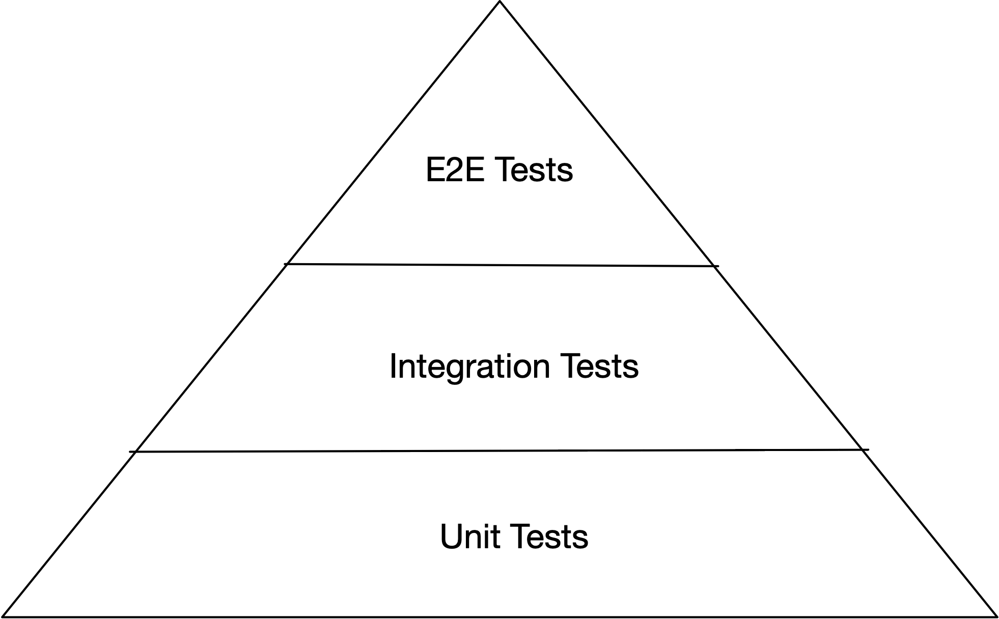
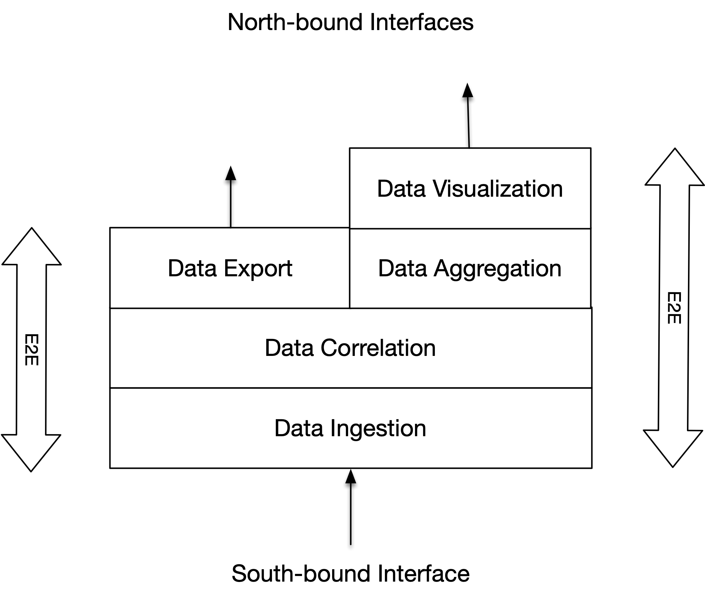

# 测试原则
传统上，测试分为两类：功能测试和非功能测试。 本章将首先介绍功能测试原理，然后介绍非功能测试原理。

## 功能测试原则

功能测试分为三个阶段：

- 单元测试
- 集成测试
- 端到端 (```E2E```) 测试

功能测试阶段可以用测试金字塔来描述：



测试金字塔描述了每个阶段测试的相对数量。 大多数测试都是单元测试。 第二多的测试是集成测试，最少的是端到端测试。 单元测试应该覆盖软件组件的整个代码库。 单元测试侧重于将单个公共功能作为(代码)单元进行测试。 软件组件集成测试涵盖将经过单元测试的功能集成到完整的工作软件组件，包括测试与外部服务的接口。 外部服务的示例包括数据库、消息代理和其他微服务。 ```E2E``` 测试侧重于测试完整软件系统的端到端功能。

### 单元测试原则

单元测试应该以尽可能高的覆盖率将公共函数的功能作为独立单元进行测试。 隔离意味着依赖项(其他类/模块/服务)被模拟。

单元测试应该只为公共功能编写。 不要尝试单独测试私有函数。 在测试公共功能时，应该间接测试它们。 下面是一个 ```JavaScript``` 示例：

```parseConfig.js```

```javascript
import { doSomething } from 'other-module';

function readFile(...) {
   // ...
}

export default function parseConfig(...) {
   // ...
   // readFile(...)
   // doSomething(...)
   // ...
}
```

上述模块中，有```1```个公有函数```parseConfig```和```1```个私有函数```readFile```。 在单元测试中，你应该单独测试 ```public parseConfig``` 函数并模拟从另一个模块导入的 ```doSomething``` 函数。 并且你在测试公共 ```parseConfig``` 函数时间接测试私有 ```readFile``` 函数。

下面是用 ```Java``` 编写的上述示例。 你以与 ```JavaScript``` 版本类似的方式测试 ```Java``` 版本。 你仅为公共 ```parseConfig``` 方法编写单元测试。 这些测试将间接测试私有 ```readFile``` 函数。 你必须为 ```ConfigParser``` 构造函数提供 ```OtherClass``` 类的模拟实例。

```javascript
public class OtherClass {
   // ...
   
   public void doSomething(...) {
      // ...
   }
}

public class ConfigParser {
   private OtherClass otherClass;
   
   public ConfigParser(final OtherClass otherClass) {
      this.otherClass = otherClass
   }
   
   // ...
   
   public Configuration parseConfig(...) {
      // ...
      // readFile(...)
      // otherClass.doSomething(...)
      // ...
   }
   
   private String readFile(...) {
      // ...
   }
}
```

单元测试应该测试公共函数的所有功能：快乐路径、可能的失败情况和边缘情况，以便函数的每个代码行至少被一个单元测试覆盖。

以下是列出的边缘案例的一些示例：

- 最后的循环计数器值是否正确？ 此测试应检测可能的差一错误
- 使用空数组进行测试
- 使用最小允许值进行测试
- 使用最大允许值进行测试
- 用负值测试
- 用零值测试
- 用很长的字符串测试
- 用空字符串测试
- 使用具有不同精度的浮点值进行测试
- 使用不同舍入的浮点值进行测试
- 使用非常小的浮点值进行测试
- 使用非常大的浮点值进行测试

单元测试不应测试依赖项的功能。 这是要用集成测试来测试的东西。 单元测试应该单独测试一个功能。 如果一个函数对不同类(或模块)中定义的其他函数具有一个或多个依赖项，则应模拟这些依赖项。 模拟是模拟真实对象或函数行为的东西。 模拟将在本节后面更详细地描述。

单独测试函数有两个好处。 它使测试更快。 这是一个真正的好处，因为你可以有很多单元测试，并且经常运行它们，所以单元测试的执行时间尽可能短是至关重要的。 另一个好处是你不需要设置外部依赖项，如数据库、消息代理和其他微服务，因为你正在模拟依赖项的功能。

#### 测试驱动开发 (```TDD```)
测试驱动开发 (```TDD```) 是一种软件开发过程，在该过程中，在软件实施之前将软件需求制定为测试用例。 这与首先实施软件，然后才编写测试用例的做法相反。

我在这个行业已经将近 30 年了，当我开始编码时，还没有自动化测试或测试驱动开发。 直到 2010 年，我才开始编写自动化单元测试。 由于这样的背景，```TDD```对我来说一直很困难，因为有一点我已经习惯了：先实现软件，再做测试。 如果你也是这样学习的，那么切换到 ```TDD``` 可能会非常困难。

纯 ```TDD``` 循环包括以下步骤：

1. 为指定功能添加测试
2. 运行所有测试(刚刚添加的测试应该失败，因为它正在测试的功能尚未实现)
3. 编写使测试通过的最简单的代码
4. 运行所有测试。 (他们现在应该通过了)
5. 根据需要重构(现有测试应确保不会破坏任何东西)
6. 从第一步重新开始，直到实现、重构和测试所有功能

让我们继续举个例子。 假设待实现的```backlog```中有如下用户故事：

> 将配置属性从配置字符串解析为配置对象。 可以从配置对象访问配置属性。

让我们首先为指定的功能编写一个测试：

```ConfigParserTests.java```

```java
public class ConfigParserTests {
  private final ConfigParser configParser = new ConfigParserImpl();
  
  @Test
  public void testParse() {
    // GIVEN
    final var configStr = "propName1=value1\npropName2=value2";
    
    // WHEN
    final var configuration = configParser.parse(configStr);
    
    // THEN
    assertEquals(configuration.getPropertyValue("propName1"),
                 "value1");

    assertEquals(configuration.getPropertyValue("propName2"),
                 "value2");
  }
}
```

现在，如果我们运行所有的测试，我们会得到一个编译错误，这意味着我们编写的测试用例还没有通过。 接下来，我们将编写尽可能简单的代码，使测试用例既能编译又能通过：

```java
public interface Configuration {
  String getPropertyValue(String propertyName);
}

public class ConfigurationImpl implements Configuration {
  private final Properties properties;

  public ConfigurationImpl(final Properties properties) {
    this.properties = properties;
  }

  public String getPropertyValue(final String propertyName) {
    return properties.getProperty(propertyName);
  }
}

public interface ConfigParser {
  Configuration parse(String configStr);
}

public class ConfigParserImpl implements ConfigParser {
  public Configuration parse(final String configStr) {
    final Properties properties = new Properties();
    
    // Load properties to 'properties' variable
    // from the 'configString'
    
    return new ConfigurationImpl(properties);
  }
}
```

我们现在可以添加新功能。 假设解析函数在无法解析配置字符串时应该抛出错误。 我们现在可以通过首先创建一个失败的测试从头开始重复 ```TDD``` 循环：

```java
public class ConfigParserTests {
  // ...
  
  @Test
  public void testParse_whenParsingFails() {
    // GIVEN
    final var configStr = "invalid";
    
    try {
      // WHEN
      configParser.tryParse(configStr);
      fail();
    } catch (final ConfigParseError error) {
      // THEN error was successfully thrown
    }
  }
}
```

接下来，我们应该重构实现以使第二次测试通过：

```java
public interface ConfigParser {
  Configuration tryParse(String configStr);
}

public class ConfigParseError extends RuntimeException {
  public ConfigParseError(final String errorMessage,
                          final Throwable error) {
      super(errorMessage, error);
  }
}

public class ConfigParserImpl implements ConfigParser {
  public Configuration tryParse(final String configStr) {
    final Properties properties = new Properties();
    
    try {
      // Try load properties from the configStr
      
      return new ConfigurationImpl(properties);
    } catch (...) {
      throw new ConfigParseError(...);  
    }
  }
}
```

我们还需要重构第一个单元测试以调用 ```tryParse``` 而不是 ```parse```。 我们可以继续为附加功能添加测试用例。

对我来说，上述 ```TDD``` 循环听起来有点麻烦。 但是，预先创建测试有明显的好处。 当首先定义测试时，通常不太可能忘记测试或实现某些东西。 这是因为 ```TDD``` 更好地迫使你考虑功能规范：快乐路径、边缘和失败案例。

如果你不实践 ```TDD``` 而总是首先执行实现，那么你很可能会忘记边缘情况或特定的失败场景。 当你还没有实施它时，你就不会测试它。 你可以对一个函数进行 100% 的单元测试覆盖，但特定的边缘情况或失败场景未实现和测试。 这也是发生在我身上的事情。

作为上述 ```TDD``` 循环的替代方案，你可以通过首先考虑函数应具有的功能来开始函数实现。 你可以先想到"快乐之路"，这是该功能最常见的场景。 创建一个空的测试用例，其中只包含一条使测试失败的语句。 你应该将失败调用放在测试用例中，以免忘记执行测试用例。 下面是一个示例测试用例：

```java
public class ConfigParserTests {
  // Tests the "happy path":
  // successful parsing of configuration
  @Test
  public void testParse() { 
    fail();
  }
}
```

接下来，考虑该功能的所有其他场景：其他快乐路径、边缘和失败案例。 然后为每个场景创建一个失败的测试用例，例如：

```java
public class ConfigParserTests {
  @Test
  public void testParse_whenParsingFails() {
    fail();
  }

  @Test
  public void testParse_whenMandatoryPropIsMissing() {
    fail();
  }

  @Test
  public void testParse_whenOptionalPropIsMissing() {
    fail();
  }

  @Test
  public void testParse_whenPropHasInvalidName() {
    fail();
  }

  @Test
  public void testParse_whenPropHasInvalidType() {
    fail();
  }
}
```

现在你以场景的形式对功能进行了高级规范。 接下来，你可以继续功能实现。 功能实现完成后，逐一执行测试用例，去除fail调用。

这种方法的好处是你不必在实现源代码文件和测试源代码文件之间不断切换。 在每个阶段，你可以专注于一件事：

1. 功能说明
   1. 指定场景：函数的作用是什么，可能会发生什么故障？ 有边缘情况吗？
   2. 将场景实现为失败的单元测试用例
2. 功能实现
3. 单元测试的实施

#### 命名约定

当要测试的函数在一个类中时，应该为单元测试创建一个分别命名的类。 例如，如果有一个 ```ConfigParser``` 类，则单元测试的相应类应该是 ```ConfigParserTests```。 这样，很容易找到包含特定实现类的单元测试的文件。

测试方法名称应以测试前缀开头，之后是被测方法的名称。 比如被测方法是parse，那么测试方法名应该是```testParse```。 一个功能通常有多个测试。 所有的测试方法名称都应该以```test<function-name>```开头，但是测试方法名称还应该包含测试方法测试场景的描述，例如：```testParse_whenParsingFails```。

将 ```Jest``` 测试库与 ```JavaScript``` 或 ```TypeScript``` 一起使用时，单元测试的组织和命名方式如下：

```javascript
describe('<class-name>', () => {
  describe('<public-method-name>', () => {
    it('should do this...', () => {
      // ...
    });
    
    it('should do other thing when...', () => {
      // ...
    });
    
    // Other scenarios...
  });
});

// Example:

describe('ConfigParser', () => {
  describe('parse', () => {
    it('should parse config string successfully', () => {
      // ...
    });
    
    it('should throw an error if parsing fails', () => {
      // ...
    });
    
    // Other scenarios...
  });
});
```

#### Mocking
让我们看一个在单元测试中模拟依赖项的小型 ```Spring Boot``` 示例。 我们有一个服务类，其中包含我们要为其编写单元测试的公共函数：

```SalesItemServiceImpl.java```

```java
@Service
public class SalesItemServiceImpl implements SalesItemService {
  @Autowired
  private SalesItemRepository salesItemRepository;
  
  @AutoWired
  private SalesItemFactory salesItemFactory;

  @Override
  public final SalesItem createSalesItem(
    final SalesItemArg salesItemArg
  ) {
    return salesItemRepository.save(
      salesItemFactory.createFrom(salesItemArg));
  }

  @Override
  public final Iterable<SalesItem> getSalesItems() {
    return salesItemRepository.findAll();
  }
}
```

在```Spring Boot```项目中，我们需要在```build.gradle```文件中定义如下依赖：

```java
dependencies {
  // Other dependencies ...
  testImplementation 'org.springframework.boot:spring-boot-starter-test'
}
```

现在，我们可以使用 ```JUnit``` 创建单元测试，并且可以使用 ```Mockito``` 进行模拟。 查看上面的代码，我们可以注意到 ```SalesItemServiceImpl``` 服务依赖于 ```SalesItemRepository```。 根据单元测试原则，我们应该模拟那个依赖。 同样，我们还应该模拟 ```SalesItemConverter``` 依赖项：

```SalesItemServiceTests.java```

```java
import org.junit.jupiter.api.Test;
import org.mockito.InjectMocks;
import org.mockito.Mock;
import org.mockito.Mockito;
import org.springframework.boot.test.context.SpringBootTest;

import java.util.List;

import static org.junit.jupiter.api.Assertions.assertEquals;
import static org.mockito.ArgumentMatchers.any;
import static org.mockito.ArgumentMatchers.refEq;

@SpringBootTest
class SalesItemServiceTests {
  private static final String SALES_ITEMS_NOT_EQUAL =
    "Sales items not equal";

  private final SalesItem testSalesItem = 
    new SalesItem(1L, 1L, "Test", 10);

  // Create mock implementation of
  // SalesItemRepository interface
  @Mock
  private SalesItemRepository salesItemRepositoryMock; 
  
  // Create mock implementation of
  // SalesItemFactory interface
  @Mock
  private SalesItemFactory salesItemFactoryMock;
  
  // Injects the above created mocks to salesItemService
  @InjectMocks
  private SalesItemService salesItemService =
    new SalesItemServiceImpl();

  @Test
  final void testCreateSalesItem() {
    // GIVEN
    final var salesItemArg = new SalesItemArg(1L, "Test", 10);
    
    // Instructs to return 'testSalesItem' when 
    // salesItemFactoryMock's createFrom
    // method is called with an argument that reference
    // equals 'salesItemArg'
    Mockito
      .when(salesItemFactoryMock.createFrom(refEq(salesItemArg)))
      .thenReturn(testSalesItem);

    // Instructs to return 'testSalesItem' when
    // salesItemRepositoryMock's 'save' method is called
    // with an argument that reference equals 'testSalesItem'
    Mockito
      .when(salesItemRepositoryMock
        .save(refEq(testSalesItem)))
      .thenReturn(testSalesItem);

    // WHEN
    final var createdSalesItem =
      salesItemService.createSalesItem(salesItemArg);

    // THEN
    assertEquals(createdSalesItem,
                 testSalesItem,
                 SALES_ITEMS_NOT_EQUAL);
  }

  @Test
  final void testGetSalesItems() {
    // GIVEN
    // Instructs to return a list of containing one sales item
    // 'salesItem' when salesItemRepository's 'findAll'
    // method is called
    Mockito
      .when(salesItemRepositoryMock.findAll())
      .thenReturn(List.of(testSalesItem));

    // WHEN
    final var foundSalesItems = salesItemService.getSalesItems();

    // THEN
     final var iterator = foundSalesItems.iterator();

     assertEquals(iterator.next(),
                  testSalesItem,
                  SALES_ITEMS_NOT_EQUAL);

     assertFalse(iterator.hasNext());
  }
}
```

```Java``` 有许多测试框架和模拟库。 下面是 ```JakartaEE``` 微服务的一个小示例，它分别使用 ```TestNG``` 和 ```JMockit``` 库进行单元测试和模拟。 在下面的示例中，我们正在测试 ```ChartStore``` 类中的几个方法，这些方法负责使用 ```Java Persistence API (JPA)``` 处理图表实体的持久化。

```ChartStoreTests.java```

```java
import com.silensoft.conflated...DuplicateEntityError;
import mockit.Expectations;
import mockit.Injectable;
import mockit.Mocked;
import mockit.Tested;
import mockit.Verifications;
import org.testng.annotations.Test;

import javax.persistence.EntityExistsException;
import javax.persistence.EntityManager;

import java.util.Collections;
import java.util.List;

import static org.testng.Assert.assertEquals;
import static org.testng.Assert.fail;

public class ChartStoreTests {
  // chartStore will contain an instance
  // of ChartStoreImpl after @Tested
  // annotation is processed
  @Tested
  private ChartStore chartStore;

  // @Injectable annotation creates a mock instance
  // of EntityManager interface and then injects
  // it where needed
  // In this case, it will be injected to 'chartStore'
  @Injectable
  private EntityManager entityManager;

  // Create a mock instance of Chart
  // (does not inject anywhere)
  @Mocked
  private Chart chartMock;

  @Test
  void testCreate() {
    // WHEN
    chartStore.create(chartMock);

    // THEN
    // JMockit's verification block checks 
    // that below mock functions are called
    new Verifications() {{
      chartStore.getEntityManager().persist(chartMock);
      chartStore.getEntityManager().flush();
    }};
  }

  @Test
  void testCreate_whenChartAlreadyExists() {
    // GIVEN
    // JMockit's expectations block will define what mock methods
    // calls are expected and also can specify
    // the return value or result of the mock method call.
    // Below the 'persist' mock method call will throw
    // EntityExistsException
    new Expectations() {{
      chartStore.getEntityManager().persist(chartMock);
      result = new EntityExistsException();
    }};

    try {
      // WHEN
      chartStore.create(chartMock);
      fail("Expected exception, but it was not thrown");
    } catch (final DuplicateEntityError error) {
      // THEN successfully throws an error
    }
  }

  @Test
  void testGetChartById() {
    // GIVEN
    new Expectations() {{
      chartStore.getEntityManager().find(Chart.class, 1L);
      result = chartMock;
    }};

    // WHEN
    final var chart = chartStore.getById(1L);

    // THEN
    assertEquals(chart, chartMock);
  }
}
```

让我们有一个使用 ```JavaScript/TypeScript``` 的单元测试示例。 我们将使用 ```Jest``` 库为以下函数编写单元测试：

```fetchTodos.ts```

```typescript
import store from '../../store/store';
import todoService from '../services/todoService';

export default async function fetchTodos(): Promise<void> {
  const { todosState } = store.getState();
  todosState.isFetching = true;
  try { 
    todosState.todos = await todoService.tryFetchTodos();
    todosState.fetchingHasFailed = false; 
  } catch(error) {
    todosState.fetchingHasFailed = true; 
  }
  todosState.isFetching = false;
}
```

下面是快乐路径场景的单元测试用例：

```fetchTodos.test.ts```

```typescript
import store from '../../store/store';
import todoService from '../services/todoService';
import fetchTodos from 'fetchTodos';
// ...

// Mock both 'store' and 'todoService' objects
jest.mock('../../store/store');
jest.mock('../services/todoService');

describe('fetchTodos', async () => {
  it('should fetch todos from todo service', async () => {
    // GIVEN
    const todosState = { todos: [] } as TodoState;
    store.getState.mockReturnValue({ todosState });
    
    const todos = [{
      id: 1,
      name: 'todo',
      isDone: false
    }];

    todoService.tryFetchTodos.mockResolvedValue(todos);
    
    // WHEN
    await fetchTodos();
    
    // THEN
    expect(todosState.isFetching).toBe(false);
    expect(todosState.fetchingHasFailed).toBe(false);
    expect(todosState.todos).toBe(todos);    
  });
});
```

在上面的示例中，我们使用 ```jest.mock``` 函数创建了 ```store``` 和 ```todoService``` 模块的模拟版本。 使用 ```Jest``` 处理模拟的另一种方法是使用 ```jest.fn()```，它创建一个模拟函数。 让我们假设更改了 ```fetchTodos``` 函数，使其将 ```store``` 和 ```todoService``` 作为其参数：

```fetchTodos.ts```

```typescript
// ...

export default async function fetchTodos(
  store: Store,
  todoService: TodoService
): Promise<void> {
  // Same code here as in earlier example...
}
```

现在模拟看起来像下面这样：

```fetchTodos.test.ts```

```typescript
import fetchTodos from 'fetchTodos';
// ...

const store = {
   getState: jest.fn()
};

const todoService = {
   tryFetchTodos: jest.fn();
}

describe('fetchTodos', async () => {
  it('should fetch todos from todo service', async () => {
    // GIVEN
    // Same code as in earlier example...
    
    // WHEN
    await fetchTodos(store as any, todoService as any);
    
    // THEN
    // Same code as in earlier example...
  });
});
```

让我们举一个 ```C++``` 和 ```Google Test``` 单元测试框架的例子。 在 ```C++``` 中，你可以通过扩展纯虚拟基类("接口")并使用 ```Google Mock``` 宏定义模拟方法来定义模拟类。 下面是我们要进行单元测试的 ```detectedAnomalies``` 方法的定义：

```AnomalyDetectionEngine.h```

```c++
class AnomalyDetectionEngine
{
public:
  virtual ~AnomalyDetectionEngine() = default;
  
  virtual void detectAnomalies() = 0;
};
```

```AnomalyDetectionEngineImpl.h```

```c++
#include <memory>
#include "AnomalyDetectionEngine.h"
#include "Configuration.h"

class AnomalyDetectionEngineImpl :
  public AnomalyDetectionEngine
{
public:
  explicit AnomalyDetectionEngineImpl(
    std::shared_ptr<Configuration> configuration
  );

  void detectAnomalies() override;

private:
  void detectAnomalies(
    const std::shared_ptr<AnomalyDetectionRule>& anomalyDetectionRule
  );
  
  std::shared_ptr<Configuration> m_configuration;
};
```

```AnomalyDetectionEngineImpl.cpp```

```c++
#include <algorithm>
#include <execution>
#include "AnomalyDetectionEngineImpl.h"

AnomalyDetectionEngineImpl::AnomalyDetectionEngineImpl(
  std::shared_ptr<Configuration> configuration
) : m_configuration(std::move(configuration))
{}

void AnomalyDetectionEngineImpl::detectAnomalies()
{
  const auto anomalyDetectionRules =
    m_configuration->getAnomalyDetectionRules();

   std::for_each(std::execution::par,
                 anomalyDetectionRules->cbegin(),
                 anomalyDetectionRules->cend(),
                 [this](const auto& anomalyDetectionRule)
                 {
                   detectAnomalies(anomalyDetectionRule);
                 });
}

void AnomalyDetectionEngineImpl::detectAnomalies(
  const std::shared_ptr<AnomalyDetectionRule>& anomalyDetectionRule
)
{
  const auto anomalyIndicators = anomalyDetectionRule->detectAnomalies();
  
  std::ranges::for_each(*anomalyIndicators,
                        [](const auto& anomalyIndicator)
                        {
                          anomalyIndicator->publish();
                        });
}
```

让我们为模拟创建一个 ```Configuration``` 类和一个 ```ConfigurationMock``` 类：

```Configuration.h```

```c++
#include <memory>
#include <vector>
#include "AnomalyDetectionRule.h"

class Configuration
{
public:
  virtual ~Configuration() = default;
   
  virtual std::shared_ptr<AnomalyDetectionRules>
  getAnomalyDetectionRules() const = 0;
};
```

```ConfigurationMock.h```

```c++
#include <gmock/gmock.h>
#include "Configuration.h"

class ConfigurationMock : public Configuration
{
public:
  MOCK_METHOD(std::shared_ptr<AnomalyDetectionRules>,
              getAnomalyDetectionRules, (), (const)
  );
};
```

让我们创建一个 ```AnomalyDetectionRule``` 类和一个相应的模拟类 ```AnomalyDetectionRuleMock```：

```AnomalyDetectionRule.h```

```c++
#include "AnomalyIndicator.h"

class AnomalyDetectionRule
{
public:
  virtual ~AnomalyDetectionRule() = default;

  virtual std::shared_ptr<AnomalyIndicators>
  detectAnomalies() = 0;
};

using AnomalyDetectionRules =
  std::vector<std::shared_ptr<AnomalyDetectionRule>>;
```

```AnomalyDetectionRuleMock.h```

```c++
#include <gmock/gmock.h>
#include "AnomalyDetectionRule.h"

class AnomalyDetectionRuleMock : public AnomalyDetectionRule
{
  public:
    MOCK_METHOD(std::shared_ptr<AnomalyIndicators>,
                detectAnomalies, ());
};
```


让我们创建一个 ```AnomalyIndicator``` 类和一个模拟类 ```AnomalyIndicatorMock```：

```AnomalyIndicator.h```

```c++
#include <memory>
#include <vector>

class AnomalyIndicator
{
public:
  virtual ~AnomalyIndicator() = default;

  virtual void publish() = 0;
};

using AnomalyIndicators =
  std::vector<std::shared_ptr<AnomalyIndicator>>;
```

```AnomalyIndicatorMock.h```

```c++
#include <gmock/gmock.h>
#include "AnomalyIndicator.h"

class AnomalyIndicatorMock : public AnomalyIndicator
{
public:
  MOCK_METHOD(void, publish, ());
};
```

让我们为 ```AnomalyDetectionEngineImpl``` 类中的 ```detectAnomalies``` 方法创建一个单元测试：

```AnomalyDetectionEngineImplTests.h```

```c++
#include <gtest/gtest.h>
#include "ConfigurationMock.h"
#include "AnomalyDetectionRuleMock.h"
#include "AnomalyIndicatorMock.h"

class AnomalyDetectionEngineImplTests : public testing::Test
{
protected:
  void SetUp() override {
    m_anomalyDetectionRules->push_back(m_anomalyDetectionRuleMock);
    m_anomalyIndicators->push_back(m_anomalyIndicatorMock);
  }

  std::shared_ptr<ConfigurationMock> m_configurationMock{
    std::make_shared<ConfigurationMock>()
  };

  std::shared_ptr<AnomalyDetectionRuleMock> m_anomalyDetectionRuleMock{
    std::make_shared<AnomalyDetectionRuleMock>()
  };

  std::shared_ptr<AnomalyDetectionRules> m_anomalyDetectionRules{
    std::make_shared<AnomalyDetectionRules>()
  };
  
  std::shared_ptr<AnomalyIndicatorMock> m_anomalyIndicatorMock{
    std::make_shared<AnomalyIndicatorMock>()
  };

  std::shared_ptr<AnomalyIndicators> m_anomalyIndicators{
    std::make_shared<AnomalyIndicators>()
  }
};
```

```AnomalyDetectionEngineImplTests.cpp```

```c++
#include "../src/AnomalyDetectionEngineImpl.h"
#include "AnomalyDetectionEngineImplTests.h"

using testing::Return;

TEST_F(AnomalyDetectionEngineImplTests, testDetectAnomalies)
{
  // GIVEN
  AnomalyDetectionEngineImpl anomalyDetectionEngine{m_configurationMock};

  // EXPECTATIONS
  EXPECT_CALL(*m_configurationMock, getAnomalyDetectionRules)
    .Times(1)
    .WillOnce(Return(m_anomalyDetectionRules));

  EXPECT_CALL(*m_anomalyDetectionRuleMock, detectAnomalies)
    .Times(1)
    .WillOnce(Return(m_anomalyIndicators));

  EXPECT_CALL(*m_anomalyIndicatorMock, publish).Times(1);

  // WHEN
  anomalyDetectionEngine.detectAnomalies();
}
```

上面的例子没有包含依赖注入，所以让我们在 ```C++``` 中使用依赖注入的另一个例子。 首先，我们为单例定义一个通用基类：

```Singleton.h```

```c++
#include <memory>

template<typename T>
class Singleton
{
public:
  Singleton() = default;

  virtual ~Singleton()
  {
    m_instance.reset();
  };

  static inline std::shared_ptr<T>& getInstance()
  {
    return m_instance;
  }

  static void setInstance(const std::shared_ptr<T>& instance)
  {
    m_instance = instance;
  }

private:
  static inline std::shared_ptr<T> m_instance;
};
```

接下来，我们实现一个配置解析器，稍后我们将对其进行单元测试：

```ConfigParserImpl.h```

```c++
#include <memory>
#include "Configuration.h"

class ConfigParserImpl {
public:
  std::shared_ptr<Configuration> parse();
};
```

```ConfigParserImpl.cpp```

```c++
#include "AnomalyDetectionRulesParser.h"
#include "Configuration.h"
#include "ConfigFactory.h"
#include "ConfigParserImpl.h"
#include "MeasurementDataSourcesParser.h"

std::shared_ptr<Configuration>
ConfigParserImpl::parse(...)
{
  const auto measurementDataSources =
    MeasurementDataSourcesParser::getInstance()->parse(...);

  const auto anomalyDetectionRules =
    AnomalyDetectionRulesParser::getInstance()->parse(...);

  return ConfigFactory::getInstance()
    ->createConfig(anomalyDetectionRules);
}
```

接下来，我们定义 ```MeasurementDataSource```、```MeasurementDataSourcesParser``` 和 ```MeasurementDataSourcesParserImpl``` 类：

```MeasurementDataSource.h```

```c++
#include <memory>
#include <vector>

class MeasurementDataSource {
  // ...
};

using MeasurementDataSources =
  std::vector<std::shared_ptr<MeasurementDataSource>>;
```

```MeasurementDataSourcesParser.h```

```c++
#include "Singleton.h"
#include "MeasurementDataSource.h"

class MeasurementDataSourcesParser :
  public Singleton<MeasurementDataSourcesParser>
{
public:
  virtual std::shared_ptr<MeasurementDataSources> parse(...) = 0;
};
```

```MeasurementDataSourcesParserImpl.h```

```c++
#include "MeasurementDataSourcesParser.h"

class MeasurementDataSourcesParserImpl :
  public MeasurementDataSourcesParser
{
public:
  std::shared_ptr<MeasurementDataSources> parse(...) override {
    // ...
  }
};
```

接下来，我们定义 ```AnomalyDetectionRulesParser``` 和 ```AnomalyDetectionRulesParserImpl``` 类：

```AnomalyDetectionRulesParser.h```

```c++
#include "Singleton.h"
#include "AnomalyDetectionRule.h"

class AnomalyDetectionRulesParser :
  public Singleton<AnomalyDetectionRulesParser>
{
public:
  virtual std::shared_ptr<AnomalyDetectionRules> parse(...) = 0;
};
```

```AnomalyDetectionRulesParserImpl.h```

```c++
#include "AnomalyDetectionRulesParser.h"

class AnomalyDetectionRulesParserImpl :
  public AnomalyDetectionRulesParser
{
public:
  std::shared_ptr<AnomalyDetectionRules> parse(...) override {
   // ...
  }
};
```

接下来，我们定义 ```ConfigFactory``` 和 ```ConfigFactoryImpl``` 类：

```ConfigFactory.h```

```c++
#include "Singleton.h"
#include "Configuration.h"

class ConfigFactory :
  public Singleton<ConfigFactory>
{
public:
  virtual std::shared_ptr<Configuration>
  createConfig(
    const std::shared_ptr<AnomalyDetectionRules>& rules
  ) = 0;
};
```

```ConfigFactoryImpl.h```

```c++
#include "ConfigFactory.h"

class ConfigFactoryImpl : public ConfigFactory
{
public:
  std::shared_ptr<Configuration>
  createConfig(
    const std::shared_ptr<AnomalyDetectionRules>& rules
  ) override {
    // ...
  }
};
```

然后我们定义一个依赖注入器类：

```DependencyInjector.h```

```c++
#include "AnomalyDetectionRulesParserImpl.h"
#include "ConfigFactoryImpl.h"
#include "MeasurementDataSourcesParserImpl.h"

class DependencyInjector final
{
public:
  static void injectDependencies()
  {
    AnomalyDetectionRulesParser::setInstance(
      std::make_shared<AnomalyDetectionRulesParserImpl>()
    );

    ConfigFactory::setInstance(
      std::make_shared<ConfigFactoryImpl>()
    );

    MeasurementDataSourcesParser::setInstance(
      std::make_shared<MeasurementDataSourcesParserImpl>()
    );
  }
    
private:
  DependencyInjector() = default;
};
```


我们使用依赖注入器在应用程序启动时注入依赖：

```main.cpp```

```c++
#include "DependencyInjector.h"

int main()
{
  DependencyInjector::injectDependencies();
  
  // Initialize and start application...
}
```

让我们为 ```ConfigParserImpl``` 类定义一个单元测试类：

```ConfigParserImplTests.h```

```c++
#include "MockDependenciesInjectedTest.h"

class ConfigParserImplTests :
  public MockDependenciesInjectedTest
{};
```

所有单元测试类都应继承自注入模拟依赖项的基类。 测试完成后，模拟依赖项将被删除。 ```Google``` 测试框架需要此删除，因为它仅在模拟对象销毁时验证对模拟的期望。

```MockDependenciesInjectedTest.h```

```c++
#include <gtest/gtest.h>
#include "MockDependencyInjector.h"

class MockDependenciesInjectedTest :
  public testing::Test
{
protected:
  void SetUp() override
  {
    m_mockDependencyInjector.injectMockDependencies();
  }

  void TearDown() override
  {
    m_mockDependencyInjector.removeMockDependencies();
  }

  MockDependencyInjector m_mockDependencyInjector;
};
```

以下是定义的所有模拟类：

```AnomalyDetectionRulesParserMock.h```

```c++
#include <gmock/gmock.h>
#include "AnomalyDetectionRulesParser.h"

class AnomalyDetectionRulesParserMock : 
  public AnomalyDetectionRulesParser
{
public:
  MOCK_METHOD(std::shared_ptr<AnomalyDetectionRules>, parse, (...));
};
```

```ConfigFactoryMock.h```

```c++
#include <gmock/gmock.h>
#include "ConfigFactory.h"

class ConfigFactoryMock : public ConfigFactory
{
public:
  MOCK_METHOD(
    std::shared_ptr<Configuration>,
    createConfig,
    (const std::shared_ptr<AnomalyDetectionRules>& rules)
  );
};
```

```MeasurementDataSourcesParserMock.h```

```c++
#include <gmock/gmock.h>
#include "MeasurementDataSourcesParser.h"

class MeasurementDataSourcesParserMock : 
  public MeasurementDataSourcesParser
{
public:
  MOCK_METHOD(std::shared_ptr<MeasurementDataSources>, parse, (...));
};
```


下面是定义的 ```MockDependencyInjector``` 类：

```MockDependencyInjector.h```

```c++
#include "AnomalyDetectionRulesParserMock.h"
#include "ConfigFactoryMock.h"
#include "MeasurementDataSourcesParserMock.h"

class MockDependencyInjector final
{
public:
  std::shared_ptr<AnomalyDetectionRulesParserMock> 
  m_anomalyDetectionRulesParserMock{
    std::make_shared<AnomalyDetectionRulesParserMock>()
  };

  std::shared_ptr<ConfigFactoryMock> m_configFactoryMock{
    std::make_shared<ConfigFactoryMock>()
  };

  std::shared_ptr<MeasurementDataSourcesParserMock>
  m_measurementDataSourcesParserMock{
    std::make_shared<MeasurementDataSourcesParserMock>()
  };

  void injectMockDependencies() const
  {
    AnomalyDetectionRulesParser::setInstance(
      m_anomalyDetectionRulesParserMock
    );

    ConfigFactory::setInstance(
      m_configFactoryMock
    );

    MeasurementDataSourcesParser::setInstance(
      m_measurementDataSourcesParserMock
    );
  }

  void removeMockDependencies() const {
    AnomalyDetectionRulesParser::setInstance({nullptr});
    ConfigFactory::setInstance({nullptr});
    MeasurementDataSourcesParser::setInstance({nullptr});
  }
};
```


下面是使用模拟的单元测试实现：

```ConfigParserImplTests.cpp```

```c++
#include "ConfigParserImplTests.h"
#include "ConfigParserImpl.h"

using testing::Eq;
using testing::Return;

TEST_F(ConfigParserImplTests, testParseConfig)
{
  // GIVEN
  ConfigParserImpl configParser;

  // EXPECTATIONS
  EXPECT_CALL(
    *m_mockDependencyInjector.m_anomalyDetectionRulesParserMock,
    parse
  ).Times(1)
   .WillOnce(Return(m_anomalyDetectionRules));

  EXPECT_CALL(
    *m_mockDependencyInjector.m_measurementDataSourcesParserMock,
    parse
  ).Times(1)
   .WillOnce(Return(m_measurementDataSources));

  EXPECT_CALL(
    *m_mockDependencyInjector.m_configFactoryMock,
    createConfig(Eq(m_anomalyDetectionRules))
  ).Times(1)
   .WillOnce(Return(m_configMock));

  // WHEN
  const auto configuration = configParser.parse();

  // THEN
  ASSERT_EQ(configuration, m_configMock);
}
```

你还可以确保只能在 ```DependencyInjector``` 类中创建实现类实例，方法是将实现类构造函数声明为私有并使 ```DependencyInjector``` 类成为实现类的友元。 这样，就不会有人不小心创建了一个实现类的实例。 实现类的实例应该只由依赖注入器创建。 下面是一个实现类，其中构造函数是私有的，依赖注入器是该类的友元：

```AnomalyDetectionRulesParserImpl.h```

```c++
#include "AnomalyDetectionRulesParser.h"

class AnomalyDetectionRulesParserImpl :
  public AnomalyDetectionRulesParser
{
  friend class DependencyInjector;

public:
  std::shared_ptr<AnomalyDetectionRules> parse() override;

private:
  AnomalyDetectionRulesParserImpl() = default;
};
```

#### ```UI``` 组件单元测试
```UI``` 组件单元测试与常规单元测试不同，因为如果你有一个 ```React``` 功能组件，你不一定要单独测试 ```UI``` 组件的功能。 例如，你必须通过将组件安装到 ```DOM``` 来执行 ```UI``` 组件单元测试，然后通过触发事件来执行测试。 这样，你就可以测试 ```UI``` 组件的事件处理函数。 渲染部分也要测试。 可以通过生成渲染组件的快照并将其存储在版本控制中来对其进行测试。 进一步的渲染测试应该将渲染结果与存储在版本控制中的快照进行比较。

下面是一个测试 ```React``` 组件 ```NumberInput``` 渲染的例子：

```NumberInput.test.js```

```typescript
import renderer from 'react-test-renderer';
// ...

describe('NumberInput') () => {
  // ...
  
  describe('render', () => {
    it('renders with buttons on left and right"', () => {
      const numberInputAsJson =
        renderer
          .create(<NumberInput buttonPlacement="leftAndRight"/>)
          .toJSON();

      expect(numberInputAsJson).toMatchSnapshot();
    });
    
    it('renders with buttons on right', () => {
      const numberInputAsJson =
        renderer
          .create(<NumberInput buttonPlacement="right"/>)
          .toJSON();
      
      expect(numberInputAsJson).toMatchSnapshot();
    });
  });
});
```

下面是数字输入的递减按钮的点击事件处理函数 ```decrementValue``` 的示例单元测试：

```NumberInput.test.js```

```typescript
import { render, fireEvent, screen } from '@testing-library/react'
// ...

describe('NumberInput') () => {
  // ...
  
  describe('decrementValue', () => {
    it('should decrement value by given step amount', () => {
      render(<NumberInput value="3" stepAmount={2} />);
      fireEvent.click(screen.getByText('-'));
      const numberInputElement = screen.getByDisplayValue('1');
      expect(numberInputElement).toBeTruthy();
    });
  });
});
```

在上面的示例中，我们使用了测试库，它具有所有常见 ```UI``` 框架的实现：```React```、```Vue``` 和 ```Angular```。 这意味着无论你的 ```UI``` 框架如何，你都可以使用大部分相同的测试 ```API```。 差异很小，基本上只存在于 ```render``` 方法的语法中。 如果你已经用 ```React``` 实现了一些 ```UI``` 组件和单元测试，你想用 ```Vue``` 重新实现它们，你不需要重新实现所有的单元测试。 你只需要稍微修改它们(例如，对渲染函数调用进行更改)。 否则，现有的单元测试应该可以工作，因为 ```UI``` 组件的行为没有改变，只是它的内部实现从 ```React``` 到 ```Vue```。

### 软件组件集成测试原则

> 集成测试旨在测试软件组件是否针对实际依赖项工作，以及其公共方法是否正确理解它们正在使用的其他公共方法的目的和签名。

在软件组件集成测试中，应测试软件组件的所有公共功能。 并非公共函数的所有功能都应该进行测试，因为这已经在单元测试阶段完成了。 这就是集成测试比单元测试少的原因。 术语集成测试有时指的是完整软件系统或产品的集成。 但是，它应该仅用于描述软件组件集成。 在测试产品或软件系统时，应使用 ```E2E``` 测试一词以避免混淆和误解。

定义集成测试的最佳方法是使用行为驱动开发 (```BDD```)。 ```BDD``` 鼓励团队使用领域驱动设计和具体示例来形成对软件组件应如何表现的共同理解。 在 ```BDD``` 中，行为规范是集成测试的基础。 团队可以在最初的领域驱动设计阶段创建行为规范。 这种做法会将集成测试转移到左侧，这意味着编写集成测试会提早开始，并且可以与实际实现并行进行。 一种广泛使用和推荐的编写行为规范的方法是 Gherkin 语言。

使用 Gherkin 语言时，软件组件的行为被描述为特性。 每个功能都应该有一个单独的文件。 这些文件具有 ```.feature``` 扩展名。 每个功能文件都描述了一项功能以及该功能的一个或多个场景。 第一个场景应该是所谓的"快乐路径"场景，其他可能的场景应该处理额外的快乐路径、失败和需要测试的边缘情况。 请记住，你不必测试每个失败和边缘案例，因为它们已经在单元测试阶段进行了测试。

下面是数据可视化配置服务中一项功能的简化示例。 该服务是一个 ```REST API```。 该功能用于创建新图表。 (在现实场景中，图表包含更多属性，例如图表的数据源以及图表中显示的度量和维度)

```createChart.feature```

```gherkin
Feature: Create chart
  Creates a new chart

  Scenario: Creates a new chart successfully
    Given chart layout id is "1"
    And chart type is "line"
    And X-axis categories shown count is 10
    And fetchedRowCount is 1000

    When I create a new chart

    Then I should get the chart given above 
         with response code 201 "Created"
```

上面的示例显示了如何在 ```Feature``` 关键字之后给出功能的名称。 你可以在功能名称下方添加自由格式的文本，以更详细地描述该功能。 接下来，在 ```Scenario``` 关键字之后定义一个场景。 首先，给出场景的名称。 然后是场景的步骤。 每个步骤都使用以下关键字之一定义：```Given```、```When```、```Then```、```And``` 和 ```But```。 场景应遵循以下模式：

- 描述初始上下文/设置的步骤(给定/和步骤)
- 描述一个事件的步骤(When step)
- 描述事件预期结果的步骤(然后/然后步骤)

我们可以在上面的例子中加入另一个场景：

```createChart.feature```

```gherkin
Feature: Create chart
  Creates a new chart

  Scenario: Creates a new chart successfully
    Given chart layout id is "1"
    And chart type is "line"
    And X-axis categories shown count is 10
    And fetchedRowCount is 1000

    When I create a new chart

    Then I should get the chart given above 
         with status code 201 "Created"

  Scenario: Chart creation fails due to missing mandatory parameter
    When I create a new chart

    Then I should get a response with status code 400 "Bad Request"
    And response body should contain "is mandatory field" entry 
        for following fields
      | layoutId                  |
      | fetchedRowCount           |
      | xAxisCategoriesShownCount |
      | type                      |
```

现在我们有一个特征，指定了两个场景。 接下来，我们将实现场景。 我们的数据可视化配置服务是用 ```Java``` 实现的，我们也想用 ```Java``` 实现集成测试。 ```Cucumber``` 具有适用于各种编程语言的 ```BDD``` 工具。 我们将使用 ```Cucumber-JVM``` 库。

我们将集成测试代码放入源代码存储库的 ```src/test``` 目录中。 功能文件位于 ```src/test/resources/features``` 目录中。 功能目录应该以与源代码组织到子目录相同的方式组织到子目录中：使用域驱动设计并为子域创建子目录。 我们可以把上面的```createChart.feature```文件放到```src/test/resources/features/chart```目录下。

接下来，我们需要为场景中的每个步骤提供一个实现。 让我们从第一个场景开始。 我们将为测试上下文创建一个文件 ```TestContext.java```，为步骤定义创建一个 ```CreateChartStepDefs.java ```文件：

```TestContext.java```

```java
public class TestContext { 
  public io.restassured.response.Response response;
}
```

```CreateChartStepDefs.java```

```java
import integrationtests.TestContext;
import com.silensoft.dataviz.configuration.service.chart.Chart;
import io.cucumber.java.en.Given;
import io.cucumber.java.en.Then;
import io.cucumber.java.en.When;
import io.restassured.http.ContentType;
import io.restassured.mapper.ObjectMapperType;

import static io.restassured.RestAssured.given;
import static org.hamcrest.Matchers.equalTo;
import static org.hamcrest.Matchers.greaterThan;

public class CreateChartStepDefs {
  private static final String BASE_URL =
    "http://localhost:8080/data-visualization-configuration-service/";

  private final TestContext testContext;
  private final Chart chart = new Chart();
 
  public CreateChartStepDefs(final TestContext testContext) {
    this.testContext = testContext;
  }
 
  @Given("chart layout id is {string}")
  public void setChartLayoutId(final String layoutId) {
    chart.setLayoutId(layoutId);
  }

  @Given("chart type is {string}")
  public void setChartType(final String chartType) {
    chart.setType(chartType);
  }

  @Given("X-axis categories shown count is {int}")
  public void setXAxisCategoriesShownCount(
    final Integer xAxisCategoriesShownCount
  ) {
    chart
      .setxAxisCategoriesShownCount(xAxisCategoriesShownCount);
  }

  @Given("fetchedRowCount is {int}")
  public void setFetchedRowCount(final Integer fetchedRowCount) {
    chart.setFetchedRowCount(fetchedRowCount);
  }

  @When("I create a new chart")
  public void createNewChart() {
    testContext.response = given()
      .contentType("application/json")
      .body(chart, ObjectMapperType.GSON)
      .when()
      .post(Constants.BASE_URL + "charts");
  }

   @Then("I should get the chart given above with status code {int} {string}")
   public void iShouldGetTheChartGivenAbove(
     final int statusCode,
     final String statusCodeName
   ) {
     testContext.response.then()
       .assertThat()
       .statusCode(statusCode)
       .body("id", greaterThan(0))
       .body("layoutId", equalTo(chart.getLayoutId()))
       .body("type", equalTo(chart.getType()))
       .body("xAxisCategoriesShownCount",
             equalTo(chart.getXAxisCategoriesShownCount()))
       .body("fetchedRowCount", 
              equalTo(chart.getFetchedRowCount()));
 }
}
```

上面的实现包含每个步骤的函数。 每个函数都带有针对特定 Gherkin 关键字的注释：```@Given```、```@When``` 和```@Then```。 请注意，场景中的步骤可以被模板化。 例如，步骤 Given chart layout id is "1" 在函数 @Given("chart layout id is {string}") public void setChartLayoutId(final String layoutId) 中进行模板化和定义，其中实际布局 ```id``` 以 函数的参数。 你可以在可以为布局 ```ID``` 提供不同值的不同场景中使用此模板化步骤，例如：给定图表布局 ID 为"8"。

```createNewChart``` 方法使用 ```REST-assured``` 向数据可视化配置服务提交 ```HTTP POST``` 请求。 ```iShouldGetTheChartGivenAbove``` 函数获取 ```HTTP POST``` 响应并验证响应正文中的状态代码和属性。

第二种情况是常见的失败情况，你创建的内容缺少参数。 因为这种情况很常见(即，我们可以在其他功能中使用相同的步骤)，所以我们将步骤定义放在 ```src/test/java/integrationtests``` 目录的公共子目录中名为 ```CommonStepDefs.java``` 的文件中。

以下是步骤定义：

```CommonStepDefs.java```

```java
import integrationtests.TestContext;
import io.cucumber.java.en.And;
import io.cucumber.java.en.Then;

import java.util.List;

import static org.hamcrest.Matchers.hasItems;

public class CommonStepDefs {
  private final TestContext testContext;

  public CommonStepDefs(final TestContext testContext) {
    this.testContext = testContext;
  }

  @Then("I should get a response with status code {int} {string}")
  public void iShouldGetAResponseWithResponseCode(
    final int statusCode,
    final String statusCodeName
  ) {
      testContext.response.then()
        .assertThat()
        .statusCode(statusCode);
  }

  @And("response body should contain {string} entry for following fields")
  public void responseBodyShouldContainEntryForFollowingFields(
    final String entry,
    final List<String> fields
  ) {
    testContext.response.then()
      .assertThat()
      .body("", hasItems(fields
                           .stream()
                           .map(field -> field + ' ' + entry)
                           .toArray()));
  }
}
```

除了 ```Java```，```Cucumber``` 还提供许多其他语言版本。 例如，它可用于 ```JavaScript (Cucumber.js)``` 和 ```Python (Behave)```。 集成测试可以用与用于实现和单元测试代码的语言不同的语言编写。 例如，我目前正在用 ```C++``` 开发微服务。 我们的团队有一名测试自动化开发人员使用 Gherkin 语言进行集成测试，用于功能定义，使用 ```Python``` 和 ```Behave``` 来实现这些步骤。

一些框架提供了创建集成测试的方法。 ```Spring Boot``` 框架提供了 ```MockMvc``` 来测试 ```web``` 层，就像一个 ```REST API```。 下面是使用 ```MockMvc``` 测试销售项目服务 ```REST API``` 的示例：

```SalesItemControllerTests.java```

```java
import com.fasterxml.jackson.databind.ObjectMapper;
import org.junit.jupiter.api.MethodOrderer;
import org.junit.jupiter.api.Order;
import org.junit.jupiter.api.Test;
import org.junit.jupiter.api.TestMethodOrder;
import org.junit.jupiter.api.extension.ExtendWith;
import org.springframework.beans.factory.annotation.Autowired;
import org.springframework.boot.test.autoconfigure.web.servlet.AutoConfigureMockMvc;
import org.springframework.boot.test.context.SpringBootTest;
import org.springframework.http.MediaType;
import org.springframework.test.context.junit.jupiter.SpringExtension;
import org.springframework.test.web.servlet.MockMvc;

import static org.springframework.test.web.servlet.request.MockMvcRequestBuilders.delete;
import static org.springframework.test.web.servlet.request.MockMvcRequestBuilders.get;
import static org.springframework.test.web.servlet.request.MockMvcRequestBuilders.post;
import static org.springframework.test.web.servlet.request.MockMvcRequestBuilders.put;
import static org.springframework.test.web.servlet.result.MockMvcResultHandlers.print;
import static org.springframework.test.web.servlet.result.MockMvcResultMatchers.jsonPath;
import static org.springframework.test.web.servlet.result.MockMvcResultMatchers.status;

@SpringBootTest
@AutoConfigureMockMvc
@ExtendWith(SpringExtension.class)
@TestMethodOrder(MethodOrderer.OrderAnnotation.class)
class SalesItemControllerTests {
  private static final long SALES_ITEM_USER_ACCOUNT_ID = 1L;
  private static final String SALES_ITEM_NAME = "Test sales item";
  private static final int SALES_ITEM_PRICE = 10;
  private static final int UPDATED_SALES_ITEM_PRICE = 20;
  
  private static final String UPDATED_SALES_ITEM_NAME =
    "Updated test sales item";
  
  @Autowired
  private MockMvc mockMvc;
  
  @Test
  @Order(1)
  final void testCreateSalesItem() throws Exception {
    // GIVEN
    final var salesItemArg =
      new SalesItemArg(SALES_ITEM_USER_ACCOUNT_ID,
                       SALES_ITEM_NAME,
                       SALES_ITEM_PRICE);

    final var salesItemArgJson =
      new ObjectMapper().writeValueAsString(salesItemArg);

    // WHEN
    mockMvc
      .perform(post(SalesItemController.API_ENDPOINT)
                 .contentType(MediaType.APPLICATION_JSON)
                 .content(salesItemArgJson))
      .andDo(print())
      // THEN
      .andExpect(jsonPath("$.id").value(1))
      .andExpect(jsonPath("$.name").value(SALES_ITEM_NAME))
      .andExpect(jsonPath("$.price").value(SALES_ITEM_PRICE))
      .andExpect(status().isCreated());
  }
  
  @Test
  @Order(2)
  final void testGetSalesItems() throws Exception {
    // WHEN
    mockMvc
      .perform(get(SalesItemController.API_ENDPOINT))
      .andDo(print())
      // THEN
      .andExpect(jsonPath("$[0].id").value(1))
      .andExpect(jsonPath("$[0].name").value(SALES_ITEM_NAME))
      .andExpect(status().isOk());
  }
  
  @Test
  @Order(3)
  final void testGetSalesItemById() throws Exception {
    // WHEN
    mockMvc
      .perform(get(SalesItemController.API_ENDPOINT + "/1"))
      .andDo(print())
      // THEN
      .andExpect(jsonPath("$.name").value(SALES_ITEM_NAME))
      .andExpect(status().isOk());
  }
  
  @Test
  @Order(4)
  final void testGetSalesItemsByUserAccountId() throws Exception {
    // GIVEN
    final var url = SalesItemController.API_ENDPOINT +
                    "?userAccountId=" + SALES_ITEM_USER_ACCOUNT_ID;
    
    // WHEN
    mockMvc
      .perform(get(url))
      .andDo(print())
      // THEN
      .andExpect(jsonPath("$[0].name").value(SALES_ITEM_NAME))
      .andExpect(status().isOk());
  }
  
  @Test
  @Order(5)
  final void testUpdateSalesItem() throws Exception {
    // GIVEN
    final var salesItemArg =
      new SalesItemArg(SALES_ITEM_USER_ACCOUNT_ID,
                       UPDATED_SALES_ITEM_NAME,
                       UPDATED_SALES_ITEM_PRICE);

    final var salesItemArgJson =
      new ObjectMapper().writeValueAsString(salesItemArg);

    // WHEN
    mockMvc
      .perform(put(SalesItemController.API_ENDPOINT + "/1")
                 .contentType(MediaType.APPLICATION_JSON)
                 .content(salesItemArgJson))
      .andDo(print());

    // THEN
    mockMvc
      .perform(get(SalesItemController.API_ENDPOINT + "/1"))
      .andDo(print())
      .andExpect(jsonPath("$.name").value(UPDATED_SALES_ITEM_NAME))
      .andExpect(jsonPath("$.price").value(UPDATED_SALES_ITEM_PRICE))
      .andExpect(status().isOk());
  }
  
  @Test
  @Order(6)
  final void testDeleteSalesItemById() throws Exception {
    // WHEN
    mockMvc
      .perform(delete(SalesItemController.API_ENDPOINT + "/1"))
      .andDo(print());

    // THEN
    mockMvc
      .perform(get(SalesItemController.API_ENDPOINT + "/1"))
      .andDo(print())
      .andExpect(status().isNotFound());
  }
  
  @Test
  @Order(7)
  final void testDeleteSalesItems() throws Exception {
    // GIVEN
    final var salesItemArg =
      new SalesItemArg(SALES_ITEM_USER_ACCOUNT_ID,
                       SALES_ITEM_NAME,
                       SALES_ITEM_PRICE);

    final var salesItemArgJson =
      new ObjectMapper().writeValueAsString(salesItemArg);
    
    mockMvc
      .perform(post(SalesItemController.API_ENDPOINT)
                 .contentType(MediaType.APPLICATION_JSON)
                 .content(salesItemArgJson))
      .andDo(print());

    // WHEN
    mockMvc
      .perform(delete(SalesItemController.API_ENDPOINT))
      .andDo(print());

    // THEN
    mockMvc
      .perform(get(SalesItemController.API_ENDPOINT))
      .andDo(print())
      .andExpect(jsonPath("$").isEmpty())
      .andExpect(status().isOk());
  }
```

如果你有 ```API``` 微服务，实现集成测试的另一种选择是 ```API``` 开发平台，如 ```Postman```。 ```Postman``` 可用于使用 ```JavaScript``` 编写集成测试。

以下是用于创建新销售项目的示例 ```API``` 请求。 你可以在 ```Postman``` 中将其定义为新请求：

```sh
POST http://localhost:3000/sales-item-service/sales-items
{
  "name": "Test sales item",
  "price": 10,
}
```

这是一个 ```Postman``` 测试用例，用于验证对上述请求的响应：

```javascript
pm.test("Status code is 201 Created", function () {
  pm.response.to.have.status(201);
});

const salesItem = pm.response.json();
pm.collectionVariables.set("salesItemId", salesItem.id)

pm.test("Sales item name", function () {
  return pm.expect(salesItem.name).to.eql("Test sales item"); 
})

pm.test("Sales item price", function () {
  return pm.expect(salesItem.price).to.eql(10); 
})
```

在上面的测试用例中，首先验证了响应状态码，然后从响应体中解析出 ```salesItem``` 对象。 变量 ```salesItemId``` 的值已设置。 该变量将在后续测试用例中使用。 最后，检查 ```name``` 和 ```price``` 属性的值。

接下来，可以在 ```Postman``` 中创建一个新的 ```API``` 请求来检索刚刚创建的销售项目：

```sh
GET http://localhost:3000/sales-item-service/sales-items/{{salesItemId}}
```

我们使用存储在请求 ```URL``` 中的 ```salesItemId``` 变量中的值。 可以使用以下符号在 ```URL``` 和请求正文中使用变量：``````。 让我们为上述请求创建一个测试用例：

```sh
pm.test("Status code is 200 OK", function () {
  pm.response.to.have.status(200);
});

const salesItem = pm.response.json();

pm.test("Sales item name", function () {
  return pm.expect(salesItem.name).to.eql("Test sales item"); 
})

pm.test("Sales item price", function () {
  return pm.expect(salesItem.price).to.eql(10); 
})
```

用 ```Postman``` 编写的 ```API``` 集成测试可用于 ```CI/CD``` 管道。 一种简单的方法是将 ```Postman``` 集合导出到包含所有 ```API``` 请求和相关测试的文件。 ```Postman``` 集合文件是一个 ```JSON``` 文件。 ```Postman``` 提供了一个名为 ```Newman``` 的 ```Node.js``` 命令行实用程序。 它可用于在导出的 ```Postman``` 集合文件中运行 ```API``` 请求和相关测试。

你可以在 ```CI/CD``` 管道中使用以下命令在导出的 ```Postman``` 集合文件中运行集成测试：

```
newman run integration-tests/integrationTestsPostmanCollection.json
```

在上面的示例中，我们假设名为 ```integrationTestsPostmanCollection.json``` 的文件已导出到源代码存储库中的 ```integration-tests``` 目录。

#### ```UI```集成测试

你还可以在指定 ```UI``` 功能时使用 Gherkin 语言。 例如，```TestCafe UI``` 测试工具可以与```gherkin-testcafe``` 工具一起使用，使```TestCafe``` 支持Gherkin 语法。 让我们创建一个简单的 ```UI``` 功能：

```greetUser.feature```

```gherkin
Feature: Greet user
  Entering user name and clicking submit button
  displays a greeting for the user
  
  Scenario: Greet user successfully
    Given there is "John Doe" entered in the input field
    When I press the submit button
    Then I am greeted with text "Hello, John Doe" 
```

接下来，我们可以使用 ```TestCafe``` 测试 ```API``` 在 ```JavaScript``` 中实现上述步骤：

```GreetUserSteps.js```

```javascript
// Imports...

// 'Before' hook runs before the first step of each scenario.
// 't' is the TestCafe test controller object
Before('Navigate to application URL', async (t) => {
  // Navigate browser to application URL
  await t.navigateTo('...');
});

Given('there is {string} entered in the input field',
      async (t, [userName]) => {
  // Finds an HTML element with CSS id selector and
  // enters text to it 
  await t.typeText('#user-name', userName);
});

When('I press the submit button', async (t) => {
  // Finds an HTML element with CSS id selector and clicks it
  await t.click('#submit-button');
});

When('I am greeted with text {string}', async (t, [greeting]) => {
  // Finds an HTML element with CSS id selector
  // and compares its inner text
  await t.expect(Selector('#greeting').innerText).eql(greeting);
});
```

还有一个与 ```TestCafe``` 类似的工具，即 ```Cypress```。 你还可以通过 ```cypress-cucumber-preprocessor``` 包将 ```Gherkin``` 与 ```Cypress``` 一起使用。 然后你可以像这样编写你的 ```UI``` 集成测试：

```visitDuckDuckGoWebSite.feature```

```gherkin
Feature: Visit duckduckgo.com website

  Scenario: Visit duckduckgo.com website successfully
    When I visit duckduckgo.com
    Then I should see the search bar
```

```VisitDuckDuckGoWebSiteSteps.js```

```javascript
import { When, Then } from 
  '@badeball/cypress-cucumber-preprocessor';

When("I visit duckduckgo.com", () => {
  cy.visit("https://www.duckduckgo.com");
});

Then("I should see the search bar", () => {
  cy.get("input").should(
    "have.attr",
    "placeholder",
    "Search the web without being tracked"
  );
});
```

#### 搭建集成测试环境

在运行集成测试之前，必须设置集成测试环境。 集成测试环境是被测试的微服务及其所有依赖项运行的地方。 为容器化微服务设置集成测试环境的最简单方法是使用 ```Docker Compose```，这是一种用于单个主机的简单容器编排工具。

让我们为 ```sales-item-service``` 创建一个 ```docker-compose.yml``` 文件，它有一个 ```MySQL``` 数据库作为依赖项。

```docker-compose.yml```

```yaml
version: "3.8"

services:
  wait-for-services-ready:
    image: dokku/wait
  sales-item-service:
    restart: always
    build:
      context: .
    env_file: .env.ci
    ports:
      - "3000:3000"
    depends_on:
      - mysql
  mysql:
    image: mysql:8.0.22
    command: --default-authentication-plugin=mysql_native_password
    restart: always
    cap_add:
      - SYS_NICE
    environment:
      MYSQL_ROOT_PASSWORD: ${MYSQL_PASSWORD}
    ports:
      - "3306:3306"
```

在上面的例子中，我们首先定义了一个服务 ```wait-for-services-ready``` ，我们稍后会用到它。 接下来，我们定义我们的微服务，```sales-item-service```。 我们要求 ```Docker Compose``` 使用当前目录中的 ```Dockerfile``` 为 ```sales-item-service``` 构建容器镜像。 然后我们定义要从 ```.env.ci``` 文件中读取的微服务的环境。 我们暴露```3000```端口，告诉我们微服务依赖```mysql```服务。

接下来，我们定义 ```mysql``` 服务。 我们告诉使用什么图像，提供命令行参数并定义环境并公开端口。

在我们运行集成测试之前，我们必须使用 ```docker-compose up``` 命令启动集成测试环境：

```sh
docker-compose up --env-file .env.ci --build -d
```

我们告诉 ```docker-compose``` 命令从 ```.env.ci``` 文件中读取环境变量，该文件应该包含一个名为 ```MYSQL_PASSWORD``` 的环境变量。 我们要求 ```docker-compose``` 始终通过指定 ```--build``` 标志来构建 ```sales-item-service```。 ```-d``` 标志告诉 ```docker-compose``` 在后台运行。

在我们运行集成测试之前，我们必须等到 ```docker-compose.yml``` 中定义的所有服务都启动并运行。 我们使用 ```dokku/wait``` 镜像提供的 ```wait-for-services-ready``` 服务。 我们可以通过发出以下命令等待服务准备就绪：

```sh
docker-compose 
  --env-file .env.ci
  run wait-for-services-ready
  -c mysql:3306,sales-item-service:3000
  -t 600
```

```mysql```服务的```3306```端口和```sales-item-service```的```3000```端口可以连接后，以上命令结束。 上述命令完成后，就可以运行集成测试了。 在下面的示例中，我们使用 ```newman CLI``` 工具运行集成测试：

```sh
newman run integration-tests/integrationTestsPostmanCollection.json
```

集成测试完成后，你可以关闭集成测试环境：

```sh
docker-compose down
```

如果你的集成测试环境中需要其他依赖项，可以将它们添加到 ```docker-compose.yml``` 文件中。 如果你需要添加其他具有依赖的微服务，你也必须添加传递依赖。 例如，如果你需要添加另一个使用 ```PostgreSQL``` 数据库的微服务，则需要将其他微服务和 ```PostgreSQL``` 数据库添加到 ```docker-compose.yml``` 文件中。

假设 ```sales-item-service``` 依赖于 ```Apache Kafka 2.x```，而 ```Apache Kafka 2.x``` 依赖于 ```Zookeeper``` 服务。 添加 ```Kafka``` 和 ```Zookeeper``` 后，```sales-item-service``` 的 ```docker-compose.yml``` 如下所示：

```docker-compose.yml```

```yaml
version: "3.8"

services:
  wait-for-services-ready:
    image: dokku/wait
  sales-item-service:
    restart: always
    build:
      context: .
    env_file: .env.ci
    ports:
      - 3000:3000
    depends_on:
      - mysql
      - kafka
  mysql:
    image: mysql:8.0.22
    command: --default-authentication-plugin=mysql_native_password
    restart: always
    cap_add:
      - SYS_NICE
    environment:
      MYSQL_ROOT_PASSWORD: ${MYSQL_PASSWORD}
    ports:
      - "3306:3306"
  zookeeper:
    image: bitnami/zookeeper:3.7
    volumes:
      - "zookeeper_data:/bitnami"
    ports:
      - 2181:2181"
    environment:
      - ALLOW_ANONYMOUS_LOGIN=yes
  kafka:
    image: bitnami/kafka:2.8.1
    volumes:
      - "kafka_data:/bitnami"
    ports:
      - "9092:9092"
    environment:
      - KAFKA_CFG_ZOOKEEPER_CONNECT=zookeeper:2181
      - ALLOW_PLAINTEXT_LISTENER=yes
    depends_on:
      - zookeeper

volumes:
  zookeeper_data:
    driver: local
  kafka_data:
    driver: local
```

### 端到端(```E2E```)测试原则
> 端到端(```E2E```)测试应该测试一个完整的软件系统(即微服务的集成)，使得每个测试用例都是端到端的(从软件系统的南向接口到软件系统的北向接口) 界面)。

顾名思义，在端到端测试中，测试用例应该是端到端的。 他们应该测试每个微服务是否正确部署到测试环境并连接到它的依赖服务。 ```E2E``` 测试用例的想法不是测试微服务功能的细节，因为它已经作为单元和软件组件集成测试的一部分进行了测试。

让我们考虑一个包含以下应用程序的电信网络分析软件系统：

- 数据摄取
- 数据关联
- 数据汇总
- 数据导出器
- 数据可视化



软件系统的南向接口是数据摄取应用。 数据可视化应用程序提供 ```Web``` 客户端作为北向接口。 此外，数据导出器应用程序还为软件系统提供了另一个北向接口。

```E2E``` 测试的设计和实施类似于软件组件集成测试。 我们只是在集成不同的东西(微服务而不是功能)。 端到端测试应该从端到端特性的规范开始。 这些功能可以使用 Gherkin 语言指定并放入 ```.feature``` 文件中。

你可以在软件系统的架构设计完成后立即开始指定和实施 ```E2E``` 测试。 这样，你可以将 ```E2E``` 测试的实施向左移动并加快开发阶段。 你不应该在整个软件系统实现之后才开始指定和实现 ```E2E```。

我们的示例软件系统应该至少有两个快乐路径 ```E2E``` 功能。 一个用于测试从数据摄取到数据可视化的数据流，另一个功能用于测试从数据摄取到数据导出的数据流。 以下是第一个 ```E2E``` 功能的规范：

```dataVisualization.feature```

```gherkin
Feature: Visualize ingested, correlated and 
         aggregated data in web UI's dashboard's charts

  Scenario: Data ingested, correlated and aggregated is visualized
            successfully in web UI's dashboard's charts
    
    Given southbound interface simulator is configured
          to send input messages that contain data...
    And data ingester is configured to read the input messages
        from the southbound interface
    And data correlator is configured to correlate
        the input messages
    And data aggregator is configured to calculate 
        the following counters...
    And data visualization is configured with a dashboard containing
        the following charts viewing the following counters/KPIs...
    
    When southbound interface simulator sends the input messages
    And data aggregation period is waited
    And data content of each data visualization web UI's dasboard's
        chart is exported to a CSV file
    
    Then the CSV export file of the first chart should
         contain following values...
    And the CSV export file of the second chart should
         contain following values...
    .
    .
    .
    And the CSV export file of the last chart should
         contain following values...
```

然后，我们可以创建另一个功能来测试从数据摄取到数据导出的 ```E2E``` 路径：

```dataExport.feature```

```gherkin
Feature: Export ingested, correlated and transformed data
         to Apache Pulsar

  Scenario: Data ingested, correlated and transformed is
            successfully exported to Apache Pulsar
    Given southbound interface simulator is configured to send
          input messages that contain data...
    And data ingester is configured to read the input messages
        from the southbound interface
    And data correlator is configured to correlate
       the input messages
    And data exporter is configured to export messages with
        the following transformations to Apache Pulsar...
    
    When southbound interface simulator sends the input messages
    And messages from Apache Pulsar are consumed
    
    Then first message from Apache Pulsar should have
         the following fields with following values...
    And second message from Apache Pulsar should have
        the following fields with following values...
    .
    .
    .
    And last message from Apache Pulsar should have
        the following fields with following values...
```

接下来，可以进行端到端的测试。 可以使用任何与 Gherkin 语法兼容的编程语言和工具，例如 ```Behave with Python```。

我们要进行端到端测试的软件系统必须驻留在类生产测试环境中。 通常，```E2E``` 测试是在 ```CI``` 和暂存环境中完成的。 在运行端到端测试之前，需要将软件部署到测试环境中。

如果我们考虑上面的第一个特征，那么实现 ```E2E``` 测试步骤是可以完成的，因此场景的 ```Given``` 部分中的步骤是使用外部化配置来实现的。 如果我们的软件系统运行在 ```Kubernetes``` 集群中，我们可以通过创建所需的 ```ConfigMap``` 来配置微服务。 可以通过启动 ```Kubernetes Job``` 来控制南向接口模拟器，或者，如果南向接口模拟器是带有 ```API``` 的微服务，则可以通过其 ```API``` 对其进行命令。 等待所有摄取的数据被聚合和可视化后，```E2E``` 测试可以启动适合 ```Web UI``` 测试的测试工具(如 ```TestCafe```)，将图表数据从 ```Web UI``` 导出到下载的文件中。 然后 ```E2E``` 测试将这些文件的内容与预期值进行比较。

你可以在每次提交到主分支后(即，在微服务 ```CI/CD``` 管道运行完成后)在 ```CI``` 环境中运行 ```E2E``` 测试，以测试新提交没有破坏任何 ```E2E``` 测试。 或者，如果 E2E 测试很复杂并且执行时间很长，你可以按计划(例如每小时)在 ```CI``` 环境中运行 ```E2E``` 测试。

你可以使用 ```CI/CD``` 工具中的单独管道在暂存环境中运行 ```E2E``` 测试。

## 非功能测试原则

> 除了多级功能测试外，还应该对软件系统进行尽可能自动化的非功能测试。

最重要的非功能测试类别如下：

- 性能测试
- 数据量测试
- 稳定性测试
- 可靠性测试
- 压力和可扩展性测试
- 安全测试

### 性能测试
性能测试的目标是验证软件系统的性能。 这种验证可以在不同的层次上以不同的方式进行，例如，通过分别验证每个性能关键的微服务。

要衡量微服务的性能，可以创建性能测试来对微服务中的一个或多个繁忙循环进行基准测试。 如果我们以数据导出器微服务为例，有一个执行消息解码、转换和编码的繁忙循环。 我们可以使用单元测试框架为这个繁忙的循环创建性能测试。 性能测试应该在繁忙循环中执行一定轮数的代码，并验证执行时间不超过性能测试第一次运行时获得的指定阈值。 性能测试旨在验证性能是否保持在与之前相同的水平。 如果性能变差，测试将不会通过。 这样，你就不会在没有注意到的情况下意外引入对性能产生负面影响的更改。 同样的性能测试也可用于衡量优化的效果。 首先，你为没有优化的繁忙循环编写代码，测量性能，并将该测量值用作参考点。 之后，你开始一项一项地介绍优化，看看它们是否以及如何影响性能。

必须为每个开发人员的计算机单独指定性能测试的执行时间阈值。 这可以通过为运行测试的每台计算机主机名设置不同的阈值来实现。

你也可以在 ```CI/CD``` 管道中运行性能测试，但你必须首先测量该管道中的性能并相应地设置阈值。 此外，运行 ```CI/CD``` 管道的计算实例必须是同类的。 否则，你将在不同的 ```CI/CD``` 流水线运行中得到不同的结果。

上述性能测试是针对一个单元(一个公共功能)进行的，但性能测试也可以在软件组件级别进行。 如果软件组件具有需要测量其性能的外部依赖项，这将很有用。 在电信网络分析软件系统中，我们可以引入数据摄取服务的性能测试，以衡量处理一定数量的消息(例如一百万条)需要多长时间。 执行该测试后，我们有一个性能测量值可供参考。 当我们尝试优化微服务时，我们可以测量优化后的微服务的性能并将其与参考值进行比较。 如果我们做出已知的更改使性能变差，我们就有了一个参考值，我们可以将变差的性能与该参考值进行比较，看看它是否可以接受。 当然，这个参考值可以防止开发人员意外做出对微服务性能产生负面影响的更改。

我们还可以衡量端到端的性能。 例如，在电信网络分析软件系统中，我们可以测量从数据摄取到数据导出的性能。

### 数据量测试
数据量测试的目标是衡量数据库的性能，比较数据库为空时与数据库中存储了大量数据时的性能。 通过数据量测试，我们可以衡量数据量对软件组件性能的影响。 通常，空数据库比包含大量数据的数据库具有更好的性能。 当然，这取决于数据库以及它如何扩展大量数据。

### 稳定性测试
稳定性测试旨在验证软件系统在负载下长时间运行时是否保持稳定。 此测试也称为负载、耐久性或浸泡测试。 根据软件系统的不同，术语"延长期"可以有不同的解释。 但是这个时间应该是很多小时，最好是几天，甚至长达一周。 稳定性测试旨在发现偶发错误或内存泄漏等问题。 偶发错误是仅在特定条件下或以不规则间隔发生的错误。 内存泄漏可能非常小，以至于需要软件组件在它变得可见后运行数十小时。 建议在较长时间运行软件系统时，对软件系统的诱导负载遵循自然模式(模仿生产负载)，这意味着负载有高峰和低谷。

稳定性测试可以部分自动化。 可以使用为此目的创建的工具生成系统负载，例如 ```Apache JMeter```。 每个软件组件都可以测量崩溃次数，并且可以在稳定性测试完成后自动或手动分析这些统计数据。 分析内存泄漏可能比较棘手，但应该记录由于内存不足导致的崩溃，以及软件组件由于内存不足而扩展的情况。

### 可靠性测试
可靠性测试旨在验证软件系统是否可靠运行。 当软件系统对故障具有弹性并尽可能快地自动从故障中恢复时，它就是可靠的。 可靠性测试也称为可用性、恢复或弹性测试。

可靠性测试涉及混沌工程，以在软件系统环境中引发各种故障。 它还应确保软件系统保持可用并可以自动从故障中恢复。

假设你有一个软件系统部署到 ```Kubernetes``` 集群。 你可以通过将无状态服务配置为运行多个 ```pod``` 来使其高度可用。 如果一个节点出现故障，它将终止其中一个 ```pod```，但该服务仍然可用和可用，因为至少有一个其他 ```pod``` 仍在不同的节点上运行。 还有，过一会，当```Kubernetes```发现有一个```pod```少了，就会在一个新的节点上创建一个新的```pod```，还会有原来数量的```pod```在运行，从节点```down```恢复成功。

可靠性测试的许多部分都可以自动化。 你可以使用现成的混沌工程工具或创建自己的工具。 使用工具在环境中引发故障。 然后验证服务是否保持高可用性或至少从故障中快速恢复。

考虑到电信网络分析软件系统，我们可以引入一个消息代理(例如 ```Kafka```)关闭的测试用例。 然后我们期望尝试使用不可用消息代理的微服务在一段时间后触发警报。 消息代理启动后，警报应自动取消，微服务应继续正常运行。

### 压力和可扩展性测试
压力测试旨在验证软件系统是否在高负载下运行。 在压力测试中，软件系统承受的负载高于系统的正常负载。 软件系统应该设计成可扩展的，这意味着软件系统也应该在高负载下运行。 因此，
压力测试应该测试软件系统的可扩展性，并看到微服务在需要时横向扩展。 压力测试结束后，负载恢复到正常水平，也可以验证微服务的伸缩性。

你可以为 ```Kubernetes``` 部署指定 ```HorizontalPodAutoscaler (HPA)```。 在 ```HPA``` 清单中，你必须指定最小副本数。 如果你想让你的微服务高可用，这应该至少是两个。 你还需要指定最大副本数，以便你的微服务在某些奇怪的故障情况下不会消耗过多的计算资源。 你可以通过指定 ```CPU``` 和内存的目标利用率来实现水平扩展(缩小和缩小)。 下面是一个用于定义 ```Kubernetes HPA``` 的 ```Helm``` 图表模板示例：

```
```

也可以指定自动缩放以使用外部指标。 例如，外部指标可能是 ```Kafka``` 消费者滞后。 如果 ```Kafka``` 消费者延迟增长过高，```HPA``` 可以向外扩展微服务以为 ```Kafka``` 消费者组提供更多处理能力，当 ```Kafka``` 消费者延迟降低到定义的阈值以下时，```HPA``` 可以向内扩展微服务以减少 ```pod``` 的数量。

### 安全测试

安全测试的目标是验证一个软件系统是安全的，不存在安全漏洞。 安全测试的一部分是对软件工件执行漏洞扫描。 通常，这意味着使用自动漏洞扫描工具扫描微服务容器。 安全测试的另一个重要部分是渗透测试，它模拟恶意方的攻击。 可以使用 ```OWASP ZAP``` 或 ```Burp Suite``` 等自动化工具执行渗透测试。

渗透测试工具试图找到以下类别的安全漏洞：

- 跨站脚本
- SQL注入
- 路径公开
- 拒绝服务
- 代码执行
- 内存损坏
- 跨站请求伪造 (```CSRF```)
- 信息披露
- 本地/远程文件包含

OWASP ZAP 工具发现的可能安全漏洞的完整列表可以在 https://www.zaproxy.org/docs/alerts/ 找到。

### 其他非功能测试
其他非功能测试是文档测试和一些与 ```UI``` 相关的非功能测试，包括可访问性 (```A11Y```) 测试、视觉测试、可用性测试以及本地化和国际化 (```I18N```) 测试。

### 视觉测试
我想在这里提出视觉测试，因为它很重要。 ```Backstop.js``` 和 ```cypress-plugin-snapshots``` 使用快照测试来测试 ```Web UI``` 的 ```HTML``` 和 ```CSS```。 快照是 ```Web UI``` 的屏幕截图。 比较快照以确保应用程序的视觉外观保持不变，并且没有因 ```HTML``` 或 ```CSS``` 更改而引入的错误。