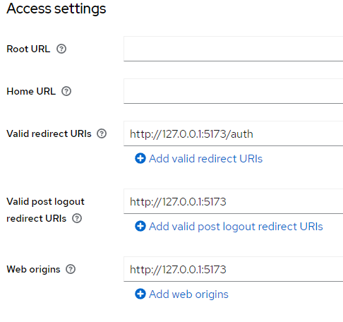

# 安全第一原则
> 将安全实施转移到左侧。 首先而不是最后实施与安全相关的功能。

假设与安全相关的功能仅在项目的最后阶段实现。 那样的话，没有时间去实施或者忘记实施的可能性就更大了。 出于这个原因，与安全相关的特性应该首先实现，而不是最后。 下一节中描述的威胁建模过程应用于识别潜在威胁，并提供需要作为威胁对策实施的安全功能列表。

## 威胁建模
威胁建模过程使你能够识别、量化和解决与应用程序相关的安全风险。 威胁建模过程由三个高级步骤组成：

- 分解应用
- 确定和排列威胁
- 确定对策和缓解措施

### 分解应用
应用程序分解步骤是了解应用程序由哪些部分组成、外部依赖项以及它们的使用方式。 该步骤可以在应用架构设计完成后进行。 这一步的结果是：

- 识别攻击者进入应用程序的入口点
- 识别受到威胁的资产。 这些资产是攻击者感兴趣的东西
- 确定信任级别，例如，具有不同用户角色的用户可以做什么

### 确定和排序威胁

为确定可能的威胁，应使用威胁分类方法。 ```STRIDE``` 方法将威胁分为以下几类：

|   类别   |                             说明                             |
| :------: | :----------------------------------------------------------: |
|   欺骗   | 攻击者在没有真实身份验证或使用窃取的凭据的情况下充当另一个用户 |
|   篡改   |                      攻击者恶意更改数据                      |
|   否认   |                   攻击者能够执行禁止的操作                   |
| 信息泄露 |                      攻击者获取敏感数据                      |
| 拒绝服务 |                   攻击者试图使服务无法使用                   |
| 特权提升 |                  攻击者获得不需要的访问权限                  |

应用程序安全框架 (```ASF```) 将应用程序安全功能分为以下几类：

|          类别          |                             说明                             |
| :--------------------: | :----------------------------------------------------------: |
|       审计和记录       |                记录用户操作以检测例如否认攻击                |
|          验证          |                       禁止身份欺骗攻击                       |
|          授权          |                       禁止提升权限攻击                       |
|        配置管理        |              正确存储机密并以最少的权限配置系统              |
| 传输和休息中的数据保护 | 使用 ```TLS``` 等安全协议，加密数据库中 ```PII``` 等敏感信息 |
|        数据验证        |      验证用户的输入数据以防止注入和 ```ReDoS``` 攻击等       |
|        异常管理        |            不要在错误消息中向最终用户透露实施细节            |

使用上述任何一种威胁分类方法时，应根据分解应用程序的信息列出每个类别中的威胁：需要保护的应用程序入口点和资产是什么？ 在列出每个类别中的潜在威胁后，应对威胁进行排序。 有几种方法可以对威胁进行排序。 对威胁进行排序的最简单方法是根据风险将它们归入以下三个类别之一：高、中和低。 作为排名的基础，你可以使用有关威胁概率及其负面影响（影响）大小的信息。 排名的想法是优先考虑安全功能。 应首先实施针对高风险威胁的安全功能。

### 确定对策和缓解措施

确定对策步骤应提供所需安全功能的用户故事列表。 这些安全功能应该消除或至少减轻威胁。 如果你有无法消除或缓解的威胁，并且该威胁被归类为低风险威胁，你可以接受该风险。 低风险威胁是对应用程序影响较小的威胁，威胁实现的概率较低。 假设你在应用程序中发现了一个风险非常高的威胁，并且你无法消除或减轻该威胁。 在这种情况下，你应该通过从应用程序中完全删除与威胁相关的功能来消除威胁。

## 安全功能
### 身份验证和授权

在为应用程序实现用户认证和授权时，使用第三方授权服务。 不要尝试自己构建授权服务。 你很容易犯错误。 此外，如果你的应用程序处理纯文本用户凭据，则可能存在安全风险。 最好使用经过实战检验的解决方案，该解决方案已纠正最重要的错误并可以安全地存储用户凭据。 在接下来的示例中，我们使用 ```Keycloak``` 作为授权服务。

此外，尽量使用已建立的第 3 方库，而不是自己编写所有与授权相关的代码。 创建单个前端身份验证/授权库并在多个项目中使用相同的库而不是在不同项目中从头开始不断地实现身份验证和授权相关的功能也很有帮助。

#### 前端的 ```OpenID Connect``` 身份验证和授权

对于前端授权，需要注意验证码、```token```等授权相关secret的安全存储。 这些必须存储在浏览器中的安全位置。 以下是一些不安全存储机制的列表：

- ```Cookies```
  - 自动发送，```CSRF``` 威胁
- 会话/本地存储
- 容易被恶意代码窃取（```XSS```威胁）
- 加密会话/本地存储
  - 由于加密密钥为明文，因此很容易被恶意代码窃取
- 全局变量
  - 容易被恶意代码窃取（```XSS```威胁）

将秘密存储在闭包变量中并非本质上不安全，但秘密会在页面刷新或新页面时丢失。

下面是一个使用 ```service worker``` 作为秘密安全存储的示例。 ```service worker``` 的额外好处是它不允许恶意的第 3 方代码修改 ```service worker``` 的 ```fetch``` 方法，例如，它可以窃取访问令牌。

恶意代码很容易更改全局获取功能：

```javascript
fetch = () => console.log('hacked');
fetch() // prints 'hacked' to console
```

下面是一个更现实的例子：

```javascript
originalFetch = fetch;
fetch = (url, options) => {
  // Implement malicious attack here
  // For example: change some data in the request body

  // Then call original fetch implementation
  return originalFetch(url, options); 
}
```

当然，有人会问：为什么可以这样修改全局对象的内置方法呢？ 当然，这应该是不可能的，但不幸的是，它是。

让我们创建一个 ```Vue.js``` 应用程序，它使用 ```OpenID Connect``` 协议（```OAuth2``` 协议的扩展）执行身份验证和授权。

在下面的主模块中，我们将全局获取设置为始终返回错误，并且只允许我们的 ```tryMakeHttpRequest``` 函数使用原始的全局获取方法。 然后我们注册一个```service worker```。 如果 ```service worker``` 已经注册过，则不会再次注册。 最后，我们创建应用程序（```App``` 组件），激活路由器，激活用于状态管理的 ```Pinia``` 中间件，并将应用程序挂载到 ```DOM``` 节点：

```main.ts```

```typescript
import { setupFetch } from "@/tryMakeHttpRequest";
setupFetch();
import { createApp } from "vue";
import { createPinia } from "pinia";
import App from "@/App.vue";
import router from "@/router";

if ("serviceWorker" in navigator) {
  await navigator.serviceWorker.register("/serviceWorker.js");
}

const app = createApp(App);
const pinia = createPinia();
app.use(pinia);
app.use(router);
app.mount("#app");
```

下面是 ```App``` 组件的定义。 安装后，它会检查用户是否已经被授权。

如果用户被授权，他/她的授权信息将从 ```service worker``` 中获取，用户的名字将在授权信息存储中更新。 用户将被转发到主页。

如果用户未被授权，则进行授权。

```App.vue```

```vue
<template>
  <HeaderView />
  <router-view></router-view>
</template>

<script setup>
import { onMounted } from "vue";
import { useRouter } from "vue-router";
import authorizationService from "@/authService";
import { useAuthInfoStore } from "@/stores/authInfoStore";
import HeaderView from "@/HeaderView.vue";
import tryMakeHttpRequest from "@/tryMakeHttpRequest";

const router = useRouter();
const route = useRoute();

onMounted(async () => {
  const response = await tryMakeHttpRequest("/authorizedUserInfo");
  const responseBody = await response.text();
  if (responseBody !== "") {
    const authorizedUserInfo = JSON.parse(responseBody);
    const { setFirstName } = useAuthInfoStore();
    setFirstName(authorizedUserInfo.firstName);
    router.push({ name: "home" });
  } else if (route.path !== '/auth') {
    authorizationService
      .tryAuthorize()
      .catch(() =>  router.push({ name: "auth-error" }));
  }
});
</script>
```

```authInfoStore.ts```

```typescript
import { ref } from "vue";
import { defineStore } from "pinia";

export const useAuthInfoStore =
  defineStore("authInfoStore", () => {
    const firstName = ref('');

    function setFirstName(newFirstName: string) {
      firstName.value = newFirstName;
    }

    return { firstName, setFirstName };
  });
```

录用户的名字和用于注销用户的按钮：

```HeaderView.vue```

```vue
<template>
  <span>{{authInfoStore.firstName}}</span>
  &nbsp;
  <button @click="logout">Logout</button>
</template>

<script setup>
import { useRouter } from "vue-router";
import authorizationService from "@/authService";
import { useAuthInfoStore } from "@/stores/authInfoStore";

const authInfoStore = useAuthInfoStore();
const router = useRouter();

function logout() {
  authorizationService
    .tryLogout()
    .catch(() => router.push({ name: "auth-error" }));
}
</script>
```

```tryMakeHttpRequest``` 函数是浏览器全局获取方法的包装器。 如果 ```HTTP``` 请求返回 ```HTTP``` 状态代码 ```403 Forbidden```，它将启动授权过程。

```tryMakeHttpRequest.ts``` 文件

```typescript
import authorizationService from "@/authService";

let originalFetch: typeof fetch;

export default function tryMakeHttpRequest(
  url: RequestInfo,
  options?: RequestInit
): Promise<Response> {
  return originalFetch(url, options).then(async (response) => {
    if (response.status === 403) {
      try {
        await authorizationService.tryAuthorize();
      } catch {
        // Handle auth error, return response with status 403
      }
    }

    return response;
  });
}

export function setupFetch() {
  originalFetch = fetch;
  // @ts-ignore
  // eslint-disable-next-line no-global-assign
  fetch = () =>
    Promise.reject(new Error('Global fetch not implemented'));
}
```

下面是 ```service worker``` 的实现：

```serviceWorker.js```

```javascript
const allowedOrigins = [
  "http://localhost:8080", // IAM in dev environment
  "http://localhost:3000", // API in dev environment
  "https://software-system-x.domain.com" // prod environment
];

const apiEndpointRegex = /\/api\//;
const tokenEndpointRegex = /\/openid-connect\/token$/;
const data = {};

// Listen to messages that contain data
// to be stored inside the service worker
addEventListener("message", (event) => {
  if (event.data) {
    data[event.data.key] = event.data.value;
  }
});

function respondWithUserInfo(event) {
  const response = 
    new Response(data.authorizedUserInfo
                   ? JSON.stringify(data.authorizedUserInfo)
                   : '');
  event.respondWith(response);
}

function respondWithIdToken(event) {
  const response = new Response(data.idToken 
                                  ? data.idToken
                                  : '');
  event.respondWith(response);
}

function respondWithTokenRequest(event) {
  let body = "grant_type=authorization_code";
  body += `&code=${data.code}`;
  body += `&client_id=app-x`;
  body += `&redirect_uri=${data.redirectUri}`;
  body += `&code_verifier=${data.codeVerifier}`;
  const tokenRequest = new Request(event.request, { body });
  
  // Verify that state received from the authorization
  // server is same as sent by this app earlier
  if (data.state === data.receivedState) {
    event.respondWith(fetch(tokenRequest));
  } else {
    // Handle error
  }
}

function respondWithApiRequest(event) {
  const headers = new Headers(event.request.headers);
      
  // Add Authorization header that contains the access token
  if (data.accessToken) {
    headers.append("Authorization",
                   `Bearer ${data.accessToken}`);
  }

  const authorizedRequest = new Request(event.request, {
    headers
  });

  event.respondWith(fetch(authorizedRequest));
}

function fetchHandler(event) {
  const requestUrl = new URL(event.request.url);

  if (event.request.url.endsWith('/authorizedUserInfo') &&
      !apiEndpointRegex.test(requestUrl.pathname)) {
    respondWithUserInfo(event);  
  } else if (event.request.url.endsWith('/idToken') &&
             !apiEndpointRegex.test(requestUrl.pathname)) {
    respondWithIdToken(event);
  } else if (allowedOrigins.includes(requestUrl.origin)) {
    if (tokenEndpointRegex.test(requestUrl.pathname)) {
      respondWithTokenRequest(event);
    } else if (apiEndpointRegex.test(requestUrl.pathname)) {
      respondWithApiRequest(event);
    }
  } else {
    event.respondWith(fetch(event.request));
  }
}

// Intercept all fetch requests and handle
// them with 'fetchHandler'
addEventListener("fetch", fetchHandler);
```

使用 ```OAuth2``` 授权代码流的授权是从浏览器重定向到以下类型的 ```URL``` 开始的：

```javascript
https://authorization-server.com/auth?response_type=code&client_id=CLIENT_ID&redirect_uri=https://example-app.com/cb&scope=photos&state=1234zyx...ghvx3&code_challenge=CODE_CHALLENGE&code_challenge_method=SHA256
```


上述 ```URL``` 中的查询参数如下：

- ```response_type=code``` - 表示你希望收到授权码
- ```client_id``` - 在授权服务器上创建客户端时使用的客户端 ```ID```
- ```redirect_uri``` - 表示授权完成后将浏览器重定向到的 ```URI```。 你还需要在授权服务器中定义此 ```URI```。
- ```scope``` - 一个或多个范围值，指示你希望访问用户帐户的哪些部分。 范围应由 ```URL``` 编码的空格字符分隔
- ```state``` - 由你的应用程序生成的随机字符串，稍后你将对其进行验证
- ```code_challenge``` - ```PKCE``` 扩展：代码验证器的 ```URL``` 安全 ```base64``` 编码 ```SHA256``` 哈希。 代码验证器是你生成的随机字符串秘密
- ```code_challenge_method=S256``` - ```PKCE extension```: 指示使用哪种散列方法（```S256``` 表示 ```SHA256```）

我们需要使用 ```PKCE``` 扩展作为额外的安全措施，因为我们在前端而不是后端执行授权代码流。

如果授权成功，授权服务器会将浏览器重定向到上面给定的 ```redirect_uri```，并将代码和状态作为 ```URL``` 查询参数，例如：

```
https://example-app.com/cb?code=AUTH_CODE_HERE&state=1234zyx...ghvx3
```

- ```code``` - 从授权服务器返回的授权码
- ```state``` - 你之前传递的相同状态值

应用程序成功授权后，可以使用以下类型的 ```HTTP POST``` 请求请求令牌：

```
POST https://authorization-server.com/token
  
  grant_type=authorization_code&
  code=AUTH_CODE_HERE&
  redirect_uri=REDIRECT_URI&
  client_id=CLIENT_ID&
  code_verifier=CODE_VERIFIER
```

- ```grant_type=authorization_code``` - 此流的授权类型是 ```authorization_code```
- ```code=AUTH_CODE_HERE``` - 这是你在浏览器从授权服务器重定向回你的应用程序时收到的代码。
- ```redirect_uri=REDIRECT_URI``` - 必须与之前在授权期间提供的重定向 ```URI``` 相同
- ```client_id=CLIENT_ID``` - 在授权服务器上创建客户端时使用的客户端 ```ID```
- ```code_verifier=CODE_VERIFIER``` - 你之前生成的随机字符串秘密

下面是 ```AuhtorizationService``` 类的实现。 它提供了授权、获取令牌和注销的方法。

```AuthorizationService.ts```

```typescript
import pkceChallenge from "pkce-challenge";
import jwt_decode from "jwt-decode";
import tryMakeHttpRequest from "@/tryMakeHttpRequest";
import type { useAuthInfoStore } from "@/stores/authInfoStore";

interface AuthorizedUserInfo {
  readonly userName: string;
  readonly firstName: string;
  readonly lastName: string;
  readonly email: string;
}

export default class AuthorizationService {
  constructor(
    private readonly oidcConfigurationEndpoint: string,
    private readonly clientId: string,
    private readonly authRedirectUrl: string,
    private readonly loginPageUrl: string
  ) {}

  // Try to authorize the user using the OpenID Connect
  // Authorization Code Flow
  async tryAuthorize(): Promise<void> {
    // Store the redirect URI in service worker
    navigator.serviceWorker?.controller?.postMessage({
      key: "redirectUri",
      value: this.authRedirectUrl
    });

    // Store the state secret in service worker
    const state = crypto.randomUUID();
    navigator.serviceWorker?.controller?.postMessage({
      key: "state",
      value: state,
    });

    // Generate a PKCE challenge and store
    // the code verifier in service worker
    const challenge = pkceChallenge(128);
    navigator.serviceWorker?.controller?.postMessage({
      key: "codeVerifier",
      value: challenge.code_verifier,
    });

    const authUrl = await this.tryCreateAuthUrl(state, challenge);

    // Redirect the browser to authorization server's
    // authorization URL
    location.href = authUrl;
  }

  // Try get access, refresh and ID token from
  // the authorization server's token endpoint
  async tryGetTokens(
    authInfoStore: ReturnType<typeof useAuthInfoStore>
  ): Promise<void> {
    const oidcConfiguration = await this.getOidcConfiguration();
    
    const response =
      await tryMakeHttpRequest(oidcConfiguration.token_endpoint, {
        method: "post",
        mode: "cors",
        headers: {
          "Content-Type": "application/x-www-form-urlencoded",
        },
    });

    const tokens = await response.json();
    this.storeTokens(tokens);
    this.storeAuthorizedUserInfo(tokens.id_token, authInfoStore);
  }

  // Logout and redirect to login page
  async tryLogout(): Promise<void> {
    const oidcConfiguration = await this.getOidcConfiguration();
    
    // Clear authorized user info in service worker
    navigator.serviceWorker?.controller?.postMessage({
      key: "authorizedUserInfo",
      value: undefined
    });

    // Get ID token from service worker
    const response = await tryMakeHttpRequest("/idToken");
    const idToken = await response.text();

    // Redirect browser to authorization server's
    // logout endpoint
    if (idToken !== "") {
      location.href =
        oidcConfiguration.end_session_endpoint +
        `?post_logout_redirect_uri=${this.loginPageUrl}` +
        `&id_token_hint=${idToken}`;
    } else {
      location.href = oidcConfiguration.end_session_endpoint;
    }
  }

  private async getOidcConfiguration(): Promise<any> {
    const response =
      await tryMakeHttpRequest(this.oidcConfigurationEndpoint);
    
    return response.json();
  }
  
  private async tryCreateAuthUrl(
    state: string,
    challenge: ReturnType<typeof pkceChallenge>
  ) {
    const oidcConfiguration = await this.getOidcConfiguration();
    let authUrl = oidcConfiguration.authorization_endpoint;
    
    authUrl += "?response_type=code";
    authUrl += "&scope=openid+profile+email";
    authUrl += `&client_id=${this.clientId}`;
    authUrl += `&redirect_uri=${this.authRedirectUrl}`;
    authUrl += `&state=${state}`;
    authUrl += `&code_challenge=${challenge.code_challenge}`;
    authUrl += "&code_challenge_method=S256";
    
    return authUrl;
  }
  
  private storeTokens(tokens: any) {
    navigator.serviceWorker?.controller?.postMessage({
      key: "accessToken",
      value: tokens.access_token,
    });

    navigator.serviceWorker?.controller?.postMessage({
      key: "refreshToken",
      value: tokens.refresh_token,
    });

    navigator.serviceWorker?.controller?.postMessage({
      key: "idToken",
      value: tokens.id_token,
    });
  }
  
  private storeAuthorizedUserInfo(
    idToken: any,
    authInfoStore: ReturnType<typeof useAuthInfoStore>
    ) {
    const idTokenClaims: any = jwt_decode(idToken);

    const authorizedUserInfo = {
      userName: idTokenClaims.preferred_username,
      firstName: idTokenClaims.given_name,
      lastName: idTokenClaims.family_name,
      email: idTokenClaims.email,
    };

    navigator.serviceWorker?.controller?.postMessage({
      key: "authorizedUserInfo",
      value: authorizedUserInfo
    });

    authInfoStore.setFirstName(idTokenClaims.given_name);
  }
}
```

以下是你在 ```tryGetTokens``` 方法中执行 ```tryMakeHttpRequest``` 函数时获得的示例响应：

```typescript
{
  "access_token": "eyJz93a...k4laUWw",
  "id_token": "UFn43f...c5vvfGF",
  "refresh_token": "GEbRxBN...edjnXbL",
  "token_type": "Bearer",
  "expires_in": 3600
}
```

```AuthorizationCallback``` 组件是授权服务器在授权成功后将浏览器重定向回应用程序时将呈现的组件。 该组件将授权代码和接收到的状态存储在 ```Service Worker``` 中，并发起令牌请求。 收到令牌后，它将应用程序路由到主页。 作为一项额外的安全措施，只有在原始状态和接收到的状态相等时才会执行令牌请求。 此检查在服务工作者代码中完成。

```AuthorizationCallback.vue```

```vue
<template>
  <div></div>
</template>

<script setup>
import { onMounted } from "vue";
import { useRouter, useRoute } from "vue-router";
import authorizationService from "@/authService";
import { useAuthInfoStore } from "@/stores/authInfoStore";

const { query } = useRoute();
const router = useRouter();
const authInfoStore = useAuthInfoStore();

onMounted(async () => {
  // Store authorization code in service worker
  navigator.serviceWorker?.controller?.postMessage({
    key: "code",
    value: query.code,
  });
  
  // Store received state in service worker
  navigator.serviceWorker?.controller?.postMessage({
    key: "receivedState",
    value: query.state,
  });

  // Try fetch tokens 
  try {
    await authorizationService.tryGetTokens(authInfoStore);
    router.push({ name: "home" });
  } catch (error) {
    router.push({ name: "auth-error" });
  }
});
</script>
```

应用程序使用的其他 ```UI``` 组件定义如下：

```AuthorizationError.vue```

```vue
<template>
  <div>Error</div>
</template>
```

```LoginView.vue```

```vue
<template>
  <div>Login</div>
</template>
```

```HomeView.vue```

```vue
<template>
  <div>Home</div>
</template>
```

应用程序的路由器如下：

```router.ts```

```typescript
import { createRouter, createWebHistory } from "vue-router";
import AuthorizationCallback from "@/AuthorizationCallback.vue";
import AuthorizationError from "@/AuthorizationError.vue";
import HomeView from "@/HomeView.vue";
import LoginView from "@/LoginView.vue";

const routes = [
  {
    path: "/",
    name: "login",
    component: LoginView,
  },
  {
    path: "/auth",
    name: "auth",
    component: AuthorizationCallback,
  },
  {
    path: "/auth-error",
    name: "auth-error",
    component: AuthorizationError,
  },
  {
    path: "/home",
    name: "home",
    component: HomeView,
  },
];

const router = createRouter({
  history: createWebHistory(),
  routes,
});

export default router;
```

下面的 ```authService``` 模块包含所需常量的定义并创建 ```AuthorizationService``` 类的实例。 以下代码包含本地开发环境的值。 在现实生活中，这些值应该取自环境变量。 如果你在 ```localhost:8080``` 运行 ```Keycloak``` 服务并且在 ```localhost:5173``` 运行 ```Vue``` 应用程序，则以下值有效。 你必须在 ```Keycloak``` 中创建一个名为```app-x```的客户端。 此外，你必须定义有效的重定向 ```URI``` 并添加允许的 ```Web``` 来源。 最后，你必须配置一个有效的注销后重定向 ```URI```（见下图）。 ```Keycloak``` 中的默认访问令牌生命周期仅为一分钟。 你可以在领域设置（令牌选项卡）中增加测试目的



```authService.ts```

```typescript
import AuthorizationService from "@/AuthorizationService";

const oidcConfigurationEndpoint =
  "http://localhost:8080/realms/master/.well-known/openid-configuration";

const clientId = "app-x";
const redirectUrl = "http://127.0.0.1:5173/auth";
const loginPageUrl = "http://127.0.0.1:5173";

const authorizationService = new AuthorizationService(
  oidcConfigurationEndpoint,
  clientId,
  redirectUrl,
  loginPageUrl
);

export default authorizationService;
```

#### 后台OAuth2授权

只让授权用户访问资源。 不要忘记实现授权的最好方法是默认拒绝对资源的访问。 你可以要求授权注释必须出现在所有控制器方法中。 如果 ```API``` 端点不需要授权，则可以使用 ```@AllowAnyone``` 之类的特殊注释。 例如，如果控制器方法缺少授权注释，则可能会抛出异常。 这样，你永远不会忘记向控制器方法添加授权注释。

损坏的访问控制在 2021 年 OWASP 前 10 名中排名第一。尤其要记住禁止用户通过提供他人的唯一标识符来创建、查看、编辑或删除属于他人的资源。

下面是一个基于 ```JWT``` 的授权器类，可以在使用 ```Express``` 框架实现的后端 ```API``` 服务中使用：

```JwtAuthorizer.ts```

```typescript
import _ from 'lodash';
import { decode, verify } from 'jsonwebtoken';
import { fetch } from 'fetch-h2';
import { Request } from 'express';
import jwks from 'jwks-rsa';
import throwException from './throwException';

export default class JwtAuthorizer implements
                       Authorizer {
  private readonly oidcConfigurationEndpoint: string;
  private readonly rolesClaimPath: string;
  private readonly getUserIdBySubjectUrl: string;
  private jwksClient: any;

  constructor() {
    this.oidcConfigurationEndpoint =
     process.env.OIDC_CONFIGURATION_ENDPOINT ??
      throwException('OIDC_CONFIGURATION_ENDPOINT is not defined');
      
    // With Keycloak you can use e.g., realm_access.roles
    this.rolesClaimPath = process.env.JWT_ROLES_CLAIM_PATH ??
      throwException('JWT_ROLES_CLAIM_PATH is not defined')
    
    // This is the URL where you can fetch the user id for a
    // specific 'sub' claim value in the access token
    this.getUserIdBySubjectUrl =
      process.env.GET_USER_ID_BY_SUBJECT_URL ??
      throwException('GET_USER_ID_BY_SUBJECT_URL is not defined');
  }
  
  async tryAuthorize(
    request: Request
  ): Promise<void> {
    await this.tryGetClaims(request.headers.authorization);
  }
  
  // Authorize a user for his/hers own resources only
  // Note! For some IAM systems other than Keycloak,
  // you might need to use 'uid'
  // claim instead of 'sub' to get really unique user id
  async tryAuthorizeForUserOwnResourcesOnly(
    userId: number,
    request: Request
  ): Promise<void> {
    const claims =
      await this.tryGetClaims(request.headers.authorization);

    const response =
      await fetch(this.getUserIdBySubjectUrl +
                  `?sub=${claims.sub}`);
    
    const userIdObject = await response.json();

    if (userId !== userIdObject.userId) {
      throw new Error('...');
    }
  }

  async tryAuthorizeIfUserHasOneOfRoles(
    allowedRoles: string[],
    request: Request):
  Promise<void> {
    const claims =
      await this.tryGetClaims(request.headers.authorization);

    const roles = _.get(claims, this.rolesClaimPath);

    const isAuthorized =
      allowedRoles.some((allowedRole) =>
        roles.includes(allowedRole));

    if (!isAuthorized) {
      throw new Error('...');
    }
  }

  private async tryGetClaims(
    authHeader: string | undefined
  ): Promise<any> {
    const response = await fetch(this.oidcConfigurationEndpoint);
    const oidcConfiguration = await response.json();

    if (!this.jwksClient) {
      this.jwksClient =
        jwks({ jwksUri: oidcConfiguration.jwks_uri });
    }

    const jwt = authHeader?.split('Bearer ').pop();
    const decodedJwt = decode(jwt ?? '', { complete: true });
    const kid = decodedJwt?.header?.kid;
    const signingKey = await this.jwksClient.getSigningKey(kid);
    return verify(jwt ?? '', signingKey.getPublicKey());
  }
}

export const authorizer = new JwtAuthorizer();
```

下面是一个使用上面定义的 ```JwtAuthorizer``` 的示例 ```API``` 服务：

```app.ts```

```typescript
import express, { Response, Request } from 'express';
import cors from 'cors';
import { authorizer } from './JwtAuthorizer';

const app = express();
app.use(express.json());
app.use(cors());

function sendAuthError(request: Request, response: Response) {
  if (request.headers.authorization) {
    response
      .status(403)
      .json({ error: 'Unauthorized' });
  } else {
    response
      .status(401)
      .json({ error: 'Unauthenticated' });
  }
}

app.get('/api/sales-items', () => {
  // No authorized needed
  // Send sales items
});

app.post('/api/messages', (request, response) => {
  authorizer.tryAuthorize(request)
    .then(() => {
      // Create a message
    }).catch(() => sendAuthError(request, response));
});

app.post('/api/orders', (request, response) => {
  authorizer
    .tryAuthorizeForUserOwnResourcesOnly(request.body.userId,
                                         request)
    .then(() => {
      // Create an order for the user,
      // user cannot create orders for other users
    }).catch(() => sendAuthError(request, response));
});

app.delete('/api/sales-items', (request, response) => {
  authorizer
    .tryAuthorizeIfUserHasOneOfRoles(['admin'], request)
    .then(() => {
      // Only admin user can delete all sales items
    }).catch(() => sendAuthError(request, response));
});

app.listen(3000);
```

下面是一个使用 ```Spring Boot``` 实现 ```OAuth2``` 资源服务器的简单示例。 首先，需要添加 ```OAuth2``` 资源服务器依赖：

```build.gradle```

```java
dependencies {
    implementation 'org.springframework.boot:spring-boot-starter-oauth2-resource-server'
}
```

接下来，你需要配置 ```JWT``` 颁发者 ```URL```。 在下面的示例中，我们使用本地主机 ```Keycloak``` 服务。

```application.yml```

```yaml
spring:
  security:
    oauth2:
      resourceserver:
        jwt:
          issuer-uri: http://localhost:8080/realms/master/
```

然后，你将配置哪些 ```API``` 端点需要使用有效的 ```JWT``` 进行授权。 以下示例要求对所有 ```API``` 端点的请求包含有效的 ```JWT```。

```SecurityConfiguration.java```

```java
import org.springframework.context.annotation.Configuration;
import org.springframework.security.config.annotation.web.builders.HttpSecurity;
import org.springframework.security.config.annotation.web.configuration.WebSecurityConfigurerAdapter;

@Configuration
public class SecurityConfiguration 
                extends WebSecurityConfigurerAdapter {
  @Override
  protected final void configure(
    final HttpSecurity httpSecurity
  ) throws Exception {
    httpSecurity.authorizeRequests()
      .antMatchers("/**")
      .authenticated()
      .and()
      .oauth2ResourceServer()
      .jwt();
  }
}
```

在 ```REST``` 控制器中，你可以使用 ```AuthenticationPrincipal``` 注释注入 ```JWT```，以在控制器方法中执行额外的授权：

```SalesItemController.java```

```java
@RestController
@RequestMapping(SalesItemController.API_ENDPOINT)
@Slf4j
public class SalesItemController {
  public static final String API_ENDPOINT = "/salesitems";

  @Autowired
  private SalesItemService salesItemService;

  @PostMapping
  @ResponseStatus(HttpStatus.CREATED)
  public final SalesItem createSalesItem(
    @RequestBody final SalesItemArg salesItemArg,
    @AuthenticationPrincipal final Jwt jwt
  ) {
    log.info("Username: {}",
             jwt.getClaimAsString("preferred_username"));

    // You can now use the "jwt" object to get a claim about
    // user's roles and verify a needed role, for example.
    return salesItemService.createSalesItem(salesItemArg);
  }
}
```

### 密码政策

实施需要强密码的密码策略，并且更喜欢密码而不是密码。 密码短语应该包含多个单词。 与强密码相比，密码短语更难被攻击者猜测，也更容易被用户记住。 允许密码短语包含 ```Unicode``` 字符。 这允许用户使用他们的母语创建密码。

你应该要求密码强度高并符合以下条件：

- 至少 12 个字符长
- 至少有一个大写字母
- 至少一个小写字母
- 至少一个号码
- 至少一个特殊字符
- 可能不包含用户名
- 不得包含太多相同的数字或字母，例如，应拒绝包含```111111```、```aaaaaa```或```1a1a1a1a1a```的密码
- 不得包含太多连续的数字或字母，例如，应拒绝包含```12345```、```56789```、```abcdef```或```klmno```的密码
- 键盘中不得包含太多相邻字母，例如，应拒绝包含```qwerty```的密码
- 不得包含列入黑名单的词。 将所有常用的、易于猜测的密码列入黑名单。

### 密码学
以下是与密码学相关的要实施的关键安全功能：

- 不要以明文形式传输数据
  - 你不需要在所有微服务中实现 ```HTTPS```，因为你可以设置服务网格并将其配置为在服务之间实现 ```mTLS```
- 不要以明文形式存储个人身份信息 (```PII```) 等敏感信息
  - 在将敏感数据存储到数据库之前对其进行加密，并在从数据库中获取数据时对其进行解密
  - 请记住根据隐私法、监管要求或业务需求确定哪些数据被归类为敏感数据
  - 不要使用 ```FTP``` 和 ```SMTP``` 等旧协议来传输敏感数据
  - 尽快丢弃敏感数据或使用标记化（例如，符合 ```PCI DSS```）甚至截断
  - 不要缓存敏感数据
- 不要使用旧的/弱的加密算法。 使用强大的算法，如 ```SHA-256``` 或 ```AES-256```
- 不允许在生产环境中使用默认密码或加密密钥
  - 当微服务在生产环境中运行时，你可以在微服务中实现密码/加密密钥的验证逻辑。 如果微服务的密码/加密密钥不够强，微服务不应运行，而是会出错退出

### 拒绝服务 (```DoS```) 预防

```DoS``` 预防至少应通过以下方式进行：

- 为微服务建立请求速率限制。 它可以在 ```API``` 网关级别或由云提供商完成
- 使用验证码来防止非人类（机器人）用户执行可能昂贵的操作，例如创建新资源或获取大型资源（例如大文件）

### ```SQL```注入预防

以下是为防止 ```SQL``` 注入攻击而实施的关键功能：

- 使用参数化 ```SQL``` 语句。 不要将用户提供的数据直接连接到 ```SQL``` 语句字符串
- 请记住，你不能在 ```SQL``` 语句的所有部分都使用参数化。 如果你必须在没有参数化的情况下将用户提供的数据放入 ```SQL``` 语句中，请先对其进行清理/验证。 例如，对于 ```LIMIT```，你必须验证用户提供的值是否为整数且在给定范围内
- 迁移以使用 ```ORM```（对象关系映射）
- 对查询中获取的记录数量使用适当的限制，以防止记录的大量泄露
- 验证第一个查询结果行的形状是否正确。 如果第一行数据的形状错误，例如包含错误的字段，则不要将查询结果发送给客户端。

### 安全配置

默认情况下，容器的安全上下文应如下所示：

- 容器不应该有特权
- 所有能力都被丢弃
- 容器文件系统是只读的
- 只允许非 ```root``` 用户在容器内运行
- 定义容器应在其下运行的非根用户和组
- 禁止权限升级

实现在```API```网关中发送安全相关的```HTTP```响应头：

- ```X``` 内容类型选项：```nosniff```
- 严格传输安全：最大年龄：； 包括子域
- ```X``` 框架选项：拒绝
- 内容安全策略：框架祖先"无"
- 内容类型：```application/json```
- 如果未专门启用和配置缓存，则应设置以下标头：```Cache-Control: no-store```
- 访问控制允许来源：https://your_domain_here

### 自动漏洞扫描
定期在微服务 ```CI/CD``` 管道和容器注册表中实施自动漏洞扫描。 应扫描软件系统的所有软件组件。 至少立即纠正所有严重和高漏洞。

### 正直

仅使用带有 ```SHA``` 摘要标签的容器镜像。 如果攻击者成功发布了带有相同标签的恶意容器镜像，```SHA``` 摘要将阻止使用该恶意镜像。 确保你使用来自可信来源的库和依赖项，例如 ```NPM``` 或 ```Maven```。 你还可以托管存储库的内部镜像，以避免意外使用任何不受信任的存储库。 确保所有代码（源代码、部署、基础架构）和配置更改都存在审查流程，以便不会将恶意代码引入你的软件系统。

### 错误处理

确保 ```API``` 响应中的错误消息不包含敏感信息。 不要将堆栈跟踪添加到传输到生产环境中的客户端的错误响应中。

### 审计记录

与最终用户相关的可审核事件，例如登录、登录失败、未经授权或无效的请求以及高价值交易，应记录并存储在外部审核日志系统中。 审核日志系统应自动检测与最终用户相关的可疑操作并发出警报。

### 输入验证

始终验证来自不受信任来源的输入，例如来自最终用户的输入。 有很多方法可以实现验证，并且有几个库可用于此目的。 假设你使用 ```ORM``` 并实现实体和数据传输对象。 确保正确验证的最佳方法是要求每个实体/```DTO``` 属性都必须具有验证注释。 如果实体或 ```DTO``` 中的属性不需要任何验证，请使用特殊注释（例如 ```@AnyValue```）对该属性进行注释。

请记住验证来自所有可能来源的未经验证的数据：

- 命令行参数
- 环境变量
- 标准输入 (```stdin```)
- 来自文件系统的文件
- 来自套接字的数据（网络输入）
- 界面输入

#### 验证数字
验证数值时，始终验证值是否在指定范围内。 例如，如果你使用未经验证的数字来检查循环是否应该结束并且该数字非常大，则可能会导致拒绝服务 (```DoS```)。 如果数字应该是整数，则不允许使用浮点值。

#### 验证字符串

验证字符串时，始终首先验证字符串的最大长度。 只有在那之后执行额外的验证。 使用正则表达式验证长字符串可能会导致正则表达式拒绝服务 (```ReDoS```)。 你应该避免为验证目的制作自己的正则表达式，而应使用包含经过实战测试的代码的现成库。 还可以考虑使用 ```Google RE2``` 库。 它比许多语言运行时提供的正则表达式功能更安全，并且你的代码将不易受到 ```ReDoS``` 的影响。

#### 验证数组

验证数组时，你可以验证数组的大小不会太小或太大，如果需要，你可以验证值的唯一性。 另外，请记住分别验证数组中的每个值。

#### 验证对象

通过分别验证对象的每个属性来验证对象。 请记住还要验证嵌套对象。

#### 验证库示例

查看附录 A，了解使用验证类型 ```NPM``` 库创建 ```TypeScript``` 验证库。 验证库可以验证 ```JavaScript``` 对象，例如，解析的 ```JSON/YAML``` 格式配置、环境变量（```process.env``` 对象）和输入 ```DTO```。 验证库接受对象模式并根据给定模式验证对象并生成强类型验证对象。