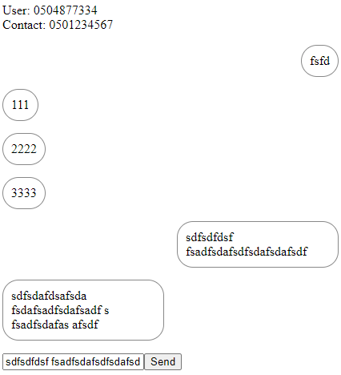
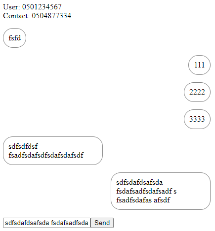

# ```API```设计原则
本章介绍面向前端和后端 API 的设计原则。 首先，讨论面向前端的 API 设计，然后介绍微服务间 API 设计。

## 面向前端的 ```API``` 设计原则

大多数面向前端的 ```API``` 应该是基于 ```HTTP``` 的 ```JSON-RPC```、```REST``` 或 ```GraphQL API```。 使用 ```GraphQL```，尤其是当 ```API``` 处理大量嵌套的资源，或者客户想要决定查询应该返回哪些字段时。 对于基于订阅的 ```API```，使用服务器发送事件 (```SSE```) 或 ```GraphQL``` 订阅，对于实时双向通信，使用 ```WebSocket```。

### ```JSON-RPC API``` 设计原理

> 设计一个 ```JSON-RPC API``` 来为 ```API``` 端点执行单个操作（过程）。

顾名思义，```JSON-RPC API``` 用于执行远程过程调用。 远程过程参数是 ```HTTP``` 请求正文中的一个 ```JSON``` 对象。 而远程过程的返回值是 ```HTTP``` 响应体中的一个 ```JSON``` 对象。 客户端通过发出 ```HTTP POST``` 请求来调用远程过程，它在 ```URL``` 路径中指定过程的名称，并在 ```JSON``` 的请求正文中提供远程过程调用的参数。

以下是翻译服务翻译过程的示例请求：

```http
POST /translation-service/translate
{
  "text": "Ich liebe dich"
  "fromLanguage": "German",
  "toLanguage": "English"
}
```

```API``` 服务器应使用 ```HTTP``` 状态代码进行响应，并将过程的响应包含在 ```JSON``` 格式的 ```HTTP``` 响应正文中。

对于上述请求，你会得到以下响应：

```http
HTTP/1.1 200 OK
{
  "translatedText": "I love you"
}

```

让我们再举一个网页搜索服务的例子：

```http
POST /web-page-search-service/search-web-pages
{
  "containingText": "Software design patterns"
}
```

```http
HTTP/1.1 200 OK
[
  {
    "url": "https://...",
    "title: "...",
    "date": "...",
    "contentExcerpt": "..."
  },
  ...
]
```

你可以使用 ```JSON-RPC``` 而不是 ```REST``` 或 ```GraphQL``` 创建完整的服务。 下面是为销售项目服务定义的五个远程过程。 使用 ```JSON-RPC``` 而不是 ```REST```、```GraphQL``` 或 ```gRPC``` 的好处是你不必学习任何特定技术。

```http
POST /sales-item-service/createSalesItem
{
  "name": "Sample sales item",
  "price": 20
}

POST /sales-item-service/getSalesItems

POST /sales-item-service/getSalesItemById
{
  "id": 1
}

POST /sales-item-service/updateSalesItem
{
  "id": 1,
  "name": "Sample sales item name modified",
  "price": 30
}

POST /sales-item-service/deleteSalesItemById
{
  "id": 1
}

POST /sales-item-service/deleteSalesItems
```

你可以轻松地为上述服务创建一个控制器。 下面是这样一个控制器的例子，它定义了一个远程过程：

```SalesItemController.java```

```java
@RestController
public class SalesItemController {
  @Autowired
  private SalesItemService salesItemService;

  @PostMapping("/createSalesItem")
  @ResponseStatus(HttpStatus.CREATED)
  public final SalesItem createSalesItem(
    @RequestBody final SalesItemArg salesItemArg
  ) {
    return salesItemService.createSalesItem(salesItemArg);
  }
  
  // Rest of the methods ...
}
```

你可以通过向 ```URL``` 路径添加版本号来对 ```API``` 进行版本控制。 在下面的示例中，新的 ```API``` 版本 ```2``` 允许为搜索网页过程提供新的过程参数 ```someNewParam```。

```http
POST /web-page-search-service/v2/search-web-pages
{
  "containingText": "Software design patterns"
  "someNewParam": "..."
}
```

### ```REST API``` 设计原则

> 设计一个 ```REST API```，用于使用 ```CRUD```（创建、读取、更新、删除）操作与一个（或多个）资源交互。

许多 ```API``` 属于对资源执行 ```CRUD``` 操作的类别。 让我们创建一个名为 ```sales-item-service``` 的示例 ```REST API```，用于对销售项目执行 ```CRUD``` 操作。

#### 创建资源

使用 ```REST API``` 创建新资源是通过向 ```API``` 的资源端点发送 ```HTTP POST``` 请求来完成的。 ```API``` 的资源端点应根据其处理的资源命名。 资源端点名称应该是一个名词，并且总是以复数形式给出，例如，对于 ```sales-item-service```，资源端点应该是 ```sales-items```，对于处理订单的订单服务，资源端点应该是 称为命令。

你在 ```JSON``` 的 ```HTTP``` 请求正文中提供要创建的资源。 要创建新的销售项目，你可以发出以下请求：

```http
POST /sales-item-service/sales-items
{
  "name": "Sample sales item",
  "price": 20
}
```

服务器将使用 ```HTTP``` 状态代码 ```201 Created``` 进行响应。 服务器可以在创建时向资源添加字段。 通常，服务器会向创建的资源添加一个 ```id``` 属性，但它也可以添加其他属性。 服务器将在 ```JSON``` 格式的 ```HTTP``` 响应正文中使用创建的资源进行响应。 以下是对销售项目创建请求的响应。 你会注意到服务器向资源添加了 id 属性。 通常添加的其他属性是创建时间戳和资源版本（新创建资源的版本应该是一个）。

```http
HTTP/1.1 201 Created
{
  "id": 1,
  "name": "Sample sales item",
  "price": 20
}
```

如果提供的要创建的资源因某种原因无效，服务器应响应 ```HTTP``` 状态代码 ```400 Bad Request``` 并在响应正文中解释错误。 响应正文应采用 ```JSON``` 格式，其中包含有关错误的信息，例如错误代码和消息。

如果创建的资源很大，不需要将资源返回给调用者，浪费网络带宽。 你只能返回添加的属性。 例如，如果服务器只添加了 ```id``` 属性，则可以在响应体中只返回 ```id```：

```http
HTTP/1.1 201 Created
{
  "id": 1
}
```

请求发送者可以通过将发送的资源对象与接收到的资源对象合并来构建创建的资源。

> 确保没有创建重复的资源。

当客户端尝试创建新的资源时，资源创建请求可能会失败，这样资源在服务器上创建成功，但是客户端没有及时收到响应，请求会因超时而失败。 从服务器的角度来看，请求是成功的，但从客户端的角度来看，它是不确定的。 客户端当然需要重新发出超时的请求，如果成功，相同的资源会在服务器端创建两次，这可能总是不需要的。

假设一个资源包含一个独特的属性，比如用户的电子邮件。 在那种情况下，如果服务器被正确实现，就不可能创建重复的资源（= 唯一属性在数据库表定义中被标记为唯一列）。 在许多情况下，资源中不存在这样的唯一字段。 在这些情况下，客户端可以提供一个通用唯一标识符 (```UUID```)，例如，名为 ```creationUuid```。 服务器的作用是检查是否已经创建了具有相同 ```creationUuid``` 的资源，并在创建重复资源时失败。 作为 ```UUID``` 方法的替代方法，服务器可以请求
如果服务器在短时间内从同一客户端接收到两个相同的资源，则客户端验证是否打算创建两个相同的资源。

#### 读取资源

使用 ```REST API``` 读取资源是通过向 ```API``` 的资源端点发送 ```HTTP GET``` 请求来完成的。 要阅读所有销售项目，你可以发出以下请求：

```http
GET /sales-item-service/sales-items
```

服务器将响应 ```HTTP``` 状态代码 ```200 OK```。 服务器将在响应正文中使用 ```JSON``` 资源数组进行响应，如果找不到资源，则返回一个空数组。 以下是对获取销售项目的请求的示例响应：

```http
HTTP/1.1 200 OK
[
  {
    "id": 1,
    "name": "Sample sales item",
    "price": 20
  }
]
```

要通过其 ```id``` 读取单个资源，请将资源 ```id``` 添加到请求 ```URL``` 路径，如下所示：

```http
GET /sales-item-service/sales-items/<id>
```

可以发出以下请求来读取标识为 1 的销售项目：

```http
GET /sales-item-service/sales-items/1
```

如果未找到所请求的资源，服务器将以 ```HTTP``` 状态代码 ```404 Not Found``` 进行响应。

你可以在 ```URL``` 查询字符串中定义参数来过滤要读取的资源。 查询字符串是 ```URL``` 的最后一部分，用问号 (```?```) 字符与 ```URL``` 路径分隔。 查询字符串可以包含一个或多个由与号 (```&```) 字符分隔的参数。 每个查询字符串参数都具有以下格式：```<query-parameter-name>=<query-parameter-value>```。 下面是一个带有两个查询参数的示例请求：```name-contains``` 和 ```price-greater-than```。

```http
GET /sales-item-service/sales-items?name-contains=Sample&price-greater-than=10
```

上述请求获取名称中包含字符串 ```Sample``` 且价格大于 ```10``` 的销售商品。

要定义过滤器，你可以按以下格式指定查询参数：```<fieldName>[-<condition>]=<value>```，例如：

- ```price=10```
- ```price-not-equal=10```
- ```price-less-than=10```
- ```price-less-than-equal=10```
- ```price-greater-than=10```
- ```price-greater-than-equal=10```
- ```name-starts-with=Sample```
- ```name-ends-with=item```
- ```name-contains=Sample```
- ```createdTimestamp-before=2022-08-02T05:18:00Z```
- ```createdTimestamp-after=2022-08-02T05:18:00Z```
- ```images.url-starts-with=https```

请记住，在服务器端实现并将上述参数添加到 ```SQL``` 查询时，必须使用参数化 ```SQL``` 查询来防止 ```SQL``` 注入攻击，因为攻击者可以在查询参数中发送恶意数据。

查询资源的投影、排序和分页等其他操作也可以使用 ```URL``` 中的查询参数定义：

```http
GET /sales-item-service/sales-items?fields=id,name&sort-by=price:asc&offset=0&limit=100
```

上述请求获取按价格（升序）排序的销售项目。 获取的销售商品数量限制为 ```100```。销售商品从偏移量 ```0``` 开始获取，并且响应仅包含每个销售商品的字段 ```id``` 和 ```name```。

```fields``` 参数定义响应中返回的资源字段（属性）。 所需字段定义为以逗号分隔的字段名称列表。 如果你想定义子资源字段，可以用点符号定义，例如：

```http
fields=id,name,images.url
```

```sort-by``` 查询参数使用以下格式定义排序：```sort-by=<fieldName>:asc|desc,[<fieldName>:asc|desc]```。 例如：

```http
sort-by=price:asc,images.rank:asc
```

在上面的示例中，返回的资源首先按价格升序排序，其次按图像排名排序。

```limit``` 和 ```offset``` 参数用于分页。 ```limit``` 查询参数定义了可以返回的最大资源数。 ```offset``` 查询参数指定返回资源的偏移量。 你还可以通过以 ```<sub-resource>:<number>``` 的形式给出偏移量和限制来对子资源进行分页。 下面是使用分页查询参数的示例：

```http
offset=0&limit=50,images:5
```

上述查询参数定义了获取```50```个商品的第一页，每个商品包含该商品的前```5```张图片。 你可以使用 ```page``` 和 ```pageSize``` 参数来代替 ```offset``` 和 ```limit``` 参数。 ```page``` 参数定义了页码，```pageSize``` 定义了一个页面应该包含多少资源。

在实施服务器端并将查询参数中的数据添加到 ```SQL``` 查询时，请记住验证用户提供的数据以防止 ```SQL``` 注入攻击。 例如，```fields``` 查询参数中的字段名称应仅包含 ```SQL``` 列名称中允许的字符。 同样，```sort-by``` 参数的值应该只包含 ```SQL``` 列名称中允许的字符以及单词 ```asc``` 和 ```desc```。 最后，```offset``` 和 ```limit```（或 ```page``` 和 ```pageSize```）参数的值必须是整数。 你还应该根据最大允许值验证 ```limit/pageSize``` 参数，因为你不应允许最终用户一次获取太多资源。

一些 ```HTTP``` 服务器记录 ```HTTP GET``` 请求的 ```URL```。 因此，不建议在 ```URL``` 中放入敏感信息。 敏感信息应放入请求正文中。 此外，浏览器可以限制 ```URL``` 的最大长度。 如果你有一个长达数千个字符的查询字符串，你应该改为在请求正文中提供参数。 你不应该将请求主体放入 ```HTTP GET``` 请求中。 你应该做的是改为使用 ```HTTP POST``` 方法发出请求，例如：

```http
POST /sales-item-service/sales-items
X-HTTP-Method-Override: GET
{
  "fields": ["name"],
  "sortBy": "price:asc",
  "limit": 100
}
```

服务器可能会将上述请求与销售项目创建请求混淆，因为 ```URL``` 和 ```HTTP``` 方法与资源创建请求相同。 为此，已将自定义 ```HTTP``` 请求标头 ```X-HTTP-Method-Override``` 添加到请求中。 服务器应读取自定义标头并将上述请求视为 ```GET``` 请求。 ```X-HTTP-Method-Override``` 标头告诉服务器使用标头中提供的方法覆盖请求方法。

#### 更新资源

使用 ```REST API``` 更新资源是通过向 ```API``` 的资源端点发送 ```HTTP PUT``` 或 ```PATCH``` 请求来完成的。 要更新标识为 ```1``` 的销售项目，你可以发出以下请求：

```http
PUT /sales-item-service/sales-items/1
{
  "name": "Sample sales item name modified",
  "price": 30
}
```

服务器将响应没有内容：

```http
HTTP/1.1 204 No Content
```

如果找不到请求的资源，服务器将响应 ```HTTP``` 状态代码 ```404 Not Found```。

如果请求中提供的资源无效，服务器应响应 ```HTTP``` 状态代码 ```400 Bad Request```。 响应正文应包含 ```JSON``` 格式的错误对象。

```HTTP PUT``` 请求将用提供的资源替换现有资源。 你还可以使用 ```HTTP PATCH``` 方法部分修改现有资源：

```http
PATCH /sales-item-service/sales-items/1
{
  "price": 30
}
```

上述请求仅修改标识为 ```1``` 的销售项目的价格属性。

你可以通过在 ```URL``` 中指定过滤器来进行批量更新，例如：

```http
PATCH /sales-item-service/sales-items?price-less-than=10
{
  "price": 10
}
```

上面的示例将更新当前价格低于十的每个资源的价格属性。 在服务器端，```API``` 端点可以使用以下参数化 ```SQL``` 语句来实现更新功能：

```sql
UPDATE salesitems SET price = :price WHERE price < :priceLessThan
```

上面的```SQL```语句只会修改```price```列，其他列保持不变。

> 需要时使用资源版本控制。

当你从服务器获取资源然后尝试更新它时，有可能在你获取资源之后和你尝试更新它之前，其他人已经更新了它。 如果你不关心其他客户端的更新，有时这可能没问题。 但有时，你希望确保在你更新资源之前没有其他人更新过该资源。 在这种情况下，你应该使用资源版本控制。 在资源版本控制中，资源中有一个版本字段，每次更新都会加一。 如果你获得版本为 ```x``` 的资源，然后尝试更新该资源，将相同的版本 ```x``` 返回给服务器，但其他人已将资源更新为版本 ```x + 1```，你的更新将因版本不匹配 (```x ! = x + 1```). 服务器应响应 ```HTTP``` 状态代码 ```409``` 冲突。 收到冲突响应后，你可以从服务器获取最新版本的资源，并根据资源的新状态决定你的更新是否仍然相关。

服务器应将资源版本值分配给 ```HTTP``` 响应标头 ```ETag```。 客户端可以通过将接收到的 ```ETag``` 值分配给请求标头 ```If-None-Match```，在有条件的 ```HTTP GET``` 请求中使用接收到的 ```ETag``` 值。 现在，只有更新版本的服务器才会返回请求的资源。 否则，服务器不返回任何内容，```HTTP``` 状态代码为 ```304 Not Modified```。 这样做的好处是不需要将未修改的资源从服务器传输到客户端。 当资源很大或服务器和客户端之间的连接很慢时，这尤其有用。

#### 删除资源

使用 ```REST API``` 删除资源是通过向 ```API``` 的资源端点发送 ```HTTP DELETE``` 请求来完成的。 要删除标识为 ```1``` 的销售项目，你可以发出以下请求：

```http
DELETE /sales-item-service/sales-items/1
```

服务器将响应没有内容：

```http
HTTP/1.1 204 No Content
```

如果请求删除的资源已经被删除，```API``` 仍应返回 ```HTTP``` 状态码 ```204 No Content```，表示操作成功。 它不应响应 ```HTTP``` 状态代码 ```404 Not Found```。

要删除所有销售项目，你可以发出以下请求：

```http
DELETE /sales-item-service/sales-items
```

要使用过滤器删除销售项目，你可以发出以下类型的请求：

```http
DELETE /sales-item-service/sales-items?price-less-than=10
```

在服务器端，```API``` 端点处理程序可以使用以下参数化 ```SQL``` 查询来实现删除功能：

```http
DELETE FROM salesitems WHERE price < ?
```

#### 对资源执行非 ```CRUD``` 操作
有时你需要对资源执行非 ```CRUD``` 操作。 在这些情况下，你可以发出 ```HTTP POST``` 请求并将操作名称（动词）放在 ```URL``` 中的资源名称之后。 以下示例将对帐户资源执行存款操作：

```http
POST /account-balance-service/accounts/12345678912/deposit
{
  "amountInCents": 2510
}
```

同样，你可以执行取款操作：

```http
POST /account-balance-service/accounts/12345678912/withdraw
{
  "amountInCents": 2510
}
```

#### 资源构成

资源可以由其他资源组成。 资源组合的实现方式有两种：嵌套资源或链接资源。 我们先来看一个嵌套资源的例子。 销售项目资源可以包含一个或多个图像资源。 我们不想在客户请求销售商品时返回所有图像，因为图像可能很大并且不一定由客户使用。 我们可以返回的是一组小缩略图。 对于要查看销售商品图像的客户端，我们可以为图像资源实施 ```API``` 端点。 要获取特定销售商品的图像，可以发出以下 ```API``` 调用：

```http
GET /sales-item-service/sales-items/<id>/images
```

你还可以为销售项目添加新图像：

```http
POST /sales-item-service/sales-items/<id>/images
```

此外，还可以提供其他 ```CRUD``` 操作：

```http
PUT /sales-item-service/sales-items/<salesItemId>/images/<imageId>
DELETE /sales-item-service/sales-items/<salesItemId>/images/<imageId>
```

这种方法的问题是 ```sales-item-service``` 的大小会变大，如果你将来需要添加更多嵌套资源，大小会变大，从而使微服务过于复杂并负责太多事情。

更好的替代方法是为嵌套资源创建单独的微服务。 这将能够利用最适合的技术来实施微服务。 关于商品图片，```sales-item-image_service``` 可以使用云对象存储来存储图片，而 ```sales-item-service``` 可以使用标准关系数据库来存储商品。

当为销售项目图像提供单独的微服务时，你可以通过发出以下请求来获取销售项目的图像：

```http
GET /sales-item-image-service/sales-item-images?salesItemId=<salesItemId>
```

你会注意到 ```sales-item_service``` 和 ```sales-item-image-service``` 现在由 ```salesItemId``` 链接。

#### ```HTTP``` 状态代码
使用以下 ```HTTP``` 状态代码：

|       HTTP 状态代码       |                           何时使用                           |
| :-----------------------: | :----------------------------------------------------------: |
|          200 OK           |          使用 ```GET``` 方法成功进行 ```API``` 操作          |
|        201 Created        |         使用 ```POST``` 方法成功进行 ```API``` 操作          |
|      204 No Content       | 使用 ```PUT```、```PATCH``` 或 ```DELETE``` 方法成功执行 ```API``` 操作 |
|      400 Bad Request      |   ```API``` 操作中的客户端错误，例如，客户端提供的数据无效   |
|     401 Unauthorized      |                 客户端未在请求中提供授权标头                 |
|       403 Forbidden       |      客户端在请求中提供授权标头，但用户无权执行API操作       |
|       404 Not Found       | 使用 ```GET```、```PUT``` 或 ```PATCH``` 方法请求不存在的资源时 |
|  405 Method Not Allowed   |        当客户端尝试对 ```API``` 端点使用错误的方法时         |
|    406 Not Acceptable     | 当客户端以服务器无法生成的格式请求响应时，例如请求 ```XML```，但服务器仅提供 ```JSON``` |
|       409 Conflict        |   当客户端试图更新一个在客户端获取到资源后已经更新的资源时   |
|   413 Payload Too Large   | 当客户端尝试在请求中提供过大的负载时。 为防止 ```DoS``` 攻击，不要接受来自客户端的任意大的负载 |
|   429 Too Many Requests   | 在你的 ```API``` 网关中配置速率限制以在超过请求速率时发送此状态代码 |
| 500 Internal Server Error |               当服务器发生错误时，例如抛出异常               |
|  503 Service Unavailable  | 服务器与相关服务的连接失败。 这表明客户端应该在一段时间后重试请求，因为这个问题通常是暂时的。 |

#### ```HATEOAS``` 和 ```HAL```
超媒体作为应用程序状态引擎 (```HATEOAS```) 可用于将超媒体/元数据添加到请求的资源。 超文本应用程序语言 (```HAL```) 是定义超媒体（元数据）的约定，例如外部资源的链接。 以下是对获取 ```ID``` 为 ```1234``` 的销售项目的请求的示例响应。销售项目由 ```ID``` 为 ```5678``` 的用户所有。响应提供了一个指向所获取资源本身的链接，以及另一个用于获取用户（帐户）的链接 拥有销售项目：

```json
{
  "_links": {
    "self": {
      "href": "https://.../sales-item-service/sales-items/1234"
    },
    "userAccount": {
      "href": "https://.../user-account-service/user-accounts/5678"
    }
  },
  "id": 1234,
  "name": "Sales item xyz"
  "userAccountId": 5678
}
```

当使用 ```HAL``` 获取第 ```3``` 页的销售项目集合时，我们可以得到以下类型的响应：

```json
{
  "_links": {
    "self": {
      "href": "https://.../sales-items?page=3"
    },
    "first": {
      "href": "https://...sales-items"
    },
    "prev": {
      "href": "https://.../sales-items?page=2"
    },
    "next": {
      "href": "https://.../sales-items?page=4"
    },
  },
  "count": 25,
  "total": 1500,
  "_embedded": {
    "salesItems": [
      {
        "_links": {
           "self": {
             "href": "https://.../sales-items/123"
           }
        },
        "id": 123,
        "name": "Sales item 123"
      },
      {
        "_links": {
           "self": {
             "href": "https://.../sales-items/124"
           }
        },
        "id": 124,
        "name": "Sales item 124"
      },
      .
      .
      .
    ]
  }
}
```

#### 版本控制

你可以使用版本控制 ```URL``` 路径段引入 ```API``` 的新版本。 以下是 ```API``` 版本 ```2``` 的示例端点：

```http
GET /sales-item-service/v2/sales-items
POST /sales-item-service/v2/sales-items
...
```

#### 文档

如果你需要为 ```REST API``` 编写文档或提供交互式在线文档，有两种方法：

1. 首先，为 ```API``` 创建规范，然后根据规范生成代码
2. 首先实现 ```API```，然后从代码生成 ```API``` 规范

```Swagger``` 和 ```Postman``` 等工具可以根据 ```API``` 规范为你的 ```API``` 生成静态和交互式文档。 你应该使用 ```OpenAPI``` 规范指定 ```API```。

使用第一种方法时，你可以使用 ```OpenAPI``` 规范语言指定你的 ```API```。 你可以使用 ```SwaggerHub``` 或 ```Postman``` 等工具来编写 ```API``` 规范。 ```Swagger``` 为多种语言提供代码生成工具。 代码生成器根据 ```OpenAPI``` 规范生成代码。

使用第二种方法时，你可以使用特定于 ```Web``` 框架的方式从 ```API``` 实现构建 ```API``` 规范。 例如，如果你使用的是 ```Spring Boot```，则可以使用 ```springdoc-openapi-ui``` 库，对于 ```Nest.js```，你可以使用 ```_@nestjs/swagger_``` 库。

#### 实施例

让我们使用 ```Typescript``` 和 ```Nest.js``` 及其 ```Controller``` 装饰器为 ```sales-item-service``` 实现 ```API``` 端点：

```SalesItemController.ts```

```typescript
import { 
  Controller,
  Get,
  Query,
  Post,
  Body,
  Put,
  Param,
  Delete 
} from '@nestjs/common';
// ...

@Controller('sales-items')
export class SalesItemController {
  
  constructor(private readonly salesItemService: SalesItemService) {}
  
  @Post()
  create(@Body() salesItemArg: SalesItemArg): Promise<SalesItem> {
    return this.salesItemService
      .createSalesItem(salesItemArg);
  }

 @Get()
  getSalesItems(
    @Query('userAccountId') userAccountId: string,
  ): Promise<SalesItem[]> {
    if (userAccountId) {
      return this.salesItemService.getSalesItemsByUserAccountId(
        parseInt(userAccountId, 10),
      );
    } else {
      return this.salesItemService.getSalesItems();
    }
  }

  @Get('/:id')
  getSalesItemById()(@Param('id') id: string): Promise<SalesItem> {
    return this.salesItemService
      .getSalesItemById(parseInt(id, 10));
  }

  @Put('/:id')
  @HttpCode(204)
  updateSalesItem(
    @Param('id') id: string,
    @Body() salesItemArg: SalesItemArg
  ):Promise<void> {
    return this.salesItemService
      .updateSalesItem(parseInt(id, 10), salesItemArg);
  }

  @Delete('/:id')
  @HttpCode(204)
  deleteSalesItemById(@Param('id') id: string): Promise<void> {
    return this.salesItemService
      .deleteSalesItemById(parseInt(id, 10));
  }
  
  @Delete()
  @HttpCode(204)
  deleteSalesItems(): Promise<void> {
    return this.salesItemService.deleteSalesItems();
  }
}
```

接下来，我们创建 ```SalesItemService``` 类，它将由 ```Nest.js``` 框架注入到控制器中。 为了使其成为可注入的依赖项，我们使用 ```@Injectable``` 装饰器装饰 ```SaleItemService``` 类。 我们在应用程序模块的提供程序中列出了 ```SaleItemService``` 类，以允许在需要的地方注入 ```SaleItemService``` 类的实例，例如，注入 ```SalesItemController``` 类的实例。

```SalesItemService.ts```

```typescript
import { Injectable } from '@nestjs/common';
// ...

@Injectable()
export class SalesItemService {
  // Implement service methods...
}
```

```AppModule.ts```

```typescript
import { Module } from '@nestjs/common';
// ...

@Module({
  controllers: [SalesItemController],
  providers: [SalesItemService],
})
export class AppModule {}
```

关于错误，```Nest.js``` 指示抛出其 ```HttpException``` 类的实例或 ```HttpException``` 子类的实例。 这不是处理错误的正确方法。 错误不应与特定的 ```Web``` 框架相关联。 你应该从业务逻辑中抛出业务错误，并使用 ```Web``` 框架的错误映射/处理/过滤功能将业务错误映射到 ```HTTP``` 响应。 实现这一点的最佳方法是创建一个基本错误类，可以存储 ```HTTP``` 状态代码，可能是错误代码，当然还有错误消息本身。

```ApiError.ts```

```typescript
export class ApiError extends Error {
  getStatusCode(): number {
    return 500;
  }
  
  getErrorCode(): string {
   return "UNSPECIFIED";
  }
}
```

```EntityNotFoundError.ts```

```typescript
export class EntityNotFoundError extends ApiError {
  constructor(entityType: string, id: number) {
    super(`${entityType} entity not found with id ${id}`);
  } 
  
  override getStatusCode(): number {
    return 404;
  }
}
```

### ```GraphQL API``` 设计
将 ```API``` 端点分为查询和变更。 与 ```REST``` 相比，```REST GET``` 请求是 ```GraphQL``` 查询，而 ```REST POST/PUT/PATCH/DELETE``` 请求是 ```GraphQL``` 突变。 使用 ```GraphQL```，你可以使用描述性名称来命名你的查询和变更。

让我们创建一个 ```GraphQL``` 模式，为销售项目服务定义所需的类型和 ```API``` 端点：

```schema.graphql```

```
type Image {
  id: ID!
  rank: Int!
  url: String!
}

type SalesItem {
  id: ID!
  createdAtTimestampInMillis: String!
  name: String!
  price: Float!
  images(
    sortByField: String = "rank",
    sortDirection: SortDirection = ASC,
    offset: Int = 0,
    limit: Int = 5
  ): [Image!]!
}

input InputImage {
  id: ID!
  rank: Int!
  url: String!
}

input NewSalesItem {
  name: String!
  price: Float!
  images: [InputImage!]!
}

input UpdatedSalesItem {
  name: String
  price: Float
  images: [InputImage!]
}

enum SortDirection {
  ASC,
  DESC
}

type IdResponse {
  id: ID!
}

type Query {
  salesItems(
    sortByField: String = "createdAtTimestamp",
    sortDirection: SortDirection = DESC,
    offset: Int = 0,
    limit: Int = 50
  ): [SalesItem!]!

  salesItem(id: ID!): SalesItem!

  salesItemsByFilters(
    nameContains: String,
    priceGreaterThan: Float
  ): [SalesItem!]!
}

type Mutation {
  createSalesItem(salesItem: NewSalesItem!): SalesItem!

  updateSalesItem(
    id: ID!,
    updatedSalesItem: UpdatedSalesItem
  ): IdResponse!

  deleteSalesItem(id: ID!): IdResponse!
}
```

在上面的 ```GraphQL``` 模式中，我们定义了 ```API``` 请求和响应中使用的几种类型。 ```GraphQL``` 类型指定该类型具有哪些属性以及这些属性的类型。 用 ```input``` 关键字指定的类型是仅输入类型（输入 ```DTO``` 类型）。 ```GraphQL``` 定义了以下原始（标量）类型：```Int```（32 位）、```Float```、```String```、```Boolean``` 和 ```ID```。 你可以使用以下符号定义数组类型：```[<Type>]```。 默认情况下，类型可以为空。 如果你想要一个不可为 ```null``` 的类型，你必须在类型名称后添加一个感叹号 (```!```)。 你可以使用 ```enum``` 关键字定义枚举类型。 查询和突变类型是特殊的 ```GraphQL``` 类型，用于定义查询和突变。 上面的示例定义了客户端可以执行的三个查询和四个变更。 你可以为类型属性添加参数。 我们为所有查询（查询是 ```Query``` 类型的属性）、突变（突变是 ```Mutation``` 类型的属性）和 ```SalesItem``` 类型的图像属性添加了参数。

在上面的示例中，我用描述它们返回的值的名称命名了所有查询，即查询名称中没有动词。 可以命名以动词开头的查询（如突变）。 例如，如果需要，你可以将 ```get``` 添加到上面定义的查询的名称中。

下面的 ```Apollo``` 服务器实现了一些返回静态响应的 ```GraphQL``` 类型解析器。 使用 ```node server.js``` 命令启动服务器后，你可以浏览到 ```http://localhost:4000``` 并尝试执行一些已实现的查询或变更。

```server.js```

```typescript
import { ApolloServer } from '@apollo/server';
import { startStandaloneServer } from '@apollo/server/standalone';

const typeDefs = readFileSync('./schema.graphql',
                              { encoding: 'utf8' });

const resolvers = {
  Query: {
    salesItems: (_, { sortByField,
                      sortDirection,
                      offset,
                      limit }) =>   
    [{
        id: 1,
        createdAtTimestampInMillis: '12345678999877',
        name: 'sales item',
        price: 10.95
    }],
    salesItem: (_, { id }) => ({
      id,
      createdAtTimestampInMillis: '12345678999877',
      name: 'sales item',
      price: 10.95
    })
  },
  Mutation: {
    createSalesItem: (_, { newSalesItem }) => {
      return {
        id: 100,
        createdAtTimestampInMillis: Date.now().toString(),
        ...newSalesItem
      };
    },
    deleteSalesItem: (_, { id }) => {
      return {
        id
      };
    }
  },
  SalesItem: {
    images: (parent) => {
      return [{
        id: 1,
        rank: 1,
        url: 'url'
      }];
    }
  }
};

const server = new ApolloServer({
  typeDefs,
  resolvers
});

startStandaloneServer(server, {
  listen: { port: 4000 }
});
```

```GraphQL``` 错误处理不同于 ```REST API``` 错误处理。 ```GraphQL API``` 不提供不同的 ```HTTP``` 响应状态代码。 当处理 ```GraphQL API``` 请求时发生错误，响应主体对象将包含一个错误数组。 在你的 ```GraphQL``` 类型解析器中，当查询或突变失败时，你应该抛出一个 ```GraphQLError``` 对象。 通过提供"扩展"对象，你可以在抛出 ```GraphQLError``` 对象时提供自定义错误属性。 在下面的示例中，我们在扩展对象中提供了一个 ```errorCode``` 属性。

```javascript
import { GraphQLError } from 'graphql';

throw new GraphQLError(message, {
  extensions: { errorCode: 'YOUR_ERROR_CODE' }
});
```

如果需要，你也可以在扩展对象中提供 ```HTTP``` 状态代码：

```javascript
import { GraphQLError } from 'graphql';

throw new GraphQLError(message, {
  extensions: { 
    statusCode: 500,
    status: 'Internal Server Error',
    errorCode: 'YOUR_ERROR_CODE' 
  }
});
```

请记住在实施生产代码时遵循干净的微服务设计原则。 使用控制器、服务、存储库、```DTO``` 和实体。 下面是一个 ```GraphQL``` 控制器的例子：

```GraphQlSalesItemController.js```

```javascript
export default class GraphQlSalesItemController {
  salesItemService;
  salesItemImageService;
  
  // ...

  getSalesItems(...) {
    return this.salesItemService.getSalesItems(...);
  }

  getSalesItem({ id }) {
    return this.salesItemService.getSalesItem(id);
  }

  getSalesItemImages({ id }) {
    return this.salesItemImageService.getSalesItemImages(id);
  }

  createSalesItem({ newSalesItem }) {
    return this.salesItemService.createSalesItem(newSalesItem);
  }

  deleteSalesItem({ id }) {
    this.salesItemService.deleteSalesItem(id);
    return { id };
  }

  getResolvers() {
    return {
      Query: {
        salesItems: this.getSalesItems,
        salesItem: this.getSalesItem
      },
      Mutation: {
        createSalesItem: this.createSalesItem,
        deleteSalesItem: this.deleteSalesItem  
      },
      SalesItem: {
        images: this.getSalesItemImages
      }
    }
  }
}
```

你可以使用上述控制器（以及其他可能的控制器）来引导你的 ```GraphQL``` 服务器：

```server.js```

```javascript
import { merge } from 'lodash';
import { ApolloServer } from '@apollo/server';
import { startStandaloneServer } from '@apollo/server/standalone';
import GraphQlSalesItemController
  from './GraphQlSalesItemController.js';
// ...

const typeDefs = readFileSync('./schema.graphql',
                              { encoding: 'utf8' });

const resolvers = merge(
  {},
  [
    new GraphQlSalesItemController(),
    new GraphQlUserController(),
    new GraphQlOrderController()
  ].map(controller => controller.getResolvers())
);

const server = new ApolloServer({
  typeDefs,
  resolvers
});

startStandaloneServer(server, {
  listen: { port: 4000 }
});
```

在 ```GraphQL``` 架构中，你还可以为原始（标量）属性添加参数。 这对于实现转换很有用。

例如，我们可以定义带有参数化价格属性的 ```SalesItem``` 类型：

```javascript
enum Currency {
  USD,
  GBP,
  EUR,
  JPY
}

type SalesItem {
  id: ID!
  createdAtTimestampInMillis: String!
  name: String!
  price(currency: Currency = USD): Float!
  images(
    sortByField: String = "rank",
    sortDirection: SortDirection = ASC,
    offset: Int = 0,
    limit: Int = 5
  ): [Image!]!
}
```

现在，客户可以在查询中为价格属性提供货币参数，以获取不同货币的价格。 如果未提供货币参数，则默认货币为 ```USD```。

下面是客户端可以针对先前定义的 ```GraphQL``` 模式执行的两个示例查询：

```
{   
  # gets the name, price in euros and the first 5 images
  # for the sales item with id "1"
  salesItem(id: "1") {
    name
    price(currency: EUR)
    images
  }
  
  # gets the next 5 images for the sales item 1
  salesItem(id: "1") {
    images(offset: 5)
  }
}
```

在现实生活中，请考虑将资源的获取限制为仅上一页或下一页（如果你在客户端实现无限滚动，则仅下一页）。 然后，客户端无法获取随机页面。 这可以防止恶意用户试图获取具有巨大页码（例如 10,000）的页面的攻击，这可能会给服务器带来额外的负载，或者在极端情况下导致拒绝服务。

下面是一个示例，其中客户端只能查询第一页、下一页或上一页。 当客户端请求第一页时，页面游标可以为空，但当客户端请求上一页或下一页时，必须将当前页游标作为查询参数。

```
type PageOfSalesItems {
  # Contains the page number encrypted and
  # encoded as a Base64 value.
  pageCursor: String!
  
  salesItems: [SalesItem!]!
}

enum Page {
  FIRST,
  NEXT,
  PREVIOUS
}

type Query {
  pageOfSalesItems(
    page: Page = FIRST,
    pageCursor: String = ""
  ): PageOfSalesItems!
}
```

在上面的 ```GraphQL``` 示例中，我们没有实现用户输入验证。 生产代码中需要验证。 你可以手动向每个解析器函数添加验证逻辑，如果输入参数无效，你可以从解析器中抛出验证错误。

```GraphQL``` 模式语言的一个主要缺点是你无法定义验证。 即使输入类型始终需要验证。 考虑使用 ```TypeScript``` 而不是 ```JavaScript``` 实现 ```GraphQL API```。 然后，你可以使用 ```type-graphql NPM``` 库，该库允许你使用 ```TypeScript``` 类和基于装饰器的验证来编写 ```GraphQL``` 模式。 下面是来自早期 ```GraphQL``` 模式的 ```NewSalesItem``` 输入类型，表示为带有来自类验证器库的验证装饰器的 ```TypeScript``` 类。 使用 ```type-graphql``` 库时，你不必分别为每个解析器函数编写验证逻辑。 验证由类验证器库透明地处理，你的代码会更清晰。 ```type-graphql``` 库适用于大多数 ```GraphQL``` 服务器实现，例如 ```express-graphql``` 或 ```apollo-server```。

```NewSalesItem.ts```

```javascript
import { Field, InputType } from 'type-graphql';
import { Max, MaxLength, Min } from "class-validator";
import InputImage from './InputImage';

@InputType()
export default class NewSalesItem {
  @Field()
  @MaxLength(256)
  title: name;

  @Field()
  @Min(0)
  @Max(100000000)
  price: number;

  @Field(type => [InputImage])
  images: InputImage[];
}
```

你可以使用 ```Nest.js Web``` 框架代替 ```type-graphql```。 它还允许你使用 ```TypeScript``` 类和验证装饰器定义 ```GraphQL``` 架构。 上面和下面的示例是相同的，除了一些装饰器是从不同的库中导入的。

```NewSalesItem.ts```

```javascript
import { Field, Int, InputType } from '@nestjs/graphql';
import { Max, MaxLength, Min } from "class-validator";
import InputImage from './InputImage';

@InputType()
export class NewSalesItem {
  @Field()
  @MaxLength(256)
  title: name;

  @Field()
  @Min(0)
  @Max(100000000)
  price: number;

  @Field(type => [InputImage])
  images: InputImage[];
}
```

使用 ```type-graphql``` 和 ```Nest.js```，你无需为 ```GraphQL``` 查询和变更指定控制器。 你指定用于组成 ```GraphQL API``` 的最终根解析器的解析器类。 下面是一个 ```Nest.js``` 解析器示例：

```SalesItemResolver.ts```

```javascript
import {
  Args,
  Int,
  Parent,
  Query,
  ResolveField,
  Resolver,
} from '@nestjs/graphql';
// ...

@Resolver(of => SalesItem)
export class SalesItemResolver {
  constructor(
    private salesItemService: SalesItemService,
    private salesItemImageService: SalesItemImageService
  ) {}

  @Query(returns => SalesItem)
  async salesitem(@Args('id', { type: () => Int }) id: number) {
    return this.salesItemService.getSalesItem(id);
  }

  @ResolveField()
  async images(@Parent() salesItem: SalesItem) {
    return this.salesItemImageService
      .getSalesItemImages(salesItem.id);
  }
}
```

### 基于订阅的 API 设计
当你希望客户端能够订阅对大型对象的小的、增量的更改，或者当客户端想要接收低延迟的实时更新时，设计一个基于订阅的 API。

#### 服务器发送的事件 (```SSE```)

服务器发送事件 (```SSE```) 是一种单向推送技术，使客户端能够通过 ```HTTP``` 连接从服务器接收更新。

让我们用一个真实的例子来展示 ```SSE``` 的功能。 下面的例子定义了一个 ```subscribe-to-loan-application-summaries API``` 端点
供客户订阅贷款申请摘要。 客户端将在其 ```UI``` 的列表视图中显示贷款申请摘要。 每当有可用的贷款申请摘要时，服务器将向客户端发送贷款申请摘要事件，客户端将通过添加新的贷款申请摘要来更新其 ```UI```。

```server.js```

```javascript
import express from 'express';
import bodyParser from 'body-parser';
import loanApplicationSummariesSubscriptionHandler 
  from './loanApplicationSummariesSubscriptionHandler.js';

const app = express();
app.use(bodyParser.json());
app.use(bodyParser.urlencoded({extended: false}));

app.get('/subscribe-to-loan-application-summaries', loanApplicationSummariesSubscriptionHandler);
        
app.listen(3001);
subscribers.js

import { v4 as uuidv4 } from 'uuid';

export let subscribers = [];

export function addSubscriber(response) {
  const id = uuidv4();

  const subscriber = {
    id,
    response
  };

  subscribers.push(subscriber);
  return id;
}

export function removeSubscriber(id) {
  subscribers = subscribers.filter((subscriber) =>
    subscriber.id !== id);
}
```

```loanApplicationSummariesSubscriptionHandler.js```

```javascript
import { 
  addSubscriber,
  removeSubscriber
} from './subscribers.js';

export default function
loanApplicationSummariesSubscriptionHandler(request, response) {
  // Response headers needed for SSE:
  // - Server sent events are identified with
  //   content type 'text/event-stream'
  // - The connection must be kept alive so that server
  //   can send continuously data to client
  // - Server sent events should not be cached
  const headers = {
    'Content-Type': 'text/event-stream',
    'Connection': 'keep-alive',
    'Cache-Control': 'no-cache'
    // For dev environment you can add CORS header:
    'Access-Control-Allow-Origin': '*'
  };
  
  response.writeHead(200, headers);
  
  // Server sent event must be a string beginning with 'data: '
  // and ending with two newline characters
  // First event is empty
  const data = 'data: \n\n';
  response.write(data);
  const subscriberId = addSubscriber(response);
  request.on('close', () => removeSubscriber(subscriberId));
}
```

每当服务器收到新的贷款申请摘要时，都会调用下面的 ```publishLoanApplicationSummary``` 函数。 服务器可以接收贷款申请摘要作为从消息代理主题消费的消息。 （此消息消费部分未在此处实现，但本章后面的另一个示例演示了如何从 Kafka 主题消费消息。）

```publishLoanApplicationSummary.js```

```javascript
import { subscribers } from './subscribers.js';

export default function publishLoanApplicationSummary(
  loanApplicationSummary
) {
   // Send an event to each subscriber
   // Loan application summary data is converted to JSON
   // before sending the event
   // Server sent event must be a string beginning with 'data: '
   // and ending with two newline characters
   const data = JSON.stringify(loanApplicationSummary);
   subscribers.forEach(({ response }) =>
     response.write(`data: ${data}\n\n`));
}
```

接下来，我们可以实现 ```Web``` 客户端并定义以下 ```React``` 功能组件：

```LoanApplicationSummaries.jsx```

```javascript
import React, { useEffect, useState } from 'react';

export default function LoanApplicationSummaries() {
  const [ loanApplicationSummaries,
          setLoanApplicationSummaries ] = useState([]);

  // Define an effect to be executed on component mount
  useEffect(() => {
    // Create new event source
    // Hardcoded dev environment URL is used here for demonstration
    // purposes
    const eventSource =
      new EventSource('http://localhost:3001/subscribe-to-loan-application-summaries');
  
    // Listen to server sent events and add a new 
    // loan application summary to the head of
    // loanApplicationSummaries array
    eventSource.addEventListener('message', (messageEvent) => {
      try {
        const loanApplicationSummary =
          JSON.parse(messageEvent.data);
          
        if (loanApplicationSummary) {
          setLoanApplicationSummaries([loanApplicationSummary,
                                    ...loanApplicationSummaries]);
        }
      } catch {
        // Handle error
      }
    });
      
    
    eventSource.addEventListener('error', (errorEvent) => {
      // Handle error
    });
      
    // Close the event source on component unmount
    return function cleanup() { eventSource.close(); }
  }, [loanApplicationSummaries]);

  // Render loan application summary list items 
  const loanApplicationSummaryListItems =
    loanApplicationSummaries.map(({ ... }) =>
       (<li key={key here...}>render here...</li>)); 
  
  return (
    <ul>{loanApplicationSummaryListItems}</ul>
  );
}
```

#### ```GraphQL``` 订阅

让我们举一个 ```GraphQL``` 订阅的例子。 下面的 ```GraphQL``` 模式定义了一个帖子评论的订阅。 帖子是什么无关紧要。 例如，它可以是博客文章或社交媒体文章。 我们希望客户能够订阅帖子的评论。

```javascript
type PostComment {
  id: ID!,
  text: String!  
}
  
type Subscription {
  postComment(postId: ID!): PostComment
}
```

在客户端，我们可以定义一个名为 ```postCommentText``` 的订阅，用于订阅帖子的评论并返回评论的 ```text``` 属性：

```javascript
import { gql } from '@apollo/client';

const POST_COMMENT_SUBSCRIPTION = gql`
  subscription postCommentText($postId: ID!) {
    postComment(postID: $postId) {
      text
    }
  }
`;
```


如果客户端针对特定帖子（使用 ```postId``` 参数定义）执行上述查询，则可以预期以下类型的响应：

```javascript
{
  "data": {
    "postComment": {
      "text": "Nice post!"
    }
  }
}
```

为了能够使用 ```GraphQL``` 订阅，你必须在服务器端和客户端实现对它们的支持。 对于服务器端，你可以在此处找到 ```Apollo``` 服务器的说明：```https://www.apollographql.com/docs/apollo-server/data/subscriptions/#enabling-subscriptions```。 对于客户端，你可以在此处找到 ```Apollo``` 客户端的说明：```https://www.apollographql.com/docs/react/data/subscriptions/#setting-up-the-transport```

在服务端和客户端支持订阅后，你可以在你的 ```React``` 组件中使用订阅：

```SubscribedPostCommentsView.jsx```

```javascript
import { useState } from 'react';
import { gql, useSubscription } from '@apollo/client';

const POST_COMMENT_SUBSCRIPTION = gql`
  subscription subscribeToPostComment($postId: ID!) {
    postComment(postID: $postId) {
      id  
      text
    }
  }
`;

export default function SubscribedPostCommentsView({ postId }) {
  const [ postComments, setPostComments ] = useState([]);
  
  const { data } = useSubscription(POST_COMMENT_SUBSCRIPTION,
                                   { variables: { postId } });
  
  if (data?.postComment) {
    setPostComments([...postComments, data.postComment]);
  }
  
  const postCommentListItems = 
    postComments.map(( { id, text }) =>
      (<li key={id}>{text}</li>));
   
  return <ul>{postCommentListItems}</ul>;
}
```

#### ```WebSocket``` 示例
下面是一个聊天消息应用程序，由使用 ```Node.js``` 和 ```ws NPM``` 库实现的 ```WebSocket``` 服务器以及使用 ```React``` 实现的 ```WebSocket``` 客户端组成。 服务器可以运行多个实例。 这些实例是无状态的，除了为本地连接的客户端存储 ```WebSocket``` 连接。 首先，我们列出服务器端的源代码文件。

使用 ```kafkajs NPM``` 库创建一个新的 ```Kafka``` 客户端：

```kafkaClient.js```

```javascript
import { Kafka } from 'kafkajs';

const kafkaClient = new Kafka({
  clientId: 'app-y',
  brokers: [process.env.KAFKA_BROKER],
});

export default kafkaClient;
```

使用 ```ioredis NPM``` 库创建一个新的 ```Redis``` 客户端：

```redisClient.js```

```javascript
import Redis from 'ioredis';

const redisClient = new Redis({
  port: parseInt(process.env.REDIS_PORT, 10),
  host: process.env.REDIS_HOST,
  username: process.env.REDIS_USERNAME, 
  password: process.env.REDIS_PASSWORD
});

export default redisClient;
```

下面的 ```KafkaMessageBrokerAdminClient``` 类用于在 ```Kafka``` 中创建主题：

```KafkaMessageBrokerAdminClient.js```

```javascript
export default class KafkaMessageBrokerAdminClient {
  kafkaAdminClient;
  
  constructor(kafkaClient) {
    this.kafkaAdminClient = kafkaClient.admin();
  }
  
  async create(topic) {
    try { 
      await this.kafkaAdminClient.connect();
     
      await this.kafkaAdminClient.createTopics({
        topics: [{ topic }]
      });
     
      await this.kafkaAdminClient.disconnect();
    } catch {
      // Handle error
    }
  }
}
```

聊天消息应用程序的用户通过电话号码进行识别。 在服务器端，我们将每个用户的 ```WebSocket``` 连接存储在 ```phoneNbrToWsConnectionMap``` 中：

```phoneNbrToWsConnectionMap.js```

```javascript
const phoneNbrToWsConnectionMap = new Map();
export default phoneNbrToWsConnectionMap;
```

下面的 ```WebSocketChatMessagingServer``` 类处理 ```WebSocket``` 服务器的构建。 服务器接受来自客户端的连接。 当它收到来自客户端的聊天消息时，它会首先解析并验证它。 如果接收到的聊天消息是特殊的在线指示消息，则服务器将注册一个新用户。 对于实际的聊天消息，服务器会将消息存储在持久存储中（使用单独的聊天消息服务 ```REST API```，此处未实现）。 服务器从 ```Redis``` 缓存中获取接收者的服务器信息，并将聊天消息发送到接收者的 ```WebSocket``` 连接，或者将聊天消息生成到 ```Kafka``` 主题，另一个服务器实例可以使用聊天消息并将其发送到接收者的 ```WebSocket``` 连接。 ```Redis``` 缓存存储一个哈希映射，其中用户的电话号码映射到他们当前连接的服务器实例。 ```UUID``` 标识服务器实例。

```WebSocketChatMessagingServer.js```

```javascript
import { WebSocketServer } from 'ws';
import kafkaClient from './kafkaClient.js';
import redisClient from './redisClient.js';

import phoneNbrToWsConnectionMap
  from './phoneNbrToWsConnectionMap.js';

import KafkaMessageBrokerProducer
  from './KafkaMessageBrokerProducer.js';

export default class WebSocketChatMessagingServer {
  wsServer;
  serverUuid;
  messageBrokerProducer;
  wsConnectionToPhoneNbrMap = new Map();

  constructor(serverInstanceUuid) {
    this.serverUuid = serverUuid;
    
    this.messageBrokerProducer =
      new KafkaMessageBrokerProducer(kafkaClient);

    this.wsServer = new WebSocketServer({ port: 8080 });

    this.wsServer.on('connection', wsConnection => {
      wsConnection.on('message', async (chatMessageJson) => {
        const chatMessage = this.parse(chatMessageJson);

        if (chatMessage) {
          const messageIsOnlineIndicator =
            chatMessage.message === 'online' &&
            !chatMessage.recipientPhoneNbr;

          if (messageIsOnlineIndicator) {
            await this.handleOnlineIndication(
              wsConnection,
              chatMessage.senderPhoneNbr
            );
          } else {
            this.store(chatMessage);

            const recipientServerUuid =
              await this.getServerUuid(
                chatMessage.recipientPhoneNbr
              );
              
            this.send(chatMessage, recipientServerUuid);
          }
        }
      });

      wsConnection.on('close', () => {
        this.close(wsConnection);
      });
    });
  }

  closeServer() {
    this.wsServer.close();
    this.wsServer.clients.forEach(client => client.close());
    this.messageBrokerProducer.close();
  }

  parse(chatMessageJson) {
    return (() => {
      try {
        const chatMessage = JSON.parse(chatMessageJson);
        // Validate chatMessage properties here
        return chatMessage;
      } catch {
        return '';
      }
    })();
  }

  async handleOnlineIndication(
    wsConnection,
    senderPhoneNbr
  ) {
    phoneNbrToWsConnectionMap.set(
      senderPhoneNbr,
      wsConnection
    );

    this.wsConnectionToPhoneNbrMap.set(
      wsConnection,
      senderPhoneNbr
    );

    try {
      await redisClient.hset(
        'phoneNbrToServerUuidMap',
        senderPhoneNbr,
        this.serverUuid
      );
    } catch {
      // Handle error
    }
  }

  store(chatMessage) {
    fetch('http://.../chat-message-service/chat-messages',
      { method: 'post', 
        body: JSON.stringify(chatMessage)
      })
      .catch(() => {
        // Handle error
      });
  }

  async getServerUuid(phoneNbr) {
    try {
      return
        await redisClient.hget(
          'phoneNbrToServerUuidMap',
           phoneNbr
        );
    } catch {
      return undefined;
    }
  }

  send(chatMessage, serverUuid) {
    if (serverUuid === this.serverUuid) {
      // Recipient has active connection on
      // the same server instance as sender
      const recipientWsConnection =
        phoneNbrToWsConnectionMap
          .get(chatMessage.recipientPhoneNbr);

      recipientWsConnection?
        .send(JSON.stringify(chatMessage));

    } else if (serverUuid) {
      // Recipient has active connection on different
      // server instance compared to sender
      const serverTopic = serverUuid;
       
      this.messageBrokerProducer
        .produce(chatMessage, serverTopic);
    }
  }

  async close(wsConnection) {
    const phoneNbr =
      this.wsConnectionToPhoneNbrMap
        .get(wsConnection);

    phoneNbrToWsConnectionMap.delete(phoneNbr);
    this.wsConnectionToPhoneNbrMap.delete(wsConnection);
    
    try {
      await redisClient.hdel('phoneNbrToServerUuidMap',
                             phoneNbr);
    } catch {
      // Handle error
    }
  }
}
```

```KafkaMessageBrokerProducer.js```

```javascript
export default class KafkaMessageBrokerProducer {
  kafkaProducer;

  constructor(kafkaClient) {
    this.kafkaProducer = kafkaClient.producer();
  }

  async produce(chatMessage, topic) {
    try {
      await this.kafkaProducer.connect();
      await this.kafkaProducer.send({
        topic,
        messages: [{ value: JSON.stringify(chatMessage) }],
      });
    } catch {
      // Handle error
    }
  }

  async close() {
    try {
      this.isTerminating = true;
      await this.kafkaProducer.disconnect();
    } catch {
    }
  }
}
```

```KafkaMessageBrokerConsumer``` 类定义了一个 ```Kafka``` 消费者，它使用来自特定 ```Kafka``` 主题的聊天消息并将它们发送到接收者的 ```WebSocket``` 连接：

```KafkaMessageBrokerConsumer.js```

```javascript
import phoneNbrToWsConnectionMap 
  from './phoneNbrToWsConnectionMap.js';

export default class KafkaMessageBrokerConsumer {
  kafkaConsumer;
  
  constructor(kafkaClient) {
    this.kafkaConsumer =
      kafkaClient.consumer({ groupId: 'app-y' });
  }
  
  async consumeChatMessages(topic) {
    await this.kafkaConsumer.connect();
    await this.kafkaConsumer.subscribe({ 
      topic,
      fromBeginning: true 
    });
    
    this.kafkaConsumer.run({
      eachMessage: async ({ message }) => {
        try {
          const chatMessage =
            JSON.parse(message.value.toString());
            
          const recipientWsConnection =
            phoneNbrToWsConnectionMap
              .get(chatMessage.recipientPhoneNbr);
            
          recipientWsConnection?
            .send(JSON.stringify(chatMessage));
        } catch {
          // Handle error
        }
      },
    });
  }
  
  async close() {
    try {
      await this.kafkaConsumer.disconnect();
    } catch 
    {}
  }
}
```

最后，我们将它们全部放在 ```index.js``` 文件中：

```index.js```

```javascript
import { v4 as uuidv4 } from 'uuid';
import kafkaClient from './kafkaClient.js';

import KafkaMessageBrokerAdminClient 
  from './KafkaMessageBrokerAdminClient.js';
    
import KafkaMessageBrokerConsumer
  from './KafkaMessageBrokerConsumer.js';
  
import WebSocketChatMessagingServer
  from './WebSocketChatMessagingServer.js';

// Generate a unique id for this particular server instance
const serverUuid = uuidv4(); 
const serverTopic = serverUuid;

// Create a Kafka topic for this particular microservice instance
await new KafkaMessageBrokerAdminClient(kafkaClient)
  .create(serverTopic); 

// Create the chat messaging service for 
// handling WebSocket connections
const chatMessagingServer =
  new WebSocketChatMessagingServer(serverUuid);

// Create and start a Kafka consumer to consume and send 
// chat messages for recipients that are connected to 
// this microservice instance
const messageBrokerConsumer =
  new KafkaMessageBrokerConsumer(kafkaClient);
  
messageBrokerConsumer.consumeChatMessages(serverTopic);

// Close the Web Socket server and Kafka consumer before exiting
function prepareExit() {
  chatMessagingServer.closeServer();
  messageBrokerConsumer.close();
}

// Handle signals and prepare for the process exit
process.once('SIGINT', prepareExit);
process.once('SIGQUIT', prepareExit);
process.once('SIGTERM', prepareExit);
```

对于 ```Web``` 客户端，我们有以下代码。 ```ChatMessagingService``` 类的实例通过 ```WebSocket``` 连接到聊天消息服务器。 它侦听从服务器接收到的消息，并在收到聊天消息时调度一个动作。 该类还提供了一种向服务器发送聊天消息的方法。

```ChatMessagingService.js```

```js
import store from "./store";

class ChatMessagingService {
  wsConnection;
  connectionIsOpen = false;
  lastChatMessage;

  constructor(dispatch, userPhoneNbr) {
    this.wsConnection = new WebSocket('ws://localhost:8080');

    this.wsConnection.addEventListener('open', () => {
      this.connectionIsOpen = true;

      const onlineMessage = {
        message: 'online',
        senderPhoneNbr: userPhoneNbr
      };

      this.wsConnection.send(JSON.stringify(onlineMessage));
    });

    this.wsConnection.addEventListener('error', () => {
      this.lastChatMessage = null;
    });

    this.wsConnection.addEventListener(
      'message',
      ({ data: chatMessageJson }) => {
        const chatMessage = JSON.parse(chatMessageJson);

        store.dispatch({
          type: 'receivedChatMessageAction',
          chatMessage
        });
      });

    this.wsConnection.addEventListener('close', () => {
      this.connectionIsOpen = false;
    });
  }

  send(chatMessage) {
    this.lastChatMessage = chatMessage;

    if (this.connectionIsOpen) {
        this.wsConnection.send(JSON.stringify(chatMessage));
    } else  {
      // Send message to REST API
    }
  }

  close() {
    this.connectionIsOpen = false;
    this.wsConnection.close();
  }
}

export let chatMessagingService;

export default function createChatMessagingService(
  userPhoneNbr
) {
  chatMessagingService =
    new ChatMessagingService(store.dispatch, userPhoneNbr);
    
  return chatMessagingService;
}
```

```index.jsx```

```js
import React from 'react';
import ReactDOM from 'react-dom/client';
import { Provider } from 'react-redux'
import ChatApp from './ChatApp';
import store from './store'
import './index.css';

const root = ReactDOM.createRoot(document.getElementById('root'));

root.render(
  <Provider store={store}>
    <ChatApp/>
  </Provider>
);
```

聊天应用程序从 ```URL``` 中解析用户和联系人的电话号码，然后呈现用户和联系人之间的聊天视图：

```ChatApp.jsx```

```js
import React, { useEffect } from 'react';
import queryString from "query-string";
import ContactChatView from "./ContactChatView";
import createChatMessagingService from "./ChatMessagingService";

const { userPhoneNbr, contactPhoneNbr } =
  queryString.parse(window.location.search);

export default function ChatApp() {
  useEffect(() => {
    const chatMessagingService =
      createChatMessagingService(userPhoneNbr);

    return function cleanup() {
      chatMessagingService.close();
    }
  }, []);

  return (
    <div>
      User: {userPhoneNbr}
      <ContactChatView 
        userPhoneNbr={userPhoneNbr} 
        contactPhoneNbr={contactPhoneNbr}
      />
    </div>
  );
}
```

```ContactChatView``` 组件呈现用户和联系人之间的聊天消息：

```ContactChatView.jsx```

```js
import React, { useEffect, useRef } from 'react';
import { connect } from "react-redux";
import store from './store';

function ContactChatView({ 
  userPhoneNbr,
  contactPhoneNbr,
  chatMessages,
  fetchLatestChatMessages
}) {
  const inputElement = useRef(null);
    
  useEffect(() => {
    fetchLatestChatMessages(userPhoneNbr, contactPhoneNbr);
  }, [contactPhoneNbr,
      fetchLatestChatMessages,
      userPhoneNbr]
  );
  
  function sendChatMessage() {
    if (inputElement?.current.value) {
      store.dispatch({
        type: 'sendChatMessageAction',
        chatMessage: {
          senderPhoneNbr: userPhoneNbr,
          recipientPhoneNbr: contactPhoneNbr,
          message: inputElement.current.value
        }
      });
    }
  }
    
  const chatMessageElements = chatMessages
    .map(({ message, senderPhoneNbr }, index) => {
      const messageIsReceived = 
        senderPhoneNbr === contactPhoneNbr;
        
      return (
        <li 
          key={index}
          className={messageIsReceived ? 'received' : 'sent'}>
            {message}
        </li>
      );  
    });
  
  return (
    <div className="contactChatView">
      Contact: {contactPhoneNbr}
      <ul>{chatMessageElements}</ul>
      <input ref={inputElement}/>
      <button onClick={sendChatMessage}>Send</button>
    </div>
  );
}

function mapStateToProps(state) {
  return {
    chatMessages: state
  };
}

export default connect(mapStateToProps)(ContactChatView);
```

```store.js```

```js
import { createStore } from 'redux';
import { chatMessagingService } from "./ChatMessagingService";

function chatMessagesReducer(state = [], { type, chatMessage }) {
  switch (type) {
    case 'receivedChatMessageAction':
      return state.concat([chatMessage]);
    case 'sendChatMessageAction':
      chatMessagingService.send(chatMessage);
      return state.concat([chatMessage]);
    default:
      return state;
  }
}

const store = createStore(chatMessagesReducer)
export default store;
```

```index.css```

```css
.contactChatView {
  width: 420px;
}

.contactChatView ul {
  padding-inline-start: 0;
  list-style-type: none;
}

.contactChatView li {
  margin-top: 15px;
  width: fit-content;
  max-width: 180px;
  padding: 10px;
  border: 1px solid #888;
  border-radius: 20px;
}

.contactChatView li.received {
  margin-right: auto;
}

.contactChatView li.sent {
  margin-left: auto;
}
```





## 微服务间 ```API``` 设计原则

微服务间 ```API``` 可以根据通信类型分为两类：同步和异步。 当期望立即响应发出的请求时，应使用同步通信。 当预期没有对请求的响应，或者不需要立即响应时，应该使用异步通信。

### 同步 ```API```设计原则

使用基于 ```HTTP``` 的 ```RPC```、```REST``` 或带有 ```JSON``` 数据编码的 ```GraphQL API```，当请求和响应不是很大且不包含太多二进制数据时，最好使用 ```HTTP/2``` 或 ```HTTP/3``` 传输。 如果你有大量请求或响应或大量二进制数据，最好将数据编码为 ```Avro``` 二进制格式（内容类型：```avro/binary```）而不是 ```JSON``` 或使用基于 ```gRPC``` 的 ```API```。 ```gRPC``` 始终以二进制格式（协议缓冲区）对数据进行编码。

#### 基于 ```gRPC``` 的 ```API``` 设计示例
让我们举一个基于 ```gRPC``` 的 ```API``` 的例子。 首先，我们必须定义所需的 ```Protocol Buffers``` 类型。 它们在扩展名为 ```.proto``` 的文件中定义。 ```proto``` 文件的语法非常简单。 我们通过列出远程过程来定义服务。 远程过程使用以下语法定义：```rpc <procedure-name> (<argument-type>) returns (<return-type>) {}```。 使用以下语法定义类型：

```protobuf
message <type-name> {
  <field-type> <field-name> [= <field-index>];
  ...
}
```

```salesItemService.proto```

```protobuf
syntax = "proto3";

option java_multiple_files = true;
option java_package = "com.silensoft.salesitemservice";
option java_outer_classname = "SalesItemServiceProto";
option objc_class_prefix = "SIS";

package salesitemservice;

service SalesItemService {
  rpc createSalesItem (NewSalesItem) returns (SalesItem) {}
  rpc getSalesItems(Nothing) returns (SalesItems) {}
  rpc getSalesItem (Id) returns (SalesItem) {}
}

message Nothing {}

message NewSalesItem {
  string name = 1;
  float price = 2;
}

message SalesItem {
  uint64 id = 1;
  uint64 createdAtTimestampInMillis = 2;
  string name = 3;
  float price = 4;
}

message Id {
  uint64 id = 1;
}

message SalesItems {
  repeated SalesItem salesItem = 1;
}
```

下面是 ```gRPC``` 服务器的部分实现。 我们只实施了 ```createSalesItem``` 过程。

```SalesItemServiceServer.java```

```java
package com.silensoft.salesitemservice;

import io.grpc.Server;
import io.grpc.ServerBuilder;
import io.grpc.stub.StreamObserver;
import java.io.IOException;
import java.util.concurrent.TimeUnit;
import lombok.Log;
        
@Log
public class SalesItemServiceServer {
  private Optional<Server> maybeGrpcServer;

  private void start() throws IOException {
    maybeGrpcServer = Optional.of(ServerBuilder.forPort(50051)
      .addService(new SalesItemServiceImpl())
      .build());
    
    maybeGrpcServer.get().start();
    logger.info("Server started, listening on port: " + port);
    
    Runtime.getRuntime().addShutdownHook(new Thread() {
      @Override
      public void run() {
        try {
          stop();
        } catch (final InterruptedException exception) {
          exception.printStackTrace(System.err);
        }
          
        System.err.println("Server shut down");
      }
    });
  }

  private void stop() throws InterruptedException {
    maybeGrpcServer
      .ifPresent(grpcServer -> 
        grpcServer
          .shutdown()
          .awaitTermination(30, TimeUnit.SECONDS));
  }
  
  private void waitUntilTerminated() throws InterruptedException {
    maybeGrpcServer.ifPresent(Server::awaitTermination);
  }
  
  public static void main(
    final String[] args
  ) throws IOException, InterruptedException {
    final var server = new SalesItemServiceServer();
    server.start();
    server.waitUntilTerminated();
  }

  static class SalesItemServiceImpl 
                 extends SalesItemServiceGrpc.ImplBase {
    @Override
    public void createSalesItem(
      final NewSalesItem salesItem,
      final StreamObserver<SalesItem> responseObserver
    ) {
      // Set createdAtTimestamp value on salesItem to be now  
      // Insert sales item to database and return 'id'

      salesItem.id = id;
      responseObserver.onNext(salesItem);
      responseObserver.onCompleted();
    }
  }
}
```

下面是上述 ```gRPC``` 服务器的 ```gRPC``` 客户端实现：

```SalesItemServiceClient.java```

```java
package com.silensoft.salesitemservice;

import io.grpc.Channel;
import io.grpc.ManagedChannel;
import io.grpc.ManagedChannelBuilder;
import io.grpc.StatusRuntimeException;
import java.util.concurrent.TimeUnit;
import java.util.logging.Level;
import java.util.logging.Logger;
import lombok.Log;

@Log
public class SalesItemServiceClient {
  private final SalesItemServiceGrpc.SalesItemServiceBlockingStub salesItemService;
  
  public SalesItemServiceClient(final Channel channel) {
    salesItemService =
      SalesItemServiceGrpc.newBlockingStub(channel);
  }

  public SalesItem createSalesItem(final NewSalesItem salesItem) {
    try {
      return salesItemService.createSalesItem(salesItem);
    } catch (final StatusRuntimeException exception) {
       logger.log(Level.ERROR,
                  "CreateSalesItem failed: {0}",
                  exception.getStatus());
    }
  }
  
  public static void main(final String[] args) throws Exception {
    final var channel = ManagedChannelBuilder
                          .forTarget("localhost:50051")
                          .usePlaintext()
                          .build();
    
    try {
      SalesItemServiceClient client =
        new SalesItemServiceClient(channel);
        
      client.createSalesItem(...);
    } finally {
      channel.shutdownNow().awaitTermination(5, TimeUnit.SECONDS);
    }
  }
}
```

### 异步 ```API``` 设计原则
当请求是只请求的（即发即弃，即不期望响应）或不立即期望响应时，使用异步 ```API```。

#### ```Request-Only```异步 ```API```设计

在只请求异步 ```API``` 中，请求发送者不期望响应。 此类 ```API``` 通常使用消息代理来实现。 请求发送者将向消息代理中的主题发送 ```JSON``` 格式的请求，请求接收者异步使用请求。

例如，可以使用过程属性在请求中指定不同的 ```API``` 端点。 你可以根据需要命名过程属性，例如 ```action```、```operation```、```apiEndpoint``` 等。过程的参数可以在 ```parameters``` 属性中提供。 下面是一个 ```JSON``` 格式的请求示例：

```json
{
  "procedure": "<procedure name>",
  "parameters": {
    "parameterName1": <parameter value>,
    "parameterName2": <parameter value>,
    // ...
  }
}
```

让我们举一个电子邮件发送微服务的例子，它实现了一个只请求异步 ```API``` 并处理电子邮件的发送。 我们首先为微服务定义一个消息代理主题。 主题应以微服务命名，例如：```email-sending-service```

在电子邮件发送服务中，我们为发送电子邮件的 ```API``` 端点定义了以下请求模式：

```json
{
  "procedure": "sendEmailMessage",
  "parameters": {
    "fromEmailAddress": "...",
    "toEmailAddresses": ["...", "...", ...],
    "subject": "...",
    "message": "..."
  }
}
```

下面是一些其他微服务可以向消息代理中的电子邮件发送服务主题生成的示例请求：

```json
{
  "procedure": "sendEmailMessage",
  "parameters": {
    "fromEmailAddress": "sender@domain.com",
    "toEmailAddresses": ["receiver@domain.com"],
    "subject": "Status update",
    "message": "Hi, Here is my status update ..."
  }
}
```

#### 请求-响应异步 ```API``` 设计

请求-响应异步 ```API``` 微服务接收来自其他微服务的请求，然后异步生成响应。 请求-响应异步 ```API``` 通常使用消息代理实现。 请求发送者将请求发送到一个主题，请求接收者异步地使用该请求，然后对一个或多个消息代理主题产生一个或多个响应。 每个参与的微服务都应该有一个以消息代理中的微服务命名的主题。

请求格式与之前定义的相同，但响应具有 ```response``` 属性而不是 ```parameters``` 属性。 因此，响应具有以下格式：

```json
{
   "procedure": "<procedure name>",
   "response": {
     "propertyName1": <property value>,
     "propertyName2": <property value>,
     // ...
   }
}
```

下面是一个示例，其中贷款申请服务请求贷款资格评估服务来评估贷款资格。 贷款申请服务向消息代理的贷款资格评估服务主题发送以下 ```JSON``` 格式的请求：

```json
{
  "procedure": "assessLoanEligibility",
  "parameters": {
    "userId": 123456789012,
    "loanApplicationId": 5888482223,
    // Other parameters...
  }
}
```

贷款资格评估服务通过向消息代理的贷款申请服务主题发送以下 ```JSON``` 格式的响应来响应上述请求：

```json
{
  "procedure": "assessLoanEligibility",
  "response": {
     "loanApplicationId": 5888482223,
     "isEligible": true,
     "amountInDollars": 10000,
     "interestRate": 9.75,
     "termInMonths": 120
  }
}
```

以下是贷款申请被拒绝时的示例响应：

```json
{
  "procedure": "assessLoanEligibility",
  "response": {
    "loanApplicationId": 5888482223,
    "isEligible": false
  }
}
```

或者，可以将请求和响应消息视为具有某些数据的事件。 当我们在微服务之间发送事件时，我们有一个事件驱动的架构。 下面是早期写成事件的请求和响应消息：

```json
{
  "event": "assessLoanEligibility",
  "data": {
    "userId": 123456789012,
    "loanApplicationId": 5888482223,
    // ...
  }
}
```

```json
{
  "event": "LoanApproved",
  "data": {
     "loanApplicationId": 5888482223,
     "isEligible": true,
     "amountInDollars": 10000,
     "interestRate": 9.75,
     "termInMonths": 120
  }
}
```

```json
{
  "procedure": "LoanRejected",
  "response": {
    "loanApplicationId": 5888482223,
    "isEligible": false
  }
}
```

