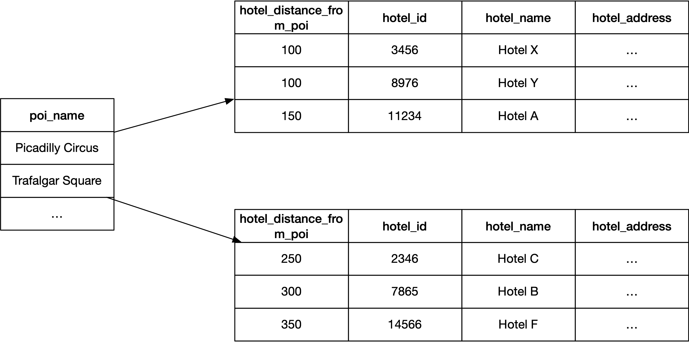

# 数据库和数据库原理
本章介绍了选择和使用数据库的原则。 为以下数据库类型提供了原则：

- 关系数据库
- 文档数据库
- 键值数据库
- 宽列数据库
- 搜索引擎

关系数据库也称为 ```SQL``` 数据库，因为访问关系数据库是通过发出 ```SQL``` 语句发生的。 其他数据库类型的数据库被称为 ```NoSQL``` 数据库，因为它们要么根本不支持 ```SQL```，要么只支持 ```SQL``` 的一个子集，可能有一些添加和修改。

## 关系数据库

> 关系数据库是满足多种需求的多用途数据库。 如果你不了解对数据库的所有需求，请选择关系数据库。

例如，如果你不知道现在或将来需要什么样的数据库查询，你应该考虑使用非常适合不同类型查询的关系数据库。

### 关系数据库的结构

关系数据库中的数据按以下层次结构组织：

- 逻辑数据库/模式
  - 表
    - 列

表格由列和行组成。 数据库中的数据以行的形式存储在表中。 每一行都有一个表中每一列的值。 如果一行没有特定列的值，则使用特殊的 ```NULL``` 值。 你可以指定列是否允许空值。

微服务应该有一个单一的逻辑数据库（或模式）。 有些关系数据库默认有一个逻辑数据库（或模式）可用，而在其他数据库中，你必须自己创建一个逻辑数据库（或模式）。

### 使用对象关系映射器（```ORM```）原理

> 使用对象关系映射器 (```ORM```) 来避免编写 ```SQL``` 的需要，并避免使你的微服务可能容易受到 ```SQL``` 注入攻击。 使用 ```ORM``` 将数据库行自动映射到可以序列化为 ```JSON``` 的对象。

许多语言都有 ```ORM``` 框架。 例如，```Java``` 有 ```Java Persistence API```（```JPA```，最著名的实现是 ```Hibernate```），```JavaScript/TypeScript``` 有 ```TypeORM```，```Python``` 有 ```Django``` 框架。

```ORM``` 使用实体作为数据库模式的构建块。 微服务中的每个实体类都反映为数据库中的表。 对实体和数据库表使用相同的名称，但表名应该是复数。 下面是 ```SalesItem``` 实体类的示例：

```SalesItem.java```

```java
@Entity
public class SalesItem {
  private Long id;
  private String name;
  private Integer price;
}
```

将 ```SalesItem``` 实体存储在名为 ```salesitems``` 的表中。 在本书中，我使用了不区分大小写的数据库标识符，并且所有的标识符都以小写形式书写。 数据库是否区分大小写取决于数据库及其运行的操作系统。 例如，```MySQL``` 仅在 ```Linux``` 系统上区分大小写。

实体的属性映射到实体表的列，这意味着 ```salesitems``` 表具有以下列：

- ```ID```
- 姓名
- 价格

每个实体表都必须定义一个主键。 表中每一行的主键必须是唯一的。 在下面的示例中，我们使用 ```@Id``` 注释将 ```id``` 列定义为包含每行唯一值的主键。 ```@GeneratedValue``` 注解定义数据库应该使用提供的策略自动为 ```id``` 列生成一个值。

```SalesItem.java```

```java
@Entity
@Table(name = "salesitems")
public class SalesItem {
  @Id
  @GeneratedValue(strategy = GenerationType.IDENTITY)
  private Long id;

  private String name;
  private Integer price;
}
```

```ORM``` 可以根据代码中的实体规范创建数据库表。 以下是 ```ORM``` 生成的 ```PostgreSQL``` 示例 ```SQL``` 语句，用于创建用于存储 ```SalesItem``` 实体的表：

```sql
CREATE TABLE salesitems (
  id BIGINT GENERATED ALWAYS AS IDENTITY,
  name TEXT,
  price INTEGER,
  PRIMARY KEY (id)
);
```

表的列可以指定为唯一且不可为空。 默认情况下，列可以为空并且不是唯一的。 下面是一个示例，我们定义了 salesitems 表中的名称列不能有空值，并且值必须是唯一的。 我们不想存储具有空名称的销售项目，我们希望存储具有唯一名称的销售项目。

```SalesItem.java```

```java
@Entity
@Table(name = "salesitems")
public class SalesItem {
  @Id
  @GeneratedValue(strategy = GenerationType.IDENTITY)
  private Long id;
    
  @Column(unique=true, nullable=false)
  private String name;
    
  private Integer price;
}
```

当你有一个 ```SalesItem``` 实体时，你可以使用 ```JPA``` 的 ```EntityManager``` 实例来持久化它：

```java
entityManager.persist(salesItem);
```

```JPA``` 将代表你生成所需的 ```SQL``` 语句并执行它。 下面是一个由 ```ORM``` 生成的用于保存销售项目的示例 ```SQL``` 语句（请记住，数据库会自动生成 ```id``` 列）。

```sql
INSERT INTO salesitems (name, price)
VALUES ('Sample sales item', 10);
```

你可以在数据库中搜索创建的销售项目（假设这里我们定义了一个 ```getId getter```）：

```java
entityManager.find(SalesItem.class, salesItem.getId());
```


对于上述操作，```ORM``` 会生成如下 ```SQL``` 查询：

```sql
SELECT id, name, price FROM salesitems WHERE id = 1;
```

然后你可以修改实体并将其与实体管理器合并以更新数据库：

```java
salesItem.setPrice(20);
entityManager.merge(salesItem);
```

最后，你可以使用实体管理器删除销售项目：

```java
entityManager.remove(salesItem);
```

```ORM``` 将执行以下 ```SQL``` 语句：

```sql
DELETE FROM salesitems WHERE id = 1;
```

假设你的微服务执行的 ```SQL``` 查询不包含查询的 ```WHERE``` 子句中的主键列。 在这种情况下，数据库引擎必须执行全表扫描以找到需要的行。 假设你想查询价格低于 10 的销售商品。这可以通过以下查询来实现：

```java
// final var price = ...

final TypedQuery<SalesItem> salesItemsQuery = entityManager
 .createQuery("SELECT s FROM salesitems s WHERE s.price < :price",
              SalesItem.class);

usersSalesItemsQuery.setParameter("price", price);

final List<SalesItem> salesItems = salesItemsQuery.getResultList();
```

数据库引擎必须执行全表扫描以查找价格列的值低于价格变量值的所有销售项目。 如果数据库很大，这可能会很慢。 如果你经常执行上述查询，你应该通过创建索引来优化这些查询。 为了使上述查询更快，我们必须使用 ```@Table``` 注释中的 ```@Index``` 注释为价格列创建索引：

```SalesItem.java```

```java
@Entity
@Table(
  name = "salesitems",
  indexes = @Index(columnList = "price")
)
public class SalesItem {
  @Id
  @GeneratedValue(strategy = GenerationType.IDENTITY)
  private Long id;
    
  @Column(unique=true, nullable=false)
  private String name;
    
  private Integer price;
}
```

### 实体/表关系
关系数据库中的表可以与其他表有关系。 存在三种类型的关系：

- 一对一
- 一对多
- 多对多

#### 一对一/多关系
在本节中，我们重点关注一对一和一对多关系。 在一对一关系中，一个表中的一行可以与另一个表中的另一行有关系。 在一对多关系中，一个表中的单行可以与另一个表中的多行有关系。

让我们举一个订单服务的例子，它可以将订单存储在数据库中。 每个订单由一个或多个订单项目组成。 订单项目包含有关购买的销售项目的信息。

```java
@Entity
@Table(name = "orders")
public class Order {
  @Id
  @GeneratedValue(strategy = GenerationType.IDENTITY)
  private Long id;
  
  // Other order fields ...

  @OneToMany(mappedBy="order")
  private List<OrderItem> orderItems;
}

@Entity
@Table(name = "orderitems")
public class OrderItem {
  @Id
  @GeneratedValue(strategy = GenerationType.IDENTITY)
  private Long id;
  
  @OneToOne
  @JoinColumn(name = "salesitemid")
  private SalesItem salesItem;

  @ManyToOne
  @JoinColumn(name = "orderid", nullable = false)
  private Order order;
}
```

订单存储在 ```orders``` 表中，订单项存储在 ```orderitems``` 表中，其中包含一个名为 ```orderid``` 的连接列。 使用此连接列，我们可以将特定订单项映射到特定订单。 每个订单项目恰好映射到一个销售项目。 为此，```orderitems``` 表还包含一个名为 ```salesitemid``` 的连接列。 使用此连接列，我们可以将订单项映射到销售项。

下面是 ```ORM``` 生成的用于创建 ```orderitems``` 表的 ```SQL``` 语句。 一对一和一对多关系反映在外键约束中：

- ```fksalesitem：orderitems``` 表中的 ```salesitemid``` 列值引用 ```salesitems``` 表中的 ```id``` 列值
- ```fkorder：orderitems``` 表中的 ```orderid``` 列值引用 ```orders``` 表中的 ```id``` 列值

```sql
CREATE TABLE orderitems (
  id BIGINT GENERATED ALWAYS AS IDENTITY,
  salesitemid BIGINT,
  orderid BIGINT,
  CONSTRAINT fksalesitem FOREIGN KEY (salesitemid)
    REFERENCES salesitems(id),
  CONSTRAINT fkorder FOREIGN KEY (orderid)
    REFERENCES orders(id)
);
```

```ORM``` 执行以下 ```SQL``` 查询以获取 ```ID``` 为 ```123``` 的订单及其订单项：

```sql
SELECT o.id, s.name, ...
FROM orders o 
LEFT JOIN orderitems oi ON o.id = oi.orderid
LEFT JOIN salesitems s ON s.id = oi.salesitemid
WHERE o.id = 123;
```

#### 多对多关系

在多对多关系中，一个实体与许多另一种类型的实体有关系，而这些实体又与许多第一种实体类型的实体有关系。 例如，一个学生可以参加很多课程，而一门课程可以有很多学生参加。

假设我们有一项服务将学生和课程实体存储在数据库中。 每个学生实体都包含学生参加过的课程。 同样，每个课程实体都包含已参加该课程的学生列表。 我们有一个多对多的关系，一个学生可以参加多门课程，多个学生可以参加一门课程。 这意味着必须创建一个额外的映射表 ```studentcourse```。 这个新表将特定学生映射到特定课程。 下面是用 ```JPA``` 实现的多对多关系：

```java
@Entity
@Table(name = "students")
class Student {
  @Id
  @GeneratedValue(strategy = GenerationType.IDENTITY)
  private Long id;

  // Other Student fields...

  @JoinTable(
    name = "studentcourse", 
    joinColumns = @JoinColumn(name = "studentid"), 
    inverseJoinColumns = @JoinColumn(name = "courseid")
  )
  @ManyToMany
  private List<Course> attendedCourses;
}

@Entity
@Table(name = "courses")
class Course {
  @Id
  @GeneratedValue(strategy = GenerationType.IDENTITY)
  private Long id;

  // Other Course fields...

  @ManyToMany(mappedBy = "attendedCourses")
  private List<Student> students;
}
```

除了 ```studentcourse``` 映射表之外，```ORM``` 还创建了 ```students``` 和 ```courses``` 表：

```sql
CREATE TABLE studentcourse (
  studentid BIGINT,
  courseid BIGINT,
  CONSTRAINT fkstudent FOREIGN KEY (studentid)
    REFERENCES students(id),
  CONSTRAINT fkorder FOREIGN KEY (courseid)
    REFERENCES courses(id)
);
```

下面是一个 ```SQL``` 查询示例，```ORM``` 执行该查询以获取 ```ID``` 为 ```123``` 的用户的已参加课程：

```sql
SELECT s.id, c.id, ...
FROM students s 
LEFT JOIN studentcourse sc ON s.id = sc.studentid
LEFT JOIN courses c ON c.id = sc.courseid
WHERE s.id = 123;
```

以下是 ```ORM``` 执行的 ```SQL``` 查询示例，用于获取 ```ID``` 为 ```123``` 的课程的学生：

```sql
SELECT c.id, s.id
FROM courses c
LEFT JOIN studentcourse sc ON c.id = sc.courseid
LEFT JOIN students s ON s.id = sc.studentid
WHERE c.id = 123;
```

在现实生活中，我们不一定必须或不应该在单个微服务中实现多对多数据库关系。 例如，上面处理学生和课程的服务违反了单一责任原则。 我们应该为学生创建一个单独的微服务，为课程创建一个单独的微服务。 那么单个微服务中的数据库表之间就不会存在多对多的关系。

### 使用参数化 ```SQL``` 语句原则
> 如果你没有使用 ```ORM``` 进行数据库访问，请使用参数化 ```SQL``` 语句来防止潜在的 ```SQL``` 注入攻击。

让我们将 ```Node.js``` 和 ```mysql NPM``` 库用于参数化 ```SQL``` 示例。 首先，让我们向 ```salesitems``` 表中插入数据：

```js
// Create a connection...

connection.query(
  `INSERT INTO salesitems (name, price)
   VALUES (?, ?)`,
  ['Sample sales item', 10]
);
```

问号 (```?```) 是参数化 ```SQL``` 查询中参数的占位符。 查询方法的第二个参数包含参数值。 当数据库引擎接收到参数化查询时，它将用提供的参数值替换查询中的占位符。

接下来，我们可以更新 ```salesitems``` 表中的一行。 以下示例将 ```ID``` 为 ```123``` 的销售商品的价格更改为 ```20```：

```js
connection.query('UPDATE salesitems SET price = ? WHERE id = ?', [20, 123]);
```

让我们执行一条 ```SELECT``` 语句来获取价格超过 ```20``` 的销售商品：

```js
connection.query(
  'SELECT id, name, price FROM salesitems WHERE price >= ?',
  [20]
);
```

在 ```SQL SELECT``` 语句中，不能到处使用参数。 你可以将它们用作 ```WHERE``` 子句中的值占位符。 如果要在 ```SQL SELECT``` 语句的其他部分使用用户提供的数据，则需要使用字符串连接。 你不应该在没有清理的情况下连接用户提供的数据，因为这会打开 ```SQL``` 注入攻击的可能性。 假设你允许微服务客户端指定一个排序列：

```js
const sortColumn = // Unvalidated data got from client
const sqlQuery = 'SELECT id, name, price FROM salesitems ORDER BY ' + connection.escapeId(sortColumn);

connection.query(sqlQuery);
```

如上所示，你需要对 ```sortColumn``` 值进行转义，以便它只包含 ```MySQL``` 列名的有效字符。 如果你需要从客户端获取排序方向，你应该验证该值是 ```ASC``` 还是 ```DESC```。 在下面的示例中，我们假设存在一个 ```validateSortDirection``` 函数：

```typescript
const sortColumn = // Unvalidated data got from client
const sortDirection = // Unvalidated data got from client

// throws if invalid sorting direction
const validatedSortDirection =
  validateSortDirection(sortDirection); 

const sqlQuery = `
  SELECT id, name, price
  FROM salesitems
  ORDER BY 
  ${connection.escapeId(sortColumn)}
  ${validatedSortDirection}
`;

connection.query(sqlQuery);
```

当你从客户端获取 ```MySQL``` 查询的 ```LIMIT``` 子句的值时，你必须验证这些值是否为整数且在有效范围内。 不要让客户提供随机的、非常大的值。 在下面的示例中，我们假设存在两个验证函数：```validateRowOffset``` 和 ```validateRowCount```。 如果验证失败，验证函数将抛出。

```typescript
const rowOffset = // Unvalidated data got from client
const rowCount = // Unvalidated data got from client

const validatedRowOffset = validateRowOffset(rowOffset);
const validatedRowCount = validateRowCount(rowCount);

const sqlQuery = `
  SELECT id, name, price
  FROM salesitems
  LIMIT ${validatedRowOffset}, ${validatedRowCount}
`;

connection.query(sqlQuery);
```


当你从客户端获得所需列名称的列表时，你必须验证它们中的每一个都是有效的列标识符：

```typescript
const columnNames = // Unvalidated data got from client

const escapedColumnNames =
  columnNames.map(columnName => connection.escapedId(columnName));

const sqlQuery =
  `SELECT ${escapedColumnNames.join(', ')} FROM salesitems`;

connection.query(sqlQuery);
```

### 规范化规则
> 将规范化规则应用于你的数据库设计。

下面列出了三个最基本的规范化规则：

- 第一范式 (```1NF```)
- 第二范式 (```2NF```)
- 第三范式 (```3NF```)

如果数据库关系满足第一、第二和第三范式，则通常将其描述为"规范化"。

#### 第一范式 (```1NF```)

第一范式要求在行和列的每个交叉点都存在一个值，而不是值列表。 在考虑销售项目时，第一范式规定价格列中不能有两个不同的价格值，名称列中的销售项目不能有多个名称。 如果你需要为一个销售项目使用多个名称，则必须在 ```SalesItem``` 实体和 ```SalesItemName``` 实体之间建立一对多关系。 这实际上意味着你从 ```SalesItem``` 实体类中删除名称属性并创建一个新的 ```SalesItemName``` 实体类用于存储销售项目的名称。 然后在 ```SalesItem``` 实体和 ```SalesItemName``` 实体之间创建一对多映射。

#### 第二范式 (```2NF```)
第二范式要求每个非键列完全依赖于主键。 假设我们在 ```orderitems``` 表中有以下列：

- ```orderid```（主键）
- ```productid```（主键）
- 订单状态

```orderstate``` 列只依赖于 ```orderid``` 列，而不是整个主键。 ```orderstate``` 列在错误的表中。 当然，它应该在订单表中。

#### 第三范式 (```3NF```)

第三范式要求非键列相互独立。

假设我们在 ```salesitems``` 表中有以下列：

- ```id```（主键）
- 姓名
- 价格
- 类别
- 折扣

假设折扣取决于类别。 该表违反了第三范式，因为非键列 ```discount``` 依赖于另一个非键列 ```category```。 列独立性意味着你可以更改任何非键列值而不影响任何其他列。 如果更改类别，则折扣也需要相应更改，从而违反了第三范式规则。

应将折扣列移至包含以下列的新类别表：

- ```id```（主键）
- 姓名
- 折扣

然后我们应该更新 ```salesitems``` 表以包含以下列：

- ```id```（主键）
- 姓名
- 价格
- ```categoryid```（引用类别表中 ```id``` 列的外键）

## 文档数据库原则
> 在完整文档（例如 ```JSON``` 对象）通常作为一个整体存储和检索的情况下使用文档数据库。

文档数据库，如 ```MongoDB```，对于存储完整的文档很有用。 文档通常是一个 ```JSON``` 对象，包含数组和嵌套对象中的信息。 文档就这样存储，查询时将获取整个文档。

让我们考虑一个销售项目的微服务。 每个销售项目都包含一个 ```ID```、名称、价格、图像 ```URL``` 和用户评论。

下面是一个作为 ```JSON``` 对象的销售项目示例：

```json
{
  "id": "507f191e810c19729de860ea",
  "category": "Power tools",
  "name": "Sample sales item",
  "price": 10,
  "imageUrls": ["https://url-to-image-1...",
                "https://url-to-image-2..."],
  "averageRatingInStars": 5,
  "reviews": [
     {
       "reviewerName": "John Doe",
       "date": "2022-09-01",
       "ratingInStars": 5, 
       "text": "Such a great product!"
     }
  ]
}
```

文档数据库通常对单个文档有大小限制。 因此，上面的示例没有直接在文档中存储销售项目图像，而是仅存储图像的 ```URL```。 实际图像存储在另一个更适合存储图像的数据存储中，如 ```Amazon S3```。

在为销售项目创建微服务时，我们可以选择文档数据库，因为我们通常存储和访问整个文档。 创建销售项目时，它们将创建为上述形状的 ```JSON``` 对象，其中 ```reviews``` 数组为空。 获取销售项目时，将从数据库中检索整个文档。 当客户添加对销售项目的评论时，将从数据库中提取销售项目。 新评论附加到评论数组，计算新的平均评分，最后，修改后的文档被持久化。

下面是将一个销售项目插入名为 ```salesItems``` 的 ```MongoDB``` 集合的示例。 ```MongoDB``` 使用术语集合而不是表。 一个 ```MongoDB``` 集合可以存储多个文档。

```json
db.salesItems.insertOne({
  category: "Power tools",
  name: "Sample sales item",
  price: 10,
  images: ["https://url-to-image-1...",
             "https://url-to-image-2..."],
  averageRatingInStars: null,
  reviews: []
})
```

你可以使用以下查询查找电动工具类别的销售商品：

```json
db.salesItems.find({ category: "Power tools" })
```

如果客户通常按类别查询销售商品，明智的做法是为该字段创建索引：

```json
// 1 means ascending index, -1 means descending index
db.salesItems.createIndex( { category: 1 } )
```

当客户想要为销售项目添加新评论时，你首先获取销售项目的文档：

```json
db.salesItems.find({ _id: ObjectId("507f191e810c19729de860ea") })
```

然后使用现有评级和新评级计算 ```averageRatingInStars``` 字段的新值，并将新评论添加到评论数组，然后使用以下命令更新文档：

```json
db.salesItems.updateOne(
  { _id: ObjectId("507f191e810c19729de860ea")  },
  { averageRatingInStars: 5,
  $push: { reviews: {
    reviewerName: "John Doe",
    date: "2022-09-01",
    ratingInStars: 5,
    text: "Such a great product!"
  }}
)
```

客户可能希望检索按平均评级降序排列的销售项目。 出于这个原因，你可能希望将索引更改为以下内容：

```json
db.salesItems.createIndex( { category: 1, averageStarCount: -1 } )
```

例如，客户可以发出获取电动工具类别中评级最高的销售商品的请求。 此请求可以通过以下使用上述创建的索引的查询来满足：

```json
db.salesItems
  .find({ category: "Power tools" })
  .sort({ averageStarCount: -1 })
```

## 键值数据库原则
> 使用键值数据库可以快速实时访问键存储的数据。 键值存储通常将数据存储在内存中，并具有持久性的可能性。

键值数据库的一个简单用例是将其用作关系数据库的缓存。 例如，微服务可以将来自关系数据库的 ```SQL``` 查询结果存储在缓存中。 ```Redis``` 是一种流行的开源键值存储。 让我们举一个使用 ```JavaScript``` 和 ```Redis``` 缓存 ```SQL``` 查询结果的例子。 在下面的示例中，我们假设 ```SQL``` 查询结果作为 ```JavaScript``` 对象提供：

```javascript
redisClient.set(sqlQueryStatement, JSON.stringify(sqlQueryResult));
```

可以从 ```Redis``` 中获取缓存的 ```SQL``` 查询结果：

```javascript
const sqlQueryResultJson = redisClient.get(sqlQueryStatement);
```

使用 Redis，你可以创建在特定时间后自动过期的键值对。 如果你使用键值数据库作为缓存，这是一个有用的特性。 你可能希望缓存的项目在一段时间后过期。

除了纯字符串，```Redis``` 还支持其他数据结构。 例如，你可以为键存储列表、队列或哈希映射。 如果将队列存储在 ```Redis``` 中，则可以将其用作简单的单一消费者消息代理。 下面是向消息代理中的主题生成消息的示例：

```javascript
// RPUSH command (= right push) pushes a new message
// to the end of the list identified by key _topic_.
redisClient.rpush(topic, message);
```

下面是在消息代理中使用来自主题的消息的示例：

```javascript
// LPOP command (= left pop) pops a message from
// the beginning of the list identified by key _topic_
// The LPOP command removes the value from the list
const message = redisClient.lpop(topic);
```

## 宽列数据库原则
> 当你知道需要执行哪些查询并且希望这些查询速度快时，请使用宽列数据库。

宽列数据库的表结构针对特定查询进行了优化。 对于宽列数据库，存储重复数据可以加快查询速度。 宽列数据库也可以很好地水平扩展。

在本节中，我们使用 ```Apache Cassandra``` 作为示例宽列数据库。 ```Cassandra``` 是一个可扩展的多节点数据库引擎。 在 ```Cassandra``` 中，表的数据根据表的分区键划分为分区。 分区键由表的一个或多个列组成。 每个分区都存储在单个 ```Cassandra``` 节点上。 你可以认为 ```Cassandra``` 是一个键值存储，其中键是分区键，值是另一个"嵌套"表。 "嵌套"表中的行由默认按升序排序的集群列唯一标识。 如果需要，可以将排序顺序更改为降序。

分区键和集群列构成了表的主键。 主键唯一标识一行。 让我们有一个示例表，用于存储特定兴趣点 (```POI```) 附近的酒店：

```sql
CREATE TABLE hotels_by_poi (
  poi_name text,
  hotel_distance_in_meters_from_poi int,
  hotel_id uuid,
  hotel_name text,
  hotel_address text,
  PRIMARY KEY (poi_name, hotel_distance_in_metersfrom_poi, hotel_id)
);
```

在上面的示例中，主键由三列组成。 第一列 (```poi_name```) 始终是分区键。 分区键必须在查询中给出。 否则查询会很慢，因为 ```Cassandra``` 必须进行全表扫描，因为它不知道数据位于哪个节点。 当在 ```SELECT``` 语句的 ```WHERE``` 子句中给出分区键时，```Cassandra``` 可以找到该特定分区的数据所在的适当节点。 另外两个主键列 ```hotel_distance_in_meters_from_poi``` 和 ```hotel_id``` 是聚类列。 它们定义"嵌套"表中行的顺序和唯一性。



上图显示，当你提供分区键值 (```poi_name```) 时，你可以访问相应的"嵌套"表，其中行首先按 ```hotel_distance_in_meters_from_poi```（升序）排序，其次按 ```hotel_id```（升序）排序。

现在酒店客房预订客户端可以很容易地要求服务器执行查询以查找用户提供的 ```POI``` 附近的酒店。 以下查询将返回距离皮卡迪利广场 ```POI``` 最近的前 ```15``` 家酒店：

```sql
SELECT 
  hotel_distance_in_meters_from_poi,
  hotel_id,
  hotel_name,
  hotel_address
FROM hotels_by_poi
WHERE poi_name = 'Piccadilly Circus'
LIMIT 15
```

当用户从上述查询结果中选择特定酒店时，客户端可以请求执行另一个查询以获取有关所选酒店的信息。 用户想要查看所选酒店附近的其他 ```POI```。 对于该查询，我们应该创建另一个表：

```sql
CREATE TABLE pois_by_hotel_id (
  hotel_id uuid,
  poi_distance_in_meters_from_hotel int,
  poi_id uuid,
  poi_name text,
  poi_address text,
  PRIMARY KEY (hotel_id, poi_distance_in_meters_from_hotel, poi_id)
);
```

现在客户端可以请求服务器执行查询以获取所选酒店最近的 ```20``` 个 ```POI```。 （酒店编号为 ```c5a49cb0-8d98-47e3-8767-c30bc075e529```）：

```sql
SELECT
  poi_distance_in_meters_from_hotel,
  poi_id,
  poi_name,
  poi_address
FROM pois_by_hotel_id 
WHERE hotel_id = c5a49cb0-8d98-47e3-8767-c30bc075e529
LIMIT 20
```

在现实场景中，用户想要在选定的时间段内搜索特定 ```POI``` 附近的酒店。 服务器应响应最近的酒店，在选定的时间段内有免费房间。 对于这种查询，我们创建了一个额外的表来存储酒店房间的可用性：

```sql
CREATE TABLE availability_by_hotel_id (
  hotel_id uuid,
  accommodation_date date,
  available_room_count counter,
  PRIMARY KEY (hotel_id, accommodation_date)
);
```

每当特定日期的房间被预订或房间预订被取消时，上表就会更新。 ```available_room_count``` 列值在更新过程中递减或递增 ```1```。

假设已执行以下查询：

```sql
SELECT
  hotel_distance_in_meters_from_poi,
  hotel_id,
  hotel_name,
  hotel_address
FROM hotels_by_poi 
WHERE poi_name = 'Piccadilly Circus'
LIMIT 30
```

接下来，我们应该从 ```2022 年 9 月 1 日```到 ```2022 年 9 月 3 日```之间有空房的 ```30``` 家酒店的结果中找到酒店。我们不能在 ```Cassandra``` 中使用连接，但我们可以执行以下查询，我们专门列出返回的酒店 ```ID``` 通过上面的查询：

```sql
SELECT hotel_id, MIN(available_room_count)
FROM availability_by_hotel_id 
WHERE hotel_id IN (List the 30 hotel_ids here...) AND
      accommodation_date >= '2022-09-01' AND
      accommodation_date <= '2022-09-03'
GROUP BY hotel_id
LIMIT 15
```

作为上述查询的结果，我们有最多 ```15``` 家酒店的列表，其中列出了最少可用房间数。 我们可以向用户返回最多 ```15``` 家酒店的列表，其中最少可用房间数为一个或多个。

如果 ```Cassandra``` 的 ```CQL``` 语言支持目前不支持的 ```HAVING``` 子句，我们可以发出以下查询来获得我们想要的：

```sql
SELECT hotel_id, MIN(available_room_count)
FROM availability_by_hotel_id 
WHERE hotel_id IN (List the 30 hotel_ids here...) AND
      accommodation_date >= '2022-09-01' AND
      accommodation_date <= '2022-09-03'
GROUP BY hotel_id
HAVING MIN(available_room_count) >= 1
LIMIT 15
```

宽列数据库也可用于存储来自 ```IoT``` 设备和传感器的时间序列数据。 下面是用于在电信网络分析系统中存储测量数据的表定义：

```sql
CREATE TABLE measurements (
  measure_name text,
  dimension_name text,
  aggregation_period text,
  measure_timestamp timestamp,
  measure_value double,
  dimension_value text,
  PRIMARY KEY ((measure_name, dimension_name, aggregation_period),
               measure_timestamp,
               measure_value,
               dimension_value)
) WITH CLUSTERING ORDER BY (
  measure_timestamp DESC,
  measure_value DESC
  dimension_value ASC
);
```

在上表中，我们定义了一个包含三列的复合分区键：```measure_name```、```dimension_name``` 和 ```aggregation_period```。 复合分区键的列在括号中给出。

假设我们已经实现了一个可视化测量的客户端。 在客户端中，用户可以首先选择要可视化的计数器/```KPI```（= 度量名称），然后选择维度和聚合周期。 假设用户希望查看在 ```2022-02-03 16:00``` 为一分钟时间段计算的单元格的 ```dropped_call_percentage```。 可以执行以下类型的查询：

```sql
SELECT measure_value, dimension_value 
FROM measurements
WHERE measure_name = 'dropped_call_percentage' AND
      dimension_name = 'cell' AND
      aggregation_period = '1min' AND
      measureTimestamp = '2022-02-03T16:00+0000'
LIMIT 50;
```

上面的查询返回前 ```50``` 个单元格，其中掉话百分比在给定分钟内最高。

我们可以创建另一个表来保存选定维度值的测量值，例如，特定单元格 ```ID```。 该表可用于向下钻取到特定维度并查看历史记录中的度量值。

```sql
CREATE TABLE measurements_by_dimension (
  measure_name text,
  dimension_name text,
  aggregation_period text,
  dimension_value text,
  measure_timestamp timestamp,
  measure_value double,
  PRIMARY KEY ((measure_name,
                dimension_name,
                aggregation_period,
                dimension_value), measure_timestamp)
) WITH CLUSTERING ORDER BY (measureTimestamp DESC);
```

以下查询将为小区 ```ID 3000``` 标识的小区返回最近 ```30``` 分钟的掉线百分比值：

```sql
SELECT measure_value, measureTimestamp
FROM measurements_by_dimension
WHERE measure_name = 'dropped_call_percentage' AND
      dimension_name = 'cell' AND
      aggregation_period = '1min' AND
      dimension_value = '3000'
LIMIT 30;
```

## 搜索引擎原则

> 如果你有用户应该能够查询的自由格式文本数据，请使用搜索引擎。

搜索引擎（例如 ```Elasticsearch```）可用于存储信息，例如从微服务收集的日志条目。 你通常希望通过日志消息中的文本搜索收集的日志数据。

当你需要搜索文本数据时，没有必要使用搜索引擎。 其他数据库，包括文档数据库和关系数据库，都有一种特殊的索引类型，可以索引列中的自由格式文本数据。 考虑前面的 ```MongoDB``` 示例，我们可能希望客户端能够通过销售项目名称中的文本搜索销售项目。 我们不需要将销售项目存储在搜索引擎数据库中。 我们可以继续将它们存储在文档数据库（```MongoDB```）中，并为名称字段引入文本类型索引。 可以使用以下 ```MongoDB``` 命令创建该索引：

```sql
db.salesItems.createIndex( { name: "text" } )