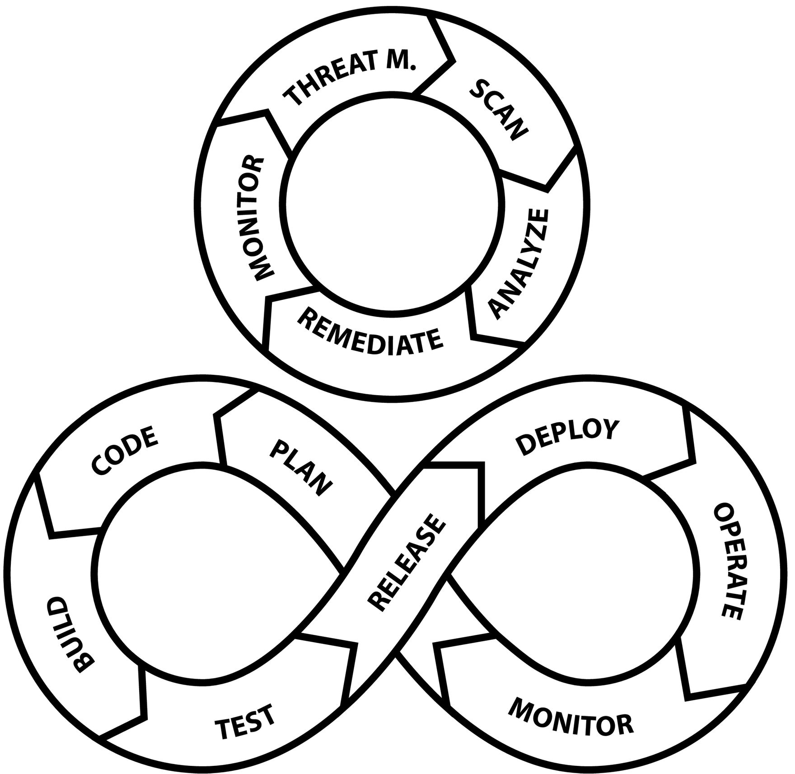

# 开发安全运维
```DevOps``` 描述了集成软件开发 (```Dev```) 和软件操作 (```Ops```) 的实践。 它旨在通过开发并行化和自动化来缩短软件开发生命周期，并提供高质量软件的持续交付。 ```DevSecOps``` 通过将安全方面添加到软件生命周期来增强 ```DevOps```。



软件开发组织负责规划、设计和实施软件可交付成果。 软件运维将软件部署到 ```IT``` 基础设施和平台。 他们监控部署的软件以确保其运行无问题。 软件运维还通过错误报告和增强想法向软件开发组织提供反馈。

## 安全运维生命周期

```SecOps``` 生命周期分为以下几个阶段：

- 威胁建模
  找出需要什么样的安全功能和测试
  实施威胁对策和缓解措施。 这方面在前面的安全原则章节中有更详细的介绍
- 扫描
  - 静态安全分析（也称为 ```SAST``` = 静态应用程序安全测试）
  - 安全测试（也称为 ```DAST``` = 动态应用程序安全测试）
  - 容器漏洞扫描
- 分析
  - 分析扫描阶段的结果，检测并消除误报并优先修复漏洞
- 修复
  根据优先级修复发现的漏洞
- 监控
  - 定义与 ```SecOps``` 相关的指标并监控它们

## 开发运维生命周期

```DevOps``` 生命周期分为以下几个阶段：

- 计划
- 代码
- 建造
- 测试
- 发布
- 部署
- 操作
- 监控

后续部分将更详细地描述每个阶段。

### 计划
计划是 ```DevOps``` 生命周期的第一个阶段。 在此阶段，规划软件功能，设计高层架构和用户体验。 此阶段涉及业务（产品管理）和软件开发组织。

### 代码

代码是软件实现阶段。 它包括软件组件的设计和实现、编写单元测试、集成测试、端到端测试和其他自动化测试。 此阶段还包括使软件可部署所需的所有其他编码。 大部分工作都在这个阶段完成，所以应该尽可能精简。

缩短这个阶段的关键是最大限度地并行化一切。 在计划阶段，软件在架构上被分成更小的部分（微服务），不同的团队可以并行开发这些部分。 关于开发单个微服务，也应该有尽可能多的并行化。 这意味着，如果一个微服务可以拆分成多个子域，那么这些子域的开发就可以非常并行地完成。 如果我们考虑数据导出器微服务，我们会确定几个子域：输入、解码、转换、编码和输出。 如果可以并行开发这五个子域，则可以大大缩短完成微服务实施所需的时间。

为了进一步缩短这个阶段，一个团队应该有一个专门的测试自动化开发人员，他可以在与实施并行的早期阶段开始开发自动化测试。

提供高质量的软件依赖于高质量的设计、低技术债务的实现以及全面的功能和非功能测试。 所有这些方面都已在前面的章节中进行了处理。

### 构建和测试

构建和测试阶段应该自动化并作为持续集成 (```CI```) 管道运行。 软件系统中的每个软件组件都应该有自己的 ```CI``` 管道。 ```CI``` 管道由 ```Jenkins``` 或 ```Github Actions``` 等 ```CI``` 工具运行。 ```CI``` 管道是使用存储在软件组件源代码存储库中的声明性代码定义的。 每次对源代码存储库中的主分支进行提交时，都应该触发 ```CI``` 管道运行。

软件组件的 ```CI``` 管道至少应执行以下任务：

- 从源代码库中检出最新的源代码
- 构建软件
- 执行静态代码分析。 可以使用像 ```SonarQube```/```SonarCloud``` 这样的工具
  - 执行静态应用程序安全测试 (```SAST```)。
- 执行单元测试
- 执行集成测试
- 执行动态应用程序安全测试 (DAST)。 可以使用像 OWASP ZAP 这样的工具
- 验证第 3 方许可合规性并提供材料清单 (BOM)。 可以使用像 Fossa 这样的工具

### 发布

在发布阶段，构建和测试的软件会自动发布。 软件组件的 ```CI``` 流水线执行成功后，软件组件可以自动发布。 这称为持续交付 (```CD```)。 持续交付通常与 ```CI``` 管道相结合，为软件组件创建 ```CI/CD``` 管道。 持续交付意味着软件组件的工件被交付到工件存储库，如 ```Artifactory```、```Docker Hub``` 或 ```Helm``` 图表存储库。

```CD``` 流水线应执行以下任务：

- 对构建容器镜像（例如 ```Dockerfile```）的代码执行静态代码分析。 像 ```Hadolint``` 这样的工具可以用于 ```Dockerfiles```。
- 为软件组件构建容器镜像
- 将容器镜像发布到容器注册表（例如，```Docker Hub```、```Artifactory``` 或你的云提供商提供的注册表）
- 执行容器镜像漏洞扫描
  - 请记住在你的容器注册表中定期启用容器漏洞扫描，也
- 对部署代码执行静态代码分析。 可以使用 ```Helm``` 的 ```lint``` 命令、```Kubesec``` 和 ```Checkov``` 等工具
- 打包并发布部署代码（例如打包```Helm chart```发布到```Helm chart```仓库）

### 示例 ```Dockerfile```

下面是一个用 ```TypeScript``` 为 ```Node.js``` 编写的微服务示例 ```Dockerfile```。 ```Dockerfile``` 使用了 ```Docker``` 的多阶段特性。 首先（在构建器阶段），它构建源代码，即将 ```TypeScript``` 源代码文件转换为 ```JavaScript``` 源代码文件。 然后（在中间阶段），它创建一个中间映像，从构建器阶段复制构建的源代码并仅安装生产依赖项。 最后一个阶段（最终）将文件从中间阶段复制到无发行版 ```Node.js``` 基础映像。 你应该使用 ```distroless``` 基础镜像来减小镜像大小和攻击面。 ```distroless``` 映像中不包含任何 ```Linux``` 发行版。

```Dockerfile```

```dockerfile
# syntax=docker/dockerfile:1

FROM node:18 as builder
WORKDIR /microservice
COPY package*.json ./
RUN  npm ci
COPY tsconfig*.json ./
COPY src ./src
RUN npm run build

FROM node:18 as intermediate
WORKDIR /microservice
COPY package*.json ./
RUN npm ci --only=production
COPY --from=builder /microservice/build ./build

FROM gcr.io/distroless/nodejs:18 as final
WORKDIR /microservice
USER nonroot:nonroot
COPY --from=intermediate --chown=nonroot:nonroot /microservice ./
CMD ["build/main"]
```

### ```Kubernetes``` 部署示例
下面是 ```Kubernetes``` 部署的示例 ```Helm``` 图表模板。 模板代码在双括号中给出。

```deployment.yaml```

```yaml
apiVersion: apps/v1
kind: Deployment
metadata:
  name: {{ include "microservice.fullname" . }}
  labels:
    {{- include "microservice.labels" . | nindent 4 }}
spec:
  {{- if ne .Values.nodeEnv "production" }}
  replicas: 1
  {{- end }}
  selector:
    matchLabels:
      {{- include "microservice.selectorLabels" . | nindent 6 }}
  template:
    metadata:
      {{- with .Values.deployment.pod.annotations }}
      annotations:
        {{- toYaml . | nindent 8 }}
      {{- end }}
      labels:
        {{- include "microservice.selectorLabels" . | nindent 8 }}
    spec:
      {{- with .Values.deployment.pod.imagePullSecrets }}
      imagePullSecrets:
        {{- toYaml . | nindent 8 }}
      {{- end }}
      serviceAccountName: {{ include "microservice.serviceAccountName" . }}
      containers:
        - name: {{ .Chart.Name }}
          image: "{{ .Values.imageRegistry }}/{{ .Values.imageRepository }}:{{ .Values.imageTag }}"
          imagePullPolicy: {{ .Values.deployment.pod.container.imagePullPolicy }}
          securityContext:
            {{- toYaml .Values.deployment.pod.container.securityContext | nindent 12 }}
          {{- if .Values.httpServer.port }}
          ports:
            - name: http
              containerPort: {{ .Values.httpServer.port }}
              protocol: TCP
          {{- end }}
          env:
            - name: NODE_ENV
              value: {{ .Values.nodeEnv }}
            - name: ENCRYPTION_KEY
              valueFrom:
                secretKeyRef:
                  name: {{ include "microservice.fullname" . }}
                  key: encryptionKey
            - name: MICROSERVICE_NAME
              value: {{ include "microservice.fullname" . }}
            - name: MICROSERVICE_NAMESPACE
              valueFrom:
                fieldRef:
                  fieldPath: metadata.namespace
            - name: MICROSERVICE_INSTANCE_ID
              valueFrom:
                fieldRef:
                  fieldPath: metadata.name
            - name: NODE_NAME
              valueFrom:
                fieldRef:
                  fieldPath: spec.nodeName
            - name: MYSQL_HOST
              value: {{ .Values.database.mySql.host }}
            - name: MYSQL_PORT
              value: "{{ .Values.database.mySql.port }}"
            - name: MYSQL_USER
              valueFrom:
                secretKeyRef:
                  name: {{ include "microservice.fullname" . }}
                  key: mySqlUser
            - name: MYSQL_PASSWORD
              valueFrom:
                secretKeyRef:
                  name: {{ include "microservice.fullname" . }}
                  key: mySqlPassword
          livenessProbe:
            httpGet:
              path: /isMicroserviceAlive
              port: http
            failureThreshold: 3
            periodSeconds: 10
          readinessProbe:
            httpGet:
              path: /isMicroserviceReady
              port: http
            failureThreshold: 3
            periodSeconds: 5
          startupProbe:
            httpGet:
              path: /isMicroserviceStarted
              port: http
            failureThreshold: {{ .Values.deployment.pod.container.startupProbe.failureThreshold }}
            periodSeconds: 10
          resources:
            {{- if eq .Values.nodeEnv "development" }}
            {{- toYaml .Values.deployment.pod.container.resources.development | nindent 12 }}
            {{- else if eq .Values.nodeEnv "integration"  }}
            {{- toYaml .Values.deployment.pod.container.resources.integration | nindent 12 }}
            {{- else }}
            {{- toYaml .Values.deployment.pod.container.resources.production | nindent 12 }}
            {{- end}}
      {{- with .Values.deployment.pod.nodeSelector }}
      nodeSelector:
        {{- toYaml . | nindent 8 }}
      {{- end }}
      {{- with .Values.deployment.pod.affinity }}
      affinity:
        podAntiAffinity:
          requiredDuringSchedulingIgnoredDuringExecution:
            - labelSelector:
                matchLabels:
                  app.kubernetes.io/name: {{ include "microservice.name" . }}
              topologyKey: "kubernetes.io/hostname"
        {{- toYaml . | nindent 8 }}
      {{- end }}
      {{- with .Values.deployment.pod.tolerations }}
      tolerations:
        {{- toYaml . | nindent 8 }}
      {{- end }}
```

上述模板中的值（由 ```.Values.<something>``` 表示）来自 ```values.yaml``` 文件。 下面是与上述 ```Helm``` 图表模板一起使用的示例 ```values.yaml``` 文件。

```values.yaml```

```yaml
imageRegistry: docker.io
imageRepository: pksilen2/backk-example-microservice
imageTag:
nodeEnv: production
auth:
  # Authorization Server Issuer URL
  # For example
  # http://keycloak.platform.svc.cluster.local:8080/auth/realms/<my-realm>
  issuerUrl:

  # JWT path where for user's roles,
  # for example 'realm_access.roles'
  jwtRolesClaimPath:
secrets:
  encryptionKey:
database:
  mySql:
    # For example:
    # my-microservice-mysql.default.svc.cluster.local or
    # cloud database host
    host:
    port: 3306
    user:
    password: &mySqlPassword ""
mysql:
  auth:
    rootPassword: *mySqlPassword
deployment:
  pod:
    annotations: {}
    imagePullSecrets: []
    container:
      imagePullPolicy: Always
      securityContext:
        privileged: false
        capabilities:
          drop:
            - ALL
        readOnlyRootFilesystem: true
        runAsNonRoot: true
        runAsUser: 65532
        runAsGroup: 65532
        allowPrivilegeEscalation: false
      env:
      startupProbe:
        failureThreshold: 30
      resources:
        development:
          limits:
            cpu: '1'
            memory: 768Mi
          requests:
            cpu: '1'
            memory: 384Mi
        integration:
          limits:
            cpu: '1'
            memory: 768Mi
          requests:
            cpu: '1'
            memory: 384Mi
        production:
          limits:
            cpu: 1
            memory: 768Mi
          requests:
            cpu: 1
            memory: 384Mi
    nodeSelector: {}
    tolerations: []
    affinity: {}
```

特别注意上述文件中的 ```deployment.pod.container.securityContext``` 对象。 它用于定义微服务容器的安全上下文。

默认情况下，安全上下文应如下所示：

- 容器不应该有特权
- 所有能力都被丢弃
- 容器文件系统是只读的
- 只允许非 ```root``` 用户在容器内运行
- 定义容器应在其下运行的非根用户和组
- 禁止权限升级

只有在微服务必需的情况下，你才能从上面的列表中删除内容。 例如，如果微服务出于某些正当理由必须写入文件系统，则不应将文件系统定义为只读。

### 示例 ```CI/CD``` 管道

下面是 ```Node.js``` 微服务的 ```GitHub Actions CI/CD``` 工作流程。 声明性工作流是用 ```YAML``` 编写的。 工作流文件应位于 ```.github/workflows``` 目录中的微服务源代码存储库中。 示例后更详细地描述了工作流中的步骤。

```yaml
name: CI/CD workflow
on:
  workflow_dispatch: {}
  push:
    branches:
      - main
    tags-ignore:
      - '**'
jobs:
  build:
    runs-on: ubuntu-latest
    name: Build with Node version 18
    steps:
      - name: Checkout Git repo
        uses: actions/checkout@v2

      - name: Setup Node.js
        uses: actions/setup-node@v2
        with:
          node-version: '18'
          cache: 'npm'

      - name: Install NPM dependencies
        run: npm ci

      - name: Lint source code
        run: npm run lint

      - name: Run unit tests with coverage
        run: npm run test:coverage

      - name: Setup integration testing environment
        run: docker-compose --env-file .env.ci up --build -d

      - name: Run integration tests
        run: scripts/run-integration-tests-in-ci.sh

      - name: OWASP ZAP API scan
        uses: zaproxy/action-api-scan@v0.1.0
        with:
          target: generated/openapi/openApiPublicSpec.yaml
          fail_action: true
          cmd_options: -I -z "-config replacer.full_list(0).description=auth1
                              -config replacer.full_list(0).enabled=true
                              -config replacer.full_list(0).matchtype=REQ_HEADER 
                              -config replacer.full_list(0).matchstr=Authorization
                              -config replacer.full_list(0).regex=false
                              -config 'replacer.full_list(0).replacement=Bearer ZXlK...aGJHZ='"

      - name: Tear down integration testing environment
        run: docker-compose --env-file .env.ci down -v

      - name: Static code analysis with SonarCloud scan
        uses: sonarsource/sonarcloud-github-action@v1.6
        env:
          GITHUB_TOKEN: ${{ secrets.GITHUB_TOKEN }}
          SONAR_TOKEN: ${{ secrets.SONAR_TOKEN }}

      - name: 3rd party software license compliance analysis with FOSSA
        uses: fossas/fossa-action@v1
        with:
          api-key: ${{ secrets.FOSSA_API_KEY }}
          run-tests: false

      - name: Lint Dockerfile
        uses: hadolint/hadolint-action@v1.6.0

      - name: Log in to Docker registry
        uses: docker/login-action@v1
        with:
          registry: docker.io
          username: ${{ secrets.DOCKER_REGISTRY_USERNAME }}
          password: ${{ secrets.DOCKER_REGISTRY_PASSWORD }}

      - name: Extract latest Git tag
        uses: actions-ecosystem/action-get-latest-tag@v1
        id: extractLatestGitTag

      - name: Set up Docker Buildx
        id: setupBuildx
        uses: docker/setup-buildx-action@v1

      - name: Cache Docker layers
        uses: actions/cache@v2
        with:
          path: /tmp/.buildx-cache
          key: ${{ runner.os }}-buildx-${{ github.sha }}
          restore-keys: |
            ${{ runner.os }}-buildx-

      - name: Extract metadata for building and pushing Docker image
        id: dockerImageMetadata
        uses: docker/metadata-action@v3
        with:
          images: ${{ secrets.DOCKER_REGISTRY_USERNAME }}/example-microservice
          tags: |
            type=semver,pattern={{version}},value=${{ steps.extractLatestGitTag.outputs.value }}

      - name: Build and push Docker image
        id: dockerImageBuildAndPush
        uses: docker/build-push-action@v2
        with:
          context: .
          builder: ${{ steps.setupBuildx.outputs.name }}
          push: true
          cache-from: type=local,src=/tmp/.buildx-cache
          cache-to: type=local,dest=/tmp/.buildx-cache
          tags: ${{ steps.dockerImageMetadata.outputs.tags }}
          labels: ${{ steps.dockerImageMetadata.outputs.labels }}

      - name: Docker image vulnerability scan with Anchore
        id: anchoreScan
        uses: anchore/scan-action@v3
        with:
          image: ${{ secrets.DOCKER_REGISTRY_USERNAME }}/example-microservice:latest
          fail-build: false
          severity-cutoff: high

      - name: Upload Anchore scan SARIF report
        uses: github/codeql-action/upload-sarif@v1
        with:
          sarif_file: ${{ steps.anchoreScan.outputs.sarif }}

      - name: Install Helm
        uses: azure/setup-helm@v1
        with:
          version: v3.7.2

      - name: Extract microservice version from Git tag
        id: extractMicroserviceVersionFromGitTag
        run: |
          value="${{ steps.extractLatestGitTag.outputs.value }}"
          value=${value:1}
          echo "::set-output name=value::$value"

      - name: Update Helm chart versions in Chart.yaml
        run: |
          sed -i "s/^version:.*/version: ${{ steps.extractMicroserviceVersionFromGitTag.outputs.value }}/g" helm/example-microservice/Chart.yaml
          sed -i "s/^appVersion:.*/appVersion: ${{ steps.extractMicroserviceVersionFromGitTag.outputs.value }}/g" helm/example-microservice/Chart.yaml

      - name: Update Docker image tag in values.yaml
        run: |
          sed -i "s/^imageTag:.*/imageTag: {{ steps.extractMicroserviceVersionFromGitTag.outputs.value }}@${{ steps.dockerImageBuildAndPush.outputs.digest }}/g" helm/example-microservice/values.yaml

      - name: Lint Helm chart
        run: helm lint -f helm/values/values-minikube.yaml helm/example-microservice

      - name: Static code analysis for Helm chart with Checkov
        uses: bridgecrewio/checkov-action@master
        with:
          directory: helm/example-microservice
          quiet: false
          framework: helm
          soft_fail: false

      - name: Upload Checkov SARIF report
        uses: github/codeql-action/upload-sarif@v1
        with:
          sarif_file: results.sarif
          category: checkov-iac-sca

      - name: Configure Git user
        run: |
          git config user.name "$GITHUB_ACTOR"
          git config user.email "$GITHUB_ACTOR@users.noreply.github.com"

      - name: Package and publish Helm chart
        uses: helm/chart-releaser-action@v1.2.1
        with:
          charts_dir: helm
        env:
          CR_TOKEN: "${{ secrets.GITHUB_TOKEN }}"
```

1. 检查微服务的 ```Git``` 存储库
2. 设置 ```Node.js``` 18
3. 安装 ```NPM``` 依赖项
4. ```Lint``` 源代码使用 ```npm run lint``` 命令，它使用 ```ESLint```
5. 执行单元测试并报告覆盖率
6. 使用 ```Docker``` 的 ```docker-compose up``` 命令设置集成测试环境。 执行命令后，构建微服务，并启动单独容器中的所有依赖项。 这些依赖项可以包括其他微服务，例如数据库和消息代理，如 ```Apache Kafka```
7. 执行集成测试。 该脚本将首先等待所有依赖项都已启动并准备就绪。 这种等待是使用 [dokku/wait](https://hub.docker.com/r/dokku/wait) 图像运行容器完成的。
8. 使用 ```OWASP ZAP API``` 扫描执行 ```DAST```。 对于扫描，我们定义了将针对其进行扫描的 ```OpenAPI 3.0``` 规范文件的位置。 我们还提供命令选项来为扫描发出的 ```HTTP``` 请求设置有效的授权标头
9. 拆除集成测试环境
10. 使用 ```SonarCloud``` 执行静态代码分析
11. 使用 ```FOSSA``` 检查第 3 方软件许可合规性
12. ```Lint``` ```Dockerfile```
13. 登录到 ```Docker``` 中心
14. 提取最新的 ```Git``` 标签以供进一步使用
15. 设置 ```Docker Buildx``` 并缓存 ```Docker``` 层
16. 提取元数据，例如用于构建和推送 ```Docker``` 镜像的标记和标签
17. 构建并推送 ```Docker``` 镜像
18. 使用 ```Anchore``` 执行 ```Docker``` 镜像漏洞扫描
19. 将 ```Anchore``` 扫描报告上传到 ```GitHub``` 存储库
20. 安装 ```Helm```
21. 从 ```Git``` 标签中提取微服务版本（去掉版本号前的```v```字母）
22. 使用 ```sed``` 命令替换 ```Helm chart``` 的 ```Chart.yaml``` 文件中的 ```Helm chart``` 版本
23. 更新 ```values.yaml``` 文件中的 ```Docker``` 镜像标签
24. ```Lint Helm chart``` 并对其执行静态代码分析
25. 将静态代码分析报告上传到 ```GitHub``` 仓库，为下一步进行 ```git``` 用户配置
26. 打包 ```Helm``` 图表并发布到 ```GitHub Pages```

上面的一些步骤是可并行的，但 ```GitHub Actions``` 工作流目前不支持作业中的并行步骤。 在 ```Jenkins``` 中，你可以使用并行块轻松并行化阶段。

你还可以在构建 ```Docker``` 映像时执行单元测试和 ```linting```，方法是将以下步骤添加到 ```Dockerfile``` 中的构建器阶段：

```dockerfile
RUN npm run lint
RUN npm run test:coverage
```

上述解决方案的问题是你无法清楚地了解构建失败的原因。 你必须检查 ```Docker``` 构建命令的输出以查看 ```linting``` 或单元测试是否失败。 此外，你不能再使用 ```SonarCloud GitHub Action```。 你必须在 ```Dockerfile``` 的构建器阶段实现 ```SonarCloud``` 报告（在完成单元测试后向 ```SonarCloud``` 报告单元测试覆盖率）。

### 部署
在部署阶段，发布的软件会自动部署。 成功运行 ```CI/CD``` 管道后，可以自动部署软件组件。 这称为持续部署 (```CD```)。 请注意，持续交付和持续部署都缩写为 ```CD```。 这可能会导致不幸的误解。 持续交付是自动发布软件，持续部署是将发布的软件自动部署到一个或多个环境中。 这些环境包括，例如，```CI/CD``` 环境、暂存环境，最后是生产环境。 有多种方法可以自动化软件部署。 一种现代且流行的方法是使用 ```GitOps```，它使用一个或多个 ```Git``` 存储库来使用声明性方法定义到不同环境的自动部署。 ```GitOps``` 可以配置为在发布新软件时自动更新环境。 这通常是针对 ```CI/CD``` 环境完成的，该环境应始终保持最新并包含最新的软件组件版本。

```GitOps``` 也可以配置为自动定期部署到暂存环境。 暂存环境复制生产环境。 这是一个在将软件部署到生产环境之前执行端到端功能和非功能测试的环境。 你可以使用多个暂存环境来加速持续部署到生产环境。 在部署到生产环境之前完成所有需要的测试至关重要。 测试可能需要几天时间来验证软件的稳定性。 如果在暂存环境中进行测试需要三天，而你设置了三个暂存环境，则可以每天部署到生产环境。 另一方面，如果在暂存环境中进行测试需要一周时间，而你只有一个暂存环境，那么你可以每周只部署一次生产环境（假设所有测试都成功执行），也可以自动化部署到生产环境。 或者可以在暂存环境中成功完成所有测试后手动触发。

### 操作

操作是软件在生产中运行的阶段。 在此阶段，需要确保及时部署软件更新（如安全补丁）。 此外，生产环境的基础设施和平台应该保持最新和安全。

### 监控

监控是监控部署的软件系统以检测任何可能的问题的阶段。 监控应尽可能自动化。 它可以通过定义软件系统操作需要人工干预时触发的警报规则来实现自动化。 这些警报通常基于从微服务、基础设施和平台收集的各种指标。 ```Prometheus``` 是一个流行的系统，用于收集指标、可视化指标和触发警报。

基本监控工作流程遵循以下路径：

1. 监控警报
2. 如果触发警报，请调查相关仪表板中的指标
3. 检查日志中相关服务的错误
4. 分布式跟踪有助于可视化不同微服务之间的请求是否以及如何失败

需要完成以下工作才能使监控成为可能且容易：

- 每个服务都必须记录到标准输出
  如果你的微服务正在使用记录到标准输出的第 3 方库，请选择一个允许你配置日志记录格式的库或请求日志格式可配置性作为对库的增强
  选择一种标准化的日志格式并将其用于所有微服务，例如 ```Syslog``` 格式或 ```OpenTelemetry``` 日志数据模型
  将每个微服务的日志收集到一个集中位置，例如 ```ElasticSearch``` 数据库
- 将微服务集成到分布式跟踪工具中，例如 ```Jaeger```
  - 分布式跟踪工具收集有关微服务网络请求的信息
- 定义需要从每个微服务收集哪些指标
  - 收集计算最重要的服务水平指标 (```SLI```) 所需的指标：
    - 可用性
    - 错误率
    - 潜伏
    - 吞吐量
  - 使用必要的代码来检测你的微服务以收集指标。 这可以使用度量收集库来完成，比如 ```Prometheus```
- 定义如何可视化指标
  为每个微服务创建一个主仪表板以显示 ```SLI```。 你还必须提出服务水平目标 (```SLO```)。 满足所有 ```SLO``` 后，仪表板应以绿色显示 ```SLI``` 值。 如果未满足 ```SLO```，则相应的 ```SLI``` 值应显示为红色。 你还可以使用黄色和橙色来表示仍然满足 ```SLO```，但 ```SLI``` 值不再是最佳值。 如果需要，创建故障排除仪表板。 使用与指标收集工具集成的可视化工具，例如带有 ```Prometheus``` 的 ```Grafana```。
  你通常可以将指标仪表板部署为微服务部署的一部分。 如果你使用的是 ```Kubernetes```、```Prometheus``` 和 ```Grafana```，则可以在使用 [Grafana Operator](https://github.com/grafana-operator/grafana-operator) 时创建 ```Grafana``` 仪表板作为自定义资源 (```CR```)
- 定义警报规则
  - 首先，定义服务级别目标 (```SLO```) 并以此为基础制定警报规则
  - ```SLO``` 示例："服务错误率必须小于 ```x%```"
  - 如果无法满足 ```SLO```，则应触发警报
  - 如果你使用的是 ```Kubernetes``` 和 ```Prometheus```，则可以使用 ```Prometheus Operator``` 和 ```PrometheusRule CR``` 定义警报。

软件运营人员通过以下方式连接回 ```DevOps``` 生命周期的软件开发端：

- 寻求技术支持
- 提交错误报告
- 提交改进意见

第一个将导致解决案例或错误报告。 后两者将进入 ```DevOps``` 生命周期的计划阶段。 错误报告通常会立即进入代码阶段，具体取决于错误的严重程度。

#### 日志
使用以下日志记录严重性在软件组件中实施日志记录：

- （严重/致命）
- 错误
- 警告
- 信息
- 调试
- 痕迹

我通常根本不使用 ```CRITICAL/FATAL``` 严重性。 最好报告具有 ```ERROR``` 严重性的所有错误，因为这样可以很容易地使用单个关键字查询日志中的错误，例如：

```kubectl logs <pod-name> | grep ERROR```

你可以向日志消息本身添加有关错误的严重程度/致命性的信息。 当你记录有可用解决方案的错误时，你应该在日志消息中告知用户解决方案，例如，提供指向故障排除指南的链接或提供可用于搜索故障排除指南的错误代码。

不要使用 ```INFO``` 严重性记录太多信息，因为当有太多噪音时，日志可能难以阅读。 仔细考虑应该使用 ```INFO``` 严重性记录什么以及可以使用 ```DEBUG``` 严重性记录什么。 微服务的默认日志记录级别应该是 ```WARNING``` 或 ```INFO```。

使用 ```TRACE``` 严重性来仅记录跟踪信息，例如与处理单个请求、事件或消息相关的详细信息。

#### ```OpenTelemetry``` 日志数据模型
本节介绍 ```OpenTelemetry``` 日志数据模型版本 1.12.0 的本质（请检查 https://github.com/open-telemetry/opentelemetry-specification 以获取可能的更新）。

日志条目是包含以下属性的 ```JSON``` 对象：

|    字段名称    |                             描述                             |
| :------------: | :----------------------------------------------------------: |
|   Timestamp    |        事件发生的时间。 自 ```Unix``` 纪元以来的纳秒         |
|    TraceId     |                      请求跟踪 ```ID```                       |
|     SpanId     |                      请求跨度 ```ID```                       |
|  SeverityText  |                 严重性文本（也称为日志级别）                 |
| SeverityNumber |                        严重程度的数值                        |
|      Body      | 日志条目的主体。 你可以在实际日志消息之前包含 ```ISO 8601``` 时间戳和严重性/日志级别 |
|    Resource    |                      描述日志条目的来源                      |
|   Attributes   | 有关日志事件的其他信息。 这是一个 JSON 对象，可以在其中提供自定义属性 |

下面是根据 ```OpenTelemetry``` 日志数据模型的示例日志条目。

```json
{
  "Timestamp": "1586960586000000000",
  "TraceId": "f4dbb3edd765f620",
  "SpanId": "43222c2d51a7abe3",
  "SeverityText": "ERROR",
  "SeverityNumber": 9,
  "Body": "20200415T072306-0700 ERROR Error message comes here",
  "Resource": {
    "service.namespace": "default",
    "service.name": "my-microservice",
    "service.version": "1.1.1",
    "service.instance.id": "my-microservice-34fggd-56faae"
  },
  "Attributes": {
    "http.status_code": 500,
    "http.url": "http://example.com",
    "myCustomAttributeKey": "myCustomAttributeValue"
  }
}
```

上述 ```JSON``` 格式的日志条目可能难以在控制台上以纯文本形式阅读，例如，在 ```Kubernetes``` 集群中使用 ```kubectl logs``` 命令查看 ```pod``` 的日志时。 你可以创建一个小脚本，仅从每个日志条目中提取 ```Body``` 属性值。

#### ```Prometheus``` 规则示例

```PrometheusRule``` 自定义资源 (```CR```) 可用于定义触发警报的规则。 在下面的示例中，当以秒为单位的请求延迟中位数大于 ```1``` (```request_latencies_in_seconds{quantile="0.5"} > 1```) 时，将触发严重程度较高的 ```example-microservice-high-request-latency``` 警报。

```yaml
apiVersion: monitoring.coreos.com/v1
kind: PrometheusRule
metadata:
  name: example-microservice-rules
spec:
  groups:
  - name: example-microservice-rules
    rules:
    - alert: example-microservice-high-request-latency
      expr: request_latencies_in_seconds{quantile="0.5"} > 1
      for: 10m 
      labels:
        application: example-microservice
        severity: major
        class: latency
      annotations:
        summary: "High request latency on {{ $labels.instance }}"
        description: "{{ $labels.instance }} has a median request latency above 1s (current value: {{ $value }}s)"
```

